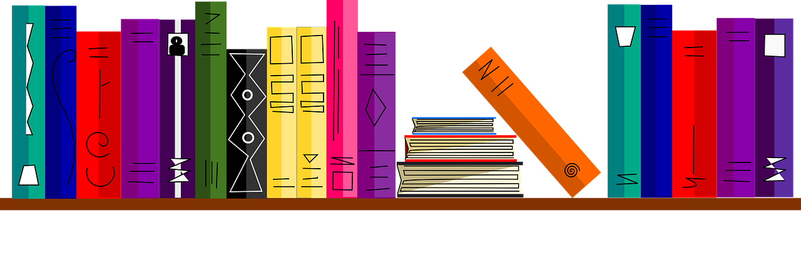
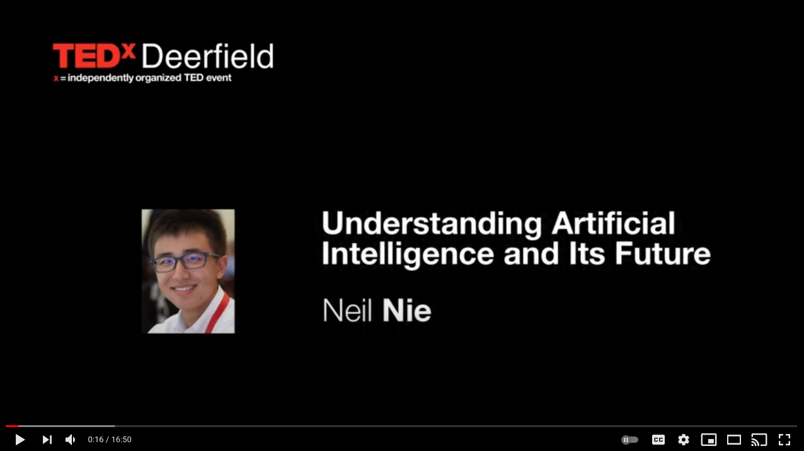
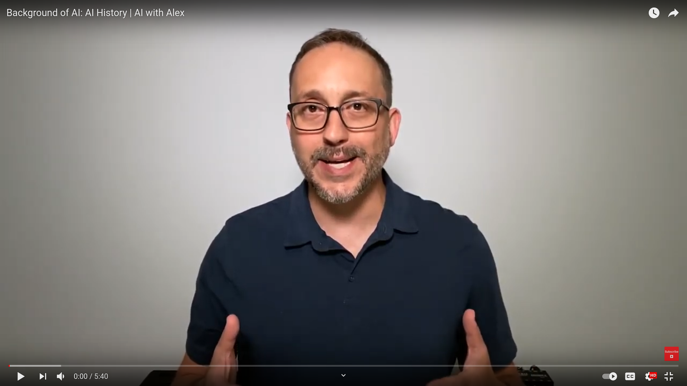
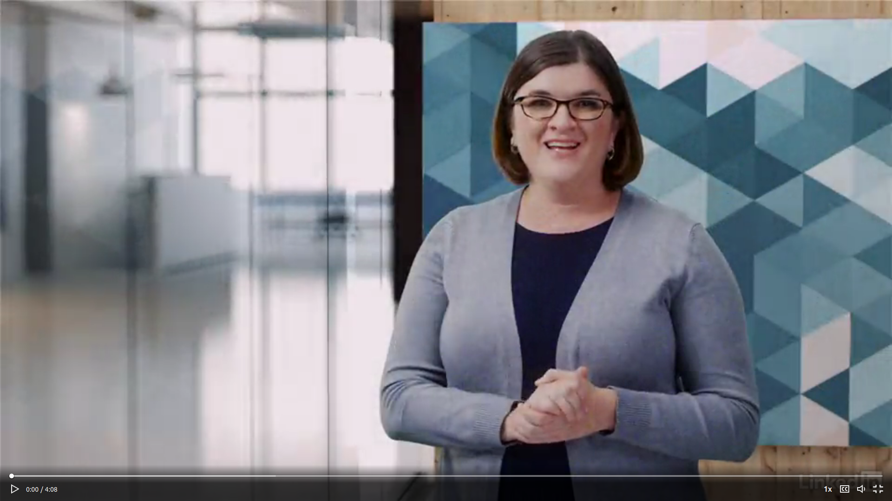

# __Independent study material: Content__
\

On this GitHub page, you will find all the resources required to complete the independent study material exercises. The resources are listed both per week, as well as per topic.

***

## __Week 1: Monday__

### __Foundations of AI (1): Philosophy, and history of AI__

### 1. Introduction
\

*Video 1. TEDx talk 'Understanding Artificial Intelligence and Its Future' by Neil Nie.*

### 2. Philosophy of Artificial Intelligence

For this module you will reading parts of the book Artificial Intelligence: A Modern Approach by Russell and Norvig (2020)[1](#footnote_1).

\
*Figure 1. Artificial Intelligence: A Modern Approach (Russell and Norvig, 2020).*

You can purchase the book or borrow it from BUAS' library. The library currently has 5 copies available.

Tip: incorporate some screen-free time in your schedule by reading a paper copy of a book/article etc. instead of a digital one. Your eyes will thank me later.

   

### 3. History of Artificial Intelligence
\

*Video 2. History of AI by YouTube´s AI with Alex.*

### __Turing Test & Chatbots (1): Article and chatbots__

### 4. Preparation for DataLab 1
\

*Video 3. Chatbots and virtual agents by Angela Wick.*

- Diaz, L. (2014, May). [How to Take Notes of Videos](http://kortschakcenter.usc.edu/wp-content/uploads/2014/05/Video-Note-taking.pdf). USC Kortschak Center for Learning and Creativity.   

- Keshav, S. (2007). [How to read a paper](http://ccr.sigcomm.org/online/files/p83-keshavA.pdf). ACM SIGCOMM Computer Communication Review, 37(3), 83-84.  

- Purdue Online Writing Lab. (n.d.). [APA Formatting And Style Guide (7th Edition)]((https://owl.purdue.edu/owl/research_and_citation/apa_style/apa_formatting_and_style_guide/reference_list_basic_rules.html)). Purdue Online Writing Lab. https://owl.purdue.edu/owl/research_and_citation/apa_style/apa_formatting_and_style_guide/reference_list_basic_rules.html

- Spielberg, S. (Director). (2002). Minority Report [Film]. Twentieth Century Fox.  

- Turing, A. M. (2009). [Computing machinery and intelligence](https://watermark.silverchair.com/lix-236-433.pdf?token=AQECAHi208BE49Ooan9kkhW_Ercy7Dm3ZL_9Cf3qfKAc485ysgAAAqswggKnBgkqhkiG9w0BBwagggKYMIIClAIBADCCAo0GCSqGSIb3DQEHATAeBglghkgBZQMEAS4wEQQMi0QU_r8XoVEcFqlmAgEQgIICXtQav8ZfX7wn3sMEOkUNL9dH5VzCvRC2RZmIy7W49sgHTbO69F9san7JvQmPOl81YMQ-3j26uRFGCiboiq7Ab4a4OSL5wtXnXaax9cWDFfrpTRJxWrVNnm8Yno9xXQyrZzJ7RYv1O7VIp4yIGTZvmE7sJuZ2etOCHfwY96_aMFjWAZH7TrUpPKvdY6E-lpyVeXcub5qrchiQHtXedsNatJJd3Y7eVlVwQfbgbLk3UcnQjWaWiDfHempRRjJUW-VGld4bpCBxAvFh5UVXzQm9B24ZFMljiGWJcvav9Qt70Vsu6VcYvx6rKfiKYSKHdpov6GNcCspnsOaVOVmkq66ZAElW5WMD4cZrmkfjTy435CLWORdIOlSJYX2jx7yHi-mV3Jifq0-ij-rRlnttSyodRch07QiU2G0GRKuN9fO9F7EOJtrvOurLEXwJcxaNL3Q4_3V82ffAmvtto5rzFLm0yuWjTG25kT-Hzzq6t4Z17g44vhddVWLZodCytpX8zQpiMnIpPIWCscluaLDDHhoCkY-dQGAzCqLDmC7yM1EuNHo1e99_6K5c8rZf7Yj_Suhzkn_WiTHO09mWW4V1dBHYiDpquaxPg0ENWywf3k7zMa68nqDrn4Aa4vkHHmftIRWkUDft8jjiyGx35bYma10yge1JJNzmSykqjwpTuKRKyhx-aQcYLcKVei5VjSEC4qrEn93N3KQ0FqWBb8YVhtxFhE7Suro5dyr5E9pz3T-OPHBxfImev3B_nZntI6YFihOorG7WuQlAh60yXOcCBHucubn9LuqCTTlEP9RsbnJgig.). In Parsing the Turing test (pp. 23-65). Springer, Dordrecht.

***

### Footnote(s)
<a name="footnote_1">1</a>: Hereforth abbreviated as AIMA.
