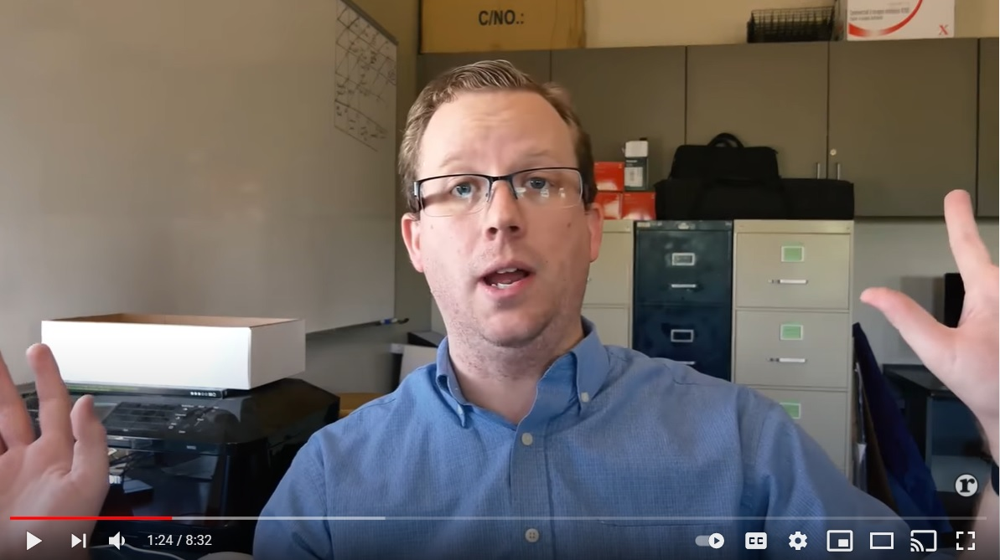

# __DataLab 1__
\

## __AI in Science Fiction (1): Minority Report screening__

### 1. Introduction
\
In today's DataLab session, we will discuss the article Computation Machinery and Intelligence, and perform an experiment called the Turing Test. Furthermore, we will start working on the creative brief of AI&DT: AI & Science Fiction. A detailed description of the assignment can be found in the Project Brief. At the end of the day we will have a moment to reflect on DataLab 1.

Before/after the movie screening and workshop you have time to work on the independent study material or creative brief, and/or ask the lecturers for
feedback.

***

### 2. Minority Report screening
\
 \
*Figure 1. Minority Report (Spielberg, 2002)*

During the day, you will be given the opportunity to watch Minority Report in the DataLab. There will be three screenings, timeslots are listed below:

- 9:00 - 11:00
- 11:15 - 13:15
- 14:00 - 16:00

Tip: if you take notes during the movie, it will be easier to identify all the relevant AI topics.

   

After you have watched Minority Report, ask yourself 'What AI technologies, methods, and/or practices etc. were depicted in the movie?'. When you have successfully identified an AI topic, search the internet for information that can be used as evidence to support your argument. [Google](https://www.google.com/) is often a good starting point. Other useful sources: [Papers with code](https://paperswithcode.com/), and [The Guardian](https://www.theguardian.com/international). Do not restrict yourself to one single source, try to look for multiple sources to back your arguments.

The first draft of the creative brief should include:

1. AI topic (e.g. technology, method, practice etc.)
2. Outline of your essay

Need help to write an outline for your essay, check out the YouTube video below:

*Video 1. Tips on writing an outline*

Essay outline template: [Structure of a General Expository Essay](./documents/main_structure-of-a-general-expository-essay-santa-barbara-city-college.pdf) by Santa Barbara City College.

The deadline for the first draft of the creative brief is Thursday at 12:00.

***

## __Turing Test & Chatbots (2): Discussion and experiment__

### 3. Discussion and experiment
\
The workshop consists of two parts: class discussing on the article, and the Turing Test. For each workshop there are 15 spots available. Timeslots:

- Group 1: 9:00 - 11:00
- Group 2: 11:15 - 13:15
- Group 3: 14:00 - 16:00

When conducting the Turing Test, we will make use of the chatbots that were found online by you, and/or your fellow students.

***

### 4. Day reflection

At the end of Datalab 1, from 16:00-17:00, we are going to reflect on the first two days of the program.

***

## __References__

Spielberg, S. (Director). (2002). Minority Report [Film]. Twentieth Century Fox.  
Turing, A. M. (2009). Computing machinery and intelligence. In Parsing the Turing test (pp. 23-65). Springer, Dordrecht.
