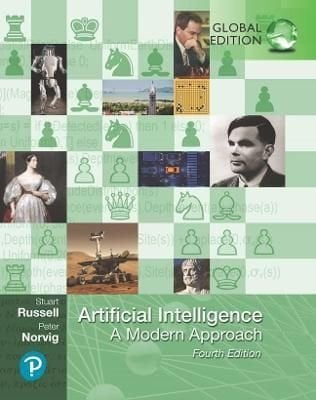
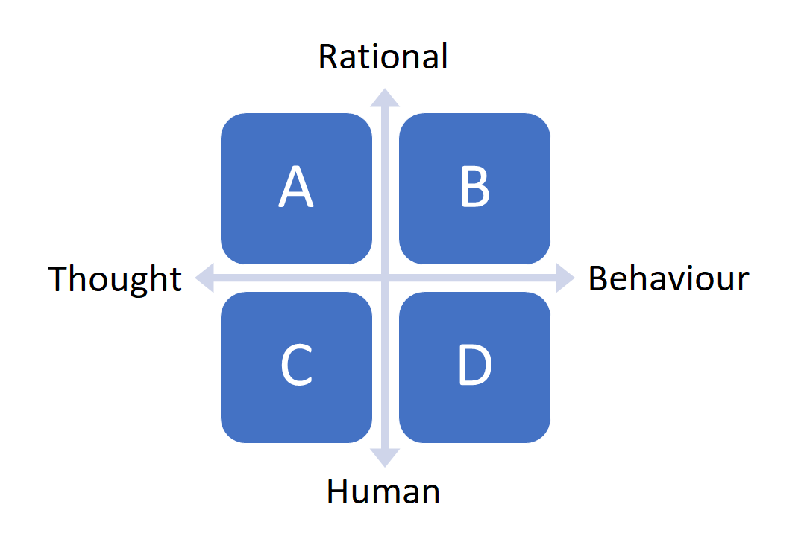

## __Foundations of AI (1): Philosophy, and history of AI__
\
\

### 1. Introduction

Today, you will start your journey into the wonderful world of Artificial Intelligence :rainbow: :computer: During the first independent study day, you will dive into the foundational concepts of AI by examining its history and philosophy. By the end of this day, having completed the relevant readings and activities listed in the study material, you should be well prepared for DataLab 1/2.

We advise you to start early with the independent study exercises, because we are going to cover quite a bit of material today!

If you have questions regarding the study material, you can send us an email or attend the Q&A session at the end of each independent study day. During the Q&A session, we will extensively discuss the  material. Make sure to hand-in your homework exercises! For the time being, you can send me your work via email (blerck.i@buas.nl, deadline 15:45). For details on availability see Project Brief.

### 2. What is artificial intelligence?

Artificial intelligence (AI) has seen a rapid rise in popularity. Research into the field of AI is rocketing, and an increasing number of companies are incorporating AI technologies into their daily business operations. But, what does AI constitute?

__2a__ Watch the TEDx talk 'Understanding Artificial Intelligence and Its Future' by Neil Nie.

<iframe width="560" height="315" src="https://www.youtube.com/embed/SN2BZswEWUA?controls=0" title="YouTube video player" frameborder="0" allow="accelerometer; autoplay; clipboard-write; encrypted-media; gyroscope; picture-in-picture" allowfullscreen></iframe>

*Video 1. TEDx talk 'Understanding Artificial Intelligence and Its Future' by Neil Nie.*

__2b__ How would you define 'artificial intelligence'?

__2c__ Give three examples of AI applications. You can choose real-life examples,
but also examples from popular culture (e.g. movies, books, video games etc.).

***

### 3. Philosophy of artificial intelligence

In this section, you will be made familiar with the various definitions of AI, and its related fields (e.g. cognitive science). The information required to successfully complete this section, can (to a greater extent) be found in the book Artificial Intelligence: A Modern Approach by Russell and Norvig (2021)[1](#footnote_1). You will be using this specific book throughout the programme.

*Figure 1. Artificial Intelligence: A Modern Approach (Russell and Norvig, 2021).*

You can purchase the book or borrow it from BUAS' library. The library currently has three copies available.

Tip: Incorporate some screen-free time in your schedule by reading a paper copy of a book/article etc. instead of a digital one. Your eyes will thank me later.

__3a__ Read the first two sub-chapters of the book Artificial Intelligence: A Modern Approach by Russell and Norvig (2021) (p.19-35).

Tip: If you cannot find the answer to a question in the provided literature, try to look for an answer online.

__3b__ Define the following terms: 'Weak AI', and 'Strong AI'.

__3c__ If you have not taken a coffee break yet, take one right now (with your fellow students via Microsoft Teams)! Unlike computers, humans are only able to maintain true focus for around 45 minutes. If you are experiencing some difficulties concentrating, check out the [Pomodoro technique](https://pomofocus.io/).

__3d__ What is the 'Chinese room experiment'? Describe its procedure.

__3e__ What is the 'Chinese room experiment' supposed to show? Select the correct statement, and elaborate on your choice:

a) Computers are not yet able to simulate the human ability to understand
\
b) Understanding involves more than the ability to formally reproduce appropriate outputs
\
c) It is only possible for systems to demonstrate understanding
\
d) No machine can demonstrate genuine understanding

__3f__ Connect the Post It notes (Fig 2.) to the relevant quadrant in the philosophy matrix (Fig 3.). For example, A = 1, 2, and  B = 3, 4, 5 etc.

*Figure 2. Post It notes with philosophy of AI terms.*
\
\

*Figure 3. Philosophy of AI matrix.*

__3g__ After completing the readings and exercises of this section, would you provide the same answer to exercise 1b? Explain your answer.

***

### 4. History of Artificial Intelligence

The early beginnings of AI, can be traced to the Ancient Greek period when philosophers started to describe human thinking as a symbolic system. Additionally, one of the first notions of a 'robot' can be found in Greek mythology:

> THE FIRST “ROBOT” to walk the earth—in ancient Greek mythology— was a bronze giant called Talos. Talos was an animated statue that guarded the island of Crete, one of three wondrous gifts fashioned by Hephaestus, god of the forge and patron of invention and technology. These marvels were commissioned by Zeus, for his son, Minos, the legendary first king of Crete. The other two gifts were a golden quiver of drone-like arrows that never missed their mark and Laelaps, a golden hound that always caught its prey. The bronze automaton Talos was charged with the task of defending Crete against pirates. Talos patrolled Minos’s kingdom by marching around the perimeter of the large island three times each day. As an animated metal machine in the form of a man, able to carry out complex human-like actions, Talos can be spoken of as an imagined android robot, an automaton “constructed to move on its own.” Designed and built by Hephaestus to repel invasions, Talos was “programmed” to spot strangers and pick up and hurl boulders to sink any foreign vessels that approached Crete’s shores. Talos possessed another capability too, modeled on a human trait. In close combat, the mechanical giant could perform a ghastly perversion of the universal gesture of human warmth, the embrace. With the ability to heat his bronze body red-hot, Talos would hug victims to his chest and roast them alive. (Mayor, 2018)

Throughout the centuries, scholars from various disciplines have made significant contributions to the field of AI. To name a few of them: al-Jazari, Leonardo Da Vinci, Ada Lovelace, Norbert Wiener, and Alan Turing.

However, the field of 'artificial intelligence' was not formally founded until 1956. It was at a conference, held at Dartmouth College, New Hampshire, were John McCarthy first coined the term 'artificial intelligence', which he defined as '... the science and engineering of making intelligent machines, especially intelligent computer programs' (Morignat, n.d.).  

After some setbacks in the 1970s and 1980s, also referred to as the AI winters, the field of AI has seen rapid advancements due to, among others, the introduction of deep learning, big data and artificial general intelligence in the early 2000s.

In this section, you will explore AI's history a bit further by reading Morignat's article 'The Ancient Quest for AI' and watching the YouTube video 'Background of AI: AI History' by AI with Alex.

__4a__ Watch the video on the History of AI by YouTube´s AI with Alex.

<iframe width="560" height="315" src="https://www.youtube.com/embed/JjQGKSOTHa4?controls=0" title="YouTube video player" frameborder="0" allow="accelerometer; autoplay; clipboard-write; encrypted-media; gyroscope; picture-in-picture" allowfullscreen></iframe>

*Video 2. History of AI by YouTube´s AI with Alex.*

__4b__ Read the article ['The Ancient Quest for AI'](http://intelligentstory.com/the-quest-for-ai.html), by Valerie Morignat.

__4c__ Find, and describe one 'milestone' in the history of AI. Be creative, so no 'milestones' by Alan Turing! No worries, we are going to extensively discuss his accomplishments during the workshop in DataLab 2 :smiley:

***

## __Footnote(s)__

<a name="footnote_1">1</a>: Hereforth abbreviated as AIMA.

***

## __Literature__

Mayor, A. (2020). *Gods and robots: Myths, machines, and ancient dreams of technology*

Morignat, V. (n.d.). *The quest for AI.* Retrieved June 16, 2021, from http://intelligentstory.com/the-quest-for-ai.html

Stuart, R., & Peter, N. *Artificial Intelligence: A Modern Approach.* 2021. Global Edition.
