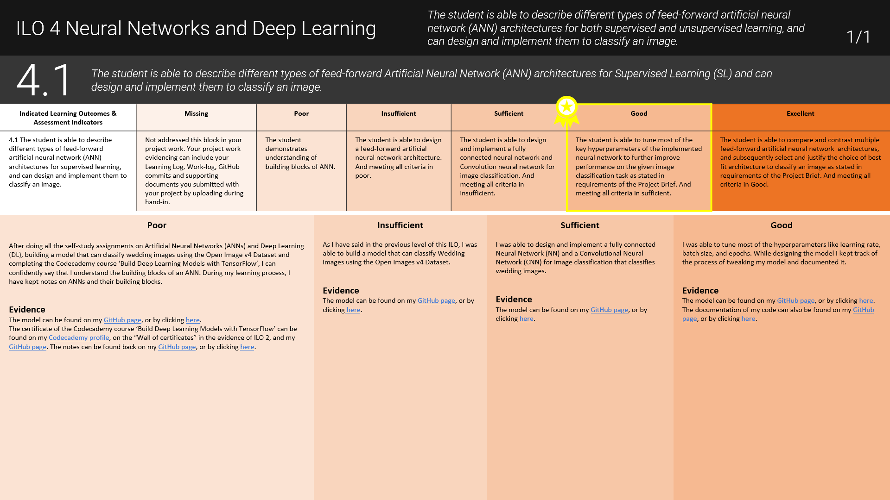

## DataLab 2: Minority Report (2)

In today's DataLab session, you will have time to work on your 'AI in Science Fiction' presentation, and ask your peers and/or mentor for feedback. In addition, you will have the chance to meet our client for Block A, the representatives of the SGD Hub@BUas. 

## Learning objectives

1. Describe the main tasks, skills, and responsibilities of a data analyst
2. Acquire, and evaluate information that will help you to gain necessary business understanding concerning the second phase of Block A

## Questions or issues?

If you have questions or issues regarding the course material, please fill out the 'Ask me Anything?' [form](https://adsai.buas.nl/Contact%20Us/AskMeAnything.html). A member of our teaching staff will respond as soon as possible.

***

## 1) Q&A and Standup (9:15-9:30)

__1a__ Ask questions regarding the independent study material.

__1b__ Answer the following questions:

- What did I work on yesterday (includes DataLab Preparation!)?
- What am I working on today?
- What issues are blocking me?

***

## 2) A Day in a life of ... (9:30-10:00)

Each Wednesday, you will have the chance to familiarise yourself with the different roles that constitute a professional data team. This week focuses on the data analyst. <mark>From 15:00-16:00 there will be a guest lecture by Max Poirault (Fe1.018)</mark>. Afterwards, there is time to for asking questions.   

### 2.1 Data analyst

__2.1a__ Find out what a typical work day looks like for a data analyst (e.g., daily tasks, and related skills, etc.).

__2.1b__ Come up with at least one question for the guest lecturer Max Poirault concerning his work as a data analyst.  

Note: The Bronze Challenge for Block A is creating an infographic that provides an overview of the different roles that constitute a professional data team.

***

## 3) SGD Hub@BUas (10:00-11:00)

<mark>At 10:00 there will be a guest lecture by the people of the SGD Hub@BUas at Fe.1.018</mark>. Be there or be square :sunglasses:. 

***

## 4) Creative Brief: Minority Report (6) (11:00-17:00)

During this DataLab session, try to put the finishing touches on your presentation. Furthermore, use this day to discuss the content of the presentation with your peers (e.g., outline).

*Figure 1. Do not be this person...start early!*

__Tips:__

- Time your presentation
- Create [cue cards](https://www.hema.nl/feest/wenskaarten-uitnodigingen/correspondentiekaarten-a6---50-stuks-14176310.html) for your presentation notes
- Do not discuss the complete plot of Minority Report in your presentation
- Elaborate on the statements you make in the presentation. For example, 'My [AI topic] can be linked to [Taxonomy of AI domain(s), and subdomain(s)], because [Explanation]'
- Use multiple sources to back your arguments with

__How do I provide evidence for ILO 3.1?__

To provide evidence for ILO 3.1, you must explain why you meet a certain grading criterion. For example, to meet the criterion of 'Insufficient', you also have to provide proof of meeting the previous criteria, - i.e.,'Poor'. 

*Figure 2. Example of ILO section in the Learning Log by Lisa.*

As evidence of meeting the criteria of ILO 3.1, you can use the video recording of your presentation and the presentation slides (e.g., PowerPoint):

- Poor: My presentation took 6:32 minutes, see my video recording.  

- Insufficient: I was able to identify, and describe an AI topic (i.e., military robot) within the movie Minority Report, see minutes 1:45 - 2:32 of the video recording and slide 1 of my presentation. Additionally, I was able to connect my [AI topic] to the [Taxonomy of AI domain(s), and subdomain(s)], see minutes 3:00 - 4:25 of the video recording and slides 2-3 of my presentation. 

You can find the [video recording](), and [slides]() of my presentation on my personal BUas [repository](). 

Etc.

Note: You are free to change the layout of the Learning Log (e.g., change colors, add additional slides, add text boxes, etc.). 

***

## Lunch break (12:00-13:00)

***

