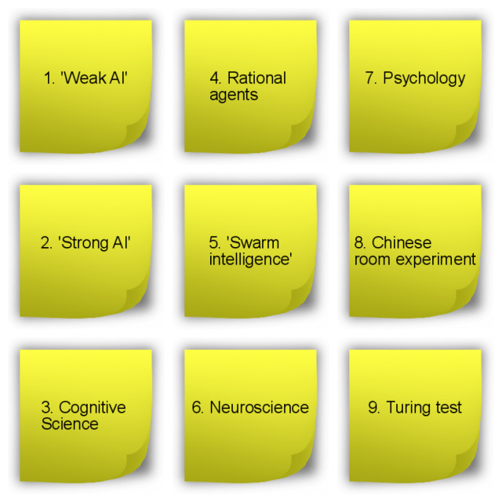
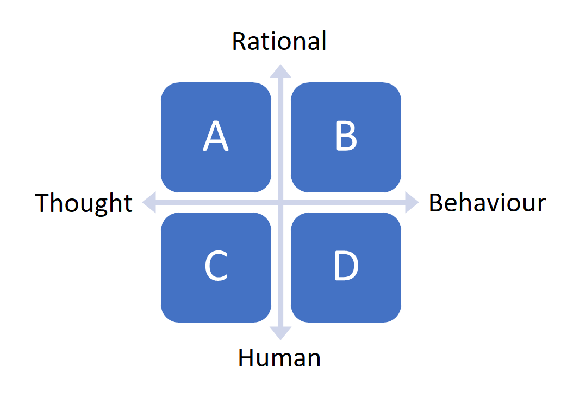

## __Philosophy AI & Information literacy__

### Week 1: Chapter overview

I. __Philosophy of AI & Information literacy__ <br>
II. DataLab I: Creative Brief <br>
III. History of AI & GitHub <br>
IV. Python programming <br>
V. DataLab II: Creative Brief & Presenting <br>

### 1. Introduction

Today, you will start your journey into the wonderful world of Artificial Intelligence :rainbow: :computer: During the first independent study day, you will dive into the foundational concepts of AI by examining its philosophy. Furthermore, you will acquire the knowledge and skills necessary to discover and utilize various sources of information. 

We advise you to start early with the independent study exercises because we will cover quite a bit of material today!

__After this chapter, you will be able to:__

- [ ] Define the term 'artificial intelligence', 'weak AI', and 'strong AI'
- [ ] Provide examples of real-life and/or fictional AI applications
- [ ] Describe the procedure of the 'Chinese Room Experiment', and explain its objective
- [ ] Appropriately match the philosophy of AI terms to the corresponding philosophy of AI matrix quadrants
- [ ] Acquire, evaluate, and use information from sources to meet the information needs for the 'AI in Science Fiction' assignment (ILO 3.1)
- [ ] Effectively read a research paper by applying Keshav's three-pass method

__Homework exercises__

For the DataLab preparation (Week 1, Tuesday), you are expected fill in a Microsoft Teams Form called ```DataLab Preparation (Week 1, DataLab I)```:

ADD EMBEDDED MICROSOFT FORM

If the embedded Microsoft form does not work in your browser, click [here](ADD URL).

To avoid multiple submissions, answer the questions that pop up (:pencil:) as you navigate the content below in a text editor of your choice (e.g., Notepad ++, Word, etc.) before entering them into the Microsoft Form. 

__Questions or issues?__

If you have questions or issues regarding the course material, please post them in the Q&A channel of Microsoft Teams. 

***

### 2. Lecture: Block A kick-off

At FILL IN TIME, we will have the Block A kick-off presentation at the BUas Campus (ADD LOCATION). Here, you will receive information regarding studying at BUas, and the day-to-day activities of the ADS&AI educational program. 

***

### 3. Foundations of AI

#### 3.1 What is artificial intelligence?

Artificial intelligence (AI) has seen a rapid rise in popularity. Research into the field of AI is rocketing, and an increasing number of companies are incorporating AI technologies into their daily business operations. But, what does AI constitute?

:pencil: __3.1a__ Watch the TEDx talk 'Understanding Artificial Intelligence and Its Future' by Neil Nie.

<iframe width="896" height="504" src="https://www.youtube.com/embed/SN2BZswEWUA?controls=0" title="YouTube video player" frameborder="0" allow="accelerometer; autoplay; clipboard-write; encrypted-media; gyroscope; picture-in-picture" allowfullscreen></iframe>

*Video 1. TEDx talk 'Understanding Artificial Intelligence and Its Future' by Neil Nie.*

:pencil: __3.1b__ How would you define 'artificial intelligence'?

:pencil: __3.1c__ Give three examples of AI applications. You can choose real-life examples, but also examples from popular culture (e.g., movies, books, video games etc.).

### 3.2 Philosophy of artificial intelligence

In this section, you will be made familiar with the various definitions of AI, and its related fields (e.g., cognitive science). The information required to complete this section successfully, can (to a greater extent) be found in the book Artificial Intelligence: A Modern Approach by Russell and Norvig (2021)<sup>[1](#footnote_1)</sup>. You will be using this specific book throughout the program.


*Figure 1. Artificial Intelligence: A Modern Approach (Russell and Norvig, 2021).*

You can purchase the book or borrow it from BUas' library. The library currently has three copies available.

<div style="padding: 15px; border: 1px solid transparent; border-color: transparent; margin-bottom: 20px; border-radius: 4px; color: #8a6d3b;; background-color: #fcf8e3; border-color: #faebcc;">
Tip: Incorporate some screen-free time in your schedule by reading a paper copy of a book/article etc. instead of a digital one. Your eyes will thank me later.
</div>

:pencil: __3.2a__ Read the first two sub-chapters of the book Artificial Intelligence: A Modern Approach by Russell and Norvig (2021) (p.19-35).

<div style="padding: 15px; border: 1px solid transparent; border-color: transparent; margin-bottom: 20px; border-radius: 4px; color: #8a6d3b;; background-color: #fcf8e3; border-color: #faebcc;">
Tip: If you cannot find the answer to a question in the provided literature, try to look for an answer online.
</div>

:pencil: __3.2b__ Define the following terms: 'weak AI', and 'strong AI'.

:pencil: __3.2c__ If you have not taken a coffee break yet, take one right now (with your fellow students via Microsoft Teams)! Unlike computers, humans are only able to maintain true focus for around 45 minutes. If you are experiencing some difficulties concentrating, check out the [Pomodoro technique](https://pomofocus.io/).

:pencil: __3.2d__ What is the 'Chinese room experiment'? Describe its procedure.

:pencil: __3.2e__ What is the 'Chinese room experiment' supposed to show? Select the correct statement, and elaborate on your choice:

a) Computers are not yet able to simulate the human ability to understand
\
b) Understanding involves more than the ability to formally reproduce appropriate outputs
\
c) It is only possible for systems to demonstrate understanding
\
d) No machine can demonstrate genuine understanding

:pencil:__3.2f__ Connect the Post It notes (Fig 2.) to the relevant quadrant in the philosophy matrix (Fig 3.). For example, A = 1, 2, and  B = 3, 4, 5 etc. Elaborate on your choices.



*Figure 2. Post It notes with the philosophy of AI terms.*
\
\


*Figure 3. Philosophy of AI matrix.*

:pencil: __3.2g__ After completing the readings and exercises of this section, would you provide the same answer to exercise 2.1b? Explain your answer.

### 4. Information literacy

As a data professional is is important to be able to find, evaluate, and use information effectively. In this section, you will be introduced to the concept of information literacy:

> Information literacy is the ability to discover and use various types of information. It's an essential skill for navigating the information age. Watch this course to learn about strategies for finding information—from a library, archive, database, or the Internet—and the ethics of using it. Librarian Elsa Loftis discusses different types of resources and explains how to evaluate their usefulness and trustworthiness. She also shows how to avoid plagiarism and copyright infringement, and accurately cite sources ([Source](https://www.linkedin.com/learning/information-literacy/welcome?autoplay=true&resume=false&u=36359204)).

:pencil: __4a__ Complete the LinkedIn course [Information Literacy](https://www.linkedin.com/learning/information-literacy/welcome?autoplay=true&resume=false&u=36359204) (Optional). Unless you are a trained librarian or data professional, we highly recommend you to take the course. Rather read a book? Then, visit LibreTexts and use one of the books listed on the webpage [Research and Information Literacy](https://human.libretexts.org/Bookshelves/Research_and_Information_Literacy).

:pencil: __4b__ Identify, and select an AI related topic within one of the following BUAS domains:

- Tourism
- Logistics
- Games

Write your answer down.

__Example:__ Autonomous shipping (BUAS domain: Logistics)

:pencil: __4c__ Find one scholarly source, and one popular source of information on your chosen AI topic. Tip: Use one of the search strategies presented in the Information Literacy course (e.g., Boolean searching).

:pencil: __4d__ Create an in-text, and bibliography citation for your popular, and scholarly source.

__Example:__

Scholarly source: [Towards Autonomous Shipping: Benefits and
Challenges in the Field of Information Technology and
Telecommunication](https://pdfs.semanticscholar.org/99a5/a8d00775e1adf5cac5c1d1c2b0a4b93d98e7.pdf?_ga=2.195360111.2114873160.1652959853-510087269.1652278776)

Bibliography: Yanchin, I., & Petrov, O. (2020). Towards autonomous shipping: Benefits and challenges in the field of information technology and telecommunication. TransNav: International Journal on Marine Navigation and Safety of Sea Transportation, 14.

In-text: (Yanchin and Petrov, 2020)

Popular source: [Automated Marine Highways Are Key to a Nation’s Growth & Security](https://sea-machines.com/automated-marine-highways-are-key-to-a-nations-growth-security/)

Bibliography: Automated Marine Highways Are Key to a Nation's Growth & Security. (2022, February 11). Automated Marine Highways Are Key to a Nation’s Growth & Security https://sea-machines.com/automated-marine-highways-are-key-to-a-nations-growth-security/

In-text: ("Automated Marine Highways Are Key to a Nation's Growth & Security," 2022)

:pencil: __4e__ Imagine writing a research report, and finding a quote similar to one below.

> Much has been written about AI's potential to reflect both the best and the worst of humanity. For example, we have seen AI providing conversation and comfort to the lonely; we have also seen AI engaging in racial discrimination. Yet the biggest harm that AI is likely to do to individuals in the short term is job displacement, as the amount of work we can automate with AI is vastly bigger than before. As leaders, it is incumbent on all of us to make sure we are building a world in which every individual has an opportunity to thrive (Andrew Ng, Co-founder and led of Google Brain).

After a thorough evaluation, you decide to include the quote in your report. List, and describe three approaches that help you incorporate the information correctly, thereby avoiding plagiarism. Write your answer down.

:pencil: __4f__ Reading scholarly text can be complex at first, but when you get the hang of it, you will most likely enjoy reading them because they often provide valuable new insights that you can use for your projects. The following guide shows you how to effectively read a research article by applying a practical and efficient three-pass method. Please, describe the three-pass procedure. Write your answer down.

- [How to read a paper](http://ccr.sigcomm.org/online/files/p83-keshavA.pdf)

<div style="padding: 15px; border: 1px solid transparent; border-color: transparent; margin-bottom: 20px; border-radius: 4px; color: #8a6d3b;; background-color: #fcf8e3; border-color: #faebcc;">
Note: As you might have noticed, Computing Machinery and Intelligence (Turing, 1950) does not look like your typical data science or artificial intelligence research article. It is missing headings such as 'Introduction', 'Experiments', and/or 'Conclusion'. A good example of a traditional artificial intelligence (i.e., computer vision) article can be found, <a href="./documents/YOLO_paper.pdf">here</a>.
</div>

*** 

### __Footnote(s)__

<a name="footnote_1">1</a>: Hereforth abbreviated as AIMA.

***
