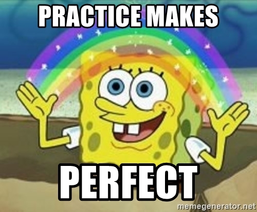
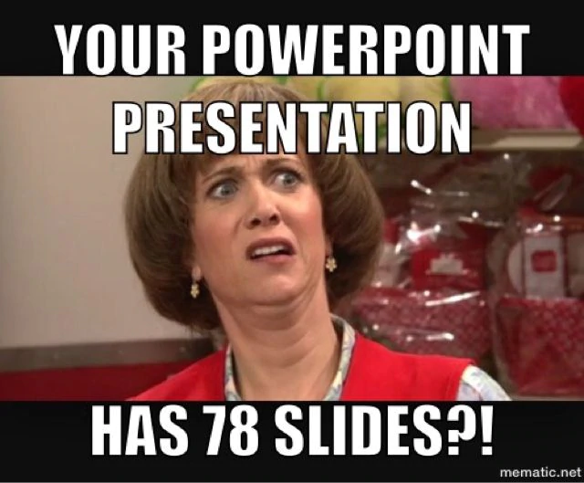

## __DataLab II: Creative Brief & Presenting__

### Week 1: Chapter overview

I. Philosophy of AI & Information literacy <br>
II. DataLab I: Creative Brief <br>
III. History of AI & GitHub <br>
IV. Python programming <br>
V. __DataLab II: Creative Brief & Presenting__ <br>

### 1. Introduction

In today's DataLab session, we will focus on strengthening our presentation skills. As a data professional, it is paramount that you can communicate your findings effectively:

> You can be the best data scientist — if you can't present your findings in a meaningful, engaging and memorable way — you won't make any impact. Simple as that. I mean, you don't have to be the next Steve Jobs… but you have to be a good enough presenter to let everyone in management understand the key takeaways of your data projects ([Source](https://data36.com/soft-skills-data-scientist/)).

To prepare you for the informative speech, i.e., the presentation 'AI in Science Fiction', we created a couple of exercises. Because, we all know:



*Figure 1. Sad, but true...*

These exercises will, among others, help you structure your speech and reduce some of the stage fright you might have. 

__After this chapter, you will be able to:__

1. Define the term 'informative speech'
2. List and describe the four types of informative speeches
3. List, and describe techniques to make informative speeches interesting, coherent, and memorable
4. Write an outline for an informative speech
5. Confidently deliver a informative speech to peers, and teaching staff members

__DataLab in-class exercises__ 

For the DataLab in-class exercises (Week 1, Friday), you are expected fill in a Microsoft Teams Form called ```DataLab in-class exercises (Week 1, DataLab II)```:

ADD EMBEDDED MICROSOFT FORM

If the embedded Microsoft form does not work in your browser, click [here](ADD URL).

To avoid multiple submissions, answer the questions that pop up (:pencil:) as you navigate the content below in a text editor of your choice (e.g., Notepad ++, Word, etc.) before entering them into the Microsoft Form. 

__Questions or issues?__

If you have questions or issues regarding the course material, please post them in the Q&A channel of Microsoft Teams. 

***

### 2. Q&A and Standup (starts at 9:15)

- Ask questions regarding the independent study material.

- Answer the following questions:

  - What did I work on yesterday (includes DataLab Preparation!)?
  - What am I working on today?
  - What issues are blocking me?

***

### 3. Review independent study material (starts at 9:30)

Further details will be provided during the DataLab session.

***

### 4. Presenting 

In this section, we will focus on the art of presenting, an essential skill for any professional. The ability to deliver a well-structured and engaging presentation is highly valuable, especially when sharing knowledge about a complex topic like AI. Throughout this section, you will learn how to prepare and deliver an informative speech effectively.

#### 4.1 Preparing a presentation 

:pencil: __4.1a__ Read [Chapter 15](https://socialsci.libretexts.org/Bookshelves/Communication/Public_Speaking/Public_Speaking_(The_Public_Speaking_Project)/15%3A_Informative_Speaking) of the book Public Speaking by The Public Speaking Project. This particular chapter will teach you how to create and deliver an informative speech.

:pencil:  __4.1b__ What is an informative speech? And what are the four types described in the book Public Speaking? Write your answer down.

:pencil:  __4.1c__ What makes an informative speech interesting, coherent, and memorable? List, and describe at least one technique.

:pencil:  __4.1d__ Prepare a 3-minute informative speech where you present your history of AI 'milestone':
  - Create an outline for your presentation
  - Think about the tool(s) that you would like to use for your presentation (e.g. PowerPoint, whiteboard etc.)
  - Practice your presentation (this includes timing it!)

For more information on public speaking, and useful presentation tools, see the following resources:

__Public speaking:__

- [Master Confident Presentations](https://www.linkedin.com/learning/master-confident-presentations/say-it-until-it-s-true?autoplay=true&resume=false&u=36359204) (LinkedIn Learning course, Chris Croft)
- [Public Speaking](https://socialsci.libretexts.org/Bookshelves/Communication/Public_Speaking/Public_Speaking_(The_Public_Speaking_Project)) (Book, The Public Speaking Project)

__Presentation tools:__

- [PowerPoint Essential Training (Office 365/Microsoft 365)](https://www.linkedin.com/learning/powerpoint-essential-training-office-365-microsoft-365/deliver-a-powerful-message-with-a-powerful-presentation?autoplay=true&u=36359204) (LinkedIn Learning course, Jess Stratton)
- [Learning PowerPoint 2021](https://www.linkedin.com/learning/learning-powerpoint-2021/learn-about-powerpoint-2021?autoplay=true&u=36359204) (LinkedIn Learning course, Garrick Chow)

Want to go beyond the traditional slide-based presentation (e.g., PowerPoint)? Make sure to check out the software package Prezi:

<iframe width="896" height="504" src="https://www.youtube-nocookie.com/embed/SWeXc0nwObc" title="YouTube video player" frameborder="0" allow="accelerometer; autoplay; clipboard-write; encrypted-media; gyroscope; picture-in-picture" allowfullscreen></iframe>

*Video 1. How to make a Prezi presentation.*

- [Prezi Essential Training](https://www.linkedin.com/learning/prezi-essential-training-8334259/break-out-of-linear-presentations-with-prezi?autoplay=true&u=36359204) (LinkedIn Learning course, Garrick Chow)

<div style="padding: 15px; border: 1px solid transparent; border-color: transparent; margin-bottom: 20px; border-radius: 4px; color: #a94442; background-color: #f2dede; border-color: #ebccd1;">
Note: Please, inform your mentor when you are finished with preparing your presentation, they will arrange a group of students for you, so you can proceed with the next step, - i.e.,  presenting your history of AI 'milestone', and providing feedback to your peers.
</div>

***

### Lunch break (12:00-13:00)

During the DataLabs, we will have a lunch break from 12:00-13:00. You can use this time to have lunch, go for a walk, or take a nap ...


***

### 4.2 Delivering a presentation 



*Figure 2. Please, do not do this...*

:pencil:  __4.2a__ Present your history of AI 'milestone', and fill in the peer feedback forms, which you can find <a href="./documents/PeerReviewFormforStudentPresentations.pdf">here</a>.  

***

### 5. DataLab tasks 

After finishing the in-class exercises, try to apply your newly gained knowledge to the Creative Brief. For example, you could create an outline for your 'AI in Science Fiction' presentation, and discuss its content with your peers and/or mentor. For the DataLab tasks page, click [here](ADD URL). 

<div style="padding: 15px; border: 1px solid transparent; border-color: transparent; margin-bottom: 20px; border-radius: 4px; color: #8a6d3b;; background-color: #fcf8e3; border-color: #faebcc;">
Note: In DataLab, we will dedicate most of our time to the DataLab tasks. These tasks have been specifically designed to foster exploration and provide you with the flexibility to work at your preferred pace.
</div>

***

