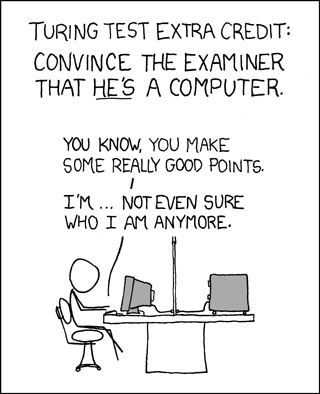

## __DataLab I: Creative Brief & Turing Test__

### Week 2: Chapter overview

I. Intelligent Agents & Conversational AI <br>
II. __DataLab I: Creative Brief & Turing Test__ <br>
III. Taxonomy of AI I <br>
IV. Python programming <br>
V. DataLab II: Creative Brief & Feedback <br>

### 1. Introduction

In today's DataLab session, we will perform an experiment called the Turing Test. A quick refresher:

<iframe width="896" height="504" src="https://www.youtube-nocookie.com/embed/3wLqsRLvV-c" title="YouTube video player" frameborder="0" allow="accelerometer; autoplay; clipboard-write; encrypted-media; gyroscope; picture-in-picture" allowfullscreen></iframe>

*Video 1. The Turing test: Can a computer pass for a human? - Alex Gendler.*

Furthermore, you have time to work on the DataLab task, which you can find [here](ADD URL).

__After this chapter, you will be able to:__

1. Find a general purpose/universal chatbot that is accessible via a website link
2. Identify, and describe the characteristics of 'human' intelligence
3. Devise a Turing Test strategy to correctly identify the machine, and human
4. Conduct the Turing Test with a group of peers
5. Describe the main tasks, skills, and responsibilities of an analytics translator

__DataLab in-class exercises__ 

For the DataLab in-class exercises (Week 2, Tuesday), you are expected fill in a Microsoft Teams Form called ```DataLab in-class exercises (Week 2, DataLab I)```:

ADD EMBEDDED MICROSOFT FORM

If the embedded Microsoft form does not work in your browser, click [here](ADD URL).

To avoid multiple submissions, answer the questions that pop up (:pencil:) as you navigate the content below in a text editor of your choice (e.g., Notepad ++, Word, etc.) before entering them into the Microsoft Form. 

__Questions or issues?__

If you have questions or issues regarding the course material, please post them in the Q&A channel of Microsoft Teams. 

***

### 2. Q&A and Standup (starts at 9:15)

- Ask questions regarding the independent study material.

- Answer the following questions:

    - What did I work on yesterday (includes DataLab Preparation!)?
    - What am I working on today?
    - What issues are blocking me?

***

### 3. The Turing Test (9:30-12:00)

#### 3.1 Chatbots (9:30-10:00)

:pencil: __3.1a__ Find a general purpose/universal chatbot that is accessible via a website link, and answer the following questions:

- When was it created?
- Who created it?
- Why was it created?

It is important to include evidence of your findings (e.g. webpage link of chatbot, newspaper article, academic journal article etc.).

Example: [Cleverbot](https://www.cleverbot.com/) (Carpenter, 1997).

***

#### 3.2  Strategy (10:00-11:00)

Before we conduct the Turing Test, we need to devise a strategy that will enable us to 'expose' the machine. Together with your fellow group members, you will develop such a strategy by drawing up a setting, its corresponding conditions, and questions. After the experiment, we will see which group succeeded, and which failed in the quest to identify both the chatbot, and human correctly. 

:pencil: __3.2a__ How to tell the difference between a robot and a human?

Can a robot:

- be creative?
- gossip?
- fall in love?
- tell a joke?
- have empathy?
- cause annoyance?

If answered with 'no', to what extent do you think robots will be able to his in the future?

Questions to think about:

- What characterizes us as being human?
- How would you define intelligence
- Can a machine/robot/computer be considered intelligent?
- Can a machine/robot/computer think for itself?

:pencil: __3.2b__ Devise a strategy, and incorporate the following elements:

- Setting (e.g. discussion between two students during a political theory class)
- Conditions (e.g. show sense of morality)
- Questions (e.g. 'I have very controversial views on politics, on democracy in particular. Do you think I’m a bad person for preferring a benevolent dictatorship?')

<div style="padding: 15px; border: 1px solid transparent; border-color: transparent; margin-bottom: 20px; border-radius: 4px; color: #8a6d3b;; background-color: #fcf8e3; border-color: #faebcc;">
Tip: Try to come up with a set of possible weak points of the Turing Test
</div>

***

#### 2.3 Turing Test (11:00-12:00)



*Figure 1. Turing Test, and the existential crisis...*

In-class experiment, instructions by mentor.  

__Material:__

Mentor instructions and questions & answers template can be found in Microsoft Teams.

***

### Lunch break (12:00-13:00)

During the DataLabs, we will have a lunch break from 12:00-13:00. You can use this time to have lunch, go for a walk, or take a nap ...


***

### 3. A Day in a life of ... 

In Tuesday, you will have the chance to familiarize yourself with the different roles that constitute a professional data team. This week focuses on the __analytics translator__. 

#### 3.1 Analytics translator

:pencil: __3.1a__ Search for an analytics translator job description and identify the required skills and responsibilities. Write them down. 

:pencil: __3.1b__ Find out what a typical work day looks like for a analytics translator (e.g., daily tasks, and related skills, etc.), and create a timeline that visualizes the analytics translator's work day.

<div style="padding: 15px; border: 1px solid transparent; border-color: transparent; margin-bottom: 20px; border-radius: 4px; color: #8a6d3b;; background-color: #fcf8e3; border-color: #faebcc;">
Note: The Bronze Challenge for Block A is creating an infographic that provides an overview of the different roles that constitute a professional data team.
</div>

***

### 4. DataLab tasks 

After finishing the in-class exercises, try to apply your newly gained knowledge to the Creative Brief. For example, you can investigate if the movie depicts any applications of conversational AI. If so, what are the technologies that drive these applications? Would you consider them 'intelligent'? Etc. For the DataLab tasks page, click [here](ADD URL). 


***


