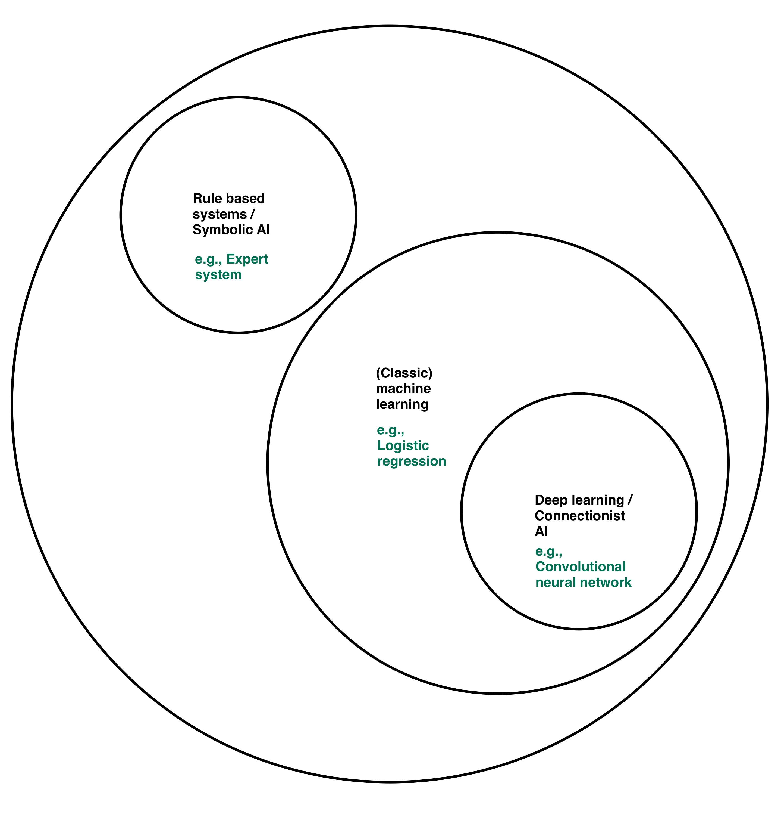
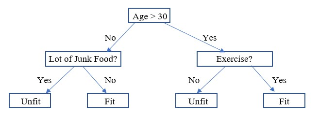
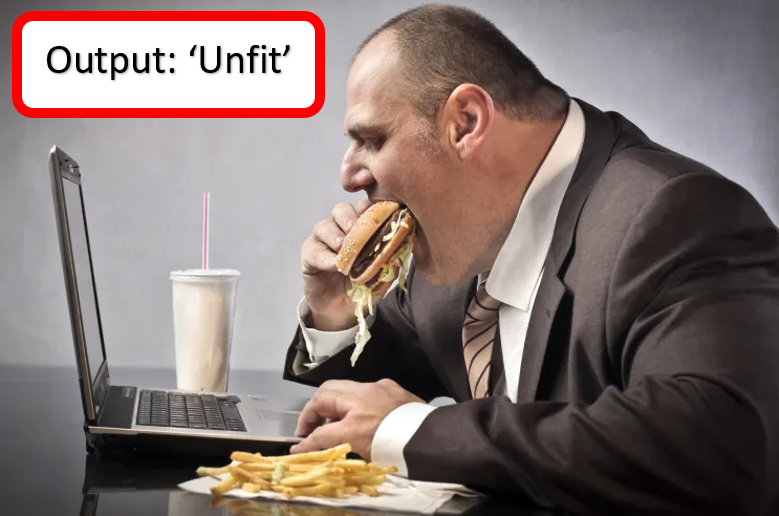
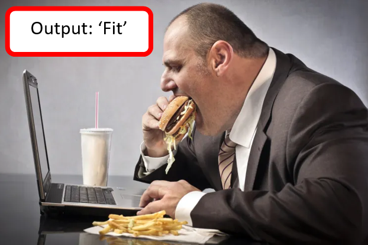

## __Taxonomy of AI I__

### Week 2: Chapter overview

I. Intelligent Agents & Conversational AI <br>
II. DataLab I: Creative Brief & Turing Test <br>
III. __Taxonomy of AI I__ <br>
IV. Python programming <br>
V. DataLab II: Creative Brief & Feedback <br>

### 1. Introduction

In today's independent study material, you will learn to define the terms 'data', 'information' and 'knowledge'. Furthermore, we will look at the four types of data analysis methods - i.e. descriptive, diagnostic, and predictive. Emphasis will be placed on the latter, as we delve into the three primary approaches to predictive modeling within the realm of AI; Rule-based Systems/Symbolic AI, (Classic) Machine Learning, and Deep Learning/Connectionist AI. 

__After this chapter, you will be able to:__

- [ ] Define the terms 'data', 'information' and 'knowledge'
- [ ] Describe the four types of data analysis methods; Descriptive, Diagnostic, Predictive, and Prescriptive
- [ ] Provide an example for each of the four types of data analysis methods
- [ ] Define the terms 'Symbolic AI', 'Machine learning', 'Connectionist AI', 'Inference', and 'Expert system'
- [ ] Explain the difference between 'supervised' and 'unsupervised' machine learning
- [ ] Provide at least one advantage, and one disadvantage of applying a rule-based systems/Symbolic AI, and deep learning/Connectionist AI predictive modeling approach

__Homework exercises__

For the DataLab preparation (Week 2, Friday), you are expected fill in a Microsoft Teams Form called ```DataLab Preparation (Week 2, DataLab II)```:

ADD EMBEDDED MICROSOFT FORM

If the embedded Microsoft form does not work in your browser, click [here](ADD URL).

To avoid multiple submissions, answer the questions that pop up (:pencil:) as you navigate the content below in a text editor of your choice (e.g., Notepad ++, Word, etc.) before entering them into the Microsoft Form. 

__Questions or issues?__

If you have questions or issues regarding the course material, please post them in the Q&A channel of Microsoft Teams. 

***

### 2. What is data, information and knowledge?

>An ounce of information is worth a pound of data.
<br>An ounce of knowledge is worth a pound of information.
<br>An ounce of understanding is worth a pound of knowledge ([Source](http://faculty.ung.edu/kmelton/documents/datawisdom.pdf)). 

:pencil: __2a__ Although the terms 'data', 'information', and 'knowledge' are often used interchangeably, they are not the same. Read [From Data to Wisdom](http://faculty.ung.edu/kmelton/documents/datawisdom.pdf) by Ackoff, and [Data Demystified — DIKW model](https://towardsdatascience.com/rootstrap-dikw-model-32cef9ae6dfb
) by Figueroa to see how these terms represent different stages of value creation from data. 

<div style="padding: 15px; border: 1px solid transparent; border-color: transparent; margin-bottom: 20px; border-radius: 4px; color: #8a6d3b;; background-color: #fcf8e3; border-color: #faebcc;">
Tip: Use the incognito mode of your browser to freely access blogs posted on popular AI/Data Science websites, such as medium.com, and towardsdatascience.com.
</div>

:pencil: __2b__ Watch the video on data information, and knowledge by Charlie Broomfield. 

<iframe width="896" height="504" src="https://www.youtube-nocookie.com/embed/QsP5WGv0aQc" title="YouTube video player" frameborder="0" allow="accelerometer; autoplay; clipboard-write; encrypted-media; gyroscope; picture-in-picture" allowfullscreen></iframe>

*Video 1. Theory 1 Topic 4.1.1 Data Information and Knowledge.*

Now, let us take a closer look at the DIKW pyramid, and complete an exercise to deepen our understanding of the aforementioned concepts.


*Figure 1. DIKW pyramid.*

:pencil: __2c__ Provide two additional examples, where you specify the four DIKW stages: 

| A. Example  |  B. Data |  C. Information  | D. Knowledge | E. Wisdom |
|---|---|---|---|---|
| 1. [Snow](https://blog.hslu.ch/majorobm/2020/03/18/kne-knowledge-management-part-1/) | It is snowing  | The temperature dropped below 0 degrees, the humidity went up by 5% within the last two hours and it started snowing at 5 p.m.   | Due to the drop in temperature and the increase in humidity, water particles in the cloud froze to ice on tiny grains of dust. More and more particles gathered together which renders the atmosphere unable to hold them anymore. On their way down to earth, the remaining water vapor freezes and crystals form which connect and hook together thereby creating a snowflake.      | Based on previous observations and statistical models, we are able to predict the weather in the future. We developed an understanding of the different interactions between temperature changes, evaporation and snow.| 
| 2.    |   |   |   |   | | 
| 3.   |   |   |   |   | | 

Fill in the blank spots. 

***

### 3. Data analysis 

#### 3.1 Methods

Data analysis is the process of transforming raw data, such as texts, images, audio, numbers, and videos, into usable information. There are many different data analysis methods, depending on the type of research. The four most commonly used methods are listed below:

- Descriptive Analytics: tells you what happened in the past
- Diagnostic Analytics: helps you understand why something happened in the past
- Predictive Analytics: predicts what is most likely to happen in the future
- Prescriptive Analytics: recommends actions you can take to affect those outcomes ([Source](https://insightsoftware.com/blog/comparing-descriptive-predictive-prescriptive-and-diagnostic-analytics/))

In the field of AI, we mainly perform predictive analytics:

> Predictive analytics is the use of data, statistical algorithms and machine learning techniques to identify the likelihood of future outcomes based on historical data. The goal is to go beyond knowing what has happened to providing a best assessment of what will happen in the future ([Source](https://www.sas.com/nl_nl/insights/analytics/predictive-analytics.html)).

However, you cannot successfully perform a predictive analysis before you have completed a descriptive and diagnostic analysis.  

__Example: COVID-19__


*Figure 2. Emergency room.*

Let us say you work as an emergency room doctor in a hospital, and you, on average, treat ten patients daily. Suddenly, the number of patients admitted to the emergency room rises starkly.

*__Descriptive analytics__* would help you explain what happened by effectively visualizing comprehensive, accurate, and real-time data. 

__Tools:__ Power BI, Tableau, Excel, SQL, etc.

:pencil: __3.1a__ Watch the video What is Descriptive Analytics? - Data Science Wednesday by Decisive Data.

<iframe width="896" height="504" src="https://www.youtube-nocookie.com/embed/cHGhSj_Ax-0" title="YouTube video player" frameborder="0" allow="accelerometer; autoplay; clipboard-write; encrypted-media; gyroscope; picture-in-picture" allowfullscreen></iframe>

*Video 2. What is Descriptive Analytics? - Data Science Wednesday.*

*__Diagnostic analytics__*, in turn, explores the data further, looking to separate patterns (e.g., correlation) and find the causes of the issue at hand. In other words, it helps you answer the 'Why' question, - i.e., 'Why is there a sharp increase in the number of patients admitted to the emergency room?'. The patient's symptoms, such as couching, and muscle ache, might, for example, point toward one specific viral infection, such as COVID-19.

__Tools:__ Power BI, Excel, R, Python, etc.

:pencil: __3.1b__ Watch the video What is Diagnostic Analytics? - Data Science Wednesday by Decisive Data.

<iframe width="896" height="504" src="https://www.youtube-nocookie.com/embed/BPshmz9qxxU" title="YouTube video player" frameborder="0" allow="accelerometer; autoplay; clipboard-write; encrypted-media; gyroscope; picture-in-picture" allowfullscreen></iframe>

*Video 3. What is Diagnostic Analytics? - Data Science Wednesday.*

Then, *__predictive analytics__* would answer the question 'What will happen in the future?' by providing a forecast of the number of patients with COVID-19-related symptoms that need to be admitted to the emergency room in the next couple of weeks.

__Tools:__ R, Python, Weights & Biases, AWS SageMaker, Azure Machine Learning etc.

__Technique:__ Machine learning

:pencil:__3.1c__ Watch the video The Fundamentals of Predictive Analytics - Data Science Wednesday by Decisive Data.

<iframe width="896" height="504" src="https://www.youtube-nocookie.com/embed/4y6fUC56KPw" title="YouTube video player" frameborder="0" allow="accelerometer; autoplay; clipboard-write; encrypted-media; gyroscope; picture-in-picture" allowfullscreen></iframe>
 
*Video 4. The Fundamentals of Predictive Analytics - Data Science Wednesday.*

Finally, *__prescriptive analytics__* would help you decide what to do next, - e.g., to account for the increase in patients with COVID-19-related symptoms admitted to the emergency room, it is suggested to increase the number of staff accordingly.

__Tools:__ R, Python, SPSS, SAS, etc.

__Technique:__ Statistical modelling

:pencil: __3.1d__ Watch the video What is Prescriptive Analytics? - Data Science Wednesday by Decisive Data.

<iframe width="896" height="504" src="https://www.youtube-nocookie.com/embed/046dYegfGrc" title="YouTube video player" frameborder="0" allow="accelerometer; autoplay; clipboard-write; encrypted-media; gyroscope; picture-in-picture" allowfullscreen></iframe>

*Video 5. What is Prescriptive Analytics? - Data Science Wednesday.*

:pencil: __3.1e__ Come up with at least one situation, where you could deploy a descriptive, diagnostic, predictive, and prescriptive analysis. Elaborate on your answer.

:pencil: __3.1f__ [Power BI](https://powerbi.microsoft.com/en-us/) is one of the most popular dashboarding tools. List another dashboarding tool, and provide at least one 'strength' and 'weakness'. Write your answer down.  

:pencil: __3.1g__ In Week 4, you will start to develop your own dashboard with Power BI. In our program, we stimulate self-directed learning, which includes setting your own goals, and identifying relevant sources of information (in the first two years under supervision of a teaching staff member). Let start with the latter; find at least three useful Power BI resources for your Block A project (e.g., books, online tutorials, etc.). List the resources (, and share them with your peers via a post in Microsoft Teams' 'Coffee Corner').  

#### 3.2 Predictive analytics: To learn or not to learn...

Let us take a closer look at the three main approaches to predictive modelling in the field of AI:

 

*Figure 1. The field of AI.*

Rule-based systems/Symbolic AI also referred to as 'Good Old Fashioned AI,' states that '... all intelligent behavior can be captured by a system that reasons logically from a set of facts and rules describing the domain' (Russel and Norvig, 2020). In contrast, (Classic) Machine learning and Deep learning/Connectionist AI do not require a symbolic representation. By feeding the systems with raw information, it can analyze and construct its own implicit knowledge, which in turn can be used to solve a data task, such as the one below.

__Example: GP health check__

Imagine being a data scientist whose task is to develop an analytical model to assist GPs in assessing patients' overall health by predicting if they are 'fit' or 'unfit' based on a few health-related characteristics.

Before you can start to build your model, i.e., apply an algorithm to your dataset, you must select one of the three approaches:

 

*Figure 2. Types of predictive analytics (learning).*

Let us use the following patient record as input for our analytical model:


&nbsp;&nbsp;&nbsp;Name: Hans Janssen <br>
&nbsp;&nbsp;&nbsp;Age: 29 <br>
&nbsp;&nbsp;&nbsp;Exercise: 0 hours per week <br>
&nbsp;&nbsp;&nbsp;Food: every day a bowl of [Brinta](https://ifunny.co/picture/breakfast-in-the-netherlands-starterpack-peanut-cheese-not-just-for-b46QlAY89?s=cl), and at least five times per week junk food <br>
&nbsp;&nbsp;&nbsp;Work: at last 60 hours per week

<br clear="left"/>

*Figure 3. GP health check: 'Is a patient fit?'.*

To determine if a patient is 'fit' or 'unfit,' you could create the following flowchart that shows the various outcomes from a series of decisions:



*Figure 4. Patient: Hans Janssen.*

A flowchart or decision tree, such as the one depicted above, is a typical example of a rule-based system/Symbolic AI model; it requires handcrafted rules created by a (domain) professional. A rule could be, for instance, if a patient is below 30, and eats lots of junk food, the model should classify this patient as 'unfit':



*Figure 5. Hans Janssen classified as 'Unfit' by the predictive model.*

In a complex environment, such as our GP health check use case, you can identify numerous factors that might influence the outcome of our decision-making process — for example, suffering from a chronic disease or having a vegetarian lifestyle. It is extremely difficult or impossible to account for all these factors in our model. To do so, the (domain) professional would have to create a rule for each possible determinant, significantly increasing our decision tree's depth and/or width. 

Additionally, complex environments are often dynamic, meaning the terms and conditions of being considered 'fit' or 'unfit' change over time. For instance, say all the major fast-food vendors have improved their menus in terms of health; on average, their food contains significantly more nutrients and less harmful fats than before. As a result, regularly eating fast food is not considered unhealthy anymore. However, your rule-based system/Symbolic AI model still thinks it is one of the decisive factors of an unhealthy lifestyle. Therefore, a patient who should be classified as 'fit' based on their junk food eating habits will be classified as 'unfit'.      

It is here where the other approaches, (classic) machine learning, and deep learning/Connectionist AI, come to the rescue. Although using different styles of learning, both 'learn' from the data that is fed to them.

If we look at (classic) machine learning, we see it has a separate feature extraction and model building phase. Features are distinctive characteristics of input patterns that help in differentiating between the various output categories (i.e., 'fit' and 'unfit'). For example, feature extraction, executed by the data scientist, helps the machine learning model identify essential properties of input patterns such as regular exercise and eating junk food. Concerning model building, a machine learning model 'learns' from past data and adjusts its responses accordingly. Initially, the model will misclassify patients such as Hans Janssen, but eventually, it will adjust its rules to account for the changed situation:



*Figure 5. Hans Janssen classified as 'Fit' by the predictive model.*

Deep learning/Connectionist AI, completely automates the feature extraction and model building phase. The model, not the data scientist, engineers the features; they are 'learned' through evaluating past data, and are often perceived as uninformative from the human perspective due to their numerical and distributed nature. Remember, computers think in ones and zeros, while we humans tend to think in high-level concepts such as exercise and eating lots of fast food. Concerning model building, deep learning/Connectionist AI models work similarly to (classic) machine learning models. They both learn from past experiences.

To deepen our understanding, let us watch a couple of videos, and complete some exercises:

:pencil: __3.2a__ Watch the video 'What is Machine Learning?' by IBM.

<iframe width="896" height="504" src="https://www.youtube-nocookie.com/embed/9gGnTQTYNaE" title="YouTube video player" frameborder="0" allow="accelerometer; autoplay; clipboard-write; encrypted-media; gyroscope; picture-in-picture" allowfullscreen></iframe>

*Video 1. 'What is Machine Learning?' by IBM.*

:pencil: __3.2b__ Define the terms 'supervised' and 'unsupervised' learning. How do these types of machine learning differ from each other? Write your answer down.

:pencil: __3.2c__ Watch the video on symbolic AI by the YouTube channel CrashCourse.

<iframe width="896" height="504" src="https://www.youtube.com/embed/WHCo4m2VOws?controls=0&amp;start=2" title="YouTube video player" frameborder="0" allow="accelerometer; autoplay; clipboard-write; encrypted-media; gyroscope; picture-in-picture" allowfullscreen></iframe>

*Video 2. Symbolic AI by CrashCourse.*

:pencil: __3.2d__ Define the terms 'inference', and 'expert system' (Be concise!).

:pencil: __3.2e__ Are artificial neural networks (ANNs) similar to the human brain? Support your answer with arguments.

:pencil: __3.2f__ An ANN uses a a) symbolic or b) connectionist approach to AI? Select one of the options, and explain your choice.

<div style="padding: 15px; border: 1px solid transparent; border-color: transparent; margin-bottom: 20px; border-radius: 4px; color: #8a6d3b;; background-color: #fcf8e3; border-color: #faebcc;">
Tip: Visit <a href="https://playground.tensorflow.org/#activation=tanh&batchSize=10&dataset=circle&regDataset=reg-plane&learningRate=0.03&regularizationRate=0&noise=0&networkShape=4,2&seed=0.12586&showTestData=false&discretize=false&percTrainData=50&x=true&y=true&xTimesY=false&xSquared=false&ySquared=false&cosX=false&sinX=false&cosY=false&sinY=false&collectStats=false&problem=classification&initZero=false&hideText=false/">Tensorflow's Playground</a> to experiment with artificial neural networks (no code needed).
</div>

In the last couple of years, there has been a reappraisal of symbolic AI because, among others, it is less susceptible to the so called 'Problem of opacity'. Minsky defines the problem as follows: '... the knowledge embodied inside a network's numerical coefficients is not accessible outside that net.' (1991). In other words, it is difficult to know why these connectionist models do what they do or how they work.

:pencil: __3.2g__ Can you think of a real-life scenario where an AI method that uses a symbolic approach would be more suited than a method that uses a connectionist approach? Explain your answer.

***

### 4. Feedback 

The next DataLab session, we will focus on strengthening our feedback skills. As part of the learning process, you will be asked to participate in a in-class workshop.  

:pencil: __4a__ Open your [__YourName_GitHubExercise__] markdown file, and list at least one piece of work, such as answer to a homework exercise, you want to receive feedback on from a peer. Commit the changes, and push the markdown file to your personal BUas Block A repository.

<div style="padding: 15px; border: 1px solid transparent; border-color: transparent; margin-bottom: 20px; border-radius: 4px; color: #8a6d3b;; background-color: #fcf8e3; border-color: #faebcc;">
Note: When you are finished with the independent study material, and still have some time left, try to apply your newly gained knowledge to the DataLab tasks.
</div>

***

