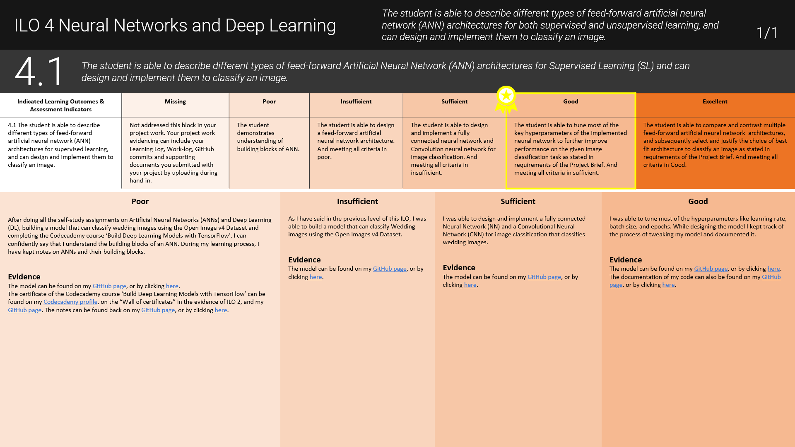

## DataLab I: Creative Brief

### Week 3: Chapter overview

I. Taxonomy of AI II & State-of-the-art AI <br>
II. __DataLab I: Creative Brief__ <br>
III. Risks & Benefits of AI <br>
IV. Python programming <br>
V. DataLab II: 'AI in Science Fiction' presentations <br>

### 1. Introduction

In today's DataLab session, you will have time to work on your 'AI in Science Fiction' presentation, and ask your peers and/or mentor for feedback. In addition, you will have the chance to meet our client for Block A, the representatives of the SGD Hub@BUas. 

__After this chapter, you will be able to:__

- [ ] Describe the main tasks, skills, and responsibilities of a data engineer
- [ ] Acquire, and evaluate information that will help you to gain necessary business understanding concerning the second phase of Block A

__DataLab in-class exercises__ 

For the DataLab in-class exercises (Week 3, Tuesday), you are expected fill in a Microsoft Teams Form called ```DataLab in-class exercises (Week 3, DataLab I)```:

ADD EMBEDDED MICROSOFT FORM

If the embedded Microsoft form does not work in your browser, click [here](ADD URL).

To avoid multiple submissions, answer the questions that pop up (:pencil:) as you navigate the content below in a text editor of your choice (e.g., Notepad ++, Word, etc.) before entering them into the Microsoft Form. 

__Questions or issues?__

If you have questions or issues regarding the course material, please post them in the Q&A channel of Microsoft Teams. 

***

### 2. Q&A and Standup (starts at 9:15)

- Ask questions regarding the independent study material.

- Answer the following questions:

    - What did I work on yesterday (includes DataLab Preparation!)?
    - What am I working on today?
    - What issues are blocking me?

***

### 3. SGD Hub@BUas 

CHECK WITH BRAM

<mark>At 10:00 there will be a guest lecture by the people of the SGD Hub@BUas at Fe.1.018</mark>. Be there or be square :sunglasses:. 

***

### 4. A Day in a life of ... 

In Tuesday, you will have the chance to familiarize yourself with the different roles that constitute a professional data team. This week focuses on the __data engineer__. 

#### 4.1 Analytics translator

:pencil: __4.1a__ Search for data engineer job description and identify the required skills and responsibilities. Write them down. 

:pencil: __4.1b__ Find out what a typical work day looks like for a data engineer (e.g., daily tasks, and related skills, etc.), and create a timeline that visualizes the data engineer's work day.

<div style="padding: 15px; border: 1px solid transparent; border-color: transparent; margin-bottom: 20px; border-radius: 4px; color: #8a6d3b;; background-color: #fcf8e3; border-color: #faebcc;">
Note: The Bronze Challenge for Block A is creating an infographic that provides an overview of the different roles that constitute a professional data team.
</div>

***

### Lunch break (12:00-13:00)

During the DataLabs, we will have a lunch break from 12:00-13:00. You can use this time to have lunch, go for a walk, or take a nap ...


***

### 5.  DataLab tasks 

During this DataLab session, try to put the finishing touches on your presentation. Furthermore, use this day to discuss the content of the presentation with your peers (e.g., outline). For the DataLab tasks page, click [here](ADD URL). 


*Figure 1. Do not be this person...start early!*

__Tips:__

- Time your presentation
- Create [cue cards](https://www.hema.nl/feest/wenskaarten-uitnodigingen/correspondentiekaarten-a6---50-stuks-14176310.html) for your presentation notes
- Do not discuss the complete plot of Minority Report in your presentation
- Elaborate on the statements you make in the presentation. For example, 'My [AI topic] can be linked to [Taxonomy of AI domain(s), and subdomain(s)], because [Explanation]'
- Use multiple sources to back your arguments with

__How do I provide evidence for ILO 3.1?__

To provide evidence for ILO 3.1, you must explain why you meet a certain grading criterion. For example, to meet the criterion of 'Insufficient', you also have to provide proof of meeting the previous criteria, - i.e.,'Poor'. 



*Figure 2. Example of ILO section in the Learning Log by Lisa.*

As evidence of meeting the criteria of ILO 3.1, you can use the video recording of your presentation and the presentation slides (e.g., PowerPoint):

- Poor: My presentation took 6:32 minutes, see my video recording.  

- Insufficient: I was able to identify, and describe an AI topic (i.e., military robot) within the movie Minority Report, see minutes 1:45 - 2:32 of the video recording and slide 1 of my presentation. Additionally, I was able to connect my [AI topic] to the [Taxonomy of AI domain(s), and subdomain(s)], see minutes 3:00 - 4:25 of the video recording and slides 2-3 of my presentation. 

You can find the [video recording](), and [slides]() of my presentation on my personal BUas [repository](). 

Etc.

<div style="padding: 15px; border: 1px solid transparent; border-color: transparent; margin-bottom: 20px; border-radius: 4px; color: #8a6d3b;; background-color: #fcf8e3; border-color: #faebcc;">
Note: You are free to change the layout of the Learning Log (e.g., change colors, add additional slides, add text boxes, etc.). 
</div>

***


