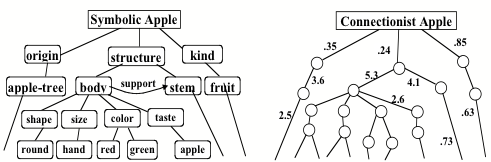

## __Foundations of AI (2): Symbolic/non-symbolic AI & Intelligent agents__
\
\

### 1. Introduction

Today's independent study material focusses on the concept of symbolic/non-symbolic AI, and intelligent agents. You will approximately spend 4 hours on the material. We advise you to work on your first draft of the creative brief for the remainder of the day.

***

### 2. Symbolic AI vs. non-symbolic AI

When you take a closer look at the field of AI, you can see that it is divided into two camps - symbolic and non-symbolic AI. Symbolic AI, also referred to as 'Good Old Fashioned AI', states that '... all intelligent behavior can be captured by a system that reasons logically from a set of facts and rules describing the domain' (Russel and Norvig, 2020). Non-symbolic or connectionist AI, are probabilistic reasoning systems that do not require a symbolic representation. By feeding the system raw information, it can analyze and construct its own implicit knowledge, which in turn can be used to solve a data task.

__2a__ Watch the video on symbolic AI by the YouTube channel CrashCourse.

<iframe width="560" height="315" src="https://www.youtube.com/embed/WHCo4m2VOws?controls=0&amp;start=2" title="YouTube video player" frameborder="0" allow="accelerometer; autoplay; clipboard-write; encrypted-media; gyroscope; picture-in-picture" allowfullscreen></iframe>

*Video 1. Symbolic AI by CrashCourse*

__2b__ Define the term 'expert system'.

__2c__ Are artificial neural networks similar to the human brain?  Support your answer with arguments.

__2d__ A artificial neural network uses a a) symbolic or b) non-symbolic approach to AI? Select one of the options, and explain your choice.

In the last couple of years, there has been a reappraisal of symbolic AI because, among others, it is less susceptible to the so called 'Problem of opacity'. Minsky defines the problem as follows: '... the knowledge embodied inside a network's numerical coefficients is not accessible outside that net.' (1991). In other words, it is difficult to know why these non-symbolic models do what they do or how they work.

*Figure 1. Symbolic and non-symbolic representation of an apple*

> 'The problem of opacity grows more acute as representations become more distributed---that is, as we move from symbolic to connectionist poles---and it becomes increasingly more difficult for external systems to analyze and reason about the delocalized ingredients of the knowledge inside distributed representations. It also makes it harder to learn, past a certain degree of complexity, because it is hard to assign credit for success, or to formulate new hypotheses (because the old hypotheses themselves are not "formulated"). Thus, distributed learning ultimately limits growth, no matter how convenient it may be in the short term, because "the idea of a thing with no parts provides nothing that we can use as pieces of explanation" (see SOM, section 5.3).' (Minsky, 1991).

__2e__ Can you think of a real-life scenario where an AI method that uses a symbolic approach would be more suited than a method that uses a non-symbolic approach? Explain your answer.

Tip: Visit <a href="https://playground.tensorflow.org/#activation=tanh&batchSize=10&dataset=circle&regDataset=reg-plane&learningRate=0.03&regularizationRate=0&noise=0&networkShape=4,2&seed=0.12586&showTestData=false&discretize=false&percTrainData=50&x=true&y=true&xTimesY=false&xSquared=false&ySquared=false&cosX=false&sinX=false&cosY=false&sinY=false&collectStats=false&problem=classification&initZero=false&hideText=false/">Tensorflow's Playground</a> to experiment with artificial neural networks (no code needed).

***

### 3. Intelligent agents

In this section, we are going to explore the concept of the intelligent agent, which can be defined as anything that perceives its environment through sensors and acting upon that environment through actuators. An example of such an 'intelligent' agent is iRobot's Roomba, which is a household vacuuming robot that is able to detect and avoid obstacles. Besides being praised for their innovative design, they are notoriously famous for committing suicide in the must stupid ways.

*Figure 2. Roomba's death by toilet paper...*

__3a__ Read chapter 2 of AIMA (p.55-80).

__3b__ Watch the video on Deep Blue by IBM.

<iframe width="560" height="315" src="https://www.youtube.com/embed/KFSVZlkHHmM?controls=0" title="YouTube video player" frameborder="0" allow="accelerometer; autoplay; clipboard-write; encrypted-media; gyroscope; picture-in-picture" allowfullscreen></iframe>

*Video 2. Deep Blue*

__5c__ IBM's Deep Blue uses a a) symbolic or b) non-symbolic approach to AI? Select one of the options, and explain your choice.

__5d__ Two intelligent agents are playing chess with a clock. One of them is called 'Deep Blue', while the other is called Gary Kasparov. Roughly specify the task environment for Deep Blue (this means you will have to specifying each letter in PEAS), and determine each of the following properties of this task environment:

1. a) Fully observable or b) partially observable
2. a) Deterministic or b) stochastic
3. a) Episodic or b) sequential
4. a) Static, b) dynamic or c) semi-dynamic
5. a) Discrete or b) continuous
6. a) Single agent or b) multi-agent

Explain your answer.

__5e__ Provide an example of an intelligent agent, and give a PEAS description of the task environment, and characterize it in terms of the properties listed in Section 2.3.2 (p. 117) in AIMA.

__5f__ Compare and contrast the following agent types:

- Simple reflex
- Model-based reflex
- Goal-based reflex
- Utility-based  

Explain your answer.

***

## __Literature__
Minsky, M. L. (1991). Logical versus analogical or symbolic versus connectionist or neat versus scruffy. AI magazine, 12(2), 34-34.

Stuart, R., & Peter, N. Artificial Intelligence: A Modern Approach. 2020.
