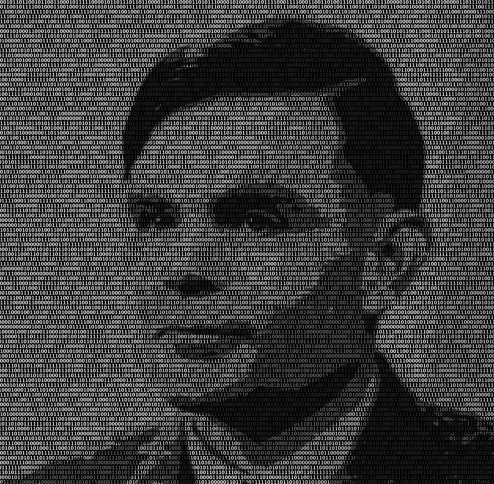

## __Turing Test & Chatbots (1): Article__
\
\

### 1. Introduction

For the second half of the day, you are going to read the famous article Computing Machinery and Intelligence by Alan Turing (1950). This is the first, and definitely not the last, peer-reviewed article are going to read for the programme. As a data professional it is important to stay up to date with new developments in the field. One way of doing so, is by reading these peer-reviewed scientific articles.

***

### 2. Article (180 minutes)

The rise of artificial intelligence forces us to rethink what robots mean to society and what their role is to be. They are far better at arithmetic, but are they really as intelligent as us? What constitutes intelligence? And should we fear being replaced by these digital machines in the future? Alan Turing was the first to examine the relationship between human and digital machines.

*Figure 1. Portret of Alan Turing made up by binary numbers.*

In the article Computing Machinery and Intelligence (1950), Turing lays the foundation for modern day AI. He introduces an behavioral test, the Turing Test, and discusses some objections raised in relation to this test. As a result of his contributions to the field, he also called one of the 'founding fathers of AI'.

__2a__ Read the following note taking guides:

- [How to take notes of videos](http://kortschakcenter.usc.edu/wp-content/uploads/2014/05/Video-Note-taking.pdf)
- [How to read a paper](http://ccr.sigcomm.org/online/files/p83-keshavA.pdf)

__2b__ Besides the Turing Test, Alan Turing is renowned for his work on:
\
\
1.
\
2.
\
3.

Fill in the blanks.

Alert: whoever has the quirkiest fact on Alan Turing will receive a Mars bar at the end of the workshop in DataLab 1.

__2c__ Read Turing’s seminal work on AI: [Computing Machinery and Intelligence](https://watermark.silverchair.com/lix-236-433.pdf?token=AQECAHi208BE49Ooan9kkhW_Ercy7Dm3ZL_9Cf3qfKAc485ysgAAAqswggKnBgkqhkiG9w0BBwagggKYMIIClAIBADCCAo0GCSqGSIb3DQEHATAeBglghkgBZQMEAS4wEQQMi0QU_r8XoVEcFqlmAgEQgIICXtQav8ZfX7wn3sMEOkUNL9dH5VzCvRC2RZmIy7W49sgHTbO69F9san7JvQmPOl81YMQ-3j26uRFGCiboiq7Ab4a4OSL5wtXnXaax9cWDFfrpTRJxWrVNnm8Yno9xXQyrZzJ7RYv1O7VIp4yIGTZvmE7sJuZ2etOCHfwY96_aMFjWAZH7TrUpPKvdY6E-lpyVeXcub5qrchiQHtXedsNatJJd3Y7eVlVwQfbgbLk3UcnQjWaWiDfHempRRjJUW-VGld4bpCBxAvFh5UVXzQm9B24ZFMljiGWJcvav9Qt70Vsu6VcYvx6rKfiKYSKHdpov6GNcCspnsOaVOVmkq66ZAElW5WMD4cZrmkfjTy435CLWORdIOlSJYX2jx7yHi-mV3Jifq0-ij-rRlnttSyodRch07QiU2G0GRKuN9fO9F7EOJtrvOurLEXwJcxaNL3Q4_3V82ffAmvtto5rzFLm0yuWjTG25kT-Hzzq6t4Z17g44vhddVWLZodCytpX8zQpiMnIpPIWCscluaLDDHhoCkY-dQGAzCqLDmC7yM1EuNHo1e99_6K5c8rZf7Yj_Suhzkn_WiTHO09mWW4V1dBHYiDpquaxPg0ENWywf3k7zMa68nqDrn4Aa4vkHHmftIRWkUDft8jjiyGx35bYma10yge1JJNzmSykqjwpTuKRKyhx-aQcYLcKVei5VjSEC4qrEn93N3KQ0FqWBb8YVhtxFhE7Suro5dyr5E9pz3T-OPHBxfImev3B_nZntI6YFihOorG7WuQlAh60yXOcCBHucubn9LuqCTTlEP9RsbnJgig.). Take notes. You will need them for the workshop in DataLab 1.

Tip: if you are having difficulties reading the mathematical equations or understanding the main concept of a text, try to look for additional information online. YouTube, StackOverfow, Quora, and Medium are examples of webpages that can help you in analyzing (scientific) articles.

***

### 3. Reflection (16:00-17:00) (15 minutes)

__3a__ Choose, and provide an answer to at least of the following questions:

1. What surprised you today, and why?
2. What’s the most important thing you learned today? Why do you think so?
3. What do you want to learn more about, and why?
4. When were you the most creative, and why do you think that is?
5. What made you curious today? How does learning feel different when you’re curious?
6. When were you at your best today, and why?
7. (Assuming we were studying the same thing and you could decide and have access to anything), where would you start tomorrow? Why?
8. What can/should you do with what you know?

Tip: the exercise is format-free, meaning you can answer in any way or form you see suited. Make a drawing, write a piece of text, create a video, etc.

***

### __Literature__
Diaz, L. (2014, May). How to Take Notes of Videos. USC Kortschak Center for Learning and Creativity.
http://kortschakcenter.usc.edu/wp-content/uploads/2014/05/Video-Note-taking.pdf
Keshav, S. (2007). How to read a paper. ACM SIGCOMM Computer Communication Review, 37(3), 83-84.
Turing, A. M. (2009). Computing machinery and intelligence. In Parsing the Turing test (pp. 23-65). Springer, Dordrecht.
