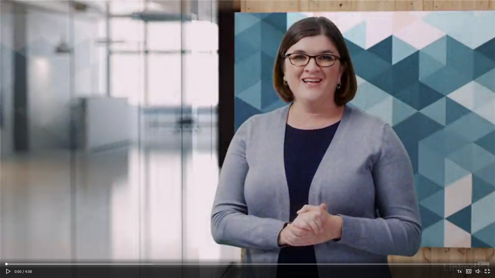

## __Turing Test & Chatbots (2): Discussion & Turing Test__
\

### 1. Introduction

In today's DataLab session, we will discuss the article Computation Machinery and Intelligence, and perform an experiment called the Turing Test.

Before/after the workshop you have time to work on the independent study material or creative brief, and/or ask the lecturers for feedback.

***

### 2. Workshop

The workshop consists of two parts: class discussing on the article, and the Turing Test (timeslot: 13:30 - 16:00).

When conducting the Turing Test, we will make use of the chatbots that were found online by you, and/or your fellow students.

#### 2.1 Discussion

Article: [Computing Machinery and Intelligence](https://watermark.silverchair.com/lix-236-433.pdf?token=AQECAHi208BE49Ooan9kkhW_Ercy7Dm3ZL_9Cf3qfKAc485ysgAAAqswggKnBgkqhkiG9w0BBwagggKYMIIClAIBADCCAo0GCSqGSIb3DQEHATAeBglghkgBZQMEAS4wEQQMi0QU_r8XoVEcFqlmAgEQgIICXtQav8ZfX7wn3sMEOkUNL9dH5VzCvRC2RZmIy7W49sgHTbO69F9san7JvQmPOl81YMQ-3j26uRFGCiboiq7Ab4a4OSL5wtXnXaax9cWDFfrpTRJxWrVNnm8Yno9xXQyrZzJ7RYv1O7VIp4yIGTZvmE7sJuZ2etOCHfwY96_aMFjWAZH7TrUpPKvdY6E-lpyVeXcub5qrchiQHtXedsNatJJd3Y7eVlVwQfbgbLk3UcnQjWaWiDfHempRRjJUW-VGld4bpCBxAvFh5UVXzQm9B24ZFMljiGWJcvav9Qt70Vsu6VcYvx6rKfiKYSKHdpov6GNcCspnsOaVOVmkq66ZAElW5WMD4cZrmkfjTy435CLWORdIOlSJYX2jx7yHi-mV3Jifq0-ij-rRlnttSyodRch07QiU2G0GRKuN9fO9F7EOJtrvOurLEXwJcxaNL3Q4_3V82ffAmvtto5rzFLm0yuWjTG25kT-Hzzq6t4Z17g44vhddVWLZodCytpX8zQpiMnIpPIWCscluaLDDHhoCkY-dQGAzCqLDmC7yM1EuNHo1e99_6K5c8rZf7Yj_Suhzkn_WiTHO09mWW4V1dBHYiDpquaxPg0ENWywf3k7zMa68nqDrn4Aa4vkHHmftIRWkUDft8jjiyGx35bYma10yge1JJNzmSykqjwpTuKRKyhx-aQcYLcKVei5VjSEC4qrEn93N3KQ0FqWBb8YVhtxFhE7Suro5dyr5E9pz3T-OPHBxfImev3B_nZntI6YFihOorG7WuQlAh60yXOcCBHucubn9LuqCTTlEP9RsbnJgig.) (Turing, 1950).

Reading guide: [How to read a paper](http://ccr.sigcomm.org/online/files/p83-keshavA.pdf).

Chatbot: [ELIZA](https://web.njit.edu/~ronkowit/eliza.html
) (Weizenbaum, 1966).

In-class exercises, instructions by lecturer.  

#### 2.2 What are chatbots?

Chatbots, also referred to as conversational agents, are software applications that mimic human behavior (i.e. written or spoken speech) with the means to stimulate an interaction with a real person. If you have ever used an customer service live chat, you probably have interacted with such an conversational agent. It is estimated that by 2022, 75% to 90% of customer service inquiries are processed by bots operating on conversational AI technology (CNBC, May 9, 2017). It is fair to say, chatbots are here to stay.

__2.2a__ Watch video on chatbots and virtual agents by Angela Wick.

*Video 3. Chatbots and virtual agents by Angela Wick.*

__2.2b__ Find a general purpose/universal chatbot that is accessible via a weblink, and answer the following questions:

- When was it created?
- Who created it?
- Why was it created?

It is important to include evidence of your findings (e.g. webpage link of chatbot, newspaper article, academic journal article etc.).

Example: [Cleverbot](https://www.cleverbot.com/) (Carpenter, 1997).

__2.2c__ The Loebner Prize is an annual competition where AI researchers try to convince a group of 'judges'/interrogators that their conversational bots are  human by answering set of questions (i.e. Turing Test). Can you list, and describe any other competitions in the field of AI?

#### 2.3  Strategy

Before we conduct the Turing Test, we need to devise a strategy to convince the 'judges'/interrogators that our chatbot is not a machine but a real human being. Together with your fellow group members you are going to develop such a strategy by drawing up a setting, and its corresponding conditions and questions. After the experiment, we will find out which group passed the test, and which group failed the test.

__2.3c__ How to tell the difference between a robot and a human?

Can a robot:

- be creative?
- gossip?
- fall in love?
- tell a joke?
- have empathy?
- cause annoyance?

If answered with 'no', to what extent do you think robots will be able to his in the future?

Questions to think about:
- What characterizes us as being human?
- How would you define intelligence
- Can a machine/robot/computer be considered intelligent?
- Can a machine/robot/computer think for itself?

__2.3b__ Devise a strategy to fool the 'judges'/interrogators. Incorporate the following elements:

- Setting (e.g. discussion between two students during a political theory class)
- Conditions (e.g. show sense of morality)
- Questions (e.g. 'I have very controversial views on politics, on democracy in particular. Do you think I’m a bad person for preferring a benevolent dictatorship?')

Tip: try to come up with a set of possible weak points of the Turing Test

#### 2.4 Turing Test

*Figure 1. Turing Test, and the existential crisis...*

In-class experiment, instructions by lecturer.  

***

## __Literature__

Gilchrist, K. (2017, May 9). Chatbots expected to cut business costs by $8 billion by 2022. CNBC. Retrieved June 16, 2021, from https://www.cnbc.com/2017/05/09/chatbots-expected-to-cut-business-costs-by-8-billion-by-2022.html

Keshav, S. (2007). *How to read a paper.* ACM SIGCOMM Computer Communication Review, 37(3), 83-84.

Turing, A. M. (2009). Computing machinery and intelligence. In Parsing the Turing test (pp. 23-65). Springer, Dordrecht.
