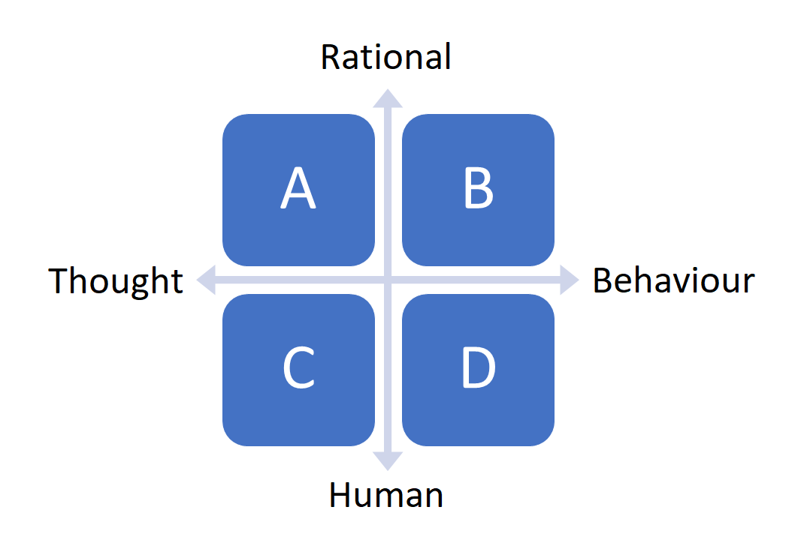

## __Philosophy AI__

Today, you will start your journey into the wonderful world of Artificial Intelligence :rainbow: :computer: During the first independent study day, you will dive into the foundational concepts of AI by examining its philosophy. In addition, you will receive instructions on how to work with GitHub, and the Work/Learning logs. 

We advise you to start early with the independent study exercises because we will cover quite a bit of material today!

## Learning objectives

1. Explain what version control is and why it can be useful
2. Implement version control using 'GitHub Desktop,' a Graphical User Interface for GitHub
3. Define the term 'artificial intelligence', 'weak AI', and 'strong AI'
4. Provide examples of real-life and/or fictional AI applications
5. Describe the procedure of the 'Chinese Room Experiment', and explain its objective
6. Appropriately match the philosophy of AI terms to the corresponding philosophy of AI matrix quadrants

## Questions or issues?

If you have questions or issues regarding the course material, please fill out the 'How Can We Help?' form under the section ['Ask me anything'](https://adsai.buas.nl/Contact%20Us/). A member of our teaching staff will respond as soon as possible.

***
## 1) Lecture: Block A kick-off

At 9:00, we will have the Block A kick-off presentation at the BUas Campus (Location to be further specified). Here, you will receive information regarding studying at BUas, and the day-to-day activities of the ADS&AI educational program. 

***

 ## 2) GitHub Desktop: Introduction to version control

Today, you will be introduced to the basics of version control, understand why it is useful and implement basic version control for a plain text document using GitHub Desktop.

 

*Figure 1. GitHub.*

### 2.1 What is version control and why use it?

It is helpful to understand what version control is and why it might be useful for the work you are doing prior to getting stuck into the practicalities. At a basic level version control involves taking 'snapshots' of files at different stages. Many people will have introduced some sort of version control systems for files. Often this is done by saving different versions of the files. Something like this:

```
mydocument.txt
mydocumentversion2.txt
mydocumentwithrevision.txt
mydocumentfinal.txt
```

The system used for naming files may be more or less systematic. Adding dates makes it slightly easier to follow when changes were made:

```
mydocument2016-01-06.txt
mydocument2016-01-08.txt
```

Though this system might be slightly easier to follow, there are still problems with it. Primarily this system does not record or describe the changes that took place between these two saves. It is possible that some of these changes were small typo fixes but the changes could also have been a major re-write or re-structuring of a document. If you have a change of heart about some of these changes you also need to work out which date the changes were made in order to go back to a previous version.

Version control tries to address problems like these by implementing a systematic approach to recording and managing changes in files. At its simplest, version control involves taking 'snapshots' of your file at different stages. This snapshot records information about when the snapshot was made but also about what changes occurred between different snapshots. This allows you to 'rewind' your file to an older version. From this basic aim of version control a range of other possibilities are made available.

#### 2.1.1 Why version control text documents?

As research increasingly makes use of digital tools and storage it becomes important to consider how to best manage our research data. This becomes especially important when we want to collaborate with other people. Though version control was originally designed for dealing with code there are many benefits to using it to with text documents too. Though not all of these benefits will be covered in this lesson, version controlling your document allows you to:

- Track developments and changes in your documents
- Record the changes you made to your document in a way that you will be able to understand later
- Experiment with different versions of a document while maintaining the original version
- 'Merge' two versions of a document and manage conflicts between versions
- Revert changes, moving 'backwards' through your history to previous versions of your document

Version control is particularly useful for facilitating collaboration. One of the original motivations behind version control systems was to allow different people to work on large projects together, in the case of Git to manage the Linux kernel source code. Using version control to collaborate allows for a greater deal of flexibility and control then many other solutions. As an example it would be possible for two people to work on a document at the same time and then merge these documents. If there were 'conflicts' between the two versions version control systems would allow you to see these conflicts and make an active decision about how to 'merge' these different versions into a new 'third' document. With this approach you would also retain a 'history' of the previous version should you wish to revert back to one of these later on.

Version control will not be necessary for all of the documents you write. However there are times when version control will be very useful. For substantial work such as articles, books, or dissertations, version control makes a lot of sense.

The implementation of version control we are going to use in this lesson will be publicly available, but it is possible to use version control and keep your documents hidden permanently or until you decide to make them available.

***

### 2.2 What are Git and GitHub?

Though often used synonymously, Git and GitHub are two different things. Git is a particular implementation of version control originally designed by Linus Torvalds as a way of managing the Linux source code. [Other systems](https://en.wikipedia.org/wiki/Comparison_of_version_control_software) of version control exist though they are used less frequently. Git can be used to refer both to a particular approach taken to version control and the software underlying it.

GitHub is a company which hosts Git repositories (more on this below) and provides software for using Git. This includes 'GitHub Desktop' which will be covered in this tutorial. GitHub is currently the most popular host of open source projects by [number of projects and number of users](https://en.wikipedia.org/wiki/Comparison_of_source_code_hosting_facilities#Popularity).

In this lesson the focus will be on gaining an understanding of the basic aims and principles of version control by uploading and version controlling a plain text document. This lesson will not cover everything but will provide a starting point to using version control.

#### 2.2.1 Why not use Dropbox or Google Drive?

Dropbox, Google Drive and other services offer some form of version control in their systems. There are times when this may be sufficient for your needs. However there are a number of advantages to using a version control system like Git:

- Language support: Git supports both text and programming languages. As research moves to include more digital techniques and tools it becomes increasingly important to have a way of managing and sharing both the 'traditional' outputs (e.g., journal articles, books, etc.) but also these newer outputs (e.g., code, datasets, etc.)
- More control: a proper version control systems gives you a much greater deal of control over how you manage changes in a document
- Useful history: using version control systems like Git will allow you to produce a history of your document in which different stages of the documents can be navigated easily both by yourself and by others

***

### 2.3 Getting started

GitHub Desktop will allow us to easily start using version control. GitHub Desktop offers a Graphical User Interface (GUI) to use Git. A GUI allows users to interact with a program using a visual interface rather than relying on text commands. Though there are some potential advantages to using the command line version of Git in the long run, using a GUI can reduce the learning curve of using version control and Git. If you decide you are interested in using the command line you can find more resources at the end of the lesson.

#### 2.3.1 A note on terminology

One of the trickiest aspects of using GitHub is the new terminology. Some of the commands are fairly self-explanatory, others less so. This tutorial will try and briefly summarise new terms. It may also be helpful to have a [glossary](https://help.github.com/articles/github-glossary/) on hand to refer to. But in general it can be best to pick up terminology through using GitHub rather than trying to understand all of the terms before you begin using it.

#### 2.3.2 Register for a GitHub account

Since we are going to be using GitHub we will need to register for an account at [GitHub](https://github.com/) if we don't already have one.

<div style="padding: 15px; border: 1px solid transparent; border-color: transparent; margin-bottom: 20px; border-radius: 4px; color: #8a6d3b;; background-color: #fcf8e3; border-color: #faebcc;">
Note: For each block, we will create a personal GitHub account for you. 
</div>


*Figure 2. GitHub ADS&AI student repositories.*


#### 2.3.3 Install GitHub Desktop

[You can download GitHub Desktop here.](https://desktop.github.com/) Once you have downloaded the file, unzip it and open the app, following the instructions for logging in to your GitHub account. Once you have installed GitHub Desktop and followed the setup instructions we can start using the software with a text document.

***

### 2.4 Version controlling a plain text document

Version control systems like Git work best with plain text files. Plain text files are files with minimal encoding, whereas word and other word processors produce a lot of code that is not human readable. The same text saved in a '.txt' file opens equally well in Word, LibreOffice or Notepad. This 'portability' of plain text files is a major benefit: they will open and display the text properly on almost any computer.

Although there are many benefits to writing our documents in plain text files we quickly come across some limitations. We may want to emphasise parts of text with *italics* or with **bold** words. We may want to include headings or include quotations. This is where 'markdown' comes in.

Markdown is a way of including formatting into a plain text document. You may have come across HTML or LaTeX in the past. These markup languages also express information about the formatting and structure of plain text. Markdown, however, tries to minimize the syntax. This makes it easier to focus on the content of writing without the markup getting in the way---hence the name 'markdown.'

The Markdown syntax will not be covered in this lesson in order to keep the length short. However, it makes sense to explore Markdown once you have gone through this lesson and are comfortable with the basics of version control. GitHub integrates its own version of Markdown syntax. If you add Markdown syntax to documents you version control with GitHub Desktop these will be rendered on the GitHub website. Arguably the best way to learn Markdown is to begin using it. The [Getting Started with Markdown](/lessons/getting-started-with-markdown) lesson by Sarah Simpkin provides an overview of Markdown.

#### 2.4.1 Text editors

To write in plain text we want to use a text editor. There are a huge number of free and paid text editors available. Some of these are very straightforward and simple to use while others have a learning curve and potential uses beyond simple text editing. In the long run using a more advanced and extendable text editor may save you time, but for now we can start with a more user-friendly editor. [Visual Studio Code](https://code.visualstudio.com/) is a good option for getting started. Visual Studio Code is a text editor built by Microsoft and includes syntax highlighting for Markdown alongside integration with GitHub. It is free and open source, a manual, including installation instructions, is available [here](https://code.visualstudio.com/docs).

#### 2.4.2 Creating a document

We can begin with a very simple document.

```
Hello world!
```

Include the above text or something similar in a new plain text document. Once you have done this save the file with a file extension '.md'. This is the most popular file extension used for markdown files though others are sometimes used. Make sure that it is saved in plain text format in a new folder. Sometimes your text editor will default to Rich Text Format. You should be able to change this in the preferences or options of your chosen text editor. Make sure to name the file and folder with something meaningful. This may seem slightly confusing. The '.md' file extension lets GitHub (and other software) know that we are using markdown syntax. However, we still want to ensure that the encoding of the file is in 'plain text'. Once you are setup with a text editor you like then the encoding of documents will not usually be an issue.

To most effectively use Git to version control it is important to organize projects in folders. Git tracks the contents of a folder by creating a **repository** in the folder. The repository is made up of all the files in the folder that are 'watched' for changes by Git. It is best to create one repository for each major project you are working on, i.e., one repository for an article, one for a book, and one for some code you are developing. These folders are like the normal folders you would have on your computer for different projects, though the files in the folders have to be deliberately added to the repository in order to be version controlled.

#### 2.4.3 Adding a document to a new or existing repository on GitHub

There are a number of different ways to **add** files for GitHub Desktop to track. We can drag the folder containing the file onto GitHub Desktop. When you do this you will be asked whether you want to create a repository for this folder. Alternatively we can click on the 'plus' icon to open a finder window to choose folders we want to add.


*Figure 3. GitHub add folder.*

You can also add files to an existing repository on GitHub.com. Before you can add a new file, you need to clone the repository to your local device. Cloning a repository pulls down a full copy of all the repository data that GitHub.com has at that point in time, including all versions of every file and folder for the project.

To clone a repository, open GitHub.com, and navigate to the main page of the repository. Above the list of files, click on the downward pointing arrow to 'Open with GitHub Desktop'. 

Once we have added our folder or existing repository from GitHub.com we will be able to see it in a list of repositories on the left column.

If we choose the repository we just added we will see the files contained in that repository. From this menu we can choose which files we want to version control. (There might be times when we are working on projects in which files are produced which we don't need or want to version control.) On the right we will see the current document.

If we show hidden folders in the folder, you will see that the folder contains an extra folder with the name '.git'. This folder is how GitHub desktop tracks changes we make within our version controlled folder whether these changes be adding new files or modifying existing ones.

Let us go back to the document in our text editor and add something new.

```
Hello world!
a second line
```

Save the changes to your file and go back to GitHub Desktop. You will see that these new lines of text appear. This lets us know that GitHub is able to see changes in your file but at the moment these changes have not been recorded in an official 'snapshot' of your repository.

To do this we need to **commit** our changes.

#### 2.4.4 Committing changes

A **commit** tells Git that you made some changes which you want to record. Though a **commit** seems similar to saving a file, there are different aims behind 'committing' changes compared to saving changes. Though people sometimes save different versions of a document, often you are saving a document merely to record the version as it is when it is saved. Saving the document means you can close the file and return to it in the same state later on. **Commits**, however, take a snapshot of the file at that point and allow you to document information about the changes made to the document.

 

*Figure 4. GitHub commit.*

To commit changes you must give a summary of the changes and include an optional message. It is important that you think carefully about when to make commits. The advantages of version control taking snapshots of your changes regularly relies on you making commits. It is often tempting to just commit changes when you have finished working on a document but this might not reflect when important changes occurred.

When you commit you will see 'commit to master'. This refers to the 'master branch'. Within a Git repository it is possible to have multiple 'branches.' These different branches are essentially different places in which to work. Often they are used to test new ideas or work on a particular feature. Initially it is not necessary to use the branches feature of GitHub, but you may want to learn to use it in the future, particularly if you want to use GitHub to collaborate on a repository with other people.

A useful way to think about commits is as the 'history' of your document. Each commit records a development or change made to the documents in your repository; the history of the document can be traced by looking at all of the commits. For this history to be useful later on, either for ourselves or for someone else, it is important that this history is recorded at relevant points. Trying to make commits 'atomic' is an important consideration. What this means is that each commit 'makes sense' on its own. The changes in the commit and the message are understandable without having to look at surrounding commits.

Thinking about how version control is used for code can make this idea more clear. When a new feature, or a bug fix, is added to some software it is important that these features can be isolated. If a commit includes changes to different aspects of the code it makes it hard to isolate when problems were introduced. It is also makes it difficult to remove a single change that is causing problems if other changes are included in the commit.

There are differences between using version control for code and text which will impact on how you make commits. However, the aim of making commits 'atomic' can still be used. For example, it would make sense to commit changes to the structure of a document separately to grammar and spelling fixes. If you later decided to change the structure you would likely still want to maintain your other fixes.

#### 2.4.5 Commit messages

It is important that you use meaningful commit summaries and messages. Writing good commit messages requires some prior thought. Messages that make sense to you as an explanation of changes when you make a commit may no longer make sense to you in the future. If you are going to use version control in collaboration with other people it is especially important that other people can understand your commit messages. Version control as a system for managing changes to documents works best when active thought goes into using the software. It is therefore particularly important when collaborating with other that there is a shared understanding and approach to using version control.

One way of addressing this is to try to follow a 'commit style'. One influential [suggestion](http://tbaggery.com/2008/04/19/a-note-about-git-commit-messages.html) for a commit style has been made by Tim Pope. The style suggestions made by Tim Pope are partly ['built in'](https://github.com/blog/926-shiny-new-commit-styles) to the GitHub Desktop commit message interface but understanding the format will help ensure a consistent approach. The following commit message paraphrases Tim Pope's suggested format to focus on commits relating to text rather than code:

```
Capitalized, short (50 chars or less) summary

More detailed explanatory text, if necessary. In some contexts, the first line is treated as the subject of an email and the rest of the text as the body.

Write your commit message in the present tense: "Fix typos" and not "Fixed
typos."  This convention matches with other aspects Git commands.

Further paragraphs come after blank lines.

- Bullet points are okay, too

- Typically a hyphen or asterisk is used for the bullet, preceded by a
  single space, with blank lines in between, but conventions vary here
```

The GitHub Desktop interface takes care of some of these 'style' issues but it is good to be conscious about how you write commit messages. It will not always be necessary to write an extensive commit message but is important that the message is clear about the changes being made and that the commits and the commit message are useful 'atomically'.

An example of a short but clear commit message in the context of written work:

```
Reorder document outline

Move the methods section below the sources section in the document outline.
Why? Some of the methods discussion doesn't make sense without a description
of the sources being used.
```

A potentially useful parallel to writing good commit messages is the messages included when you edit a Wikipedia or Wiki page. When writing these messages it is important to explain the changes you made to the page and the reasoning behind these changes so that other people who see the changes can understand your reasoning. Approaching commit messages as if they will be read not only by yourself but also by others will help you write clear and meaningful commit messages.

#### 2.4.6 Publishing your repository

At the moment we are only recording our changes locally. We may be happy to only store our changes locally (it is still important to back our files up) but we may want to upload our repository onto GitHub to make it public or to have it stored outside of our computer. The process of doing this through GitHub Desktop is straightforward. On GitHub desktop you 'publish' repositories. This will **push** your repository from your computer to the GitHub website and set up a **remote** repository in the process.


*Figure 5. GitHub push.*

Once you have 'published' your repository it will be viewable on your profile at GitHub's website. To quickly view your repository online you can use the repository menu and choose 'View on GitHub'. This will bring you to your repository online in your browser.


*Figure 6. View repository on GitHub.*

You can now see your document in your online repository.

Once your document is online, you can continue to make local changes to your file. But you will have to syncronise your local changes to reflect these changes in the published GitHub repository. GitHub stores changes both locally (on your computer) and remotely (on their servers). It is important to keep these changes in sync. On GitHub Desktop this process is simplified by using the **push** and **pull** button on GitHub Desktop. This will ensure your local (computer) and remote (GitHub server) repositories are the same. If you want to work on your document before 'publishing it' you can choose to make commits without syncing. This will allow you to implement version control early on whilst keeping the changes local to your computer initially.

#### 2.4.7 Making changes remotely

It is also possible to make a change to your repository on the web interface. Clicking on the name of the file will take you to a new page showing your document.


*Figure 7. View document on GitHub.*

From the web interface you have a variety of options available to you, including viewing the history of changes, viewing the file in GitHub Desktop, and deleting it. You can also see some other options next to 'code'. These options will not be so important to begin with but you may want to use them in the future. For now we will try editing a file in the web interface and syncing these changes to our local repository.

Click on the edit option. You will now be able to edit the file and add some new text.


*Figure 8. Edit file on GitHub.*

Once you have made some changes to your file, you will again see the option to commit changes at the bottom of the text entry box.


*Figure 9. Commit file on GitHub.*

Once you have committed these changes they will be stored on the remote repository. To get them back onto our computer we need to sync our these changes. We will see the 'pull' button on GitHub Desktop. 


*Figure 10. GitHub pull.*

We now have our remote changes synced back onto our computer.

You can see from this view that text with changes highlighted in green or red. Red indicates where things have been removed while green indicates additions. This can be useful for viewing the edits you have made before making a commit and helps you spot whether all the changes are ones you want to commit. On the left you will see a history of the changes you have made. At the moment this is very brief but as you work on a project the history might become much longer. Being able to see the changes you have made at different stages can be very useful ([Source](https://programminghistorian.org/en/lessons/retired/getting-started-with-github-desktop)).

__2.4a__ Create a new text file (e.g., markdown file), and save it with the name [**YourName_blockA_DataLabPreparation**]. Henceforth, please use this document to commit, and push the completed DataLab preparation exercises to your personal GitHub page. 

***

## 3) Foundations of AI

### 3.1 What is artificial intelligence?

Artificial intelligence (AI) has seen a rapid rise in popularity. Research into the field of AI is rocketing, and an increasing number of companies are incorporating AI technologies into their daily business operations. But, what does AI constitute?

__3.1a__ Watch the TEDx talk 'Understanding Artificial Intelligence and Its Future' by Neil Nie.

<iframe width="560" height="315" src="https://www.youtube.com/embed/SN2BZswEWUA?controls=0" title="YouTube video player" frameborder="0" allow="accelerometer; autoplay; clipboard-write; encrypted-media; gyroscope; picture-in-picture" allowfullscreen></iframe>

*Video 1. TEDx talk 'Understanding Artificial Intelligence and Its Future' by Neil Nie.*

__3.1b__ How would you define 'artificial intelligence'?

__3.1c__ Give three examples of AI applications. You can choose real-life examples, but also examples from popular culture (e.g., movies, books, video games etc.).

### 1.2 Philosophy of artificial intelligence

In this section, you will be made familiar with the various definitions of AI, and its related fields (e.g., cognitive science). The information required to complete this section successfully, can (to a greater extent) be found in the book Artificial Intelligence: A Modern Approach by Russell and Norvig (2021)<sup>[1](#footnote_1)</sup>. You will be using this specific book throughout the program.


*Figure 11. Artificial Intelligence: A Modern Approach (Russell and Norvig, 2021).*

You can purchase the book or borrow it from BUas' library. The library currently has three copies available.

<div style="padding: 15px; border: 1px solid transparent; border-color: transparent; margin-bottom: 20px; border-radius: 4px; color: #8a6d3b;; background-color: #fcf8e3; border-color: #faebcc;">
Tip: Incorporate some screen-free time in your schedule by reading a paper copy of a book/article etc. instead of a digital one. Your eyes will thank me later.
</div>

__3.2a__ Read the first two sub-chapters of the book Artificial Intelligence: A Modern Approach by Russell and Norvig (2021) (p.19-35).

<div style="padding: 15px; border: 1px solid transparent; border-color: transparent; margin-bottom: 20px; border-radius: 4px; color: #8a6d3b;; background-color: #fcf8e3; border-color: #faebcc;">
Tip: If you cannot find the answer to a question in the provided literature, try to look for an answer online.
</div>

__3.2b__ Define the following terms: 'weak AI', and 'strong AI'.

__3.2c__ If you have not taken a coffee break yet, take one right now (with your fellow students via Microsoft Teams)! Unlike computers, humans are only able to maintain true focus for around 45 minutes. If you are experiencing some difficulties concentrating, check out the [Pomodoro technique](https://pomofocus.io/).

__3.2d__ What is the 'Chinese room experiment'? Describe its procedure.

__3.2e__ What is the 'Chinese room experiment' supposed to show? Select the correct statement, and elaborate on your choice:

a) Computers are not yet able to simulate the human ability to understand
\
b) Understanding involves more than the ability to formally reproduce appropriate outputs
\
c) It is only possible for systems to demonstrate understanding
\
d) No machine can demonstrate genuine understanding

__3.2f__ Connect the Post It notes (Fig 12.) to the relevant quadrant in the philosophy matrix (Fig 13.). For example, A = 1, 2, and  B = 3, 4, 5 etc. Elaborate on your choices.


*Figure 12. Post It notes with the philosophy of AI terms.*
\
\


*Figure 13. Philosophy of AI matrix.*

__3.2g__ After completing the readings and exercises of this section, would you provide the same answer to exercise 3.1b? Explain your answer.

***

## __Footnote(s)__

<a name="footnote_1">1</a>: Hereforth abbreviated as AIMA.

***
