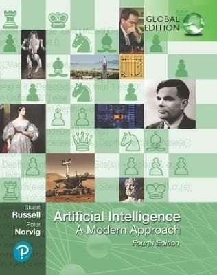

## __Philosophy AI__

Today, you will start your journey into the wonderful world of Artificial Intelligence :rainbow: :computer: During the first independent study day, you will dive into the foundational concepts of AI by examining its philosophy. In addition, you will receive instruction on how to work with your Learning and Work Log. By the end of this day, having completed the relevant readings and activities listed in the study material, you should be well prepared for DataLab 1.

We advise you to start early with the independent study exercises because we will cover quite a bit of material today!

Make sure to hand in your Preparation for DataLab 1, Week 1 exercises by the end of the day (Mandatory!). For the time being, you can upload it to your Microsoft Teams environment. For details on staff availability, see [Project Brief](https://adsai.buas.nl/Year1/BlockA/).

## Learning objectives

1. Define the term 'artificial intelligence', 'weak AI', and 'strong AI'
2. Provide examples of real-life and/or fictional AI applications
3. Describe the procedure of the 'Chinese Room Experiment', and explain its objective
4. Appropriately match the philosophy of AI terms to the corresponding philosophy of AI matrix quadrants

## Questions or issues?

If you have questions or issues regarding the course material, please fill out the 'How Can We Help?' form under the section ['Ask me anything'](https://adsai.buas.nl/Contact%20Us/). A member of our teaching staff will respond as soon as possible.

***

## 1) Foundations of AI

### 1.1 What is artificial intelligence?

Artificial intelligence (AI) has seen a rapid rise in popularity. Research into the field of AI is rocketing, and an increasing number of companies are incorporating AI technologies into their daily business operations. But, what does AI constitute?

__1.1a__ Watch the TEDx talk 'Understanding Artificial Intelligence and Its Future' by Neil Nie.

<iframe width="560" height="315" src="https://www.youtube.com/embed/SN2BZswEWUA?controls=0" title="YouTube video player" frameborder="0" allow="accelerometer; autoplay; clipboard-write; encrypted-media; gyroscope; picture-in-picture" allowfullscreen></iframe>

*Video 1. TEDx talk 'Understanding Artificial Intelligence and Its Future' by Neil Nie.*

__1.1b__ How would you define 'artificial intelligence'?

__1.1c__ Give three examples of AI applications. You can choose real-life examples, but also examples from popular culture (e.g., movies, books, video games etc.).

### 1.2 Philosophy of artificial intelligence

In this section, you will be made familiar with the various definitions of AI, and its related fields (e.g., cognitive science). The information required to complete this section successfully, can (to a greater extent) be found in the book Artificial Intelligence: A Modern Approach by Russell and Norvig (2021)[1](#footnote_1). You will be using this specific book throughout the program.

*Figure 1. Artificial Intelligence: A Modern Approach (Russell and Norvig, 2021).*

You can purchase the book or borrow it from BUas' library. The library currently has three copies available.

Tip: Incorporate some screen-free time in your schedule by reading a paper copy of a book/article etc. instead of a digital one. Your eyes will thank me later.

__1.2a__ Read the first two sub-chapters of the book Artificial Intelligence: A Modern Approach by Russell and Norvig (2021) (p.19-35).

Tip: If you cannot find the answer to a question in the provided literature, try to look for an answer online.

__1.2b__ Define the following terms: 'weak AI', and 'strong AI'.

__1.2c__ If you have not taken a coffee break yet, take one right now (with your fellow students via Microsoft Teams)! Unlike computers, humans are only able to maintain true focus for around 45 minutes. If you are experiencing some difficulties concentrating, check out the [Pomodoro technique](https://pomofocus.io/).

__1.2d__ What is the 'Chinese room experiment'? Describe its procedure.

__1.2e__ What is the 'Chinese room experiment' supposed to show? Select the correct statement, and elaborate on your choice:

a) Computers are not yet able to simulate the human ability to understand
\
b) Understanding involves more than the ability to formally reproduce appropriate outputs
\
c) It is only possible for systems to demonstrate understanding
\
d) No machine can demonstrate genuine understanding

__2f__ Connect the Post It notes (Fig 2.) to the relevant quadrant in the philosophy matrix (Fig 3.). For example, A = 1, 2, and  B = 3, 4, 5 etc. Elaborate on your choices.

*Figure 2. Post It notes with the philosophy of AI terms.*
\
\

*Figure 3. Philosophy of AI matrix.*

__1.2g__ After completing the readings and exercises of this section, would you provide the same answer to exercise 1.1b? Explain your answer.

***

## 2) Preparation for DataLab 1, Week 1

- [ ] Go to BUas' [Meta Search Engine](https://eds.s.ebscohost.com/eds/search/basic?vid=6&sid=59355576-7a16-4eec-86aa-73f051f228f0%40redis), and find:

1. A study skills book (e.g., presenting, writing, etc.) from the Library Collection
2. An AI-related eBook from the Library Collection.

Write down the title, author(s), accession number and publication year.

- [ ] Fill in your Work Log.
- [ ] Set a goal for Week 1, and note it down in your Learning Log.  

Note: When you are finished with the independent study material, and still have some time left, try to apply your newly gained knowledge to the Creative Brief.

***

## __Footnote(s)__

<a name="footnote_1">1</a>: Hereforth abbreviated as AIMA.

***
