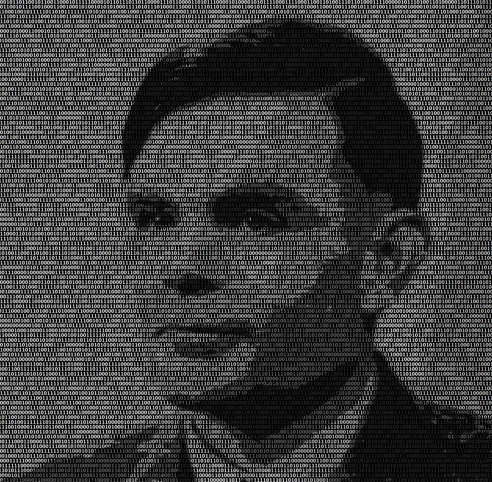

## __History of AI & Information literacy (2)__

Today's independent study material focusses on the history of AI. In particular, we will explore the famous article Computing Machinery and Intelligence by Alan Turing (1950). This is the first, and definitely not the last, research paper we are going to discuss in the program. As a data professional it is important to stay up to date with new developments in the field. Furthermore, it is good to be familiar with the seminal works of AI. One way of doing so, is reviewing these scholarly texts.

## Learning objectives

1. List, and describe key moments in the history of AI
2. Effectively read a research paper by applying Keshav's three-pass method
3. Explain the procedure, and main objective of Turing's 'Imitation Game'

## Questions or issues?

If you have questions or issues regarding the course material, please fill out the 'How Can We Help?' form in Microsoft Teams. A member of our teaching staff will respond as soon as possible.

***

## 1) History of Artificial Intelligence

### 1.1 Timeline

The early beginnings of AI, can be traced to the Ancient Greek period when philosophers started to describe human thinking as a symbolic system. Additionally, one of the first notions of a 'robot' can be found in Greek mythology:

> THE FIRST “ROBOT” to walk the earth—in ancient Greek mythology— was a bronze giant called Talos. Talos was an animated statue that guarded the island of Crete, one of three wondrous gifts fashioned by Hephaestus, god of the forge and patron of invention and technology. These marvels were commissioned by Zeus, for his son, Minos, the legendary first king of Crete. The other two gifts were a golden quiver of drone-like arrows that never missed their mark and Laelaps, a golden hound that always caught its prey. The bronze automaton Talos was charged with the task of defending Crete against pirates. Talos patrolled Minos’s kingdom by marching around the perimeter of the large island three times each day. As an animated metal machine in the form of a man, able to carry out complex human-like actions, Talos can be spoken of as an imagined android robot, an automaton “constructed to move on its own.” Designed and built by Hephaestus to repel invasions, Talos was “programmed” to spot strangers and pick up and hurl boulders to sink any foreign vessels that approached Crete’s shores. Talos possessed another capability too, modeled on a human trait. In close combat, the mechanical giant could perform a ghastly perversion of the universal gesture of human warmth, the embrace. With the ability to heat his bronze body red-hot, Talos would hug victims to his chest and roast them alive. (Mayor, 2018)

Throughout the centuries, scholars from various disciplines have made significant contributions to the field of AI. To name a few of them: al-Jazari, Leonardo Da Vinci, Ada Lovelace, Norbert Wiener, and Alan Turing.

However, the field of 'artificial intelligence' was not formally founded until 1956. It was at a conference, held at Dartmouth College, New Hampshire, were John McCarthy first coined the term 'artificial intelligence', which he defined as '... the science and engineering of making intelligent machines, especially intelligent computer programs' (Morignat, n.d.).  

After some setbacks in the 1970s and 1980s, also referred to as the AI winters, the field of AI has seen rapid advancements due to, among others, the introduction of deep learning, big data and artificial general intelligence in the early 2000s.

__1.1a__ Watch the video on the History of AI by YouTube´s AI with Alex.

<iframe width="560" height="315" src="https://www.youtube.com/embed/JjQGKSOTHa4?controls=0" title="YouTube video player" frameborder="0" allow="accelerometer; autoplay; clipboard-write; encrypted-media; gyroscope; picture-in-picture" allowfullscreen></iframe>

*Video 1. History of AI by YouTube´s AI with Alex.*

__1.1b__ Read the article ['The Ancient Quest for AI'](http://intelligentstory.com/the-quest-for-ai.html) by Valerie Morignat and/or Chapter 1.3 of AIMA (p.35-45).

__1.1c__ Find, and describe one 'milestone' in the history of AI. Be creative, so no 'milestones' by Alan Turing! No worries, we are going to extensively discuss his accomplishments in DataLab 2 :smiley:

***

### 1.2 Alan Turing & How to read a paper?

The rise of artificial intelligence forces us to rethink what robots mean to society and what their role is to be. They are far better at arithmetic, but are they really as intelligent as us? What constitutes intelligence? And should we fear being replaced by these digital machines in the future? Alan Turing was the first to examine the relationship between humans and digital machines.

*Figure 1. Portrait of Alan Turing made up by binary numbers.*

In the article Computing Machinery and Intelligence (1950), Turing lays the foundation for modern day AI. He introduces an behavioural test, the Turing Test, and discusses some objections raised in relation to this test. As a result of his contributions to the field, he also called one of the 'founding fathers' of AI.

__1.2a__ Reading scholarly text can be complex at first, but when you get the hang of it, you will most likely enjoy reading them because they often provide valuable new insights that you can use for your projects. The following guide shows you how to effectively read a research article by applying a practical and efficient three-pass method. Please, describe the three-pass procedure. Write your answer down.

- [How to read a paper](http://ccr.sigcomm.org/online/files/p83-keshavA.pdf)

Tip: If you are having difficulties reading the mathematical equations or understanding the main concept of a scholarly text, try to look for additional information online. YouTube (e.g.,
<a href="https://www.youtube.com/c/K%C3%A1rolyZsolnai/featured">Two Minute Papers</a>), StackOverfow, Quora, and Medium are examples of webpages that can help you in analysing these sources of information.

__1.2b__ Besides the Turing Test, Alan Turing is renowned for his work on:
\
1.
\
2.
\
3.

Fill in the blanks.

Alert: Whoever has the quirkiest fact on Alan Turing will receive a candy bar at the end of the workshop in DataLab 2.

__1.2c__ Read Wikipedia's summary of [Computing Machinery and Intelligence](https://en.wikipedia.org/wiki/Computing_Machinery_and_Intelligence#:~:text=Computing%20Machinery%20and%20Intelligence%20From%20Wikipedia%2C%20the%20free,as%20the%20Turing%20test%20to%20the%20general%20public.)

__1.2d__ Watch the video 'Turing Test: Can Machines Think?' by the highly popular podcast-making AI researcher Lex Fridman.

<iframe width="560" height="315" src="https://www.youtube.com/embed/MGW_Qcqr9eQ" title="YouTube video player" frameborder="0" allow="accelerometer; autoplay; clipboard-write; encrypted-media; gyroscope; picture-in-picture" allowfullscreen></iframe>

*Video 2. 'Turing Test: Can Machines Think?' by Lex Fridman.*

Did you enjoy the summary and the video, and want to take a deeper dive into Turing's Computing Machinery and Intelligence? Check out the original article, which you can find, [here](https://academic.oup.com/mind/article/LIX/236/433/986238).

Note: As you might have noticed, Computing Machinery and Intelligence (Turing, 1950) does not look like your typical data science or artificial intelligence research article. It is missing headings such as 'Introduction', 'Experiments', and/or 'Conclusion'. A good example of a traditional artificial intelligence (i.e., computer vision) article can be found, <a href="./documents/YOLO_paper.pdf">here</a>.

__1.2e__ Describe the procedure, and main objective of Turing's 'Imitation Game'. Write your answer down

***

## 2) Preparation for the conference

Tomorrow, we will attend the Artificial Intelligence & The BUAS domains conference at the Chapel, from 9:00-16:00. It is a mandatory activity for all ADS&AI students. Thus, make sure you are available throughout the day.

__Speakers:__
- fgdfg
- gfgdgh
- jhghdhg
 
- [ ]  Find background information on at least one of the abovementioned speakers:
 
- Department
- Research (e.g., domains, publications, etc.)
- Fun fact (Optional, bonus!)
 
- [ ] Please, read the [blog post](http://elisagranato.com/phd-tips-asking-a-question-after-a-seminar) on how to ask questions after a seminar/presentation/demo, etc., by Elisa Granato. She provides tips and tricks that, among others, can help you to overcome some of the anxiety you might experience when asking questions.

***
