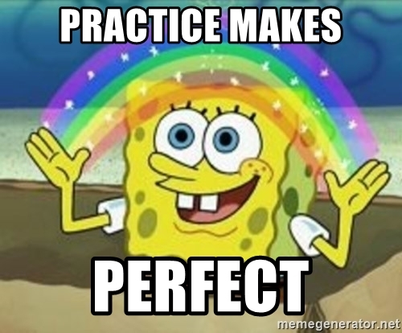
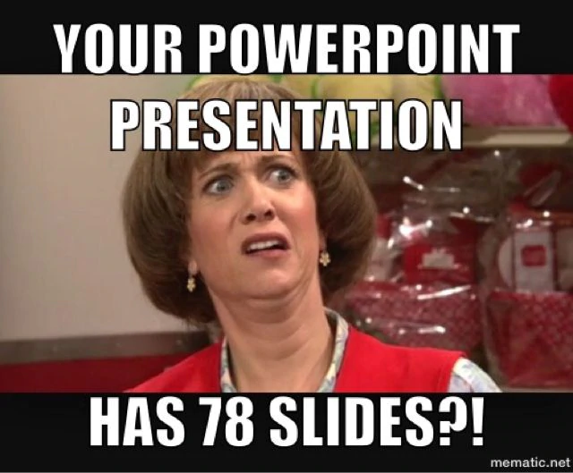

## DataLab 2: Presenting

In today's DataLab session, we will focus on strengthening our presentation skills. As a data professional, it is paramount that you can communicate your findings effectively:

> You can be the best data scientist — if you can't present your findings in a meaningful, engaging and memorable way — you won't make any impact. Simple as that. I mean, you don't have to be the next Steve Jobs… but you have to be a good enough presenter to let everyone in management understand the key takeaways of your data projects ([Source](https://data36.com/soft-skills-data-scientist/)).

To prepare you for the informative speech, i.e., the presentation 'AI in Science Fiction', we created a couple of in-class exercises and a workshop. Because, we all know:

*Figure 1. Sad, but true...*

These exercises will, among others, help you structure your speech and reduce some of the stage fright you might have.

## Learning objectives

1. Define the term 'informative speech'
2. List and describe the four types of informative speeches
3. List, and describe techniques to make informative speeches interesting, coherent, and memorable
4. Write an outline for an informative speech
5. Confidently deliver a informative speech to peers, and teaching staff members

## Questions or issues?

If you have questions or issues regarding the course material, please fill out the 'How Can We Help?' form under the section ['Ask me anything'](https://adsai.buas.nl/Contact%20Us/). A member of our teaching staff will respond as soon as possible.

***

## 1) Q&A and Standup

__1a__ Ask questions regarding the independent study material.

__1b__ Answer the following questions:

- What did I work on yesterday (includes DataLab Preparation!)?
- What am I working on today?
- What issues are blocking me?

***

## 2) Workshop: Presenting

### 2.1 Preparing a presentation

__2.1a__ Read [Chapter 15](https://socialsci.libretexts.org/Bookshelves/Communication/Public_Speaking/Public_Speaking_(The_Public_Speaking_Project)/15%3A_Informative_Speaking) of the book Public Speaking by The Public Speaking Project. This particular chapter will teach you how to create and deliver an informative speech.

__2.1b__ What is an informative speech? And what are the four types described in the book Public Speaking? Write your answer down.

__2.1c__ What makes an informative speech interesting, coherent, and memorable? List, and describe at least one technique.

__2.1d__ Prepare a 5-minute informative speech where you present your history of AI 'milestone':
  - Create an outline for your presentation
  - Think about the tool(s) that you would like to use for your presentation (e.g. PowerPoint, whiteboard etc.)
  - Practice your presentation (this includes timing it!)

For more information on public speaking, and useful presentation tools, see the following resources:

__Public speaking:__

- [Master Confident Presentations](https://www.linkedin.com/learning/master-confident-presentations/say-it-until-it-s-true?autoplay=true&resume=false&u=36359204) (LinkedIn Learning course, Chris Croft)
- [Public Speaking](https://socialsci.libretexts.org/Bookshelves/Communication/Public_Speaking/Public_Speaking_(The_Public_Speaking_Project)) (Book, The Public Speaking Project)

__Presentation tools:__

- [PowerPoint Essential Training (Office 365/Microsoft 365)](https://www.linkedin.com/learning/powerpoint-essential-training-office-365-microsoft-365/deliver-a-powerful-message-with-a-powerful-presentation?autoplay=true&u=36359204) (LinkedIn Learning course, Jess Stratton)
- [Learning PowerPoint 2021](https://www.linkedin.com/learning/learning-powerpoint-2021/learn-about-powerpoint-2021?autoplay=true&u=36359204) (LinkedIn Learning course, Garrick Chow)

Want to go beyond the traditional slide-based presentation (e.g., PowerPoint)? Make sure to check out the software package Prezi:

<iframe width="896" height="504" src="https://www.youtube-nocookie.com/embed/SWeXc0nwObc" title="YouTube video player" frameborder="0" allow="accelerometer; autoplay; clipboard-write; encrypted-media; gyroscope; picture-in-picture" allowfullscreen></iframe>

*Video 1. How to make a Prezi presentation.*

- [Prezi Essential Training](https://www.linkedin.com/learning/prezi-essential-training-8334259/break-out-of-linear-presentations-with-prezi?autoplay=true&u=36359204) (LinkedIn Learning course, Garrick Chow)

Note: Please, inform your mentor when you finished preparing the presentation, they will arrange a group (maximum of 5 students) for you, so you can proceed with the next step, - i.e., delivering your presentation, and providing feedback to your peers.

### 2.2 Delivering a presentation 

After the lunch break, you will participate in a workshop by Bert Heesakkers, where you, among others, will deliver your speech to a small group of peers. 

*Figure 2. Please, do not do this...*

__Schedule:__

| A. Mentor Group |  B.Timeslot |  
|---|---|
| 1.  Bram Heijligers & Zhanna Kozlova  | 12:00 - 12:45 |     
| 2.  Irene van Blerck |  13:00 - 13:45 |        
| 3.  Alican Noyan |  14:00 - 14:45 |     
| 4.  Dean van Aswegen  | 15:00 - 15:45  |     
| 5.  Gilmara Merrill | 16:00 -16:45  |         

***

## 3) Creative Brief: Minority Report (3)

After finishing the in-class exercises, try to apply your newly gained knowledge to the Creative Brief. For example, you could create an outline for your 'AI in Science Fiction' presentation, and discuss its content with your peers and/or mentor.

***

