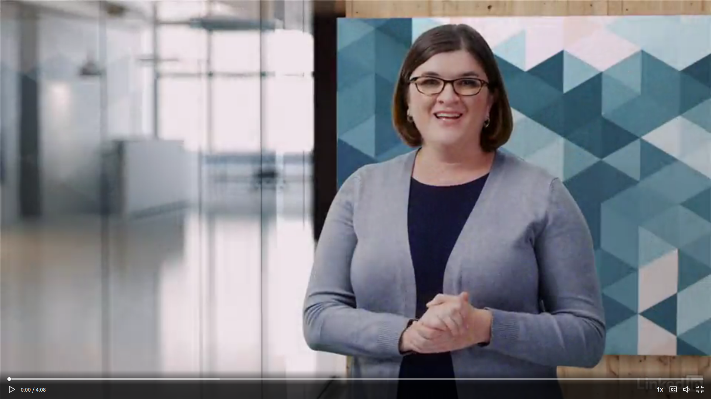

## __Intelligent Agents & Conversational AI__

Today's independent study material focuses on intelligent agents, particularly conversational agents, also known as chatbots. For example, you will be building your first AI application; a simple rule-based chatbot.

## Learning objectives

1. Define the terms 'intelligent agent', 'algorithm', and 'chatbot'
2. Explain what the Loebner Prize entails
3. Provide an example of an intelligent agent, and give a PEAS description of the task environment
4. Compare, and contrast the main (conversational) agent types/architectures
5. Create a simple rule-based chatbot with Google Forms, and Fobi.io

## Questions or issues?

If you have questions or issues regarding the course material, please fill out the 'Ask me Anything?' [form](https://adsai.buas.nl/Contact%20Us/AskMeAnything.html). A member of our teaching staff will respond as soon as possible.

***

## 1) Intelligent agents

### 1.1  What is a an intelligent agent?

Today, you are going to explore the concept of the intelligent agent, which can be defined as anything that perceives its environment through sensors and acting upon that environment through actuators. An example of such an 'intelligent' agent is iRobot's Roomba, which is a household vacuuming robot that is able to detect and avoid obstacles. Besides being praised for their innovative design, they are notoriously famous for committing suicide in the must stupid ways.

*Figure 1. Roomba's death by toilet paper...*

__1.1a__ Read chapter 2 of AIMA (p.55-80).

__1.1b__ Watch the video on Deep Blue by IBM.

<iframe width="896" height="504" src="https://www.youtube.com/embed/KFSVZlkHHmM?controls=0" title="YouTube video player" frameborder="0" allow="accelerometer; autoplay; clipboard-write; encrypted-media; gyroscope; picture-in-picture" allowfullscreen></iframe>

*Video 1. Deep Blue*

__1.1c__ Two intelligent agents are playing chess with a clock. One of them is Deep Blue, while the other is Gary Kasparov. Roughly specify the task environment for Deep Blue (this means you will have to specifying each letter in PEAS), and determine each of the following properties of this task environment:

__Specifying the task environment:__

1. Performance measure: ...
2. Environment: ...
3. Actuators: ...
4. Sensors: ...

__Properties of task environments:__

1. a) Fully observable or b) partially observable
2. a) Deterministic or b) stochastic
3. a) Episodic or b) sequential
4. a) Static, b) dynamic or c) semi-dynamic
5. a) Discrete or b) continuous
6. a) Single agent or b) multi-agent

Explain your answer.

__1.1d__ Provide an example of an intelligent agent, and give a PEAS description of the task environment, and characterize it in terms of the task properties listed in Section 2.3.2 (p. 61) in AIMA.

__1.1e__ Compare and contrast the following agent types:

- Simple reflex
- Model-based reflex
- Goal-based
- Utility-based  

Explain your answer.

### 1.2 Conversational AI

Conversational agents, also referred to as chatbots, are software applications that mimic human behavior (i.e. written or spoken speech) with the means to stimulate an interaction with a real person. If you have ever used an customer service live chat, you probably have interacted with such an conversational agent. It is estimated that by 2022, 75% to 90% of customer service inquiries are processed by bots operating on conversational AI technology ([Source](https://www.cnbc.com/2017/05/09/chatbots-expected-to-cut-business-costs-by-8-billion-by-2022.html?&qsearchterm=chatbots)). It is fair to say, chatbots are here to stay.

__1.2a__ Watch video on chatbots and virtual agents by Angela Wick.

*Video 2. Chatbots and virtual agents.*

__1.2b__ Provide three examples of a chatbot, which you might encounter in your everyday life. Write your answer down.

__1.2c__ Read the article [What are Chatbots](https://www.codecademy.com/article/what-are-chatbots), which elaborates on the different types of chatbots, - i.e., their architectures, and how they work.

__1.2d__ List, and describe the advantages and disadvantages of using the following response generation chatbot types: rule-based, retrieval-based, and generative.

__1.2e__ Watch the video about ELIZA, the first chatbot, which Joseph Weizenbaum developed at MIT's Computerized Reasoning Laboratory in 1964.

<iframe width="896" height="504" src="https://www.youtube-nocookie.com/embed/RMK9AphfLco" title="YouTube video player" frameborder="0" allow="accelerometer; autoplay; clipboard-write; encrypted-media; gyroscope; picture-in-picture" allowfullscreen></iframe>

*Video 3. Before Siri and Alexa, there was ELIZA.*

__1.2f__ ELIZA is an example of a ...

a) rule-based chatbot
\
b) retrieval-based chatbot
\
c) generative chatbot

Select the correct statement, and elaborate on your choice. 

Now, it is time to develop your own chatbot...

__1.2g__ Create a simple, code-free, rule-based chatbot with [Google Forms](https://docs.google.com/forms/u/0/), and [Fobi.io](https://fobi.io/). If you are new to Google Forms, check out the tutorial [Get started with Forms](https://support.google.com/a/users/answer/9302965?hl=en&visit_id=637898380966613309-4095149186&ref_topic=9296604&rd=1).

For a complete tutorial on how to create your chatbot, see video below:

<iframe width="896" height="504" src="https://www.youtube-nocookie.com/embed/hdiaN-7EHAk" title="YouTube video player" frameborder="0" allow="accelerometer; autoplay; clipboard-write; encrypted-media; gyroscope; picture-in-picture" allowfullscreen></iframe>

*Video 4. Fobi.io -Create Chatbots with Google Forms.*

Congratulations you have created your first [algorithm](https://www.britannica.com/science/algorithm)! :tada:

Want to make it a bit more challenging? Try to visualize your chatbot's algorithm in a flowchart:

<iframe width="896" height="504" src="https://www.youtube-nocookie.com/embed/SWRDqTx8d4k" title="YouTube video player" frameborder="0" allow="accelerometer; autoplay; clipboard-write; encrypted-media; gyroscope; picture-in-picture" allowfullscreen></iframe>

*Video 5. Introduction to Creating Flowcharts.*

__What is a flowchart?__

> A flowchart is a diagram that depicts a process, system or computer algorithm. They are widely used in multiple fields to document, study, plan, improve and communicate often complex processes in clear, easy-to-understand diagrams. Flowcharts, sometimes spelled as flow charts, use rectangles, ovals, diamonds and potentially numerous other shapes to define the type of step, along with connecting arrows to define flow and sequence. They can range from simple, hand-drawn charts to comprehensive computer-drawn diagrams depicting multiple steps and routes ([Source](https://www.lucidchart.com/pages/what-is-a-flowchart-tutorial)).

- ['What is a Flowchart' tutorial](https://www.lucidchart.com/pages/what-is-a-flowchart-tutorial) (Lucidchart)

Note: When you are finished with the independent study material, and still have some time left, try to apply your newly gained knowledge to the Creative Brief.

***
