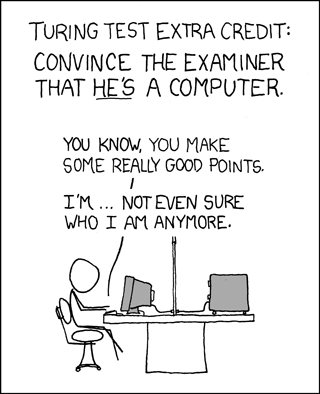

## DataLab 2: The Turing Test

In today's DataLab session, we will perform an experiment called the Turing Test. A quick refresher:

<iframe width="560" height="315" src="https://www.youtube-nocookie.com/embed/3wLqsRLvV-c" title="YouTube video player" frameborder="0" allow="accelerometer; autoplay; clipboard-write; encrypted-media; gyroscope; picture-in-picture" allowfullscreen></iframe>

*Video 1. The Turing test: Can a computer pass for a human? - Alex Gendler.*

So, our goal for today is to pass the Turing Test... Yes, Loebner prize

After the workshop you have time to work on the independent study material or creative brief, and/or ask the lecturers for feedback.

## Learning objectives

1. Find a general purpose/universal chatbot that is accessible via a weblink
2. Identify, and describe the characteristics of 'human' intelligence
3. Devise a strategy to fool the 'judges'/interrogators in the Turing Test
4. Conduct the Turing Test with a group of peers

## Questions or issues?

If you have questions or issues regarding the course material, please fill out the 'How Can We Help?' form in Microsoft Teams. A member of our teaching staff will respond as soon as possible.

***

## 1) Q&A and Standup

__1a__ Ask questions regarding the independent study material.

__1b__ Answer the following questions:

- What did I work on yesterday (includes DataLab Preparation!)?
- What am I working on today?
- What issues are blocking me?

***

## 2) Workshop: The Turing Test

### 2.1 Chatbots

__2.1a__ Find a general purpose/universal chatbot that is accessible via a weblink, and answer the following questions:

- When was it created?
- Who created it?
- Why was it created?

It is important to include evidence of your findings (e.g. webpage link of chatbot, newspaper article, academic journal article etc.).

Example: [Cleverbot](https://www.cleverbot.com/) (Carpenter, 1997).

***

### 2.2  Strategy

Before we conduct the Turing Test, we need to devise a strategy to convince the 'judges'/interrogators that our chatbot is not a machine but a real human being. Together with your fellow group members you are going to develop such a strategy by drawing up a setting, and its corresponding conditions and questions. After the experiment, we will find out which group passed the test, and which group failed the test.

__2.2a__ How to tell the difference between a robot and a human?

Can a robot:

- be creative?
- gossip?
- fall in love?
- tell a joke?
- have empathy?
- cause annoyance?

If answered with 'no', to what extent do you think robots will be able to his in the future?

Questions to think about:
- What characterizes us as being human?
- How would you define intelligence
- Can a machine/robot/computer be considered intelligent?
- Can a machine/robot/computer think for itself?

__2.2b__ Devise a strategy to fool the 'judges'/interrogators. Incorporate the following elements:

- Setting (e.g. discussion between two students during a political theory class)
- Conditions (e.g. show sense of morality)
- Questions (e.g. 'I have very controversial views on politics, on democracy in particular. Do you think I’m a bad person for preferring a benevolent dictatorship?')

Tip: Try to come up with a set of possible weak points of the Turing Test

***

### 2.3 Turing Test

*Figure 1. Turing Test, and the existential crisis...*

In-class experiment, instructions by lecturer.  

***

## 3) Creative Brief: Minority Report (4)

After finishing the in-class exercises, try to apply your newly gained knowledge to the Creative Brief. For example, you can investigate if the movie depicts any applications of conversational AI. If so, what are the technologies that drive these applications? Would you consider them 'intelligent'? Etc.

***
