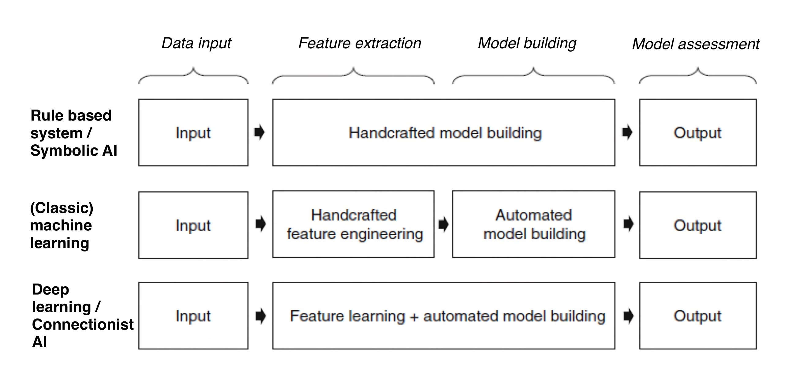
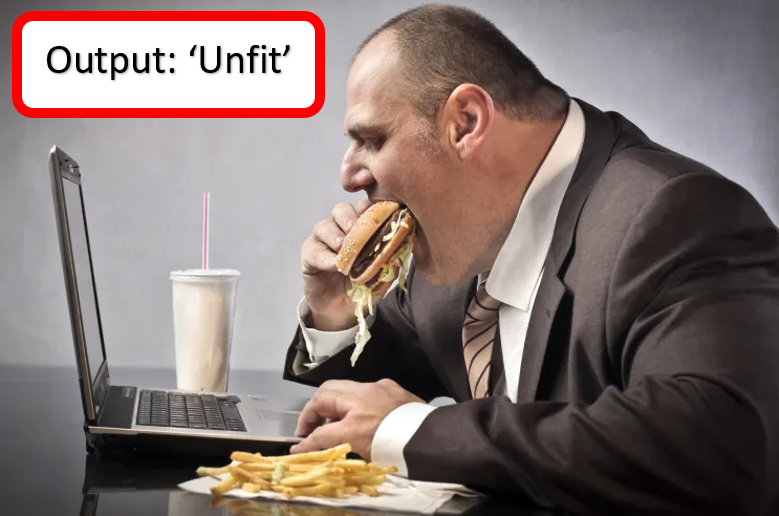
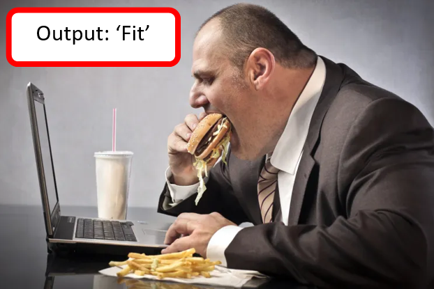

## Taxonomy of AI (2)

In today's independent study material, we will look at the different predictive modelling approaches, where we will focus on the concept of 'learning'. 

## Learning objectives

1. Define the terms 'Symbolic AI', 'Machine learning', 'Connectionist AI', 'Inference', and 'Expert system'
4. Explain the difference between 'supervised' and 'unsupervised' machine learning
5. Provide at least one advantage, and one disadvantage of applying a rule-based systems/Symbolic AI, and deep learning/Connectionist AI predictive modeling approach

## Questions or issues?

If you have questions or issues regarding the course material, please fill out the 'How Can We Help?' form under the section ['Ask me anything'](https://adsai.buas.nl/Contact%20Us/). A member of our teaching staff will respond as soon as possible.

***

## 1) Predictive analytics: To learn or not to learn...

Artificial intelligence is a wide-ranging field of research that focuses on building intelligent machines capable of performing tasks that typically require human intelligence. In this section, we will take a look at the three main approaches to predictive modelling in the field of AI:

 

*Figure 1. The field of AI.*

Rule-based systems/Symbolic AI also referred to as 'Good Old Fashioned AI,' states that '... all intelligent behaviour can be captured by a system that reasons logically from a set of facts and rules describing the domain' (Russel and Norvig, 2020). In contrast, (Classic) Machine learning and Deep learning/Connectionist AI do not require a symbolic representation. By feeding the systems with raw information, it can analyse and construct its own implicit knowledge, which in turn can be used to solve a data task, such as the one below.

#### Example: GP health check

Imagine being a data scientist whose task is to develop an analytical model to assist GPs in assessing patients' overall health by predicting if they are 'fit' or 'unfit' based on a few health-related characteristics.

Before you can start to build your model, i.e., apply an algorithm to your dataset, you must select one of the three approaches:

 

*Figure 2. Types of predictive analytics (learning).*

Let us use the following patient record as input for our analytical model:

&nbsp;&nbsp;&nbsp;Name: Hans Janssen  
&nbsp;&nbsp;&nbsp;Age: 29  
&nbsp;&nbsp;&nbsp;Exercise: 0 hours per week  
&nbsp;&nbsp;&nbsp;Food: every day a bowl of [Brinta](https://ifunny.co/picture/breakfast-in-the-netherlands-starterpack-peanut-cheese-not-just-for-b46QlAY89?s=cl), and at least five times per week junk food  
&nbsp;&nbsp;&nbsp;Work: at last 60 hours per week

 

*Figure 3. GP health check: 'Is a patient fit?'.*

To determine if a patient is 'fit' or 'unfit,' you could create the following flowchart that shows the various outcomes from a series of decisions:

*Figure 4. Patient: Hans Janssen.*

A flowchart or decision tree, such as the one depicted above, is a typical example of a rule-based system/Symbolic AI model; it requires handcrafted rules created by a (domain) professional. A rule could be, for instance, if a patient is below 30, and eats lots of junk food, the model should classify this patient as 'unfit':

*Figure 5. Hans Janssen classified as 'Unfit' by the predictive model.*

The problem with these rule-based system/Symbolic AI models is that they are rigid; the rules, and nothing else, determine if an action or inaction should be taken. Consequently, models who deploy this approach do not respond well to a changing environment. For instance, say all the major fast-food vendors have improved their menus in terms of health; on average, their food contains significantly more nutrients and less harmful fats than before. As a result, regularly eating fast food is not considered unhealthy anymore. However, your rule-based system/Symbolic AI model still thinks it is one of the decisive factors of an unhealthy lifestyle. Therefore, a patient who should be classified as 'fit' based on their junk food eating habits will be classified as 'unfit'.      

It is here where the other approaches, (classic) machine learning, and deep learning/Connectionist AI, come to the rescue. Although using different styles of learning, both 'learn' from the data that is fed to them.

If we look at (classic) machine learning, we see it has a separate feature extraction and model building phase. Features are distinctive characteristics of input patterns that help in differentiating between the various output categories (i.e., 'fit' and 'unfit'). For example, feature extraction, executed by the data scientist, helps the machine learning model identify essential properties of input patterns such as regular exercise and eating junk food. Concerning model building, a machine learning model 'learns' from past data and adjusts its responses accordingly.  Initially, the model will misclassify patients such as Hans Janssen, but eventually, it will adjust its rules to account for the changed situation:

*Figure 5. Hans Janssen classified as 'Fit' by the predictive model.*

Deep learning/Connectionist AI, completely automates the feature extraction and model building phase. The model, not the data scientist, engineers the features; they are 'learned' through evaluating past data, and are often perceived as uninformative from the human perspective due to their numerical and distributed nature. Remember, computers think in ones and zeros, while we humans tend to think in high-level concepts such as exercise and eating lots of fast food. Concerning model building, deep learning/Connectionist AI models work similarly to (classic) machine learning models. They both learn from past experiences.

To deepen our understanding, let us watch a couple of videos, and complete some exercises:

__1a__ Watch the video 'What is Machine Learning?' by IBM.

<iframe width="896" height="504" src="https://www.youtube-nocookie.com/embed/9gGnTQTYNaE" title="YouTube video player" frameborder="0" allow="accelerometer; autoplay; clipboard-write; encrypted-media; gyroscope; picture-in-picture" allowfullscreen></iframe>

*Video 1. 'What is Machine Learning?' by IBM.*

__1b__ Define the terms 'supervised' and 'unsupervised' learning. How do these types of machine learning differ from each other? Write your answer down.

__1c__ Watch the video on symbolic AI by the YouTube channel CrashCourse.

<iframe width="896" height="504" src="https://www.youtube.com/embed/WHCo4m2VOws?controls=0&amp;start=2" title="YouTube video player" frameborder="0" allow="accelerometer; autoplay; clipboard-write; encrypted-media; gyroscope; picture-in-picture" allowfullscreen></iframe>

*Video 2. Symbolic AI by CrashCourse.*

__1d__ Define the terms 'inference', and 'expert system' (Be concise!).

__1e__ Are artificial neural networks (ANNs) similar to the human brain? Support your answer with arguments.

__1f__ An ANN uses a a) symbolic or b) connectionist approach to AI? Select one of the options, and explain your choice.

Tip: Visit <a href="https://playground.tensorflow.org/#activation=tanh&batchSize=10&dataset=circle&regDataset=reg-plane&learningRate=0.03&regularizationRate=0&noise=0&networkShape=4,2&seed=0.12586&showTestData=false&discretize=false&percTrainData=50&x=true&y=true&xTimesY=false&xSquared=false&ySquared=false&cosX=false&sinX=false&cosY=false&sinY=false&collectStats=false&problem=classification&initZero=false&hideText=false/">Tensorflow's Playground</a> to experiment with artificial neural networks (no code needed).

In the last couple of years, there has been a reappraisal of symbolic AI because, among others, it is less susceptible to the so called 'Problem of opacity'. Minsky defines the problem as follows: '... the knowledge embodied inside a network's numerical coefficients is not accessible outside that net.' (1991). In other words, it is difficult to know why these connectionist models do what they do or how they work.

__1g__ Can you think of a real-life scenario where an AI method that uses a symbolic approach would be more suited than a method that uses a connectionist approach? Explain your answer.

***

## 2) DataLab preparation (Week 2, DataLab 2):

The next DataLab session, we will focus on strengthening our feedback skills. As part of the learning process, you will be asked to participate in a in-class workshop.  

- [ ] Open your [**YourName_blockA_DataLabPreparation**] markdown file, and include at least one piece of work, such as answer to a homework exercise, you want to receive feedback on from a peer. Commit the changes, and push the markdown file to your personal BUas repository, which is listed [here](ADD LINK).

Note: When you are finished with the independent study material, and still have some time left, try to apply your newly gained knowledge to the Creative Brief.

 

***

