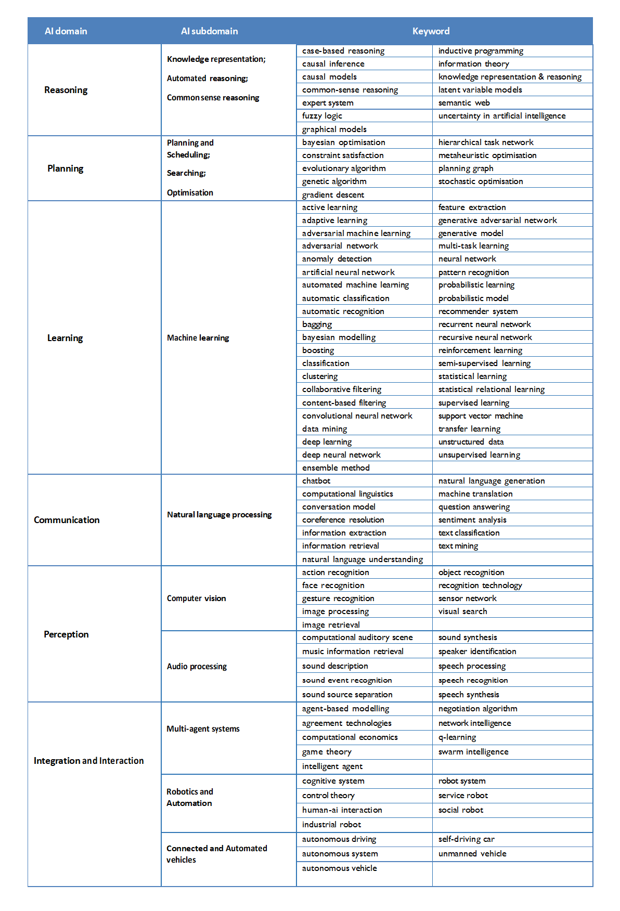

## Taxonomy of AI (3)

In today's independent study material, you will learn to define the domains, and subdomains presented in the Taxonomy of AI. In addition, we will teach you how to connect these domains and subdomains to your chosen AI topic from the movie Minority Report. 

## Learning objectives

1. Define the domains, and subdomains presented in the Taxonomy of AI
2. Connect AI topics from the movie Minority Report to relevant domains, and subdomains presented in the Taxonomy of AI

## Questions or issues?

If you have questions or issues regarding the course material, please fill out the 'How Can We Help?' form under the section ['Ask me anything'](https://adsai.buas.nl/Contact%20Us/). A member of our teaching staff will respond as soon as possible.

***

## 1) Taxonomy of AI: Domains, subdomains, and keywords

Now that you have been introduced to some of AI's foundational theories, principles, techniques, and applications, we can use AI Watch's Taxonomy of AI to classify them by domain and subdomain.

> AI Watch is an initiative of the European Commission (EC) jointly developed by the EC Joint Research Centre (JRC) and the Directorate General for Communications Networks, Content and Technology (DG CONNECT).  
AI Watch monitors industrial, technological and research capacity, policy initiatives in the Member States, uptake and technical developments of Artificial Intelligence and its impact in the economy, society and public services. It provides a number of analyses necessary to monitor and facilitate the implementation of the European Strategy for AI ([Source]()).

__1a__ Carefully look at the Taxonomy of AI table (Figure 1.), and read the text below, which provides information on the different domains, and subdomains of the field of AI.

 \
*Figure 1. AI domains, subdomains, and keywords based on AI Watch.*

__Domain 1: Reasoning__

__Subdomains: Knowledge representation; Automated reasoning; Common sense reasoning__

The domain of reasoning tackles the way machines transform data into knowledge, or infer facts from data. Several classifications address knowledge representation and automated reasoning as a field of AI, to describe the process of justifying (reasoning) the available data and information, provide solutions and represent them efficiently, based on a set of symbolic rules (HLEG, 2019; Spanish RDI Strategy in Artificial Intelligence, 2019; National Strategy: France Monitoring Report, 2019; CB Insights, 2019; AI National Strategy: Germany, 2018; Working Paper for National Strategy: India, 2018; ETSI, 2018; National Strategy: France (Villani Mission), 2018; AI National Strategy: China, 2017; McCarthy, 2007; Nilsson, 1998).

__Domain 2: Planning__

__Subdomains: Planning and Scheduling; Searching; Optimisation__

The main purpose of automated planning concerns the design and execution of strategies (e.g., an organised set of actions) to carry out some activity, and typically performed by intelligent agents, autonomous robots and unmanned vehicles. Unlike classical control and classification problems, the solutions are complex and must be discovered and optimised in the multidimensional space. (HLEG, 2019; Spanish RDI Strategy in Artificial Intelligence, 2019; National Strategy: France Monitoring Report, 2019; CB Insights, 2019; AI National Strategy: Germany, 2018; McCarthy, 2007).

__Domain 3: Learning__

__Subdomains: Machine Learning (ML)__
By learning, we refer to the ability of systems to automatically learn, decide, predict, adapt and react to changes, improving from experience, without being explicitly programmed. ML is widely included in the vast majority of efforts to identify AI categories, as the basic algorithmic approach to achieve AI regardless the type of learning, namely reinforcement, supervised, semi-supervised, unsupervised (HLEG, 2019; Spanish RDI Strategy in Artificial Intelligence, 2019; StandICT.eu project, 2019; National Strategy: Denmark, 2019; National Strategy: France Monitoring report, 2019; Australia’s Ethic Framework Dawson et al., 2019; US Congressional Research Service, 2019; CB Insights, 2019; EC JRC Flagship report on AI, 2018; AI National Strategy: Germany, 2018; OECD, 2018; Tsinghua University, 2018; Working Paper for AI National Strategy: India, 2018; National Industrial Strategy: UK, 2018; 2017; AI National Strategy: France (Villani Mission), 2018; US Department of Defense, 2018; OECD, 2017; McKinsey, 2017; Stone et al.: AI100, 2016; McCarthy, 2007).

__Domain 4: Communication__

__Subdomains: Natural Language Processing (NLP)__

NLP, as the main task of communication, refers to the machine's ability to identify, process, understand and/or generate information in written and spoken human communications. It is considered as an AI subdomain from several national strategies and AI experts, encompassing applications such as text generation, text mining, classification, and machine translation (HLEG, 2019; Spanish RDI Strategy in Artificial Intelligence, 2019; National Strategy: Denmark, 2019; National Strategy: France Monitoring report, 2019; CB Insights, 2019; EC JRC Flagship report on AI, 2018; OECD, 2018; Tsinghua University, 2018; Working Paper for AI National Strategy: India, 2018; National Strategy: France (Villani Mission), 2018; US Department of Defense, 2018; AI National Strategy: Japan, 2017; AI National Strategy: China, 2017; McKinsey, 2017; Stone et al.: AI100, 2016; McCarthy, 2007)

__Domain 5: Perception__

__Subdomains: Computer vision; Audio processing__

Perception refers to systems’ ability to become aware of their environment through the senses: vision, hearing, manipulation. etc., being vision and hearing the most developed areas in AI. Computer vision (CV) refers to activities that identify human faces and objects in digital images, as part of object-class detection. It is identified as one of the essential scientific fields with parts belonging to machine perception and, thus, AI. It is usually referred to as image pattern recognition for specific tasks, or as in a broader sense as machine vision, with applications on face and body recognition, video content recognition, 3D reconstruction, public safety and security, health etc. (HLEG, 2019; Spanish RDI Strategy in Artificial Intelligence, 2019; National Strategy: Denmark, 2019; Australia’s Ethic Framework Dawson et al., 2019; US Congressional Research Service, 2019; CB Insights, 2019; EC JRC Flagship report on AI, 2018; AI National Strategy: Germany, 2018; Tsinghua University, 2018; Working Paper for AI National Strategy: India, 2018; OECD, 2018; US Department of Defense, 2018; AI National Strategy: Japan, 2017; OECD, 2017; McKinsey, 2017; Stone et al.: AI100, 2016; McCarthy, 2007). Audio processing refers to AI systems allowing the perception or generation (synthesis) of audio signals, including speech, but also other sound material (e.g. environmental sounds, music). Speech or voice recognition, audio processing or sound technologies are also often proposed to be archived as an AI subdivision (AI4Belgium Report, 2019; COM(2018) 237 final; EC JRC Flagship report on AI, 2018; OECD, 2017, 2018; Tsinghua University, 2018; Working Paper for AI National Strategy: India, 2018; AI National Strategy: Japan, 2017; McCarthy, 2007).

__Domain 6: Integration and Interaction__

__Subdomains: Multi-agent systems; Robotics and Automation; Connected and Automated vehicles (CAVs)__

The transversal domain of Integration and Interaction addresses the combination of perception, reasoning, action, learning and interaction with the environment, as well as characteristics such as distribution, coordination, cooperation, autonomy, interaction and integration.. Robotics and Automation refers to activities related to application and research of the technological intelligent tools to assist or substitute human activity, or to enable actions that are not humanly possible (e.g. medical robots), to optimize technical limitations, labour or production costs. The CAVs subdomain regards technologies of autonomous vehicles, connected vehicles and driver assistance systems, considering all automation levels and all communication technologies (V2X). Multi-agent systems, Unmanned systems (CAVs, drones), as well as robotics and process automation (Application programming interface (API), robotic process automation for industrial, social and other uses) are also mentioned as separate intrinsic subdivisions of AI (HLEG, 2019; Spanish RDI Strategy in Artificial Intelligence, 2019; UNESCO, 2019; Australia’s Ethic Framework, 2019; National Strategy: Denmark, 2019; National Strategy: France Monitoring report, 2019; US Congressional Research Service, 2019; CB Insights, 2019; EC JRC Flagship report on AI, 2018; COM(2018) 237 final; AI National Strategy: Germany, 2018; Tsinghua University, 2018; Working Paper for AI National Strategy: India, 2018; National Industrial Strategy: UK, 2018; 2017; National Strategy: France (Villani Mission), 2018; Statista 2017; McKinsey, 2017; AI National Strategy: Japan, 2017; AI National Strategy: China, 2017; Stone et al.: AI100, 2016).

([Source](https://ai-watch.ec.europa.eu/publications/ai-watch-defining-artificial-intelligence-20_en))

__1b__ Find information that can help you to connect the following AI applications, algorithms etc. to the relevant domains and subdomains presented in the Taxonomy of AI:

- ELIZA
- Deep Blue
- AlphaGo
- AlexNet
- GPT-3
- Google's robot dog, Laikago
- Tesla car

__1c__ Let us test our newly gained knowledge by taking a short quiz!

<iframe width="1280px" height="960px" src="https://forms.office.com/r/AbmyH44uYE?embed=true" frameborder="0" marginwidth="0" marginheight="0" style="border: none; max-width:100%; max-height:100vh" allowfullscreen webkitallowfullscreen mozallowfullscreen msallowfullscreen> </iframe>

__1d__ Visualize the Taxonomy of AI by creating an infographic. You can use Google's [Jamboard](https://jamboard.google.com/) or a simple piece of paper for your infographic. Export/import your drawing to PNG, and upload it to your GitHub repository.

Note: When you are finished with the independent study material, and still have some time left, try to apply your newly gained knowledge to the Creative Brief.

 

***