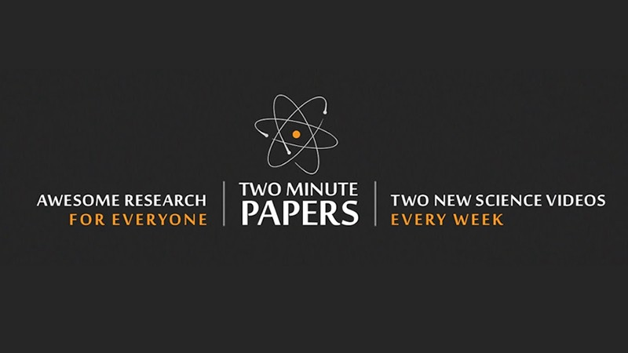

## State-of-the-art AI & Minority Report (3)

>'What a time to be alive!'  
 ― Károly Zsolnai-Fehér

In today's independent study material, you will familiarize yourself with innovative AI/Data Science research and its applications. For the second half of the day, you are free to work on your 'AI in Science Fiction' presentation. 

## Learning objectives

1. Provide examples of state-of-the-art (SOTA) AI research, and its applications
2. Reflect on personal strengths and weaknesses concerning the educational program

## Questions or issues?

If you have questions or issues regarding the course material, please fill out the 'Ask me Anything?' [form](https://adsai.buas.nl/Contact%20Us/AskMeAnything.html). A member of our teaching staff will respond as soon as possible.

***

## 1) Research & Applications

__1a__ Read sub-chapter 1.4 of the AIMA book (p.45-48). 

__1b__ Read a blog, and note down the research topic, author, and affiliated university/company, etc.

- [Berkeley Artificial Intelligence Research (BAIR)](https://bair.berkeley.edu/blog/)

- [Google AI Blog](https://ai.googleblog.com/)

- [OpenAI Blog](https://openai.com/blog/)

Struggling to read these (scientific) blogs, try to read a blog on a novel AI algorithm and/or application that is posted on [Medium](https://medium.com/tag/artificial-intelligence), which caters to a more general audience. 

> Two Minute Papers is a YouTube series that showcase and attempt to explain interesting research works, a couple minutes or more at a time, run by Károly Zsolnai-Fehér. Two Minute Papers aims to communicate newest scientific discoveries, ideas and result, bringing people in the conversation that are oftenly reserved for experts of the field. Zsolnai-Fehér breaks down the scientific papers that are meant to communicate ideas and results between experts, and making the language more understandable for people who may not have expertise in mathematics or science ([Source](https://youtube.fandom.com/wiki/Two_Minute_Papers)).

 

*Figure 1. Two Minute Papers.*

__1c__ Select three videos from [Two Minute Papers](https://www.youtube.com/c/K%C3%A1rolyZsolnai), and summarize their content in a maximum of 300 words.  

For example, check out their awesome video on OpenAI's Dall-E 2:

<iframe width="896" height="504" src="https://www.youtube-nocookie.com/embed/lbUluHiqwoA" title="YouTube video player" frameborder="0" allow="accelerometer; autoplay; clipboard-write; encrypted-media; gyroscope; picture-in-picture" allowfullscreen></iframe>

*Video 1. OpenAI's DALL-E 2: Even More Beautiful Results!*

Note: To create your own DALL-E (mini) artwork, visit <a href="https://huggingface.co/spaces/dalle-mini/dalle-mini">Hugging Faces</a>. No coding skills needed!

***

## 2) DataLab preparation (Week 3, DataLab 2):

- [ ] Open your [**YourName_BlockA_DataLabPreparation**] markdown file, and list at least one element, related to the 'AI in Science Fiction' presentation, you wish to receive feedback on. Commit the changes, and push the markdown file to your personal BUas repository.

Note: When you are finished with the independent study material, and still have some time left, try to apply your newly gained knowledge to the Creative Brief.

 

***