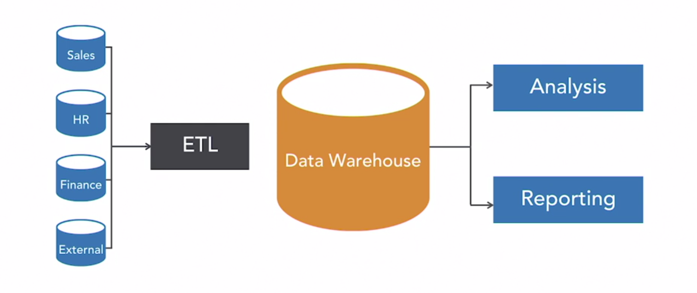

## __Introduction to BI: Data architecture & pipeline design__
\
\


### 1. Introduction

Hi everyone! Today we are going to start with Block B (Spoiler: We are going to work on a real-life business case. More on this in Datalab 1 :smile:)

For the first half of the day, you will be made familiar with the core concepts of data architecture & pipeline design. For example, you will explore the ETL process and learn how to design tables in a data warehouse.

If you have questions regarding the study material, you can send us an email or attend the Q&A session at the end of each independent study day. During the Q&A session, we will extensively discuss the independent study material. For details on availability see Project Brief.

__1a__ Complete module ```1. Data Warehouse Foundations``` of the LinkedIn course Implementing a Data Warehouse SQL Server 2019 by Adam Wilbert, which you can find [here](https://www.linkedin.com/learning/implementing-a-data-warehouse-sql-server-2019/data-warehouse-core-concepts?u=36359204).

***

### 2. Data pipeline

A traditional data pipeline transports raw data from software-as-a-service (SaaS) platforms and database sources to data warehouses for use by analytics and business intelligence (BI) tools, such as Power BI (introduced in week 3!). In this section, we are going to review the various components and stages of a data pipeline.



*Figure 1. Business intelligence system.*

__2a__ Define the term 'data warehouse'. Write your answer down.

__2b__ List three core concepts of a data warehouse. Write your answer down.

__2c__ List at least one benefit and one weakness of using a data warehouse. Provide a context, i.e. business setting, for each of your benefit(s)/weakness(es). Write your answer down in a maximum of 150 words.

<div style="padding: 15px; border: 1px solid transparent; border-color: transparent; margin-bottom: 20px; border-radius: 4px; color: #8a6d3b;; background-color: #fcf8e3; border-color: #faebcc;">
Tip: Want to explore another, increasingly popular, data management system, check out PricewaterhouseCoopers' article on data lakes: <a href="(./documents/pwc-technology-forecast-data-lakes.pdf">The enterprise data lake:
Better integration and deeper analytics</a>.
</div>

__2d__ Read IBM's blog on OLAP and OLTP systems, which  you can find [here](https://www.ibm.com/cloud/blog/olap-vs-oltp).

__2e__ As a data analyst, you are given the task to provide a list of the company's top 10 best-selling items. Should you retrieve your data from the company's OLAP or OLTP system? Explain your answer.

***

### 3. Designing a data warehouse

__3a__ Read pages 10-17 of the book The data warehouse toolkit by Kimball and Ross (2013) (optional).

__3b__ Define the term 'star schema'. Write your answer down.


*Figure 2. Example of a star schema with fact and dimension tables.*

__3c__ Provide an example of a selection of facts and dimensions joined in a star schema. You can use Google's [Jamboard](https://jamboard.google.com/) or a simple piece of paper for your schema. Export/import your drawing to PNG, and upload it to your GitHub repository.

<div style="padding: 15px; border: 1px solid transparent; border-color: transparent; margin-bottom: 20px; border-radius: 4px; color: #8a6d3b;; background-color: #fcf8e3; border-color: #faebcc;">
Note: In the upcoming independent study days we will shift our focus from the data warehouse to the transactional database. However do not despair, the star schema is here to stay!
</div>

__3d__ Describe the ETL process. Write your answer down in a maximum of 150 words.

__3e__ Create an infographic that covers the topics (of the first two modules) of the LinkedIn course Data Warehouse SQL Server 2019 by Adam Wilbert. You can use Google's [Jamboard](https://jamboard.google.com/) or a simple piece of paper for your infographic. Export/import your drawing to PNG, and upload it to your GitHub repository.

***

## __Literature__

Kimball, R., & Ross, M. (2013). The data warehouse toolkit: The definitive guide to dimensional modeling. (Free access through BUAS' MetaSearch).
