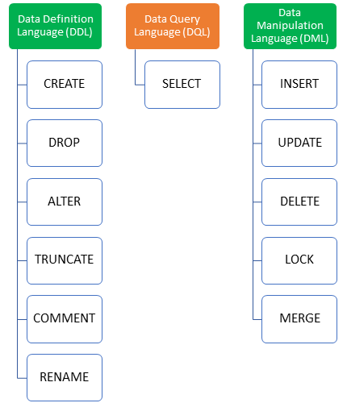
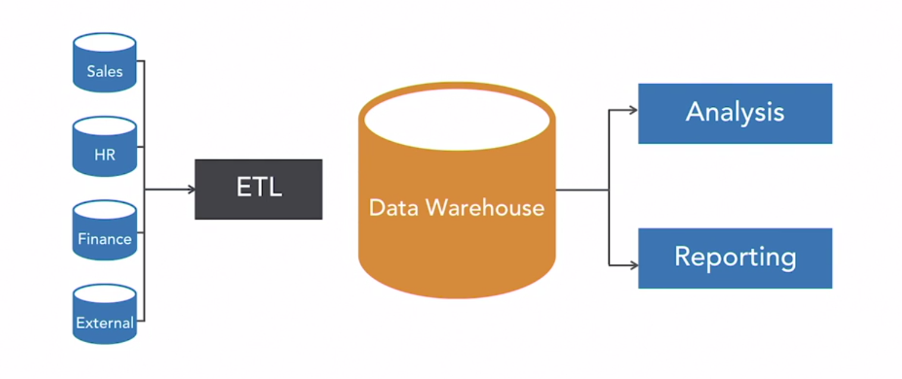
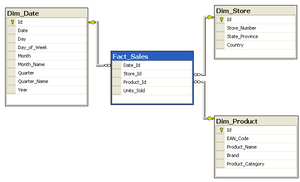
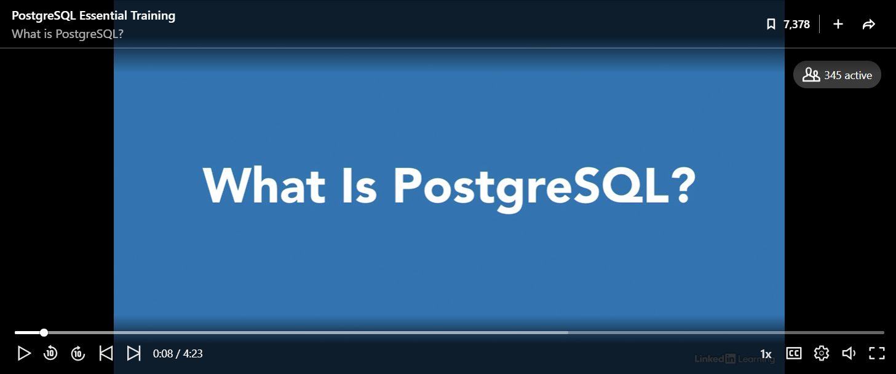
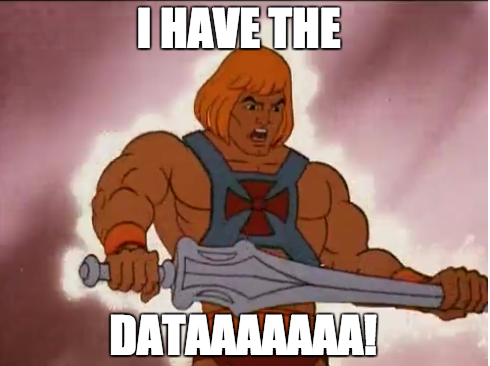

## __Databases, Data Definition Language (DDL) clauses I & Data Manipulation Language (DML) clauses__

### Chapter overview

I. __Databases, Data Definition Language (DDL) clauses I & Data Manipulation Language (DML) clauses__ <br>
II. Data Query Language (DQL) clauses <br>
III. DataLab: Use-Cases <br>
IV. Data Definition Language (DDL) clauses II & Python <br>
V. DataLab: Use-Cases <br> 

### 1. Introduction

Hello everyone! This week, our main focus will be on getting to know the datasets that you will be working with in the upcoming weeks. Some of these datasets are stored in a data warehouse, which means you will need to learn how to interact with a database using Structured Query Language (SQL).

During the first half of the day, you will be introduced to the core concepts of data architecture and pipeline design. You will learn about the ETL process and how to design tables in a data warehouse.

In the second half of the day, we will delve into the fundamental concepts of database design and Structured Query Language (SQL). You will begin by taking the Design Databases with PostgreSQL course on Codeacademy, followed by some additional SQL exercises that will focus on specific clauses of Data Definition Language (DDL) and Data Manipulation Language (DML).



<br>

__After this chapter, you will be able to:__

- [ ] Define the terms 'database', 'SQL', 'data warehouse'. 
- [ ] List, and describe three core concepts of a data warehouse.
- [ ] List, and describe at least one benefit and one weakness of using a data warehouse.
- [ ] Explain the differences between OLAP and OLTP systems.
- [ ] Draw a simple star schema for a given business scenario.
- [ ] List, and describe the main elements of the ETL process.
- [ ] Explain the difference between a relational and a non-relational (i.e., NoSQL) database.
- [ ] List, and describe some advantages and disadvantages of using a relational database.
- [ ] Install a PostgreSQL database server and client on your local device.
- [ ] Apply Data Definition Language (DDL) and Data Manipulation Language (DML) clauses to create and manipulate tables in a PostgreSQL database.

:pencil: __1a__ Complete module ```1. Data Warehouse Foundations``` of the LinkedIn course Implementing a Data Warehouse SQL Server 2019 by Adam Wilbert, which you can find [here](https://www.linkedin.com/learning/implementing-a-data-warehouse-sql-server-2019/data-warehouse-core-concepts?u=36359204).

***

### 2. Data pipeline

A traditional data pipeline transports raw data from software-as-a-service (SaaS) platforms and database sources to data warehouses for use by analytics and business intelligence (BI) tools, such as Power BI (introduced in week 3!). In this section, we are going to review the various components and stages of a data pipeline.



*Figure 1. Business intelligence system.*

:pencil: __2a__ Define the term 'data warehouse'. Write your answer down.

:pencil: __2b__ List three core concepts of a data warehouse. Write your answer down.

:pencil: __2c__ List at least one benefit and one weakness of using a data warehouse. Provide a context, i.e. business setting, for each of your benefit(s)/weakness(es). Write your answer down in a maximum of 150 words.

<div style="padding: 15px; border: 1px solid transparent; border-color: transparent; margin-bottom: 20px; border-radius: 4px; color: #8a6d3b;; background-color: #fcf8e3; border-color: #faebcc;">
Tip: Want to explore another, increasingly popular, data management system, check out PricewaterhouseCoopers' article on data lakes: <a href="./documents/pwc-technology-forecast-data-lakes.pdf">The enterprise data lake:
Better integration and deeper analytics</a>.
</div>

:pencil: __2d__ Read IBM's blog on OLAP and OLTP systems, which  you can find, [here](https://www.ibm.com/cloud/blog/olap-vs-oltp).

:pencil: __2e__ As a data analyst, you are given the task to provide a list of the company's top 10 best-selling items. Should you retrieve your data from the company's OLAP or OLTP system? Explain your answer.

***

### 3. Designing a data warehouse

:pencil: __3a__ Read pages 10-17 of the book The data warehouse toolkit by Kimball and Ross (2013) (optional).

:pencil: __3b__ Define the term 'star schema'. Write your answer down.



*Figure 2. Example of a star schema with fact and dimension tables.*

:pencil: __3c__ Provide an example of a selection of facts and dimensions joined in a star schema. You can use Google's [Jamboard](https://jamboard.google.com/) or a simple piece of paper for your schema. Export/import your drawing to PNG, and upload it to your GitHub repository.

<div style="padding: 15px; border: 1px solid transparent; border-color: transparent; margin-bottom: 20px; border-radius: 4px; color: #8a6d3b;; background-color: #fcf8e3; border-color: #faebcc;">
Note: In the upcoming independent study days we will shift our focus from the data warehouse to the transactional database. However do not despair, the star schema is here to stay!
</div>

:pencil: __3d__ Describe the ETL process. Write your answer down in a maximum of 150 words.

:pencil: __3e__ Create an infographic that covers the topics (of the first two modules) of the LinkedIn course Data Warehouse SQL Server 2019 by Adam Wilbert. You can use Google's [Jamboard](https://jamboard.google.com/) or a simple piece of paper for your infographic. Export/import your drawing to PNG, and upload it to your GitHub repository.

Let us take a closer look at what a database is and how we can interact with it using Structured Query Language (SQL).

***

### 4. What is a database?

A database is an organized collection of structured information, or data, typically stored in a computer system, such as your laptop. It is usually controlled by a database management system, also known as DBMS. Together, the data and the DBMS, along with the applications that are associated with them (e.g. PostgreSQL client), are referred to as a database system, often shortened to database. In this section, you will explore the different types of databases, and their corresponding strengths and weaknesses.

:pencil: __4a__ a) What is a SQL or relational database, and b) how does it differ from a so-called NoSQL database? Explain your answer

:pencil: __4b__ List three advantages/disadvantages of using a relational database. Write your answer down.

:pencil: __4c__ The start-up HomeRobot is looking for a lightweight relational database management system (RDBMS) that they can embed in their Internet-of-Things (IoT) application. They have asked you, as a seasoned data engineer/analyst, for advice; which RDBMS would you recommend to them? Explain your answer.

***

### 5. Install PostgreSQL database server & client

To easily access a database, you need a database client. In this section, you are going to install the PostgreSQL database server, and a so-called database client (e.g. PgAdmin).

:pencil:__5a__ Watch the video Introduction to PostgreSQL by Adam Wilbert on LinkedIn Learning, and read the article [What is PostgreSQL?](https://www.postgresqltutorial.com/what-is-postgresql/).

[](https://www.linkedin.com/learning/postgresql-essential-training/what-is-postgresql?u=36359204 "Click on link to open video!")
*Video 1. Introduction to PostgreSQL by Adam Wilbert.*

:pencil: __5b__ Install the PostgreSQL database server:

- [Install PostgreSQL on Windows](https://www.postgresqltutorial.com/install-postgresql/).

:pencil: __5c__ Install a PostgreSQL compatible client:

- [PgAdmin](https://www.pgadmin.org/download/)
- [DBeaver](https://dbeaver.io/download/)
- etc.

:pencil: __5d__ Connect PostgreSQL client to server. For PgAdmin, see online [tutorial](https://www.postgresqltutorial.com/connect-to-postgresql-database/).

***

### 6. Manipulating a database

For this knowledge module , we will use a synthetic, i.e., 'fake', dataset designed for a make-believe youth care organization, named ```youth_care```. Suppose you are recruited by a municipality to construct a data warehouse. The objective of this data warehouse is to examine the organization's effectiveness and facilitate decision-making. Both the organization's management and the data analysts from the municipality will use the data warehouse.

Let us start with some simple exercises to get you familiar with the PostgreSQL database server and client.

:pencil: __6a__ What happens if you try to create a table with an existing name? Write your answer down.

:pencil: __6b__ Identify, describe, and subsequently correct the error(s) in the following SQL statements.

Example 1a:

``` sql
CREATE TABLE youth (
  ClientKey INTEGER PRIMARY KEY,
  ToewijzingKey INTEGER,
  ClientVoornamen TEXT,
  NotaRegelBedrag NUMERIC,
  GeboorteJaar INTEGER NOT NULL
);

INSERT INTO youth
VALUES
  (
    1, 'Jan', 24, 4657, 2014
	),
	(
		1, 'Jan', 51, 45, 2014
	),
	(
		2, 'Anne', 205, 6778, 2008
	);
```

Example 1b:

``` sql
CREATE TABLE youth (
  ClientKey INTEGER PRIMARY KEY,
  ToewijzingKey INTEGER,
  ClientVoornamen TEXT,
  NotaRegelBedrag NUMERIC,
  GeboorteJaar INTEGER NOT NULL
);

INSERT INTO youth VALUES (1, 'Jan', 24, 4657, 2014);
INSERT INTO youth VALUES (1, 'Jan', 51, 45, 2014);
INSERT INTO youth VALUES (2, 'Anne', 205, 6778, 2008);
```
<div style="padding: 15px; border: 1px solid transparent; border-color: transparent; margin-bottom: 20px; border-radius: 4px; color: #8a6d3b;; background-color: #fcf8e3; border-color: #faebcc;">
Note: Example 1a, and 1b look similar, but present a very different output when you run the corresponding SQL queries.
</div>

Example 2:

``` sql
INSERT INTO youth VALUES (11, Bert, 106, 2234.50, 2005)
```
Example 3:

``` sql
DELETE ClientKey FROM youth
WHERE youth = 11;
```

:pencil: __6c__ What are constraints? List three of them, and explain why it would be beneficial to apply such as constraint?

:pencil: __6d__ After placing a UNIQUE constraint on one of the variables (named 'unique_constraint') in the table above, you receive the following error message in your PostgreSQL client: ERROR: could not create unique index "unique_constraint". Can you explain the error? What could have possibly gone wrong? Multiple answers possible.

***

### 7. Additional resources 



*Figure 2. An example of how you might look when you reach the level of data wrangling SQL wizard/action hero/avatar etc...*

Do you have time left, and have the desire to become a data wrangling SQL wizard, explore the following additional resources:

__Interactive exercises:__
- PostgreSQL Exercises: [Modifying data](https://pgexercises.com/questions/updates/).
- Intro to SQL: Querying and managing data: [SQL basics](https://www.khanacademy.org/computing/computer-programming/sql/sql-basics/v/welcome-to-sql), and [Modifying databases with SQL](https://www.khanacademy.org/computing/computer-programming/sql/modifying-databases-with-sql/a/using-sql-to-update-a-database).

__Instructional videos:__
- LinkedIn Learning: [PostgreSQL Essential Training](https://www.linkedin.com/learning/postgresql-essential-training/manage-relational-data-with-postgresql?resume=false&u=36359204).

__Books/articles/webpages etc.:__
- Batra, R. (2018). SQL primer: An accelerated introduction to SQL basics. (Freely available through BUAS' MetaSearch).
- Kimball, R., & Ross, M. (2013). The data warehouse toolkit: The definitive guide to dimensional modeling. (Free access through BUAS' MetaSearch).
- W3schools: [SQL Tutorial](https://www.w3schools.com/sql/default.asp).

***

### Codebook

|Number|Variable           |Description              |
|------|-------------------|-------------------------|
|1     |ClientKey          |Client ID                |
|2     |ClientVoornamen    |Client first name        |
|3     |ClientTussenvoegsel|Client middle name       |
|4     |ClientAchternaam   |Client last name         |
|5     |GeboorteJaar       |Client birth year        |
|6     |ClientGeslacht     |Client sex               |
|7     |NotaRegelBedrag    |Invoice amount in Euro's |
|8     |NotaJaar           |Invoice year             |
|9     |NotaKwartaal       |Invoice quarter          |
|10    |NotaMaand          |Invoice month            |
|11    |BuurtCode          |Neighborhood ID          |
|12    |BuurtNaam          |Neighborhood name        |

***

