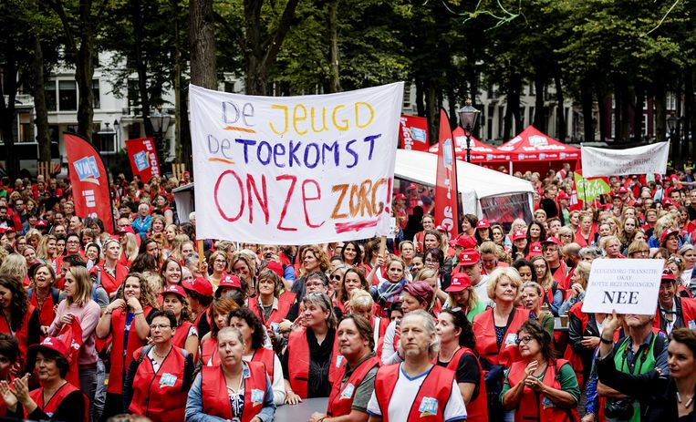
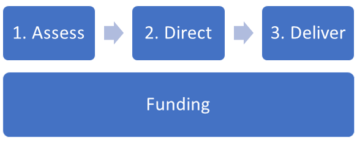

## __DataLab 1: Research design, EDA, and codebook__
\
\

### 1. Introduction

In today's DataLab session, we will start working on the Creative Brief. First, we have a guest lecture on the youth care data scheduled. Later, we will examine the client's data by exploring the codebook, and conducting an EDA. A detailed description of the assignment can be found in the Project Brief.

***

### 2. Workshop

The workshop consists of two parts: A guest lecture, and a Q&A session by a data analyst of the municipality of Oosterhout. During the lecture, you will be introduced to the youth care pilot. Schedule:

1. Workshop (9:00-10:00)
2. Q&A session (10:00-10:30)

Before/after the workshop you have time to work on the independent study material or creative brief, and/or ask the lecturers for feedback.

***

### 3. Project Brief: Background information

#### 3.1 What is a data analyst?

A data analyst serves as a gatekeeper of the organization’s data collection, ensuring that the stakeholders can make informed decisions based on accurate, correct, and complete data.

*Figure 1. What does a data analyst do?*

The responsibilities of a data analyst are generally varied, challenging, and fun. One day you might be pre-processing (e.g. transforming, cleaning etc.) data with SQL, another day you might participate in a stakeholder alignment session (e.g. establishing key performance indicators) or apply a simple ML model to a dataset.

To successfully perform these tasks, a data analyst must have a broad skillset (i.e. jack-of-all-trades), which includes but is not limited to:

- Critical thinking
- Presentation skills
- Structured Query Language (SQL)
- Python or R statistical programming
- Data pipeline design
- Data visualization
- Machine learning

Tip: If you want to get a better understanding of the daily tasks and responsibilities of a data analyst, look up videos and articles with titles such as 'Day in a life of ...' In addition, the article <a href="https://careerfoundry.com/en/blog/data-analytics/whats-it-like-to-actually-be-a-data-analyst/">'What's it like to actually be a data analyst'</a> consists of an interview with a data analyst.

***

#### 3.2 Youth care policy

With the introduction of the new Child and Youth Act in 2015, all Dutch municipalities were made responsible for the whole spectrum of care for people between the ages of 0 to 18 in need of help. As of today, 355 municipalities oversee a wide range of youth care services, ranging from preventive services to highly specialised, including both voluntary and compulsory, care.

In the Child and Youth Act of 2015, local municipalities must ensure that their youth policy:

- Activates, restores, and strengthens the own capacities of children, youth, parents, and their social environment to solve problems.
- Improves the parenting capacities of parents and their social environment, so that they are able to bear responsibility for the upbringing of children and youth. Municipalities should strengthen the pedagogical climate in families, areas, neighbourhoods, schools, playgrounds, and child daycare. And their policies should aim to improve the safety of children and youth.
- Includes prevention, early detection, and early support.
- Offers timely suitable care made to measure. This includes improving the safety of children and youth and out-of-home placements in environments that are most similar to family environments, like foster care.
- Contains effective and efficient cooperation regarding families (Hilverdink, Daamen and Vink, 2015).

However, as time passed by it became clear that the new Child and Youth Act was unable to successfully address the system's financial and administrative weaknesses. While  municipalities struggled to cope with their newly acquired responsibilities, youth care workers took to the streets to vent their discontent.

*Figure 2. Youth care workers protest, September 2018.*

Robin van der Helm, an alderman responsible for the youth care system in the municipality of Oosterhout, stated the following on the costs associated with youth care: 'Year in, year out, his municipality fails to meet the budgetary agreements. The costs are around 15 million, while Oosterhout receives 11 million from the national government'(Schapendonk and Vink, 2021).

#### 3.3 Equalit: Youth care pilot

Equalit is an ICT partnership of, and for local authorities located within the regions of Mid- and West-Brabant. Started in 2005 as a collaboration between the municipality of Oosterhout and Oisterwijk, it aims to provide high-quality ICT support at low costs. Equalit provides services to a total of 13 participants, seven of them are currently involved in this inter-municipal youth care pilot:

- Oosterhout (lead municipality)
- Alphen-Chaam, Baarle-Nassau and Gilze-Rijen (ABG-municipalities)
- Goirle, Hilvarenbeek and Oisterwijk (GHO-municipalities)

***

#### 3.4 Research Question

With the intermunicipal youth care pilot, Oosterhout and the other participating municipalities, aim to decrease the administrative load and costs associated with youth care.

Consequently, the main research question can be constructed as follows:

How can we make youth care more financially and administratively manageable?

More specifically, they want to answer the following sub-questions:

1.	Identify the ‘zorgpaden’, and predict the odds of ‘opschalen’ within these ‘zorgpaden’.
2.	Explain the difference between youth care suppliers in terms of ‘indicatietijd’ and ‘zorgduur’.
3.	Identify the characteristics that influence the amount of youth care provided on a neighbourhood level.

At the beginning of the project, you will be asked to pick one of these sub-questions. During the project, you will work on finding an appropriate answer to your chosen sub-question by applying various BI and ML techniques.

***

#### 3.5 Processes

The Dutch youth care system is complex. The processes and stakeholders driving the Dutch youth care system are, for example, often interdependent. A simplified explanation of the youth care process can be found in Figure 3.

Tip: If your first language is not Dutch, I would advise you to team up with a native speaker for the first phase of CRISP (i.e. Business understanding).

*Figure 3. Overview of the youth care process*

__1.	Assess__

During the assessment phase (1), it is determined whether the client has access to youth care. Access to youth care can be determined by various parties:
- The municipality or e.g. a social district team ('sociaal wijkteam') commissioned by the municipality, assesses the client and records access to youth care in a so-called 'beschikking' (i.e. order).
- A general practitioner, youth doctor or medical specialist refers a client to youth care.
- A judge, the Child Protection Board or the Public Prosecutor imposes youth care on the client.
- In addition to youth protection and youth probation, a certified institution can also determine regular youth care in consultation with the municipality. After consultation with the municipality, a certified institution determines what kind of youth support, which has been purchased by the municipality, will be used.

*A. Effort-oriented and output-oriented variant*
During the assessment, it is determined which kind of youth care a client needs, how much care (scope) and for how long (for which period). If the assessment is carried out by a party other than the municipality, the youth care provider then requests a 'toewijzing' from the municipality for the relevant youth care. Following the assessment, the municipality creates a 'beschikking' for the client. This sets out which youth care product the client needs (e.g. includes information on special needs and time period). One 'beschikking' is the result of one assessment and can contain multiple products. Within the Youth Act, it is also possible that a separate 'beschikking' is drawn up for each product for one client. These 'beschikkingen' may be valid simultaneously. It is also possible to give a youth care provider a budget for a predefined period. It is then up to the provider to determine which care should be used.

*B. Task-oriented variant*
Within the task-oriented implementation variant, the youth care provider itself determines, on behalf of the municipality, whether the client has access to youth care. The municipality plays no role in the assessment and does not make a 'beschikking' at the level of the individual client.

__2.	Direct__

In phase 2, direct, the 'beschikking' is allocated ('toewijzen') or withdrawn ('intrekken'). As in the first phase, there is a distinction between effort- and output-oriented, and the task-oriented variant.

*A. Effort-oriented and output-oriented variant*
- Allocate: The municipality allocates the products laid down in the 'beschikking' to one or more youth care providers. The provider is thus instructed to supply the assigned products for the client. The provider always sends a return message to indicate that the 'toewijzing' has been received. Sending this return message is important information that the municipality can also use in its contact with the client. If the provider is unable or unwilling to accept the 'beschikking', he will then contact the municipality outside the messaging system.
- Withdrawal: If the municipality finds that an assigned product no longer needs to be delivered, the 'toewijzing' for this product will be withdrawn. This terminates the assignment for the youth care provider. The municipality withdraws the allocation, for example, if the client dies, moves to another municipality or receives a Personal Budget (PGB) for the product in question.

*B. Task-oriented variant*
Within a task-oriented variant, access to care and/or support is determined by the youth care provider; the municipality plays no role in the access (no 'toewijzing' by municipalities).

The municipality assigns a task to the provider of care and/or support for a population or sub-population. This provider has the freedom to shape the interpretation of this task. The provider receives a pre-agreed budget for this.

__3.	Deliver__

The information flows surrounding the delivery, phase 3, provide insight into the actual occurrence of youth care. With the start and stop messages it is possible for the municipality to follow a client and to steer towards the actual provision of care and support. Municipalities are free to the extent to which they wish to control at the client level, however, the use of control messages is mandatory for effort- and output-oriented implementations. The municipality and youth care provider make agreements about the details of the start and end dates in the control messages.

*A. Effort-oriented and output-oriented variant*
The control messages are used for the implementation of the effort-oriented and output-oriented variants (with the exception of the Certified Institutions). The youth care provider will inform the municipality when the delivery actually starts. The provider thus responds to the assignment issued by the municipality ('toewijzing'). When the youth care is terminated, the provider also informs the municipality in a stop message. If the delivery is temporarily terminated, the provider must notify again when the delivery is resumed or when it is definitively terminated.

*B. Task-oriented variant*
In the task-oriented variant, access to youth care is provided via the provider, within predefined frameworks. In the context of coordination by the municipality, an agreement can be made between the municipality and the provider about the use of the information flows for start and stop youth care. In that case, the messages stand on their own and are not related to a 'toewijzing' and/or a declaration.

__Funding__

*A. Effort-oriented and output-oriented variant*
For the effort-oriented and output-oriented, the care or support provided is declared at the client level.

Each month, the provider declares the support provided for which the municipality has commissioned an assignment ('toewijzing').

*B. Task-oriented variant*
The task-oriented variant does not involve declaration via the iJw message system.

Detailed information on the youth care processes (in Dutch), can be found on the website of the [istandaarden](https://informatiemodel.istandaarden.nl/iWmoJw30_Eb10/views/view_72094.html).

***

## __Literature__

Hilverdink, P., Daamen, W., & Vink, C. (2015). Children and youth support and care in the Netherlands. Utrecht: Netherlands Youth Institute.

Schapendonk, N., & Vink, J. (2021, July 3). Breda blij, Oosterhout gematigd over extra miljoenen voor jeugdzorg. BNDeStem. https://www.bndestem.nl/breda/breda-blij-oosterhout-gematigd-over-extra-miljoenen-voor-jeugdzorg~a165d1e6/
