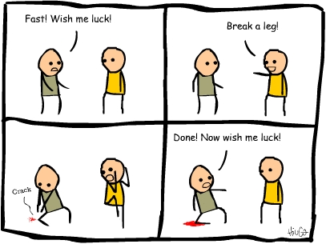

## __DataLab 2: SQL assignment__
\
\

### 1. Introduction

In today's DataLab session, you are going to display your SQL skills by completing an assignment, which you can find [here](../../Study%20Content/Business%20Intelligence/BusinessIntelligenceBlockBVersion2.html).

*Figure 1. Now is your time to shine...*

Note: This assignment evaluates your individual SQL skills. Therefore, it should be completed individually!

Need further information or have questions? The lecturers will be available throughout the DataLab session.

Good Luck :shamrock:!
\
\
The teaching team
***
