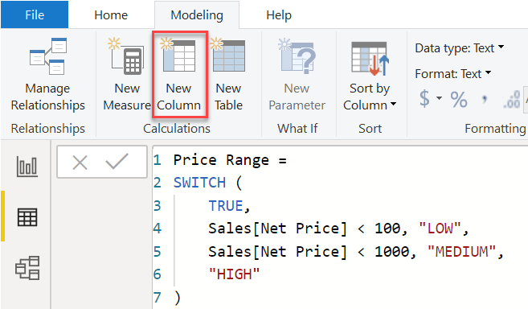

## __DataLab 2: Basic visuals & DAX in Power BI__
\
\


### 1. Introduction

In this DataLab session, you are going to practice writing DAX functions. Furthermore, you will have time to start creating visualizations with the youth care data in Power BI.

***

### 2. Q&A and Standup

__2a__ Ask questions regarding the independent study material.

__2b__ Answer the following questions:

- What did you do yesterday?
- What will you do today?
- Are there any impediments in your way?

***

### 3. DAX



*Figure 1. DAX example.*

__3a__ Complete ```Module 5 - Create Model Calculations using DAX in Power BI``` (Part 1 & 2) lab exercise, which you can find [here](https://microsoftlearning.github.io/DA-100-Analyzing-Data-with-Power-BI/).

***

### 4. Research Questions & Visualizations in Power BI

Before you start visualizing the data you want to come up with a couple of (descriptive) research questions. For example:

- How long does it on average take to receive youth care?
- Which neighbourhood has the most youth care clients?
- Is there a difference between males and females in terms of the average number of assigned care products (i.e. 'toewijzingen').
- What is the average age of a youth care client?
- Which youth care product is most commonly assigned?

Research questions are essential because they:

1. Define an investigation/research
2. Set boundaries
3. Provide direction (useful in the youth care data, a.k.a. 'table jungle')
4. Act as a frame of reference for assessing your work

So try to be creative, and come up with a couple of questions yourself!

It can be difficult to choose a suitable chart to represent (a subset of) your data. From experience, I can tell you that an average data science/business intelligence/artificial intelligence project involves quite some trial and error (one of the reasons that makes our work so much fun, if you ask me :nerd_face:). Nevertheless, a solid theoretical background (e.g. in fields such as statistics, ML, UX design etc.) can give you the edge over a data professional that lacks such a foundation. In practice, it can be the difference between delivering an 'okay' dashboard or a dashboard that conveys a compelling data story to a client.


*Figure 2. General chart type choser.*

<div style="padding: 15px; border: 1px solid transparent; border-color: transparent; margin-bottom: 20px; border-radius: 4px; color: #8a6d3b;; background-color: #fcf8e3; border-color: #faebcc;">
Tip: Thursday's independent study day material focused on creating visualizations. Want a refresher of the different visuals that are available in Power BI? Read Microsoft's <a href="( https://docs.microsoft.com/en-us/power-bi/visuals/power-bi-visualization-types-for-reports-and-q-and-a">Visualization types in Power BI</a> article.
</div>

__4a__ Load your dashboard .pbix file in Power BI.

__4b__ Apply the knowledge you have gained, through completing the Microsoft tutorial modules and lab exercises, on the youth care dataset.

***

### 5. Reflection & Work/learning log (16:00-17:00)

__5a__ Fill in your work/learning log.

__5b__ Choose, and provide an answer to at least of the following questions:

1. What surprised you today, and why?
2. What is the most important thing you learned today? Why do you think so?
3. What do you want to learn more about, and why?
4. When were you the most creative, and why do you think that is?
5. What made you curious today? How does learning feel different when you are curious?
6. When were you at your best today, and why?
7. (Assuming we were studying the same thing and you could decide and have access to anything), where would you start tomorrow? Why?
8. What can/should you do with what you know?

***

## __Literature__
