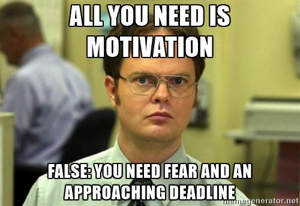

## __DataLab 1: Advanced visuals & Analyzing data in Power BI__
\
\

### 1. Introduction

In this DataLab session, you have time to put the finishing touches on your dashboard report. Try to finish the layout, visualizations for the descriptive statistics etc. by the end of this week. In Week 5, you will start with the ML learning section of the Project Brief. Here, you will be asked, among others, to design, train and evaluate a ML model. The results of the ML model need to be included in your dashboard report in Power BI.

*Figure 1. Setting your own deadlines...*

***

### 2. Q&A and Standup

__2a__ Ask questions regarding the independent study material.

__2b__ Answer the following questions:

- What did you do yesterday?
- What will you do today?
- Are there any impediments in your way?

***

### 3. Fine-tuning your dashboard in Power BI

__3a__ Load your dashboard .pbix file in Power BI.

__3b__ Apply the knowledge you have gained, through completing the Microsoft tutorial modules and lab exercises, on the youth care dataset.

Tip: Need a pointer? Visit Microsoft's <a href="(https://community.powerbi.com/">Power BI Community</a> website.

***

### 4. Reflection & Work/learning log (16:00-17:00)

__4a__ Fill in your work/learning log.

__4b__ Choose, and provide an answer to at least of the following questions:

1. What surprised you today, and why?
2. What is the most important thing you learned today? Why do you think so?
3. What do you want to learn more about, and why?
4. When were you the most creative, and why do you think that is?
5. What made you curious today? How does learning feel different when you are curious?
6. When were you at your best today, and why?
7. (Assuming we were studying the same thing and you could decide and have access to anything), where would you start tomorrow? Why?
8. What can/should you do with what you know?

***

## __Literature__
