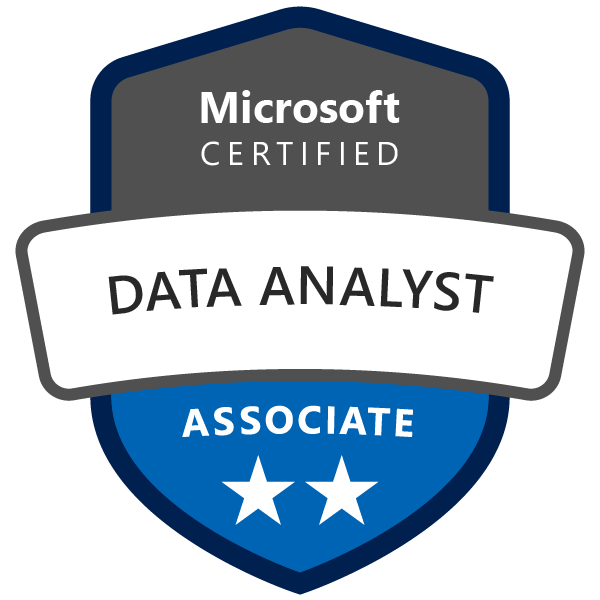
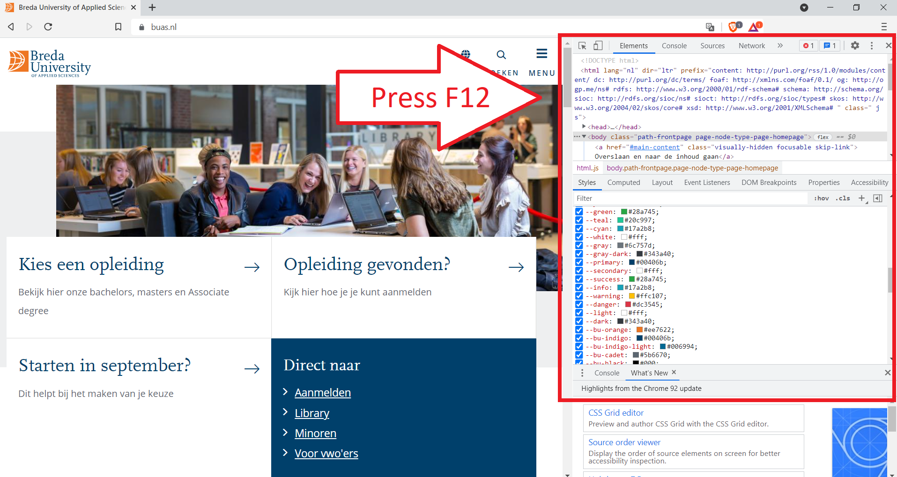

## __Getting started with Power BI & Prepare data for analysis with Power BI__
\
\


### 1. Introduction

During this independent study day you will be introduced to one of the most popular business intelligence tools, Microsoft's Power BI. For the majority of Week 3, you will be following Microsoft's data analyst associate tutorial. This tutorial will teach you all the basic skills needed to build insightful and visually pleasing dashboards.



*Figure 1. Microsoft Certified: Data Analyst Associate.*

<div style="padding: 15px; border: 1px solid transparent; border-color: transparent; margin-bottom: 20px; border-radius: 4px; color: #8a6d3b;; background-color: #fcf8e3; border-color: #faebcc;">
Note: After completing Microsoft's data analyst associate tutorial, you should be able to pass the corresponding exam. For more information, see <a href="(https://docs.microsoft.com/en-us/learn/certifications/data-analyst-associate/#certification-exams">Exam DA-100: Analyzing Data with Microsoft Power BI</a> or contact one of your lecturers.
</div>

***

### 2. Introduction to Power BI

__2a__ Watch the YouTube video 'What is Power BI' by Guy in a Cube.

<iframe width="560" height="315" src="https://www.youtube.com/embed/Vqz2d7pTOV8?controls=0" title="YouTube video player" frameborder="0" allow="accelerometer; autoplay; clipboard-write; encrypted-media; gyroscope; picture-in-picture" allowfullscreen></iframe>

>Businesses need data analysis more than ever. In this learning path, you will learn about the life and journey of a data analyst, the skills, tasks, and processes they go through in order to tell a story with data so trusted business decisions can be made. You will learn how the suite of Power BI tools and services are used by a data analyst to tell a compelling story through reports and dashboards, and the need for true BI in the enterprise (Microsoft Certified: Data Analyst Associate, Get started with Microsoft data analytics).


__2b__ Complete the module ```Get started with Microsoft data analytics``` of the Microsoft Certified: Data Analyst Associate tutorial, which you can find [here](https://www.linkedin.com/learning/implementing-a-data-warehouse-sql-server-2019/store-information-in-a-data-warehouse?resume=false&u=36359204).

__2c__ List at least one business intelligence dashboarding tool, and compare and contrast it with Power BI, taking in regards elements such as 'spatial data', 'cost', 'security' etc. Write your answer down in a maximum of 150 words.

***

### 3. Prepare data for analysis in Power BI

__3a__ Complete the module ```Prepare data for analysis``` of the Microsoft Certified: Data Analyst Associate tutorial, which you can find [here](https://www.linkedin.com/learning/implementing-a-data-warehouse-sql-server-2019/store-information-in-a-data-warehouse?resume=false&u=36359204).

### 4. Creating your own layout in Power BI

__4a__ Explore the website of the municipality of Oosterhout, and take a closer look at their corporate design (e.g. colours, logo etc.).

<div style="padding: 15px; border: 1px solid transparent; border-color: transparent; margin-bottom: 20px; border-radius: 4px; color: #8a6d3b;; background-color: #fcf8e3; border-color: #faebcc;">
Tip: When you press the f12 key on a website, your browser opens the Developers Console. In most browsers, this will contain several tools that allows you to: identify the elements and their styles, see loaded resources, check memory consumption and rendering etc.
</div>



*Figure 2. Example of what happens when you press F12 on a website in a browser.*

__4b__ Design a layout for the client's youth care Power BI dashboard, see the article [Creating Power BI layouts](https://thesqlgirl.com/2018/09/10/creating-powerbi-layouts/).

__4c__ Create a document that contains a selection of meta information of the layout you created for exercise 4b (e.g. font, colour etc.).  

***

### 5. Additional resources

As a data analyst it is important to identify the needs of your client (i.e. CRISP phase 1: Business Understanding – What does the business need?). What are useful KPIs? What does the term 'toewijzing' mean? Or when is somebody eligible to receive youth care within the municipality of Oosterhout? When you are able to answer these kind of questions, you will be much better equipped to deliver an insightful dashboard report.


*Figure 2. CRISP-DM cycle.*

Do you have time left, and want to create a dashboard that can truly help the municipality of Oosterhout to improve their youth care policy, explore the following additional resources:

- Hilverdink, P., Daamen, W., & Vink, C. (2015). [Children and youth support and care in the Netherlands.](http://aaof.eseng.nl/dwd/youth_support_care.pdf) Utrecht: Netherlands Youth Institute.
- Gervink, C. M. (2018). [The contemporary state of youth care: Impact of the decentralization on youth care employees: How decentralization of youth care influenced how youth care employees carry out their work and how they cope with the changes in their working conditions](https://essay.utwente.nl/74908/1/Gervink_MA_BMS.pdf). (Master's thesis, University of Twente).

***

## __Literature__

Gervink, C. M. (2018). The contemporary state of youth care: Impact of the decentralization on youth care employees: How decentralization of youth care influenced how youth care employees carry out their work and how they cope with the changes in their working conditions (Master's thesis, University of Twente).

Hilverdink, P., Daamen, W., & Vink, C. (2015). Children and youth support and care in the Netherlands. Utrecht: Netherlands Youth Institute.
