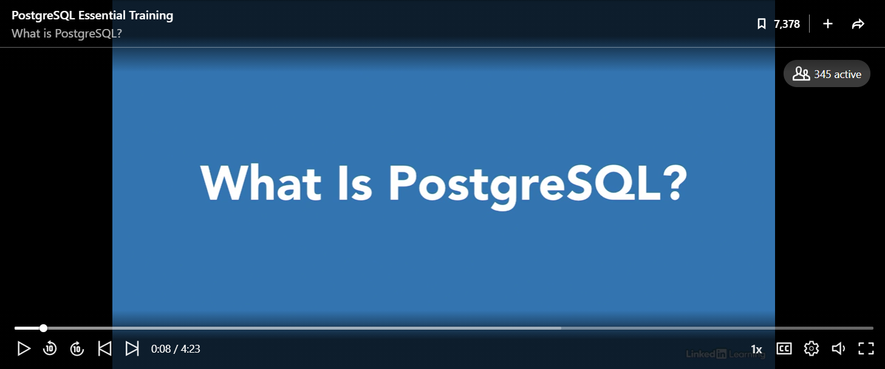

## __SQL: Data Definition Language (DDL) clauses 1 & Data Manipulation Language (DML) clauses__
\
\


### 1. Introduction

For the second half of the day, you will dive into the foundational concepts of database design, and Structured Query Language (SQL). You will start with the Design Databases With PostgreSQL course in Codeacademy, and work your way through some additional SQL exercises, which focus on Data Definition Language (DDL) and Data Manipulation Language (DML) specific clauses.


*Figure 1. Types of SQL.*

__1__ Complete the ```What is a Database?``` module in Codeacademy, which you can find [here](https://www.codecademy.com/paths/design-databases-with-postgresql/tracks/what-is-a-database/modules/welcome-to-design-databases-with-postgresql/informationals/welcome-to-design-databases-with-postgresql).

***

### 2. What is a database?

A database is an organized collection of structured information, or data, typically stored in a computer system, such as your laptop. It is usually controlled by a database management system, also known as DBMS. Together, the data and the DBMS, along with the applications that are associated with them (e.g. PostgreSQL client), are referred to as a database system, often shortened to database. In this section, you will explore the different types of databases, and their corresponding strengths and weaknesses.

__2a__ a) What is a SQL or relational database, and b) how does it differ from a so-called NoSQL database? Explain your answer

__2b__ List three advantages/disadvantages of using a relational database.

__2c__ The start-up HomeRobot is looking for a lightweight relational database management system (RDBMS) that they can embed in their Internet-of-Things (IoT) application. They have asked you, as a seasoned data engineer/analyst, for advice; which RDBMS would you recommend to them? Explain your answer.

***

### 3. Install PostgreSQL database server & client

For this section of the Project Brief, you are going to install the PostgreSQL database server, and a so-called database client (e.g. PgAdmin).

__3a__ Watch the video Introduction to PostgreSQL by Adam Wilbert on LinkedIn Learning, and read the article [What is PostgreSQL?](https://www.postgresqltutorial.com/what-is-postgresql/).

[](https://www.linkedin.com/learning/postgresql-essential-training/what-is-postgresql?u=36359204 "Click on link to open video!")
*Video 1. Introduction to PostgreSQL by Adam Wilbert.*

__3b__ Install the PostgreSQL database server:

- [Install PostgreSQL on Windows](https://www.postgresqltutorial.com/install-postgresql/).

__3c__ Install a PostgreSQL compatible client:

- [PgAdmin](https://www.pgadmin.org/download/)
- [DBeaver](https://dbeaver.io/download/)
- etc.

***

### 4. Manipulating a database

__4a__ What happens if you try to create a table with an existing name? Write your answer down.

__4b__ Identify, describe, and subsequently correct the error(s) in the following SQL statements.

Example 1a:

``` sql
CREATE TABLE youth (
  ClientKey INTEGER PRIMARY KEY,
  ToewijzingKey INTEGER,
  ClientVoornamen TEXT,
  NotaRegelBedrag NUMERIC,
  GeboorteJaar INTEGER NOT NULL
);

INSERT INTO youth
VALUES
  (
    1, 'Jan', 24, 4657, 2014
	),
	(
		1, 'Jan', 51, 45, 2014
	),
	(
		2, 'Anne', 205, 6778, 2008
	);
```

Example 1b:

``` sql
CREATE TABLE youth (
  ClientKey INTEGER PRIMARY KEY,
  ToewijzingKey INTEGER,
  ClientVoornamen TEXT,
  NotaRegelBedrag NUMERIC,
  GeboorteJaar INTEGER NOT NULL
);

INSERT INTO youth VALUES (1, 'Jan', 24, 4657, 2014);
INSERT INTO youth VALUES (1, 'Jan', 51, 45, 2014);
INSERT INTO youth VALUES (2, 'Anne', 205, 6778, 2008);
```
<div style="padding: 15px; border: 1px solid transparent; border-color: transparent; margin-bottom: 20px; border-radius: 4px; color: #8a6d3b;; background-color: #fcf8e3; border-color: #faebcc;">
Note: Example 1a, and 1b look similar, but present a very different output when you run the corresponding SQL queries.
</div>

Example 2:

``` sql
INSERT INTO youth VALUES (11, Bert, 106, 2234.50, 2005)
```
Example 3:

``` sql
DELETE ClientKey FROM youth
WHERE youth = 11;
```

__4c__ The data analyst of the municipality of Oosterhout has created a new table, by combining Table A and Table B, that contains the demographic, geographic and financial data of five youth care clients (See Table1, and Codebook). Clearly, something went wrong :weary:. Can you identify, and subsequently fix the problem with applying appropriate SQL clauses?

The original tables can be downloaded as a csv.-formatted file:
- [Table A](../../Study%20Content/Business%20Intelligence/data/SQL_DDL1_DML_exercise1.csv)
- [Table B](../../Study%20Content/Business%20Intelligence/data/SQL_DDL1_DML_exercise2.csv)

<div style="padding: 15px; border: 1px solid transparent; border-color: transparent; margin-bottom: 20px; border-radius: 4px; color: #8a6d3b;; background-color: #fcf8e3; border-color: #faebcc;">
Tip: Want to import and/or export the table into the PostgreSQL client, see the article <a href="(https://www.postgresqltutorial.com/import-csv-file-into-posgresql-table/">Import CSV File Into PostgreSQL Table</a>.
</div>

|clientkey|clientvoornamen|clienttussenvoegsel|clientachternaam|geboortejaar|clientgeslacht|clientkey-2|notaregelbedrag|notajaar|notakwartaal|notamaand|buurtcode |buurtnaam              |
|---------|---------------|-------------------|----------------|------------|--------------|-----------|---------------|--------|------------|---------|----------|-----------------------|
|1        |Bader          |van                |Wilgenburg      |2007        |Jongen        |1          |49.8           |2019    |Qtr 3       |September|BU08260102|Slotjes-West           |
|2        |Lorena         |?                  |Steensma        |2010        |Meisje        |2          |0.3            |2020    |Qtr 4       |October  |BU08261300|Dorst                  |
|3        |Jikke          |?                  |Bosveld         |2007        |Jongen        |3          |50.1           |2020    |Qtr 2       |June     |BU08261307|Buitengebied Dorst-Zuid|
|4        |Maroua         |de                 |Backer          |2009        |Meisje        |[null]       |[null]           |[null]    |[null]        |[null]     |[null]      |[null]                   |
|5        |Izaak          |?                  |Lake            |2008        |Jongen        |[null]       |[null]           |[null]    |[null]        |[null]     |[null]     |[null]                   |

*Table 1. Table with demographic, geographic and financial information from the youth care database*

__4d__ What are constraints? List three of them, and explain why it would be beneficial to apply such as constraint?

__4e__ After placing a UNIQUE constraint on one of the variables (named 'unique_constraint') in the table above, the data analyst of the municipality of Oosterhout, receives the following error message in his PostgreSQL client: ERROR: could not create unique index "unique_constraint". Can you explain the error? What could have possibly gone wrong? Multiple answers possible.

***

### 5. Additional resources

Do you have time left, and have the desire to become a data wrangling SQL wizard, explore the following additional resources:

__Interactive exercises:__
- PostgreSQL Exercises: [Modifying data](https://pgexercises.com/questions/updates/).
- Intro to SQL: Querying and managing data: [SQL basics](https://www.khanacademy.org/computing/computer-programming/sql/sql-basics/v/welcome-to-sql), and [Modifying databases with SQL](https://www.khanacademy.org/computing/computer-programming/sql/modifying-databases-with-sql/a/using-sql-to-update-a-database).

__Instructional videos:__
- LinkedIn Learning: [PostgreSQL Essential Training](https://www.linkedin.com/learning/postgresql-essential-training/manage-relational-data-with-postgresql?resume=false&u=36359204).

__Books/articles/webpages etc.:__
- Batra, R. (2018). SQL primer: An accelerated introduction to SQL basics. (Freely available through BUAS' MetaSearch).
- W3schools: [SQL Tutorial](https://www.w3schools.com/sql/default.asp).

***

## __Codebook__

|Number|Variable           |Description              |
|------|-------------------|-------------------------|
|1     |ClientKey          |Client ID                |
|2     |ClientVoornamen    |Client first name        |
|3     |ClientTussenvoegsel|Client middle name       |
|4     |ClientAchternaam   |Client last name         |
|5     |GeboorteJaar       |Client birth year        |
|6     |ClientGeslacht     |Client sex               |
|7     |NotaRegelBedrag    |Invoice amount in Euro's |
|8     |NotaJaar           |Invoice year             |
|9     |NotaKwartaal       |Invoice quarter          |
|10    |NotaMaand          |Invoice month            |
|11    |BuurtCode          |Neighborhood ID          |
|12    |BuurtNaam          |Neighborhood name        |

***

## __Literature__

Batra, R. (2018). SQL primer: An accelerated introduction to SQL basics. (Freely available through BUAS' MetaSearch).
