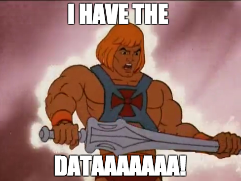

## __Data Definition Language (DDL) clauses II & Python__

### Chapter overview

I. Databases, Data Definition Language (DDL) clauses I & Data Manipulation Language (DML) clauses <br>
II. Data Query Language (DQL) clauses <br>
III. DataLab: Use-Cases <br>
IV. __Data Definition Language (DDL) clauses II & Python__ <br>
V. DataLab: Use-Cases <br> 

### 1. Introduction

With today's chapter you are going to deepen your knowledge of relational database design. For example, you will learn to compare and implement various types of database relationships (e.g. One-to-one, many-to-one etc.). Furthermore, you will acquire skills that enable you to correctly deploy DDL related SQL clauses such as PRIMARY KEY, and REFERENCES.

Furthermore, you will learn to use Python to create, populate, and retrieve data from a PostgreSQL database. This will be done using the package SQLAlchemy. You will also learn to use Pandas to read data from a csv.-formatted file and to write data to a PostgreSQL database.


*Figure 1. Types of SQL.*

__After this chapter, you will be able to:__

- [ ] Explain the difference between a primary key and a foreign key.
- [ ] Compare, and contract the three main database relationship types: One-to-one, many-to-one, and many-to-many.
- [ ] Apply Data Definition Language (DDL) clauses to create and modify a database schema.
- [ ] Connect to a PostgreSQL database using the Python package SQLAlchemy.
- [ ] Use the Python package Pandas to read data from a csv.-formatted file and to subsequently write it to a PostgreSQL database.
- [ ] Utilize the Python package SQLAlchemy to create, populate, and query a PostgreSQL database, either using 'raw' SQL or using the Object Relational Mapper (ORM) approach.

__1a__ Complete the ```How Do I Make And Populate My Own Database?``` module in Codeacademy, which you can find [here](https://www.codecademy.com/paths/design-databases-with-postgresql/tracks/how-do-i-make-and-populate-my-own-database/modules/how-do-i-make-and-populate-my-own-database/informationals/how-do-i-make-and-populate-my-own-database).

***

### 2. What is a database schema/key?

A database schema is a schematic design that represents the storage of your data in a database. It describes both the organization of data and the relationships between tables in a given database.

Some database schemas are written in a language that can be interpreted by database management software, while others are comprised of abstract diagrams.


*Figure 2. Example of a relational database schema.*

__2a__ The municipality has asked you to build a relational database with the data from Table 1. How would you solve this task? Elaborate on your approach.

|ClientKey|ToewijzingKey|ClientVoornamen|ClientTussenvoegsel|ClientAchternaam|GeboorteJaar|ClientGeslacht|NotaRegelBedrag|NotaJaar|NotaKwartaal|NotaMaand|BuurtCode |BuurtNaam              |
|---------|-------------|---------------|-------------------|----------------|------------|--------------|---------------|--------|------------|---------|----------|-----------------------|
|1        |23           |Bader          |van                |Wilgenburg      |2007        |Jongen        |49.8           |2019    |Qtr 3       |September|BU08260102|Slotjes-West           |
|2        |376          |Lorena         |?                  |Steensma        |2010        |Meisje        |0.3            |2020    |Qtr 4       |October  |BU08261300|Dorst                  |
|3        |564          |Jikke          |?                  |Bosveld         |2007        |Jongen        |50.1           |2020    |Qtr 2       |June     |BU08261307|Buitengebied Dorst-Zuid|
|4        |86           |Maroua         |de                 |Backer          |2009        |Meisje        |2022.21        |2015    |Qtr 4       |November |BU08260601|Sterrenbuurt           |
|5        |23           |Izaak          |?                  |Lake            |2008        |Jongen        |67.8           |2019    |Qtr 2       |June     |BU08260300|Vogelbuurt             |
|5        |76           |Izaak          |?                  |Lake            |2008        |Jongen        |90.5           |2019    |Qtr 4       |October  |BU08260300|Vogelbuurt             |

*Table 1. A selection of demographic, geographic and financial information from the youth care database (Version 1).*

The table can downloaded as a csv.-formatted file, [here](../../Study%20Content/Business%20Intelligence/data/SQL_DDL1_exercise1_correct_v3.csv).

__2b__ What is 'snake case'? Provide an example based on the data in Table 1.

|ClientKey|ClientVoornamen|ClientTussenvoegsel|ClientAchternaam|GeboorteJaar|ClientGeslacht|NotaRegelBedrag|NotaJaar|NotaKwartaal|NotaMaand|BuurtCode |BuurtNaam              |
|---------|---------------|-------------------|----------------|------------|--------------|---------------|--------|------------|---------|----------|-----------------------|
|1        |Bader          |van                |Wilgenburg      |2007        |Jongen        |49.8           |2019    |Qtr 3       |September|BU08260102|Slotjes-West           |
|2        |Lorena         |?                  |Steensma        |2010        |Meisje        |0.3            |2020    |Qtr 4       |October  |BU08261300|Dorst                  |
|3        |Jikke          |?                  |Bosveld         |2007        |Jongen        |50.1           |2020    |Qtr 2       |June     |BU08261307|Buitengebied Dorst-Zuid|
|4        |Maroua         |de                 |Backer          |2009        |Meisje        |2022.21        |2015    |Qtr 4       |November |BU08260601|Sterrenbuurt           |
|5        |Izaak          |?                  |Lake            |2008        |Jongen        |67.8           |2019    |Qtr 2       |June     |BU08260300|Vogelbuurt             |

*Table 2. A selection of demographic, geographic and financial information from the youth care database (Version 2).*

__2c__ Write a query that designates multiple columns from Table 2 to serve as the primary key (you cannot use the table's primary key 'ClientKey'!).

The table can downloaded as a csv.-formatted file, [here](../../Study%20Content/Business%20Intelligence/data/SQL_DDL1_exercise1_correct.csv).

***

### 3. What are database relationships?

Relationships are the cornerstone of relational databases. Data analysts/engineers can query the database and get results that combine data from different tables into a single table. In the ```Design databases with PostgreSQL``` course on Codeacademy, you are made familiar with the three types of database relationships; One-to-one, many-to-one, and many-to-many.

__3a__ The municipality asks you to provide a brief presentation on relational databases to policymakers from the social domain. As part of your preparation, you come up with three examples for each database relationship type (See Table 3). Write your examples down.

| Database Relationship | Diagram sign | Example  |  
|-----------------------|--------------|----------|
| One-to-one            |              |          |  
| One-to-many           |              |          |
| Many-to-many          |              |          |   

*Table 3. Types of database relationships.*

***

### 4. Python: SQLAlchemy & Pandas (Optional)

Until now, we have been working with with 'raw' SQL queries. However, in practice, you will often use a programming language to work with databases. For example, you can use Python to write code that queries a database, and then use the results to create visualizations or reports (e.g., Streamlit. More one this in the __MLOps for Python__ knowledge module!). For the next exercises, we will use SQLAlchemy and Pandas to create, populate, and query a PostgreSQL database.


*Figure 3. SQLAlchemy + Pandas = :star2:.*

[SQLAlchemy](https://www.sqlalchemy.org/) is a tool that helps you work with databases in Python. It lets you create, read, and update data in databases like SQLite, MySQL, PostgreSQL, and Oracle. This is useful because it makes it easier to switch between different databases.

SQLAlchemy also has a feature called Object-Relational Mapping, which lets you work with database tables as Python objects. This makes it easier to work with complex data and relationships, and allows you to write database code in a way that is similar to writing regular Python code.

In addition, we will use [Pandas](https://pandas.pydata.org/) to read a csv file into a pandas DataFrame, which we will then use to create a table in a PostgreSQL database. 

:pencil: __4a__ Create a virtual environment, using Python version 3.9, and install the following packages:

- [ ] ```sqlalchemy``` __(Use version <= 1.4.16. Multiple functions were altered in the latest version of SQLAlchemy, thus will not work with the exercises listed in this chapter.)__


```bash
conda install -c conda-forge sqlalchemy=1.4.16
```

- [ ] ```pandas```

```bash
conda install -c conda-forge pandas
```

:pencil: __4b__ Complete DataCamp course ```Introduction to Databases in Python```, which you can find [here](https://app.datacamp.com/learn/courses/introduction-to-relational-databases-in-python). Do not forget to add your certificate, as evidence, to your Learning Log!

:pencil: __4c__ Create a connection to the PostgreSQL database using SQLAlchemy. 

:pencil: __4d__ Load a CSV file into a pandas DataFrame, and write it into a table in the PostgreSQL database. To write the data into the database, you can use the [```to_sql```](https://pandas.pydata.org/pandas-docs/stable/reference/api/pandas.DataFrame.to_sql.html) function from the Pandas library. 

:pencil: __4e__ Write two queries that select all the columns from the table you created in exercise __4d__, one using SQLAlchemy's ORM and one using 'raw' SQL.

***

### 5. Additional resources 



*Figure 4. An example of how you might look when you reach the level of data wrangling SQL wizard/action hero/avatar etc...*

Do you have time left, and want to review the material
in this section of the Project Brief, explore the following additional resources:

__Interactive exercises:__
- DataCamp: [Joining Data in SQL](https://app.datacamp.com/learn/courses/joining-data-in-sql).

__Instructional videos:__
- LinkedIn Learning: [PostgreSQL Essential Training](https://www.linkedin.com/learning/postgresql-essential-training/manage-relational-data-with-postgresql?resume=false&u=36359204).
- LinkedIn Learning: [Learning Relational Databases](https://www.linkedin.com/learning/learning-relational-databases-2/welcome?resume=false&u=36359204).

__Books/articles/webpages etc.:__
- Batra, R. (2018). SQL primer: An accelerated introduction to SQL basics. (Freely available through BUAS' MetaSearch).
- W3schools: [SQL Tutorial](https://www.w3schools.com/sql/default.asp).

***

### Codebook

|Number|Variable           |Description              |
|------|-------------------|-------------------------|
|1     |ClientKey          |Client ID                |
|2     |ClientVoornamen    |Client first name        |
|3     |ClientTussenvoegsel|Client middle name       |
|4     |ClientAchternaam   |Client last name         |
|5     |GeboorteJaar       |Client birth year        |
|6     |ClientGeslacht     |Client sex               |
|7     |NotaRegelBedrag    |Invoice amount in Euro's |
|8     |NotaJaar           |Invoice year             |
|9     |NotaKwartaal       |Invoice quarter          |
|10    |NotaMaand          |Invoice month            |
|11    |BuurtCode          |Neighborhood ID          |
|12    |BuurtNaam          |Neighborhood name        |

***
