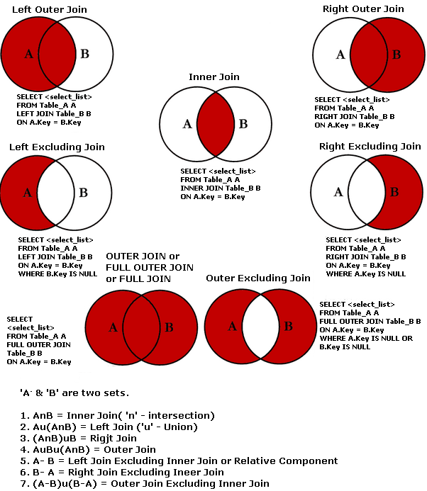

## __Data Query Language (DQL) clauses__

### Chapter overview

I. Databases, Data Definition Language (DDL) clauses I & Data Manipulation Language (DML) clauses <br>
II. __Data Query Language (DQL) clauses__ <br>
III. DataLab: Use-Cases <br>
IV. Data Definition Language (DDL) clauses II & Python <br>
V. DataLab: Use-Cases <br> 

### 1. Introduction

Today's chapter focuses on a specific type of SQL, Data Query Language (DQL), which is comprised of SQL clauses that allow you to retrieve data from a database.


*Figure 1. Types of SQL.*

__After this chapter, you will be able to:__

- [ ] Define the term 'query', and 'primary key'. 
- [ ] Apply Data Query Language (DQL) clauses to retrieve data from a database.
- [ ] Compare, and contrast the different SQL join operators.
- [ ] Apply SQL join operators to merge data from multiple tables.

:pencil: __1a__ Complete the ```What Can I Do With A Database?``` module in Codeacademy, which you can find [here](https://www.codecademy.com/paths/design-databases-with-postgresql/tracks/what-can-i-do-with-a-database/modules/what-can-i-do-with-a-database/informationals/what-can-i-do-with-a-databases).

***

### 2. Basic queries

In this section, you are going to experience how you, as a data professional, can truly benefit from using SQL:

> One of the core purposes of the SQL language is to retrieve information stored in a database. This is commonly referred to as querying. Queries allow us to communicate with the database by asking questions and returning a result set with data relevant to the question (Codeacademy, Design databases with PostgreSQL).

In order to complete the exercises in this section, you need to use the information displayed in Table 1, which you can download as a csv.-formatted file, [here](../../Study%20Content/Business%20Intelligence/data/SQL_DDL1_exercise1_correct_v2.csv).

|ClientKey|ClientVoornamen|ClientTussenvoegsel|ClientAchternaam|GeboorteJaar|ClientGeslacht|NotaRegelBedrag|NotaJaar|NotaKwartaal|NotaMaand|BuurtCode |BuurtNaam              |
|---------|---------------|-------------------|----------------|------------|--------------|---------------|--------|------------|---------|----------|-----------------------|
|1        |Bader          |van                |Wilgenburg      |2007        |Jongen        |49.8           |2019    |Qtr 3       |September|BU08260102|Slotjes-West           |
|2        |Lorena         |?                  |Steensma        |2010        |Meisje        |0.3            |2020    |Qtr 4       |October  |BU08261300|Dorst                  |
|3        |Jikke          |?                  |Bosveld         |2007        |Jongen        |50.1           |2020    |Qtr 2       |June     |BU08261307|Buitengebied Dorst-Zuid|
|4        |Maroua         |de                 |Backer          |2009        |Meisje        |2022.21        |2015    |Qtr 4       |November |BU08260601|Sterrenbuurt           |
|5        |Izaak          |?                  |Lake            |2008        |Jongen        |67.8           |2019    |Qtr 2       |June     |BU08260300|Vogelbuurt             |
|5        |Izaak          |?                  |Lake            |2008        |Jongen        |90.5           |2019    |Qtr 4       |October  |BU08260300|Vogelbuurt             |


*Table 1. A selection of demographic, geographic and financial information from the youth care database (Version 1).*

:pencil: __2a__ Is the following SQL clause written correctly? Explain your answer.

``` sql
select ClientKey, ClientGeslacht
FROM youth;
```
:pencil: __2b__ A policy maker from the municipality has asked you to permanently change the title of the column ClientKey to ClientID in the table youth. Write an SQL statement to successfully solve this task.

:pencil: __2c__ Once in a while the youth care database gets filled with erroneous data. To tackle this issue the municipality regularly runs an SQL query that checks if the values in the column NotaJaar are always greater than the values in the column GeboorteJaar. Prepare and run such an SQL statement.

:pencil: __2d__ Can you apply an ORDER BY with multiple columns? Explain your answer.

:pencil: __2e__ What will happen when you run the following SQL query on Table 1:

``` sql
SELECT *
FROM youth
LIMIT 25;
```
Write your answer down.

:pencil: __2f__ Which of the three SQL queries below is correctly written?

Example 1:

``` sql
SELECT ClientKey
  CASE
    WHEN NotaRegelBedrag < 50 THEN 'Categorie A'
    ELSE 'Categorie B'
  END AS 'Kosten'
FROM youth;
```

Example 2:

``` sql
SELECT ClientKey,
FROM youth
  CASE
    WHEN NotaRegelBedrag < 50 THEN 'Categorie A'
    ELSE 'Categorie B'
  END AS 'Kosten';
```

Example 3:

``` sql
SELECT ClientKey
FROM youth
  CASE
    WHEN NotaRegelBedrag < 50 THEN 'Categorie A'
    ELSE 'Categorie B'
  END AS 'Kosten';
```

Write your answer down.

***

### 3. Aggregate functions

An aggregate function performs a calculation on a set of values and returns a single value. For example, the SQL function AVG() takes a list of values and returns the mean value of them.

:pencil: __3a__ You are almost finished for the day when your team lead pops in and asks if he can provide a list with the number of distinct clients for the municipal council meeting. Write an SQL statement that solves this task.

:pencil: __3b__  How does the COUNT() function differ from the SUM() function? Write your answer down.

***

### 4. Multiple tables

By deploying SQL join statements you can get information from columns in more than one table. These operations are specified by placing the names of those tables that you want to join in the same FROM clause of a SELECT statement.



*Figure 2. SQL joins & Set theory.*

<div style="padding: 15px; border: 1px solid transparent; border-color: transparent; margin-bottom: 20px; border-radius: 4px; color: #8a6d3b;; background-color: #fcf8e3; border-color: #faebcc;">
Tip: Want to explore the mathematical foundations of these SQL join operators, see Khanacademy's <a href="https://www.khanacademy.org/math/statistics-probability/probability-library/basic-set-ops/v/intersection-and-union-of-sets">Basic set operations</a> tutorial.
</div>

:pencil: __4a__ There is no difference between a JOIN and INNER JOIN statement. True or false? Write your answer down.

:pencil: __4b__ List at least two requirements for a PRIMARY KEY. Write your answer down (Hint: take a look at Table 1!).

:pencil: __4c__ What happens if the tables you perform a UNION operator on have duplicate rows? Explain your answer.

:pencil: __4d__ What is the main difference between the join operators (e.g. INNER JOIN, LEFT JOIN etc.) and the UNION operator? Write your answer down.

:pencil: __4e__ One of your team members has created a new table, by combining Table A and Table B (See Table 2, and Codebook). Clearly, something went wrong :weary:. Can you identify, and subsequently fix the problem with applying appropriate SQL clauses?

The original tables can be downloaded as a csv.-formatted file:
- [Table A](../../Study%20Content/Business%20Intelligence/data/SQL_DDL1_DML_exercise1.csv)
- [Table B](../../Study%20Content/Business%20Intelligence/data/SQL_DDL1_DML_exercise2.csv)

<div style="padding: 15px; border: 1px solid transparent; border-color: transparent; margin-bottom: 20px; border-radius: 4px; color: #8a6d3b;; background-color: #fcf8e3; border-color: #faebcc;">
Tip: Want to import and/or export the table into the PostgreSQL client, see the article <a href="https://www.postgresqltutorial.com/import-csv-file-into-posgresql-table/">Import CSV File Into PostgreSQL Table</a>.
</div>

|clientkey|clientvoornamen|clienttussenvoegsel|clientachternaam|geboortejaar|clientgeslacht|clientkey-2|notaregelbedrag|notajaar|notakwartaal|notamaand|buurtcode |buurtnaam              |
|---------|---------------|-------------------|----------------|------------|--------------|-----------|---------------|--------|------------|---------|----------|-----------------------|
|1        |Bader          |van                |Wilgenburg      |2007        |Jongen        |1          |49.8           |2019    |Qtr 3       |September|BU08260102|Slotjes-West           |
|2        |Lorena         |?                  |Steensma        |2010        |Meisje        |2          |0.3            |2020    |Qtr 4       |October  |BU08261300|Dorst                  |
|3        |Jikke          |?                  |Bosveld         |2007        |Jongen        |3          |50.1           |2020    |Qtr 2       |June     |BU08261307|Buitengebied Dorst-Zuid|
|4        |Maroua         |de                 |Backer          |2009        |Meisje        |[null]       |[null]           |[null]    |[null]        |[null]     |[null]      |[null]                   |
|5        |Izaak          |?                  |Lake            |2008        |Jongen        |[null]       |[null]           |[null]    |[null]        |[null]     |[null]     |[null]                   |

*Table 2. A selection of demographic, geographic and financial information from the youth care database (Version 2)*

***

### 5. Additional resources 


*Figure 3. An example of how you might look when you reach the level of data wrangling SQL wizard/action hero/avatar etc...*

Do you have time left, and want to stay on track to eventually become a data wrangling SQL wizard, explore the following additional resources:

__Interactive exercises:__
- PostgreSQL Exercises: [All remaining exercises, except the ones listed under the header 'Recursive'](https://pgexercises.com/).
- Intro to SQL: Querying and managing data: [All remaining exercises](https://www.khanacademy.org/computing/computer-programming/sql/).

<div style="padding: 15px; border: 1px solid transparent; border-color: transparent; margin-bottom: 20px; border-radius: 4px; color: #8a6d3b;; background-color: #fcf8e3; border-color: #faebcc;">
Tip: Select your practice exercises wisely, not all are relevant for successfully completing the Creative Brief.
</div>

__Instructional videos:__
- LinkedIn Learning: [PostgreSQL Essential Training](https://www.linkedin.com/learning/postgresql-essential-training/manage-relational-data-with-postgresql?resume=false&u=36359204).

__Books/articles/webpages etc.:__
- Batra, R. (2018). SQL primer: An accelerated introduction to SQL basics. (Freely available through BUAS' MetaSearch).
- W3schools: [SQL Tutorial](https://www.w3schools.com/sql/default.asp).

***

### Codebook

|Number|Variable           |Description              |
|------|-------------------|-------------------------|
|1     |ClientKey          |Client ID                |
|2     |ClientVoornamen    |Client first name        |
|3     |ClientTussenvoegsel|Client middle name       |
|4     |ClientAchternaam   |Client last name         |
|5     |GeboorteJaar       |Client birth year        |
|6     |ClientGeslacht     |Client sex               |
|7     |NotaRegelBedrag    |Invoice amount in Euro's |
|8     |NotaJaar           |Invoice year             |
|9     |NotaKwartaal       |Invoice quarter          |
|10    |NotaMaand          |Invoice month            |
|11    |BuurtCode          |Neighborhood ID          |
|12    |BuurtNaam          |Neighborhood name        |

***
