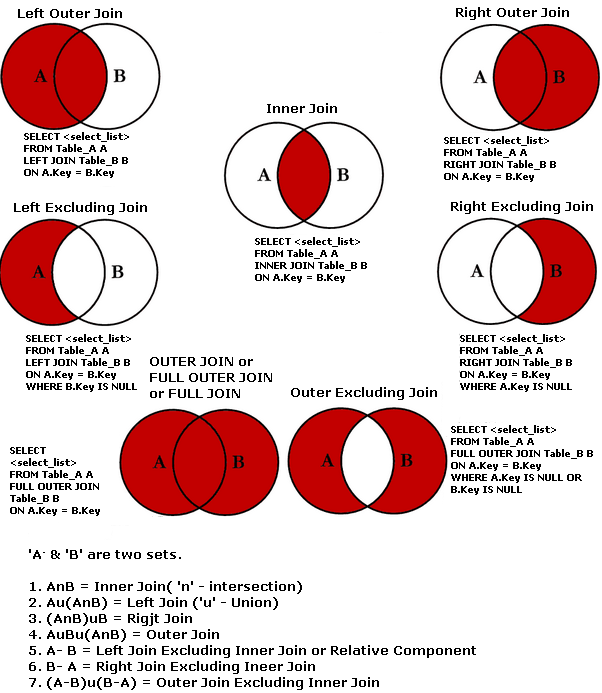

# Homework Exercises

***

__Name:__
__Studentnumber:__
__Block:__
__Week__
__Title:__

***
For more information about GitHub flavoured Markdown, see:

- [Markdown Guide](https://guides.github.com/features/mastering-markdown/)

***

## Topic

__1__ Written answer to question + SQL code block.

``` sql
select ClientKey, ClientGeslacht
FROM youth;
```

__2__



*Figure 1. SQL joins & Set theory.*

__3__

<iframe width="560" height="315" src="https://www.youtube.com/embed/9BdtGjoIN4E?controls=0" title="YouTube video player" frameborder="0" allow="accelerometer; autoplay; clipboard-write; encrypted-media; gyroscope; picture-in-picture" allowfullscreen></iframe>

*Video 1. Don Norman: The term "UX".*

***
