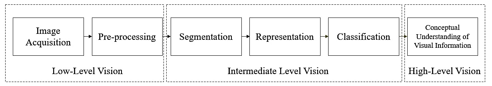
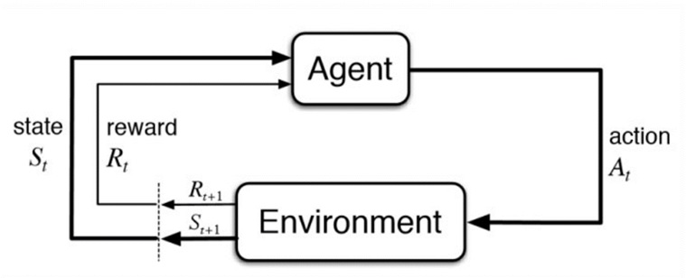

# Auditory Perception & Learning - Self-Study Day
Just what is the difference between sensing and perceiving? And how does hearing actually work? What's the difference between hearing something and making sense of it? And how do we memorize and learn all of that? Today we're going to start answering all of these questions!

Then, we're going to apply these concepts to creating a perceptual model of human cognitive vision; how a human would see our bin-picking task. So we're going to place ourselves in the shoes of the robot, fill in the template and then elaborate on it by doing some research into human cognitive vision! 
Seeing and perceiving however is not enough, humans will also need to remember, relate and contextualize what it sees in order to decide what to do. So after defining our model of human cognitive vision, we're going to learn about the human memory and where how reinforcement learning works!

Finally, we're going to translate our cognitive model of human vision and memory into a model for our robot which does object detection and reinforcement learning . As the project progresses you can then use your flowchart model of the robot to design & maintain an oversight of your code implementation and subsequently communicate it in your technical report!

## Learning Objectives: 
1. Identify appropriate perceptual features for object detection.
2. Identify required prior-knowledge for contextualising object detection.
3. Use cognitive models of pattern recognition to improve feature and/or object detection.
4.	Identifiy relevant real-world input required for situational awareness & reinforcement learning.
5.	Identify cognitive processes used to process relevant real-world input required for situational awareness & reinforcement learning.

## Introduction to Auditory Perception 
The human auditory system is a complex system responsible for the sense of hearing. It consists of several components that work together to detect, process, and interpret sound waves.

The auditory system can be divided into three main components: the outer ear, the middle ear, and the inner ear. Let's take a closer look at each component:

*Figure 1. Overview of the human auditory system.*

Outer ear: The outer ear is the visible portion of the ear, known as the pinna, and the ear canal. The pinna is responsible for capturing sound waves in the environment and funneling them into the ear canal. The ear canal then directs the sound waves towards the eardrum, which is located at the end of the canal.

Middle ear: The middle ear is a small, air-filled chamber that is separated from the outer ear by the eardrum. When sound waves reach the eardrum, they cause it to vibrate. These vibrations are then transmitted through three small bones in the middle ear, called the ossicles, which amplify the sound waves and transmit them to the inner ear. The ossicles are composed of the malleus (hammer), incus (anvil), and stapes (stirrup).

The middle ear also contains the Eustachian tube, which connects the middle ear to the back of the throat. This tube helps equalize air pressure between the middle ear and the environment, which is important for maintaining proper functioning of the eardrum and ossicles.

Inner ear: The inner ear is a complex system of fluid-filled chambers that are responsible for converting sound waves into electrical signals that can be interpreted by the brain. The inner ear is made up of two main structures: the cochlea and the vestibular system.
The cochlea is a snail-shaped structure that is responsible for converting sound waves into electrical signals. It contains tiny hair cells that are arranged along the length of the cochlea. When sound waves enter the cochlea, they cause the fluid inside to move, which in turn causes the hair cells to bend. This bending generates electrical signals, which are then transmitted to the brain via the auditory nerve.

*Figure 2. A closer look a the cochlea.*

The vestibular system is responsible for detecting changes in head position and movement, and it helps us maintain our balance. It contains three semicircular canals that are filled with fluid and lined with hair cells. When the head moves, the fluid in the canals also moves, which in turn causes the hair cells to bend. This bending generates electrical signals that are transmitted to the brain via the vestibular nerve.

Finally, the auditory cortex in the brain receives the electrical signals from the cochlea and interprets them as sound. Different parts of the auditory cortex are responsible for processing different aspects of sound, such as pitch, volume, and location.

*Figure 2. A closer look a the AuditoryCortex.*

Overall, the human auditory system is a complex and sophisticated system that allows us to detect, process, and interpret the sounds around us, enabling us to communicate and navigate our environment.

## Lecture - Cognition Fundamentals: Perception
Live lecture which is given on the 17th of November from 9:00 till 10:00 with a 20 min break. Take a look at your timetable to see where and when exactly the lecture takes place! If you can't wait, [here are the slides already](https://github.com/BredaUniversityADSAI/ADS-AI/blob/ba08eaff3a1f5c036abab9a5d1bdd729ad861bc9/docs/Study%20Content/Cognition%20Fundamentals/assets/lectures/Cognition%20Fundamentals%20-%20Perception.pptx) but after the lecture, there should be [a recording available here!](https://edubuas-my.sharepoint.com/:v:/g/personal/heijligers_b_buas_nl/EXq2Oz4etehLjvVx1iznypMBXXd4w4bjWHbvEtTopNEiLg?e=uD2gAb)

## Refreshers
If you are reviewing this material again or are looking for a different; maybe more entertaining, take then I highly recommend the following videos:

### Sensation and Perception
<iframe width="560" height="315" src="https://www.youtube.com/embed/unWnZvXJH2o" title="YouTube video player" frameborder="0" allow="accelerometer; autoplay; clipboard-write; encrypted-media; gyroscope; picture-in-picture" allowfullscreen></iframe>

### Visual perception and Contextualizing
<iframe width="560" height="315" src="https://www.youtube.com/embed/n46umYA_4dM" title="YouTube video player" frameborder="0" allow="accelerometer; autoplay; clipboard-write; encrypted-media; gyroscope; picture-in-picture" allowfullscreen></iframe>

## Tutorial - Cognition Fundamentals: Perception
Now we are going to make a flowchart of our model of the  human cognitive vision system; visual perception, and fill it in with information for our object detection task:
1. Take a look at your image dataset and figure 1 below. Create a flowchart of figure 1. List down the objects that you are going to identify in the in the 'High-Level Vision' section of the flowchart.
2. Imagine that you are identifying the objects. What features/characteristics do you look out for yourself? How do you personally identify the object. List these down in the 'mid-Level Vision' section of the flowchart.
3. Fill in the rest of the flowchart using the following steps:
- Take a look at the lecture slides and provided literature below regarding human visual perception. Fill in the rest of the human cognitive vision system; specifically taking the input, visual perception proccesing steps and desired output in mind.

*Figure 1. Flowchart of a typical human cognitive vision system (de Souza Alves, T., de Oliveira, C. S., Sanin, C., & Szczerbicki, E.,2018).*

### Example of perceptual processing model: Edge detection
What is it used for: We depend on edge detection for tasks such as depth perception and detecting objects in our field of view.
What do we look out for:
- Discontinuities in depth.
- Discontinuities in surface orientation.
- Changes in material properties.
- Variations in scene illumination

*Figure 2. Edge Detection Example.*

Relevant literature and sources to research:
- [Summary of Concepts and Terms](https://github.com/BredaUniversityADSAI/ADS-AI/blob/260f3f788372cfb55e2a4ba2956800de1b3b14a8/docs/Study%20Content/Cognition%20Fundamentals/assets/Summary%20of%20Concepts%20and%20Terms.docx): Highly recommended read which summarizes most important concepts discussed in the literature below. It also contains various important model you can use to create cognitive systems; or systems to deal with information processing in general.
- [de Souza Alves, T., de Oliveira, C. S., Sanin, C., & Szczerbicki, E. (2018). From knowledge based vision systems to cognitive vision systems: a review. Procedia Computer Science, 126, 1855-1864.](https://github.com/BredaUniversityADSAI/ADS-AI/blob/d2d99670e0bff928b8ba3115463b180458ed116c/docs/Study%20Content/Cognition%20Fundamentals/assets/sources/From%20Knowledge%20based%20Vision%20Systems%20to%20Cognitive%20Vision%20Systems%20-%20A%20Review.pdf)
- [O’Reagan, J.K. (1992). Solving the “real” mysteries of visual perception: the world as an outside memory. Can J Psychol, 46(3):461-488.](https://github.com/BredaUniversityADSAI/ADS-AI/blob/29bd304acfa39a1ae5c9aa8640a56cbbe9a18c1e/docs/Study%20Content/Cognition%20Fundamentals/assets/sources/SOLVING%20THE%20REAL%20MYSTERIES%20OF%20VISUAL%20PERCEPTION.pdf)
- [Whitney, D. & Leib, A.Y. (2018). Ensemble perception. Annual Review of Psychology, 69:105-129.](https://github.com/BredaUniversityADSAI/ADS-AI/blob/29bd304acfa39a1ae5c9aa8640a56cbbe9a18c1e/docs/Study%20Content/Cognition%20Fundamentals/assets/sources/Ensemble%20perception.pdf)
- [Deroy, O., Spence, C., & Noppeney, U. (2016). Metacognition in multisensory perception. Trends in Cognitive Sciences, 20, 736-747.](https://github.com/BredaUniversityADSAI/ADS-AI/blob/29bd304acfa39a1ae5c9aa8640a56cbbe9a18c1e/docs/Study%20Content/Cognition%20Fundamentals/assets/sources/Metacognition%20in%20multisensory%20perception%20-%20Trends%20in%20Cognitive%20Sciences.pdf)

## Break Time!
From 12:30 till 13:30.

## Lecture - Cognition Fundamentals: Learning
Live lecture which is given on the 17th of November from 13:30 till 14:30. Take a look at your timetable to see where exactly the lecture takes place! If you can't wait, [here are the slides already](https://github.com/BredaUniversityADSAI/ADS-AI/blob/8a312a9350b35bad7ebbf135293d669582d8575d/docs/Study%20Content/Cognition%20Fundamentals/assets/lectures/Cognition%20Fundamentals%20-%20Learning.pptx) but after the lecture, there should be [a recording available here!](https://edubuas-my.sharepoint.com/:v:/g/personal/heijligers_b_buas_nl/EQKPvTuGA9ZBsMB_78Zmv-cBXjKDFAmFepFHFDopwN8nsQ?e=eFEMpe).

## Refreshers
If you are reviewing this material again or are looking for a different; maybe more entertaining, take then I highly recommend the following videos:

### Learning
<iframe width="560" height="315" src="https://www.youtube.com/embed/qG2SwE_6uVM" title="YouTube video player" frameborder="0" allow="accelerometer; autoplay; clipboard-write; encrypted-media; gyroscope; picture-in-picture" allowfullscreen></iframe>

### Memories
<iframe width="560" height="315" src="https://www.youtube.com/embed/bSycdIx-C48" title="YouTube video player" frameborder="0" allow="accelerometer; autoplay; clipboard-write; encrypted-media; gyroscope; picture-in-picture" allowfullscreen></iframe>

### Information Retrieval and Deletion
<iframe width="560" height="315" src="https://www.youtube.com/embed/HVWbrNls-Kw" title="YouTube video player" frameborder="0" allow="accelerometer; autoplay; clipboard-write; encrypted-media; gyroscope; picture-in-picture" allowfullscreen></iframe>

## Tutorial - Cognition Fundamentals: Learning
Now, we are going to expand on our model of the human cognitive vision system by adding & connecting it with a cognitive model for human memory and reinforcement learning for our object detection task:
1. Take at your current flowchart and images. As a human you need to remember a whole range of things to recognize objects: the context, concept, movemement, spacial location and individual features of an object to name a few. Consider what you need to remember in order to do the bin-picking task as a human and write these down in your flowchart.
2. Take a look at figure 3 & 4 and your list of things to remember from step 1. Choose one of the two model displayed in figure 3 & 4 to integrate into your flowchart of the human cognitive vision system. After integrating the memory part, fill in the memory model you integrated using your list in step 1.

*Figure 3. The full human cognitive memory system.*

*Figure 4. A simplified human cognitive memory system.*

3. Now, that we have visualised how we perceive and memorize information about the world in our flowchart. We can start to integrate a model of reinforcement learning; take a look at figure 5 and integrate it in your flowchart. List the conditions/situations which give a positive or negative rewards to a human performing this task. In other words; describe when a human would correctly or incorrectly performs this task and what type of feedback they should receive in that given condition: negative or positive (don't concern yourself with weighting; implement the value function, here yet).

*Figure 5. The most basic form of a reinforcement learning model.*

4. The final step is converting your model of human cognitive vision, memory and reinforcement learning to one with robots. You'll learn how to do this during the remainder of the block so you don't have to finish this today! However, make sure to keep this flowchart up-to-date so you have a clear oversight of the functionality of your robot; specifically considering how the processing steps (e.g. algorithms, if-else statememnts etc.) take the input (e.g. images, robot position of arm, pressure excerted by gripper etc.) and how these would result in the desired output.  

### Example of reinforcement learning model: 
What is it used for: We depend on reinforcement learning in order to avoid harming ourselves and others during physical tasks.
What do we look out for:
- Avoiding damage to our body; pain.
- No harming others; mental pain in the form of empathy and social exclusion.
- Awarenes of changing situation context; changes in weather which signify a storm.
- etc.

Relevant literature to research:
### Books & Papers:
1. [Styles, E.A. (2005). Attention, Perception and Memory: An integrated Introduction. Psychology Press, Taylor & Francis.](https://github.com/BredaUniversityADSAI/ADS-AI/blob/997b5108aa39c2ceded8eb9dd979c7333360e624/docs/Study%20Content/Cognition%20Fundamentals/assets/sources/Attention,%20Perception%20and%20Memory%20-%20An%20integrated%20introduction.pdf)
2. [Oxenham, A.J. (2018). How we hear: The perception and neural coding of sound. Annual Review of Psychology, 69:27-50.](https://github.com/BredaUniversityADSAI/ADS-AI/blob/29bd304acfa39a1ae5c9aa8640a56cbbe9a18c1e/docs/Study%20Content/Cognition%20Fundamentals/assets/sources/How%20we%20hear%20-%20The%20perception%20and%20neural%20coding%20of%20sound.pdf)
3. [Deroy, O., Spence, C., & Noppeney, U. (2016). Metacognition in multisensory perception. Trends in Cognitive Sciences, 20, 736-747.](https://github.com/BredaUniversityADSAI/ADS-AI/blob/29bd304acfa39a1ae5c9aa8640a56cbbe9a18c1e/docs/Study%20Content/Cognition%20Fundamentals/assets/sources/Metacognition%20in%20multisensory%20perception%20-%20Trends%20in%20Cognitive%20Sciences.pdf)

11. [Joseph, S., Teki, S., Kumar, S., Husain, M., & Griffiths, T.D. (2016). Resource allocation models of auditory working memory. Brain Research, 1640: 183-192.](https://github.com/BredaUniversityADSAI/ADS-AI/blob/997b5108aa39c2ceded8eb9dd979c7333360e624/docs/Study%20Content/Cognition%20Fundamentals/assets/sources/Resource%20allocation%20models%20of%20auditory%20working%20memory.pdf)
