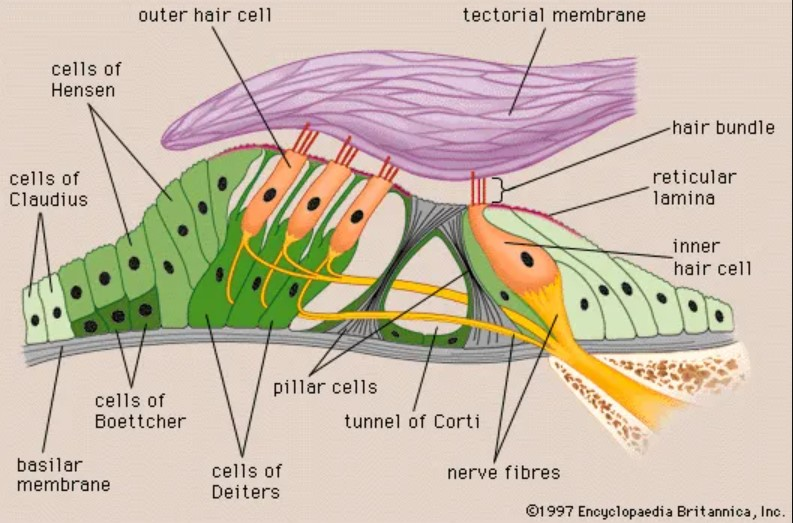
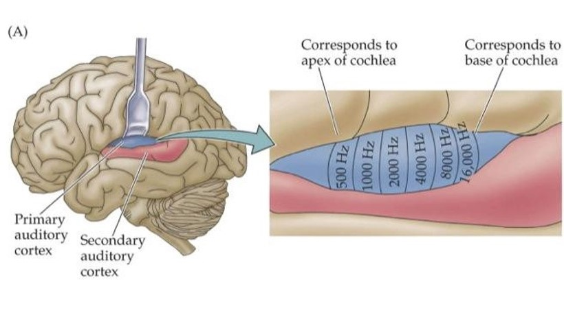

# Auditory Perception & Learning - Self-Study Day
Just what is the difference between sensing and perceiving? And how does hearing actually work? What's the difference between hearing something and making sense of it? And how do we memorize and learn all of that? Today we're going to start answering all of these questions!

Then, we're going to apply these concepts by creating a perceptual model of human auditory system; how does a human hear? And how does information flow from the point sound waves leave an audio source?

Just hearing is not enough though, like with the human vision system perception is dependent on context and representations of sound stored in the long-term and working memory. So after defining our model of human auditory system we're going to connect it to the human cognitive system to create holistic model!

## Learning Objectives: 
1. Describe the structure and function of the outer, middle and inner ear.
2. Relate the anatomical organization of the cochlea and human auditory system to the sensory transduction of sound to the brain.
3. Differentiate between the mechanisms for localization of horizontal sound. 
4. Understand the basic functioning of the human auditory system within the context of cognition; specifically attention, perception and memory.

## Introduction to the Auditory System 
The human auditory system is a complex system responsible for our sense of hearing. It consists of several components that work together to detect, process, and interpret sound waves. Please watch this quick refresher on perception, sensation and overview of the auditory system: watch untill minute 3:25 (or longer if you are interested in taste and other sensory systems).

<iframe width="560" height="315" src="https://www.youtube.com/embed/fxZWtc0mYpQ?start=82" title="YouTube video player" frameborder="0" allow="accelerometer; autoplay; clipboard-write; encrypted-media; gyroscope; picture-in-picture; web-share" allowfullscreen></iframe>

### Auditory Processing
The auditory system can be divided into three main components: the outer ear, the middle ear, and the inner ear. Let's take a closer look at each component:

*Figure 1. Overview of the human auditory system.*

**Outer ear:** The outer ear is the visible portion of the ear, known as the pinna, concha, and the ear canal. The pinna is responsible for capturing sound waves in the environment and funneling them through the concha into the ear canal. Furthermore, the shape; or folds, of the pinna also helps to determine the vertical location of the sound. The ear canal then directs the sound waves towards the eardrum, which is located at the end of the canal.

**Middle ear:** The middle ear is a small, air-filled chamber that is separated from the outer ear by the eardrum. When sound waves reach the eardrum, they cause it to vibrate. These vibrations are then transmitted through three small bones in the middle ear, called the ossicles, which amplify the sound waves and transmit them to the inner ear. The ossicles are composed of the malleus (or hammer), incus (anvil), and stapes (or stirrup).

The middle ear also contains the Eustachian tube, which connects the middle ear to the back of the throat. This tube helps equalize air pressure between the middle ear and the environment, which is important for maintaining proper functioning of the eardrum and ossicles. If pressure is too low or high in your middle ear you'll experience an uncomfortable feeling, nausea or even pain which can be resolved by yawning or clearing; blowing air gently through your nostrils while pincing them and keeping your mouth closed. 

**Inner ear:** The inner ear is the most complex system of the three parts of the ear and the one most interesting with regards to computational modelling. The inner ear consists of fluid-filled chambers that are responsible for converting sound waves into electrical signals that can be interpreted by the brain. The inner ear is made up of two main structures: the cochlea and the vestibular system.

*Figure 2. A closer look a the structure of the cochlea.*

**The cochlea** is a snail-shaped structure that is responsible for converting sound waves of different frequencies into electrical signals. It contains tiny hair cells that are arranged along the length of the cochlea. When sound waves enter the cochlea, they cause the fluid inside to move; or vibrate, which in turn causes the hair cells to bend; a process called basilar tuning. This bending generates electrical signals, which are then transmitted to the brain via the auditory nerve.

*Figure 3. A closer look a the basilar membrame where the signal as transferred by the Stapes in the upper tube; the scala vestibule. From the oval window to apex; called the scala vestibule, sounds from 20 hertz to 200 hertz are registered. After reaching the apex the sounds travel through the scale tympani to the round window, in this region the sounds from 200 hertz onwards are registered.*

Located within the cochlea is **the basilar membrane** which is a thin, flexible membrane that runs along the length of the cochlea between the two tubes; seperated from the tubes by a membrane (hence the name). The basilar membrane is lined with thousands of tiny hair cells that are responsible for detecting the vibrations caused by sound waves of different frequencies: called the organ of Corti.

*Figure 4. Within the basilar membrame there is the organ of corti. Essentially, this is the part of the basilar membrame which registers the sound waves by registering the tiny movements of the hairs.

**The organ of Corti** contains rows of hair cells, which are specialized sensory cells that are responsible for detecting particular sound waves. These hair cells are arranged in a specific pattern to detect specific sound characteristics and are connected to nerve fibers that transmit electrical signals to the brain. The hair cells in the organ of Corti are arranged in a tonotopic manner, meaning that they are sensitive to different frequencies of sound. Hair cells near the base of the cochlea are sensitive to high-frequency sounds, while hair cells near the apex are sensitive to low-frequency sounds.

*Figure 5. Within the organ of Corti there is the tectorial membrame which is the main vibrating component to which the hairs are attached. As the tectorial membrame vibrates the different hairs hairs are moved with differanting intensity, velocity and angles which registers the different aspects of a sound; primarily frequency and pitch. Don't pay attention to the rest the components in shown the diagram, we don't need to go deeper into the neuroscientific aspects of the auditory system.*

**The basilar membrane** is wider and more flexible at the base of the cochlea, and narrower and stiffer at the apex (see figure 3). This means that higher frequency sounds, which have shorter wavelengths, cause maximum displacement of the basilar membrane near the base of the cochlea, while lower frequency sounds, which have longer wavelengths, cause maximum displacement closer to the apex.

As a result, different frequencies of sound cause different hair cells along the length of the basilar membrane to bend and generate electrical signals. These signals are then transmitted to the brain via the auditory nerve, which then interprets the signals as sound.

In this way, the basilar membrane acts as a frequency analyzer, with different regions of the membrane responding preferentially to different frequencies of sound. This process is known as basilar tuning, and it allows the brain to distinguish between different frequencies of sound and perceive pitch.

Basilar tuning is important for our ability to distinguish between different sounds and to understand speech, music, and other complex auditory stimuli. It also plays a role in our ability to locate the source of sounds in space, as the relative timing and intensity of sound waves reaching each ear can be used to determine the location of the sound source.

The other important system located in the cochlea is **the vestibular system** which is responsible for providing the brain with information about the body's position and movement in space, as well as its orientation with respect to gravity. It consists of three semicircular canals and two otolith organs: the utricle and saccule which generates electrical signals that are transmitted to the brain via the vestibular nerve.

*Figure 6. A closer look a the structure of the vestibular system.*

The semicircular canals are three fluid-filled tubes that are arranged perpendicular to each other, and they are responsible for detecting rotational movements of the head. Each canal contains a specialized sensory structure called a crista, which is covered in hair cells that are embedded in a gelatinous structure called the cupula. When the head rotates, the fluid in the canals also moves, which causes the cupula to bend and the hair cells to generate electrical signals that are sent to the brain. These signals provide information about the relative direction and speed of the head's rotation; and in combination with the motor context (which knows the position of all the limbs) the entire body.

The utricle and saccule are two small, fluid-filled sacs that are located next to the semicircular canals, and they are responsible for detecting linear movements and changes in head position. The walls of these organs are covered in hair cells that are embedded in a gelatinous structure called the macula. When the head moves or changes position, the fluid in the sacs also moves, which causes the macula to bend and the hair cells to generate electrical signals that are sent to the brain. These signals provide information about the head's orientation with respect to gravity and the direction and acceleration of linear movements.

Together, the semicircular canals and otolith organs provide the brain with information about the body's position and movement in three-dimensional space. This information is crucial for maintaining balance and posture, coordinating movements, locating the source of both auditory and visual stimuli, and navigating the environment. When the vestibular system is not functioning properly, it can lead to problems with balance and spatial orientation, dizziness, and vertigo.

**Auditory Cortex:** Neurological signal are send from the organ of corti via the cochlean nerve to the auditory cortex which is where sensory processing ends and perceptual processing begins. The auditory cortex is the region of the brain responsible for processing sound information. It is located in the temporal lobe, which is one of the four main lobes of the cerebral cortex; 

Note: Don't stress about remembering the atonomy of the brain, we're mainly interested in the informational processing aspect for this module. However, it is important to mentoin the components to stress the seperate stage of informational processing within the brain.

The auditory cortex receives information about sound from the thalamus, which is a structure in the brain that relays sensory information to the appropriate processing centers; e.g. to combine visual and auditory information. Specifically, the auditory cortex receives information from the medial geniculate nucleus (MGN) of the thalamus, which is the final relay station for auditory information before it reaches the cortex. Essentially, the thalamus is where information from the long- and short-term working memory are combined with the incoming sensory information which enables the auditory cortext to perceive the incoming sound.

The auditory cortex is organized into different regions that are specialized for processing different aspects of sound. **The primary auditory cortex** is the first region of the cortex to receive information about sound, and it is organized tonotopically, which means that different frequencies of sound are represented in different regions of the cortex. The organization of the primary auditory cortex is thought to reflect the organization of the basilar membrane in the inner ear, which is responsible for separating different frequencies of sound and also organized tonotopically.

*Figure 7. A closer look a the Auditory Cortex.*

**The secondary auditory cortex** is a collection of brain regions that are located adjacent to the primary auditory cortex and are responsible for higher-level processing of auditory information. 
These higher-level areas of the auditory cortex are responsible for more complex aspects of sound processing, such as the identification of speech sounds, music perception, sound localization and language comphrension. The two more important parts of the secondary auditory cortext are the Wernicke's and Broca's areas which are responsible for language comphrension and speech production.

**Wernicke's area:** Wernicke's area is purely involved in language comphrension. Wernicke's area is named after Carl Wernicke, a German neurologist who first described it in the late 1800s. He observed that damage to this region of the brain resulted in deficits in language comprehension, but not in the ability to produce speech.

The function of Wernicke's area is to interpret and assign meaning to auditory and visual information related to language. When we hear or read language, the information is processed in the primary auditory cortex and then sent to Wernicke's area for interpretation. The area processes the information and extracts the meaning of words and sentences, allowing us to understand the language.

In addition to its role in language comprehension, Wernicke's area is also involved in other cognitive processes, such as attention, memory, and working memory. It is connected to other brain regions involved in language processing, such as Broca's area.

Fun facts: Wernicke's area is named after Carl Wernicke, a German neurologist who first described it in the late 1800s. He observed that damage to this region of the brain resulted in deficits in language comprehension, but not in the ability to produce speech. Neurological defects, although tragic, have provided us with many insights into the brain which is otherwise so difficult to measure and quantify. Damage to Wernicke's area can result in a condition known as Wernicke's aphasia, which is characterized by difficulty understanding spoken or written language, even though the person is still able to produce speech. Individuals with Wernicke's aphasia may speak fluently, but their speech may be nonsensical, with incorrect word choices and grammatical errors.

*Figure 8. A closer look at the Broca's and Wernicke's respective areas.*

**Broca's area:** Broca's area is a region of the brain located in the posterior part of the left frontal lobe; therefore, one could argue it's distinct from the auditory cortex but for our purposes it doesn't really matter. This area is involved in speech production and language processing. The function of Broca's area is to coordinate the movements of the mouth, tongue, and vocal cords required for speech production. When we speak, information about the words we want to say is sent from Wernicke's area to Broca's area, which then plans and coordinates the movements required for speech.

In addition to its role in speech production, Broca's area is also involved in other cognitive processes, such as language processing and comprehension, as well as decision-making, attention, and working memory. Like any concept of information processing and brain area these areas have a general function but are not only clear-cut destinct categories; or processor, because information has to travel between all parts of the brain and some phenomena we perceive as distinct are likely dispersed, [emergent phenomena](https://necsi.edu/emergence#:~:text=Emergence%20refers%20to%20the%20existence,they%20would%20not%20do%20alone.).

Fun facts: Broca's area is named after Paul Broca, a French neurologist who first described it in the mid-1800s. He observed that damage to this region of the brain resulted in deficits in speech production, but not in the ability to understand language. Damage to Broca's area can result in a condition known as Broca's aphasia, which is characterized by difficulty with speech production, with the person often speaking slowly and with great effort, and making errors in grammar and sentence structure. However, individuals with Broca's aphasia can still understand language relatively well.

Now that we have gotten a basic overview of the auditory system we can start mapping the flow of information into a flowchart. Because who doesn't love a flowchart? :P

## Datalab Preparation 1/2
Now we are going to make a flowchart of our model of the  human auditory system; or auditory perception more specifically, which we can use as a basis for our two use-cases:
1. Create a flowchart of the sensory section of the auditory system. Specifically, describe the structure and function of the outer, middle and inner ear in a flowchart. Make sure to capture the important substructure and information flow; including what form the information travels in at each given step.
2. Add the perceptual section of the auditory system. Specifically, relating the anatomical and tonotopic organization of the cochlea to the sensory transduction; transfer of information, of sound to the brain and organization thereof.

## Localization of sound
Just hearing a sound is not enough to create perception; hearing is actually dependent on our ability to locate sound in our surroundings. Just like visual perception, the localisation of sound could be compared to how we perceive depth in our field of view. Just like the human vision system, the auditory system likewise distinguishes between the monocular and binocular cues that provide information about depth, uses both monaural (one-eared) and binaural (two-eared) cues to localize sound.

There are several types of monoaural cues that are important for sound localization. One of the most important is spectral cues, which are based on differences in the way that sounds are filtered as they travel through the environment. For example, sounds that are reflected off of surfaces such as walls or floors will have a different spectral profile than sounds that travel directly to the ear, allowing the brain to determine the location of the sound source.

Apart from a spectral analysis as part of auditory perception, the pinna (see figure 1.) also has a distinct role in sound localization. The pinna has a distinct shape and the specific folds of the pinna help to determine, among other things, the vertical location of the sound. Depending on how close the sound source is to our bodies, each pinna reacts differently to incoming sound waves. This interaction provides a monaural cue that aids in locating sounds above, below, in front of, or behind us. Because the sound waves received by your two ears from sounds coming from directly above, below, in front, or behind you are identical, monaural cues are essential.

*Figure 9. Both monaural and interaural cues are required to localize sound in 3-dimensional space.*

However, unravelling how sound waves are redirected and influenced to perceive all the nuances of audio localization is complex and outside of the scope of this module. So, let's start with horizonatal localization as it's the easiest of the two. Horizontal localization can be defined in two distinct sensory aspects interaural intensity and interaural timing.

**Interaural intensity**, also known as interaural level difference (ILD), refers to the difference in sound intensity or level between the two ears. This difference can help the brain localize the source of a sound in space. When a sound source is located to one side of the head, the sound wave arrives at the ear closest to the source with a higher intensity than at the ear farthest from the source. This results in a difference in the level of the sound wave between the two ears, which is known as the interaural intensity or level difference.

The brain uses this interaural intensity difference to determine the location of a sound source in space. Specifically, the brain compares the level difference between the two ears to a template of expected level differences stored in the long- and short-term memory for different locations in space, and uses this information to infer the location of the sound source.

*Figure 10. The horizontal localization of sound displayed with a diagram of interaural intensity of the right and interaural timing on the left.*

**Interaural timing:** In addition to interaural intensity, the brain also uses interaural time differences (ITD), or differences in the arrival time of sound waves at the two ears, to localize sound sources in space. When a sound source is located to one side of the head, the sound wave arrives at the ear closest to the source before it arrives at the ear farthest from the source. This results in a difference in the time of arrival of the sound wave between the two ears, which is known as the interaural time difference.

The brain uses this interaural time difference to determine the location of a sound source in space. Simmilar to interaural intensity, the brain compares the time difference between the two ears to a template; stored in the long- and short-term memory, of expected time differences for different locations in space, and uses this information to infer the location of the sound source.

**Cue specific sampling - Frequency:** Both interaural intensity and timing are important cues for auditory localization and are processed by the auditory system in the brain. The information provided by these cues is integrated with other sensory information, such as visual and proprioceptive cues, to create a perception of the location of a sound source in space. Both the interaural intensity and timing are important for a range of cognitive processes, including communication, navigation, and spatial awareness. However, there is one key specialization to consider which frequency of the signal. Depending on their frequencies, these cues are processed by different groups of neurons within the primary auditory cortex.

Refresher: proprioception is how the brain senses the spatial orientation and movement of parts of the body using only stimuli from brain signals that control muscle movement.

Sound cues with a frequency above 3000 hertz consists of waves which follow one-another up in a shorter time frame and therefore detecting these by computing interaural timing is more difficult. Therefore,detecting these using interaural intensity is more appropriate and relieable. Adversely, sound cues with a fequency below 3000 hertz consist of waves follow one another up with a longer time-frame and therefore detecting using interaural timing is more feasible and relieable.  

*Figure 11. How different frequencies influence the horizontal localization of sound displayed with a diagram of interaural intensity of the left and interaural timing on the right.*

## Datalab Preparation 2/2
3. Add a second ear leading up to the auditory context to your flowchart. 
4. Imagine that a sound cello is playing a sound below 3000 hertz to the right of you. Run it through you flowchart, does the informational processing flow hold up?
5. Imagine that a sound violin is playing a sound above 3000 hertz to the left of you. Run it through you flowchart, does the informational processing flow hold up?
6. Create a new file you call Vision_Auditory_Cognition_Flowchart. Merge your flowchart from cognition fundamentals from block B with your auditory flowchart. You flowchart should be able to describe the informational proccessing of both visual and auditory queues. Ask yourself the questions:
- How does information flow from the long- and short-term memory? 
- How is it modulated by attention? 
- Have you got all information flows you learned about up untill now covered?

*Figure 12. The full human cognitive system.*

That's all regarding the human auditory system for now! If you want to dive further into cognitve processing methods such as vertical localization, timbre or complex tone processing then please have a look at the literature below. Now let's continue with processing these sounds into actual words and their respective meanings given their situational context!

### Books & Papers:
1. [Styles, E.A. (2005). Attention, Perception and Memory: An integrated Introduction. Psychology Press, Taylor & Francis.](https://github.com/BredaUniversityADSAI/ADS-AI/blob/997b5108aa39c2ceded8eb9dd979c7333360e624/docs/Study%20Content/Cognition%20Fundamentals/assets/sources/Attention,%20Perception%20and%20Memory%20-%20An%20integrated%20introduction.pdf)
2. [Oxenham, A.J. (2018). How we hear: The perception and neural coding of sound. Annual Review of Psychology, 69:27-50.](https://github.com/BredaUniversityADSAI/ADS-AI/blob/29bd304acfa39a1ae5c9aa8640a56cbbe9a18c1e/docs/Study%20Content/Cognition%20Fundamentals/assets/sources/How%20we%20hear%20-%20The%20perception%20and%20neural%20coding%20of%20sound.pdf)
3. [Deroy, O., Spence, C., & Noppeney, U. (2016). Metacognition in multisensory perception. Trends in Cognitive Sciences, 20, 736-747.](https://github.com/BredaUniversityADSAI/ADS-AI/blob/29bd304acfa39a1ae5c9aa8640a56cbbe9a18c1e/docs/Study%20Content/Cognition%20Fundamentals/assets/sources/Metacognition%20in%20multisensory%20perception%20-%20Trends%20in%20Cognitive%20Sciences.pdf)
4. [Joseph, S., Teki, S., Kumar, S., Husain, M., & Griffiths, T.D. (2016). Resource allocation models of auditory working memory. Brain Research, 1640: 183-192.](https://github.com/BredaUniversityADSAI/ADS-AI/blob/997b5108aa39c2ceded8eb9dd979c7333360e624/docs/Study%20Content/Cognition%20Fundamentals/assets/sources/Resource%20allocation%20models%20of%20auditory%20working%20memory.pdf)
5. [Summary of Concepts and Terms](https://github.com/BredaUniversityADSAI/ADS-AI/blob/260f3f788372cfb55e2a4ba2956800de1b3b14a8/docs/Study%20Content/Cognition%20Fundamentals/assets/Summary%20of%20Concepts%20and%20Terms.docx): Highly recommended read which summarizes most important concepts discussed in the literature below. It also contains various important model you can use to create cognitive systems; or systems to deal with information processing in general.