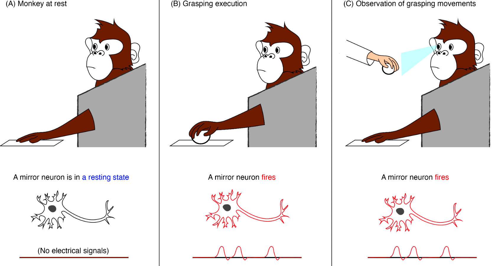

# Cognitive Models of Language Learning - Requirements & Use-cases

In **today's data lab**, we will work on the Cognitive Models of Language Learning use-cases. Use-case 1 is related to the independent study material of Monday and Tuesday (week 3) whereas Use-case 2 is related to all indepdent study material.

## Use-cases

Here is a table of the use-cases and their description.

| Use-Case | Description | ILO Criteria 
|----------|-------------|-------------
| 1 | Create a flowchart of language acquisition and demonstrate the information processing for a simple scenario | Poor - Sufficient 
| 2 | Create a flowchart of language acquisition and demonstrate the information processing for a complex scenario | Good & Excellent 

:bell: Before we start, please make sure you have read the sections on [The final deliverables](https://adsai.buas.nl/Study%20Content/Cognition%20Fundamentals/Cognitive%20Models%20of%20Language%20Learning%20-%20Requirements%20and%20Use-cases.html#the-final-deliverables) and [Plagiarism](https://adsai.buas.nl/Study%20Content/Cognition%20Fundamentals/Cognitive%20Models%20of%20Language%20Learning%20-%20Requirements%20and%20Use-cases.html#plagiarism) you can find in the bottom of this page.

**Let's get started: Keep the coffee flowing and the music playing!**

:thumbsup: :headphones: :coffee:

## Use-case 1: Create a flowchart of language acquisition and demonstrate the information processing for a simple scenario
Scenario description: Baby sees their mother directly in front and above her crib; both are in a lit room. The mother is repeating the same word over and over again: 'mama'. After every repetition, there are two possible outcomes:
1. The baby does not repeat the word (succesfully) or performs some other behaviour (e.g. smiling). The mother therefore repeats the word. <!--- (auditory cue, no positive or negative reinforcement learning) --->
2. The baby repeats the word succesfully (enough). In response the mother smiles and expresses auditory excitement. <!--- (auditory, visual and tactile cue; positive reinforcement learning) --->

You can assume that the baby and the mother both do not have any biological or psychological defects and represent the average human of their given category. You only have to describe the informational processing of the elements mentioned in the scenario description. 

### Learning Behaviour to Integrate
This scenario uses cognitive systems and processes we studied last block but it also integrate the material we studied with regards to the [auditory system](https://adsai.buas.nl/Study%20Content/Cognition%20Fundamentals/Auditory%20Perception%20&%20Learning.html) and [cognitive models of language learning](https://adsai.buas.nl/Study%20Content/Cognition%20Fundamentals/Cognitive%20Models%20of%20Language%20Learning.html). However, this scenario requires the see the exhibition of a type of a second type of learning behaviour we did not cover yet: mirror-neurons.

Mirror neurons are a type of neuron found in the brain that become active when an individual observes another individual performing the same action. If the individual performs that same action as the observed individual, the same neurons are activate. The discovery of mirror neurons has led to the development of the "mirror neuron theory," which proposes that these neurons play a key role in social cognition, empathy, and the ability to understand and imitate the actions of others. According to this theory, when an individual observes another person's actions, the mirror neurons in their brain fire in a way that allows them to simulate the observed action and understand its meaning.

Mirror neurons are found in several areas of the brain, including the premotor cortex and the inferior parietal lobule. These areas are involved in motor planning, control, and perception, suggesting that mirror neurons play a crucial role in linking the perception and action systems of the brain. 

Research on mirror neurons has focused on a wide range of behaviors, including language, empathy, and even the ability to experience emotions. For example, studies have shown that individuals with autism, who often have difficulty with social communication and empathy, may have differences in their mirror neuron systems compared to typically developing individuals. Mirror neurons are a fascinating area of research that have provided new insights into the brain mechanisms underlying social cognition and the ability to understand and interact with others. And the scenario above describes a simple situation where they would, slowly, be connected.

### Requirements
- Flowchart meeting able to handle the informational processing described in the points above where the files is delivered as: .pptx, .pdf, .png, .docx, .jpeg, and .JPG. For other file extensions, contact the course instructor.
- Recorded walkthrough (maximum of 10 minutes) in microsoft teams where you explain how the information is processed by the baby. First for step one (only once) and then for step 2. Make sure your flowchart walkthrough covers all the relevant input and output criteria; and how these inputs and output are covered in the environment and to which categories they belong (e.g. tactile cue). Only focus on the cues which are relevant for understanding the situational context.

### ILO Mapping Explained
- Poor: flowchart of auditory perceptual proccesing accurately representents cognitive theory of auditory perception and language acquisition.
- Insufficient: Input & output going into the model for acquiring the linguistic meaning of word is correctly identified.
- Sufficient: The entire model with all; A) it's components and B) the information forms (or types) at each step, is correct.

## Use-case 2: Create a flowchart of language acquisition and demonstrate the information processing for a complex scenario

Under construction.

## The final deliverables

If you are done with the use-cases, you can make sure your evidence is all in order, ensure that you have saved and committed all your work to Github. You will need to ensure that you have your flowcharts and walthrough recording evideced in your learning log and uploaded to sharepoint; note that you can use your notes to supplement your work if you refer to it in your learning log. 

## Plagiarism

Please note that plagiarism is a serious offense. You are encouraged to use the internet to help you with your analyses, but you must ensure that you cite your sources. However, if your code, and/or accompanied explanation(s) (e.g.,inline-comments, texts in markdown block, etc.), exactly resembles the code, and/or explanation(s) of another student, you will be reported to the board of examiners. You are encouraged to discuss the use-case with your peers, but you must ensure that you write your own code, and provide your own explanation(s). If you are unsure about whether your code, and/or explanation(s) are similar to another student's code, and or explanation(s), please ask your mentor to review your code, and/or other writings.

***
