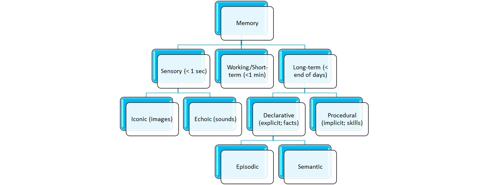
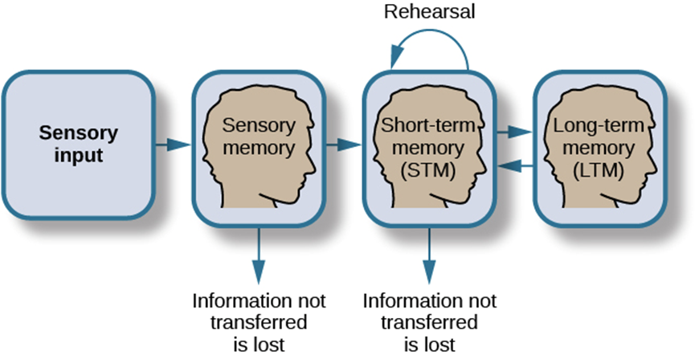

# 1. Decision-making & Actions - Datalab

## Learning Objectives: 
1. Sample relevant real-world input required for situational awareness & reinforcement learning.
2. Sample cognitive processes used to process relevant real-world input required for situational awareness & reinforcement learning.
3. Using situational awareness & reinforcement learning to respond.

# Schedule:
1. Refresher lecture on Decision-making & Actions: 9:15 - 10:00
2. Creative Briefing: Iterate on you flowchart: 10:00 - 12:00
- Group Review of Flowcharts from 11:00 - 12:00, if time allows it.
- Lunch -
3. Robosuit setup: 13:00 - 14:00
4. Selecting input in robosuit: 14:00 - 17:00

## Lecture - Cognition Fundamentals: Decision-making & Actions Refresher
Live lecture in the datalab. If you can't wait, [here are the slides already](https://github.com/BredaUniversityADSAI/ADS-AI/blob/f796cdb8c7629fe462f89344ab5592b0d858d35f/docs/Study%20Content/Cognition%20Fundamentals/assets/lectures/Cognition%20Fundamentals%20-%20Refresher%20on%20Decision-making%20and%20Actions.pptx) but after the lecture, there should be [a recording available here!](https://www.youtube.com/watch?v=dQw4w9WgXcQ&feature=share&si=ELPmzJkDCLju2KnD5oyZMQ)

## Creative Briefing: Iterate on you flowchart
Take a look at the [assessment criteria](https://adsai.buas.nl/Year2/BlockB/#cognition). The important thing for final grading is how the implementation of the robot works and how it is explained in the technical report. The cognitive model serves a didactive and can be used for comparison.

### Object Detection Algorithm

*Figure 1. Flowchart of a typical human cognitive vision system (de Souza Alves, T., de Oliveira, C. S., Sanin, C., & Szczerbicki, E.,2018).*

Having just refreshed out knowledge, we're going to run through these questions again and test our cognitive and robot models. Open your flowchart and technical report and see if you need to make any changes or elaborations based on the following questions:
2. **Identify appropriate perceptual features for object detection:** what does the human and robot both have to perceive to detect the objects? 

*Figure 1. Flowchart of a typical human cognitive vision system (de Souza Alves, T., de Oliveira, C. S., Sanin, C., & Szczerbicki, E.,2018).*

3. **Identify required prior-knowledge for contextualising object detection:** what do the human and robot both need to know about the object to detect the object and know what to do with it?

*Figure 2. The full human cognitive memory system.*

*Figure 3. A simplified human cognitive memory system.*

4. **Use cognitive models of pattern recognition to improve feature and/or object detection:** For both the human and robot; which visual perception processes (e.g. edge detection) can help recognize the object (characteristics) faster and with greather relieability?

### Robotic Controller & Reinforcement Learning algorithm
Then, we're going to elaborate on our flowchart and notes by working out the following tasks:
5. **Identifiy relevant real-world input required for situational awareness & reinforcement learning:** What do the robot and human respectively, need to know to make out what is going on in the situation and environment? How does the robot receive negative and positive feedback?

*Figure 5. The most basic form of a reinforcement learning model.*

6. **Identify cognitive processes used to process relevant real-world input required for situational awareness & reinforcement learning:** How do the robot and human respectively, know what is going on in the situation and environment, and how does he know what to do? How does the robot learn using reinforcement learning?
7. **How do humans sample relevant real-world input required for situational awareness & reinforcement learning?**
•	After sampling the relevant input, how is this input then processed to create situational awareness & reinforcement learning?
•	When we have sampled, processed (e.g. classified) our real-world input, how do we then decide upon which action to take?
•	How do we take and execute that action?
8. **The robot controller can respond to different situational conditions using formal logic:** For the robot and human respectively, which input can be proccesed into a response using just if/else statements?
9. **Suggestions for model improvement, real-world implementation, knowledge acquisition and decision-making are made**: How could you improve on your robot in the future? If you have any great ideas which are out of scope, list them for the excellent criteria!

## Robosuit setup: 13:00 - 14:00
Setup robotsuit to gather input from the simulated environement. 

## Selecting input in robosuit: 14:00 - 17:00
We've now created a design of how our robot is going to do the bin picking task and we've setup robotsuit to gather input. The next logical step is ofcourse to look at the model of our robot and select the relevant input for further processing of our robot. 
1. Find the input channels in robosuit and send them to your robot for further processing
