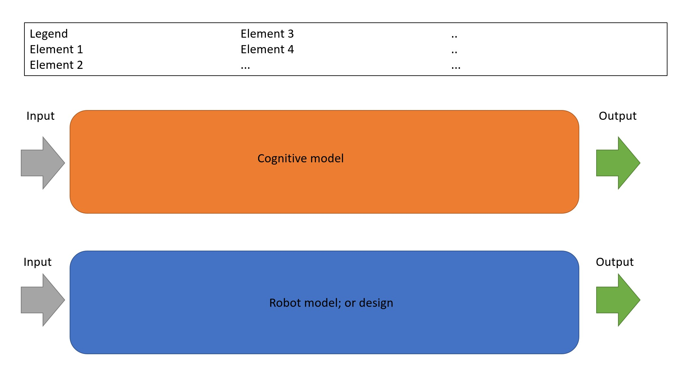
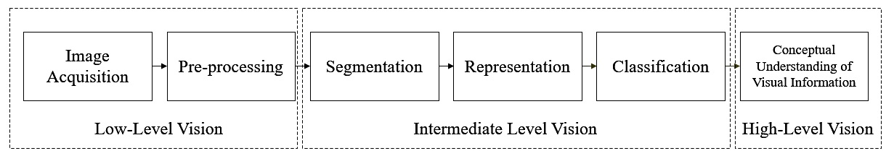
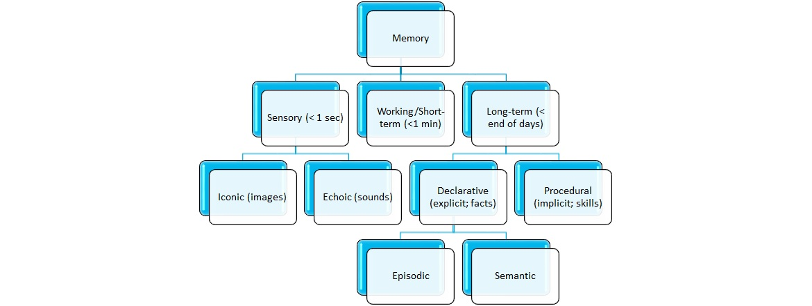
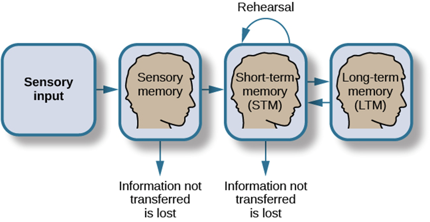
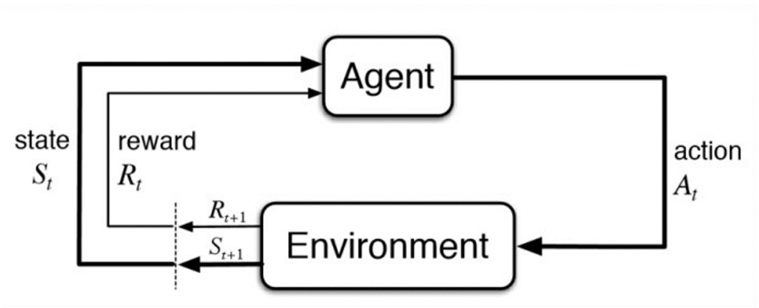

# 1. Decision-making & Actions- Workshop
What we're today essentially going to set out is determining which cognitive systems are involved in the bin-picking tasks? And how does that translate to a robot doing the task?

## Learning Objectives: 
1. Sample relevant real-world input required for situational awareness & reinforcement learning.
2. Sample cognitive processes used to process relevant real-world input required for situational awareness & reinforcement learning.
3. Using situational awareness & reinforcement learning to respond to the sampled input; to perceptions.

## Schedule:
1. Refresher lecture on Perception & Learning: 9:15 - 10:00
2. Creative Briefing: Iterate on you flowchart: 10:00 - 12:00 
- Lunch -
3. Decision-making & Actions Lecture: 13:00 - 14:30
4. Decision-making & Actions Tutorial: 14:30 - 17:00

## Lecture - Cognition Fundamentals: Perception & Learning Refresher
Live lecture which is given at the 15th of December from 9:15 till 10:00. Take a look at your timetable to see where and when exactly the lecture takes place! If you can't wait, [here are the slides already](https://github.com/BredaUniversityADSAI/ADS-AI/blob/f796cdb8c7629fe462f89344ab5592b0d858d35f/docs/Study%20Content/Cognition%20Fundamentals/assets/lectures/Cognition%20Fundamentals%20-%20Refresher%20on%20Perception%20and%20Learning.pptx) but after the lecture, there should be [a recording available here!](https://www.youtube.com/watch?v=dQw4w9WgXcQ&feature=share&si=ELPmzJkDCLju2KnD5oyZMQ)

## Creative Briefing: Iterate on you flowchart
Open your flowchart and technical report or notes thereof, these are going to be the tools to make our design. I've provided all who uploaded their flowchart with feedback, please iterate on your flowchart based on the provided feedback.
1. If you haven't done so already, create a second model for your robot below your current cognitive model. Which should roughly look a bit like this:

*Figure 0. An example of the two parrallel models. Both should have simmilar input (information) and output (actions); although there are going to be variations. 

### Object Detection Algorithm
Having layed out that groundwork condition, we are going to work the [creative brief](https://adsai.buas.nl/Year2/BlockB/#cognition). Using your flowchart supplemented by text in your report/notes we're going to run over the part we already created to check if we have adequately met the creative breif requirements:
2. **Identify appropriate perceptual features for object detection:** what does the human and robot both have to perceive to detect the objects? 

*Figure 1. Flowchart of a typical human cognitive vision system (de Souza Alves, T., de Oliveira, C. S., Sanin, C., & Szczerbicki, E.,2018).*

3. **Identify required prior-knowledge for contextualising object detection:** what do the human and robot both need to know about the object to detect the object and know what to do with it?

*Figure 2. The full human cognitive memory system.*

*Figure 3. A simplified human cognitive memory system.*

4. **Use cognitive models of pattern recognition to improve feature and/or object detection:** For both the human and robot; which visual perception processes (e.g. edge detection) can help recognize the object (characteristics) faster and with greather relieability?

### Robotic Controller & Reinforcement Learning algorithm
Then, we're going to elaborate on our flowchart and notes by working out the following tasks:
5. **Identifiy relevant real-world input required for situational awareness & reinforcement learning:** What do the robot and human respectively, need to know to make out what is going on in the situation and environment? How does the robot receive negative and positive feedback?

*Figure 5. The most basic form of a reinforcement learning model.*

6. **Identify cognitive processes used to process relevant real-world input required for situational awareness & reinforcement learning:** How do the robot and human respectively, know what is going on in the situation and environment, and how does he know what to do? How does the robot learn using reinforcement learning?

Note that these apart from designing, implementing it is also part for the [higher assessment criteria](https://adsai.buas.nl/Year2/BlockB/#cognition).

## Lecture - Cognition Fundamentals: Decision-making & Actions
Live lecture which is given at the 15th of November from 13:00 till 14:30. Take a look at your timetable to see where and when exactly the lecture takes place! If you can't wait, [here are the slides already](https://github.com/BredaUniversityADSAI/ADS-AI/blob/8a312a9350b35bad7ebbf135293d669582d8575d/docs/Study%20Content/Cognition%20Fundamentals/assets/lectures/Cognition%20Fundamentals%20-%20Decision-making%20and%20Actions.pptx) but after the lecture, there should be [a recording available here!](https://www.youtube.com/watch?v=dQw4w9WgXcQ&feature=share&si=ELPmzJkDCLju2KnD5oyZMQ)

## Creative Briefing: Elaborate on you flowchart
Open your flowchart and technical report or notes thereof, these are going to be the tools to make our design. Answer the following question using your flowchart and supplemented with text:
7. **How do humans sample relevant real-world input required for situational awareness & reinforcement learning?**
•	After sampling the relevant input, how is this input then processed to create situational awareness & reinforcement learning?
•	When we have sampled, processed (e.g. classified) our real-world input, how do we then decide upon which action to take?
•	How do we take and execute that action?
8. **The robot controller can respond to different situational conditions using formal logic:** For the robot and human respectively, which input can be proccesed into a response using just if/else statements?
9. **Suggestions for model improvement, real-world implementation, knowledge acquisition and decision-making are made**: How could you improve on your robot in the future? If you have any great ideas which are out of scope, list them for the excellent criteria!

