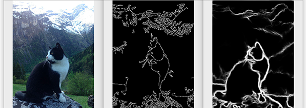

# 1. Perception & Learning - Workshop
Just what is the difference between sensing and perceiving? And how does vision actually work? So what does perception even mean? What's the difference between seeing something and making sense of it? Today we're going to answer all of these questions!

Then, we're going to apply these concepts to creating a senso-perceptual model of what our robot would need to see! Seeing and perceiving however is not enough, our robot will also need to remember, relate and contextualize what it sees in order to decide what to do. So after defining our senso-perceptual model, we're going to learn about the human memory and where how reinforcement learning works!

## Learning Objectives: 
1. Identify appropriate perceptual features for object detection.
2. Identify required prior-knowledge for contextualising object detection.
3. Use cognitive models of pattern recognition to improve feature and/or object detection.
4.	Identifiy relevant real-world input required for situational awareness & reinforcement learning.
5.	Identify cognitive processes used to process relevant real-world input required for situational awareness & reinforcement learning.

## Today's Schedule:
9:00 - 10:00: Introduction to cognition
- Lecture (afterwards 20-min break)
10:00 - 12:30: Perception
- Lecture (afterwards 20-min break)
- Tutorial: Create a flowchart for perceptual processing of sensory information for your robot!
13:30 - 13:30 Lunch
13:30 - 16:00 Learning
- Lecture (afterwards 20-min break)
- Tutorial: Create a flowchart for information; encoded perceptions, processing (a.k.a. learning) for your robot!
16:00 - 17:00 Wrap-up/If we run late

## Kick-off - Introduction to Cognitive Science Fundamentals
Live lecture which is given on the 17th of November from 9:00 till 10:00 with a 20 min break. Take a look at your timetable to see where and when exactly the lecture takes place! If you can't wait, [here are the slides already](https://github.com/BredaUniversityADSAI/ADS-AI/blob/ba08eaff3a1f5c036abab9a5d1bdd729ad861bc9/docs/Study%20Content/Cognition%20Fundamentals/assets/lectures/Cognition%20Fundamentals%20-%20Introduction.pptx) but after the lecture, there should be [a recording available here!](https://edubuas-my.sharepoint.com/:v:/g/personal/heijligers_b_buas_nl/EWDEijXTyr5KghOgLR9wx6MBZ8Fwzfjv_Vt9nxDXnTwESQ?e=FlZQJs)

## Lecture - Cognition Fundamentals: Perception
Live lecture which is given on the 17th of November from 9:00 till 10:00 with a 20 min break. Take a look at your timetable to see where and when exactly the lecture takes place! If you can't wait, [here are the slides already](https://github.com/BredaUniversityADSAI/ADS-AI/blob/ba08eaff3a1f5c036abab9a5d1bdd729ad861bc9/docs/Study%20Content/Cognition%20Fundamentals/assets/lectures/Cognition%20Fundamentals%20-%20Perception.pptx) but after the lecture, there should be [a recording available here!](https://edubuas-my.sharepoint.com/:v:/g/personal/heijligers_b_buas_nl/EXq2Oz4etehLjvVx1iznypMBXXd4w4bjWHbvEtTopNEiLg?e=uD2gAb)

## Refreshers
If you are reviewing this material again or are looking for a different; maybe more entertaining, take then I highly recommend the following videos:

### Sensation and Perception
<iframe width="560" height="315" src="https://www.youtube.com/embed/unWnZvXJH2o" title="YouTube video player" frameborder="0" allow="accelerometer; autoplay; clipboard-write; encrypted-media; gyroscope; picture-in-picture" allowfullscreen></iframe>

### Visual perception and Contextualizing
<iframe width="560" height="315" src="https://www.youtube.com/embed/n46umYA_4dM" title="YouTube video player" frameborder="0" allow="accelerometer; autoplay; clipboard-write; encrypted-media; gyroscope; picture-in-picture" allowfullscreen></iframe>

## Tutorial - Cognition Fundamentals: Perception
Now we are going to create a cognitive model of visual perception ourself for our object detection task:
1. Make a sample of object pictures that you are going use for visual perception
2. Imagine that you as a human are doing the bin-picking task and that you are identifying the object. What characteristics of the object are you watching out for? Write them down in your flowchart.
3. Take a look at the literature below and brought by Bram: 
- Define features of the objects and target area (to both retrieve and place the bin) and write them down in your flowchart.
- Create a model of visual perception for your human object detection; specifically taking the input, proccesing steps and desired output in mind.
- Convert your model of visual perception to one with computer vision; specifically consider the processing steps and how these would translate in algorithms  

### Example of perceptual processing model: Edge detection
What is it used for: We depend on edge detection for tasks such as depth perception and detecting objects in our field of view.
What do we look out for:
- Discontinuities in depth.
- Discontinuities in surface orientation.
- Changes in material properties.
- Variations in scene illumination

Relevant literature and sources to research:
- [Summary of Concepts and Terms](https://github.com/BredaUniversityADSAI/ADS-AI/blob/260f3f788372cfb55e2a4ba2956800de1b3b14a8/docs/Study%20Content/Cognition%20Fundamentals/assets/Summary%20of%20Concepts%20and%20Terms.docx): Highly recommended read which summarizes most important concepts discussed in the literature below. It also contains various important model you can use to create cognitive systems; or systems to deal with information processing in general.
- [O’Reagan, J.K. (1992). Solving the “real” mysteries of visual perception: the world as an outside memory. Can J Psychol, 46(3):461-488.](https://github.com/BredaUniversityADSAI/ADS-AI/blob/29bd304acfa39a1ae5c9aa8640a56cbbe9a18c1e/docs/Study%20Content/Cognition%20Fundamentals/assets/sources/SOLVING%20THE%20REAL%20MYSTERIES%20OF%20VISUAL%20PERCEPTION.pdf)
- [Whitney, D. & Leib, A.Y. (2018). Ensemble perception. Annual Review of Psychology, 69:105-129.](https://github.com/BredaUniversityADSAI/ADS-AI/blob/29bd304acfa39a1ae5c9aa8640a56cbbe9a18c1e/docs/Study%20Content/Cognition%20Fundamentals/assets/sources/Ensemble%20perception.pdf)
- [Deroy, O., Spence, C., & Noppeney, U. (2016). Metacognition in multisensory perception. Trends in Cognitive Sciences, 20, 736-747.](https://github.com/BredaUniversityADSAI/ADS-AI/blob/29bd304acfa39a1ae5c9aa8640a56cbbe9a18c1e/docs/Study%20Content/Cognition%20Fundamentals/assets/sources/Metacognition%20in%20multisensory%20perception%20-%20Trends%20in%20Cognitive%20Sciences.pdf)

## Break Time!
From 12:30 till 13:30.

## Lecture - Cognition Fundamentals: Learning
Live lecture which is given on the 17th of November from 13:30 till 14:30. Take a look at your timetable to see where exactly the lecture takes place! If you can't wait, [here are the slides already](https://github.com/BredaUniversityADSAI/ADS-AI/blob/8a312a9350b35bad7ebbf135293d669582d8575d/docs/Study%20Content/Cognition%20Fundamentals/assets/lectures/Cognition%20Fundamentals%20-%20Learning.pptx) but after the lecture, there should be [a recording available here!](https://www.youtube.com/watch?v=dQw4w9WgXcQ&feature=share&si=ELPmzJkDCLju2KnD5oyZMQ).

## Refreshers
If you are reviewing this material again or are looking for a different; maybe more entertaining, take then I highly recommend the following videos:

### Learning
<iframe width="560" height="315" src="https://www.youtube.com/embed/qG2SwE_6uVM" title="YouTube video player" frameborder="0" allow="accelerometer; autoplay; clipboard-write; encrypted-media; gyroscope; picture-in-picture" allowfullscreen></iframe>

### Memories
<iframe width="560" height="315" src="https://www.youtube.com/embed/bSycdIx-C48" title="YouTube video player" frameborder="0" allow="accelerometer; autoplay; clipboard-write; encrypted-media; gyroscope; picture-in-picture" allowfullscreen></iframe>

### Information Retrieval and Deletion
<iframe width="560" height="315" src="https://www.youtube.com/embed/HVWbrNls-Kw" title="YouTube video player" frameborder="0" allow="accelerometer; autoplay; clipboard-write; encrypted-media; gyroscope; picture-in-picture" allowfullscreen></iframe>

## Tutorial - Cognition Fundamentals: Learning
Now we are going to create a cognitive model of memory and reinforcement learning for our object detection task:
1. As a human you need to remember a whole range of things; concept, movemements, features, spacial locations, to recognize objects. Write them down for yourself.
2. Take a look at the literature below and brought by Bram: 
- Make a list of classes, labels, features, concepts, movements, spatial locations that you are going to need to remember to recognize (or recollected) objects. Give them a place in your flowchart or write them down in a table; usefull for in your data management plan!
- Create a model of human memory and (reinforcement) learning for your human object detection; specifically taking the input, proccesing steps and desired output in mind.
- Convert your model of human memory and (reinforcement) learning to one with computer vision; specifically consider the processing steps and how these would translate in algorithms. Think about which symbolic labels are you going to use a cues to signify an objects? Which cues are going to create positive and negative reinforcement?

### Example of reinforcement learning model: 
What is it used for: We depend on reinforcement learning in order to avoid harming ourselves and others during physical tasks.
What do we look out for:
- Avoiding damage to our body; pain.
- No harming others; mental pain in the form of empathy and social exclusion.
- Awarenes of changing situation context; changes in weather which signify a storm.
- etc.

Relevant literature to research:
- [Summary of Concepts and Terms](https://github.com/BredaUniversityADSAI/ADS-AI/blob/260f3f788372cfb55e2a4ba2956800de1b3b14a8/docs/Study%20Content/Cognition%20Fundamentals/assets/Summary%20of%20Concepts%20and%20Terms.docx): Highly recommended read which summarizes most important concepts discussed in the literature below. It also contains various important model you can use to create cognitive systems; or systems to deal with information processing in general.
- [Schurgin, M.W. (2018). Visual memory, the long and the short of it: A review of visual working memory and long-term memory. Attention, Perception, & Psychophysics, 80: 1035-1056.](https://github.com/BredaUniversityADSAI/ADS-AI/blob/997b5108aa39c2ceded8eb9dd979c7333360e624/docs/Study%20Content/Cognition%20Fundamentals/assets/sources/Visual%20memory,%20the%20long%20and%20the%20short%20of%20it%20-%20A%20review%20of%20visual%20working.pdf)
- [Eichenbaum, H. (2017). Memory: Organization and Control. Annual Review of Psychology, 68, 19-45.](https://github.com/BredaUniversityADSAI/ADS-AI/blob/997b5108aa39c2ceded8eb9dd979c7333360e624/docs/Study%20Content/Cognition%20Fundamentals/assets/sources/Memory%20-%20Organization%20and%20Control.pdf)
- [O’Reagan, J.K. (1992). Solving the “real” mysteries of visual perception: the world as an outside memory. Can J Psychol, 46(3):461-488.](https://github.com/BredaUniversityADSAI/ADS-AI/blob/29bd304acfa39a1ae5c9aa8640a56cbbe9a18c1e/docs/Study%20Content/Cognition%20Fundamentals/assets/sources/SOLVING%20THE%20REAL%20MYSTERIES%20OF%20VISUAL%20PERCEPTION.pdf)