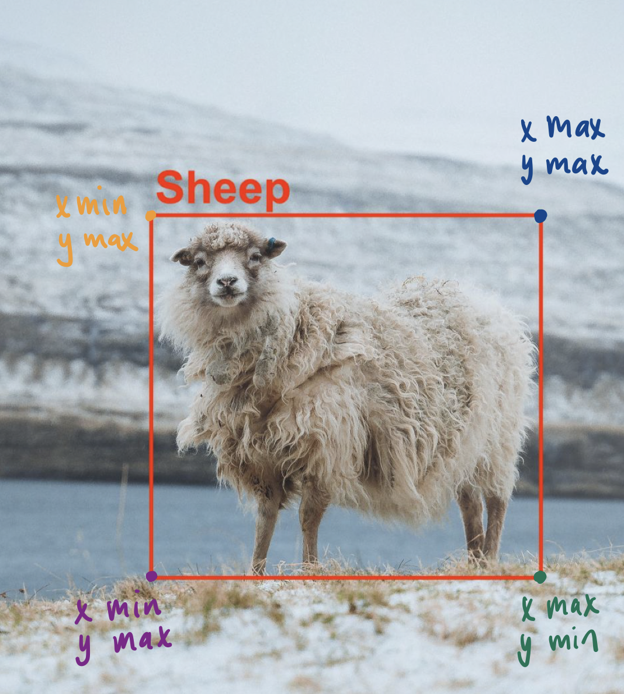
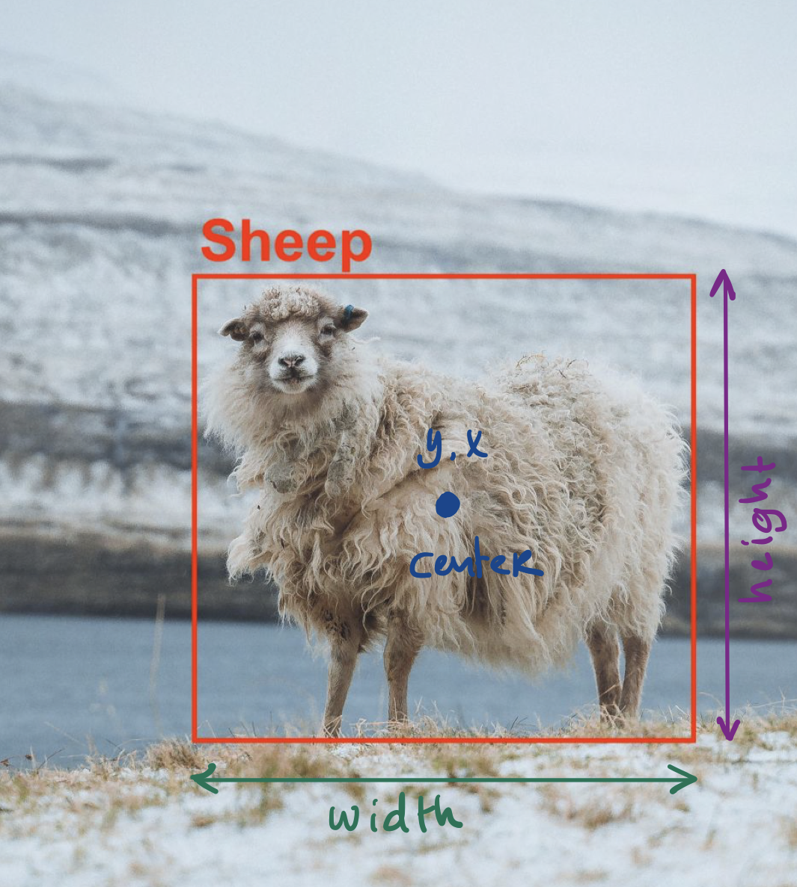
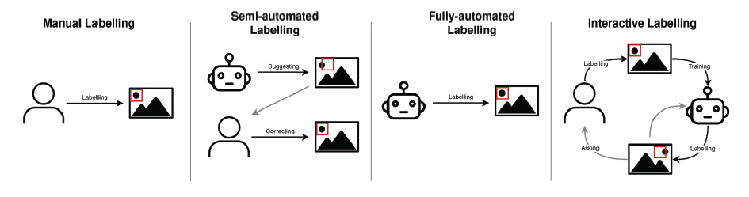

# Data annotation

In this knowledge module, you will find a list of online resources to help you annotate a custom image dataset, which in turn can be use to solve an object detection task.  

After this module, you will be able to:

- [ ] List, and describe the two main representations to specify a bounding box
- [ ] List, and describe four types of labeling approaches according to Sager et al. (2021)
- [ ] Select a (open source) labelling tools that is best suited for the object detection task based on their features
- [ ] Deploy explainable AI methods to asses the quality of the image dataset, and/or model
- [ ] List, and describe the most commonly used annotation formats for object detection

## 1. Image labeling process

Image labelling is a process that has four steps:

1. Labeling
2. Post-processing
3. Quality assessment
4. Data export

Let us run through each of them separately. 

### 1.1 Labelling

In the case of object detection, every objects needs have a class label (i.e., classification), and a set of coordinates for a rectangle, a.k.a. the bounding box (i.e.. localization). There are multiple ways to specify a bounding box, the two most commonly used representations are presented below:

1. A bounding box could also be represented as [xmin, ymin, xmax, ymax], where xmin and ymin are the coordinates of the bounding box bottom-left corner, xmax and ymax are the coordinates of the bounding box top-right corner.

*Figure 1. Bounding box corners representation.* 

2. A bounding box could be represented as [x, y, w, h], where x and y are the coordinates of the bounding box centroid, w and h are the width and height of the bounding box ([Source](https://leimao.github.io/blog/Bounding-Box-Encoding-Decoding/)).

*Figure 2. Bounding box centroids representation.* 

There are many different approaches to labelling. Based on the degree of automation, Sager et al. (2021), identify four types:

*Figure 4. The four types of labeling approaches according to Sager et al. (2021).* 

1. Manual labeling
2. Semi-automated labeling
3. Fully-automated labeling
4. Interactive labeling

For detailed description of these approaches, see the article [A survey of image labelling for computer vision applications](ADD URL) by Sager et al. (2021).

Together with your peers you will likely have to labeling your dataset, manually. However, you might want to check out some of the (paid) semi-automated, model-assisted, labeling tools available: [Roboflow](https://docs.roboflow.com/annotate/model-assisted-labeling), [V7](https://www.v7labs.com/) and [LabelBox](https://labelbox.com/product/annotate/image/). 

Now that we have to annotate our images manually, let us take a closer look at the available annotation tools. In the Good Old days, when we lecturers started implementing deep learning-based object detection models (For example, YOLOv2. Yeah, I know that sounds like ages ago...), most tools were open source. They were free, but often not very user-friendly:

*Figure 5. Open source meme.* 

Currently, there is a substantial rise in the number of paid tools, either newly developed ones (e.g., Roboflow) or ones that were previously open source (e.g., CVAT). Overall, these tools are more user-friendly than the current open-source tools, especially regarding annotating datasets collaboratively as a team. Popular annotation tools are, for example:

- [Roboflow](https://roboflow.com/)
- [V7](https://www.v7labs.com/image-annotation)
- [CVAT/LabelStudio](https://www.cvat.ai/)
- [VoTT](https://learn.microsoft.com/en-us/dotnet/machine-learning/how-to-guides/label-images-for-object-detection-using-vott)

Tip: Many of these annotation tools have educational licenses for university students and/or teaching staff. Do not hesitate to apply for these licenses, but keep in mind that it might take a while for them to process your request.  

For a full list of available tools, check out the GitHub repository [Awesome Dataset Tools](https://github.com/jsbroks/awesome-dataset-tools) by Justin Brooks. 

### 1.2 Post-processing 

An easy way to increase the size of your image dataset is to apply augmentation techniques to your training/validation data. You can always augment your data through the use of Python frameworks, such as [PyTorch](https://pytorch.org/vision/main/transforms.html). Sometimes, annotation tools offer ways to augment your data. For example, Roboflow provides multiple augmentation techniques, such as flip, random crop, and blur. It is also important to note that some object detection algorithms already include some form of data augmentation in their training pipeline. For example, YOLOv4 models applies a technique called [grid mask](https://blog.roboflow.com/yolov4-data-augmentation/) to the data during the training phase. 

### 1.3 Quality assessment 

After we are done with post-processing the data, we need to assess our datasets in terms of quality. For instance, we need see if there are any class/instance interpretation errors or similarity errors present. These errors can lead to under- or overrepresentation, a.k.a class imbalance, creating bias in your dataset. For more information on bias and labeling, see Google's blog [Datasets Have Worldviews](https://pair.withgoogle.com/explorables/dataset-worldviews/).

To test if your model is doing what it is supposed to so, detecting a particular set of objects, you can apply the following explainable AI techniques:

- Image perturbations, which will work if you have only one single class depicted in the image (Traditional approach, see p. 414 of [Computer Vision: Algorithms and Applications](https://szeliski.org/Book/) by Richard Szeliski)
- [Grad-Cam](https://github.com/jacobgil/pytorch-grad-cam) (Deep learning approach)

### 1.4 Data export 

To export your data from a tool, you must store the annotations in a structured format. These annotation formats can frequently be traced back to image benchmarking datasets, such as MS COCO or ImageNet (For details, see the article [Deep Learning for Generic Object Detection: A Survey](ADD URL) by Liu et al., (2019)). Typical formats for object detection include:

- Pascal VOC
- COCO JSON
- YOLO Darknet txt

Important to note there are object detection algorithm implementations that require your data to be annotated in a certain way. As you might have experienced by now, data labeling is a time-consuming process. Thus, before you build your object detection model, ensure that your data annotations are formatted correctly because you do not want to repeat the labeling process on the same dataset.

For information regarding computer vision annotation formats, see the blog [Computer Vision Annotation Formats](https://roboflow.com/formats) by Roboflow.

***