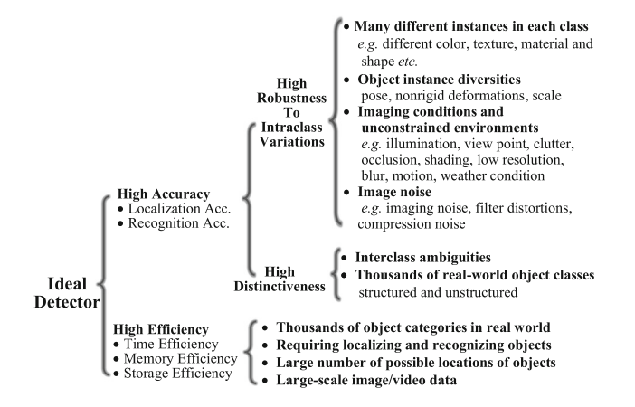
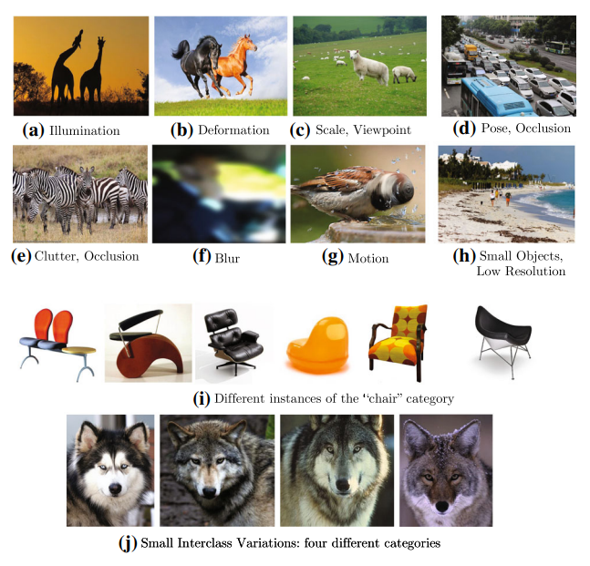
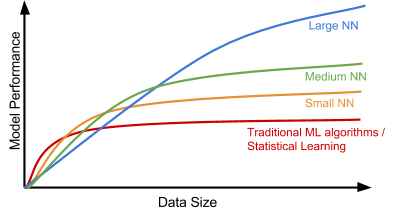
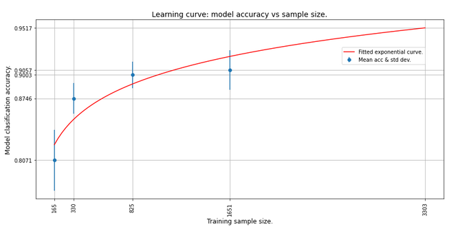

# Data collection 

In this knowledge module, you will find a list of online resources to help you create your custom image dataset.  

## 1. Dataset 

In Block C of Year 1, you created a custom dataset based on images extracted from the large-scale Open Images dataset. In this block, you will generate your own data by taking pictures or synthetically generating them in a robotic simulation environment. To meet the project requirements, you, as a group, need to create three image datasets; two real-life image datasets ('easy', and 'difficult' object detection task), and one synthetic image dataset ('easy' object detection task). 

## 1.1 The challenges of object detection

Despite significant progress in the field of computer vision, object detection is still considered a complex recognition task. The first complication can be linked to its primary objective: These models do not only classify multiple objects, but also determine their position within visual media (i.e., the branch 'High Accuracy' in Figure 1.). 



*Figure 1. Taxonomy of object detection challenges by Liu et al. (2019).*

> ... high quality detection must accurately localize and recognize objects in images or video frames, such that the large variety of object categories in the real world can be distinguished (i.e., high distinctiveness), and that object instances from the same category, subject to intraclass appearance variations, can be localized and recognized (i.e., high robustness). High efficiency requires that the entire detection task runs in real time with acceptable memory and storage demands ([Source](https://link.springer.com/content/pdf/10.1007/s11263-019-01247-4.pdf)).

Some challenges related to the 'High Robustness to Intraclass Variations' branch are exemplified in the following figure:



*Figure 2. Examples of challenges related to 'High Robustness to Intraclass Variations' by Liu et al. (2019).*

In our use case, we will most likely face challenges presented in the branch 'High Robustness to Intraclass Variations'. Problems related to 'High Distictiveness' and 'High Efficiency' become more prominent when working with a large number of classes, complex environments (e.g., multiple backgrounds), and large datasets (See, Figure 1.). 

__Nice, that you listed all these challenges, but we just need to know how many training images we need to get a good-performing model...__

## 1.2 How many training images do I need?

We would love to give you a concrete number, however, that is simply impossible. In general, deep learning requires more training data than traditional ML or statistical learning models:



*Figure 3. Dataset size and model performance.*

In other words, when deploying a deep learning object detection model you can never have too many images. Thus, when your model is performing poorly, first try to add additional training data. If that does not solve the problem, check if your dataset is susceptible to the challenges represented in the branch 'High Robustness to Intraclass Variations' (See, Figure 1.). 

The number of data instances needed to train a good object detection model depends on two factors:

1. The number of classes: The more unique classes you have, the more data instances per class are needed. 
2. Complexity/Diversity of classes: 

> A human can probably quickly learn to distinguish between beer and wine, with just a few samples. He will have to try different wines quite more often to distinguish between 5-6 different sorts of red wines, and for many humans it will be challenging to learn to distinguish between 50 different flavors of red wines. At least one will have to practice a lot. Similarly, neural networks would quickly be able to distinguish between elephants and cats, but they would need many more samples to classify 30 different animals ([Source](https://cloud.google.com/vision/automl/object-detection/docs/prepare)).

The researchers at Google recommend having '... at least 100 training samples per class if you have distinctive and few classes, and more than 200 training samples if the classes are more nuanced and you have more than 50 different classes' ([Source](https://cloud.google.com/vision/automl/object-detection/docs/prepare)).

Joseph Redmon one of the creators of the original YOLO algorithm, even states that you need a minimum of 2000 * number of classes for your model to reach optimal accuracy: 

> For each object which you want to detect - there must be at least 1 similar object in the Training dataset with about the same: shape, side of object, relative size, angle of rotation, tilt, illumination. So desirable that your training dataset include images with objects at different: scales, rotations, lightings, from different sides, on different backgrounds - you should preferably have 2000 different images for each class or more, and you should train 2000*classes iterations or more ([Source](https://github.com/AlexeyAB/darknet#how-to-improve-object-detection)). 

Another way to test if you have enough training examples, is to deploy a balanced subsampling scheme:

> This is done by selecting a random subsample consisting of Y number of images and training the model using the subsample. The model is then evaluated on an independent test set. This process is repeated N times for each subsample with replacement to allow for the construction of a mean and confidence interval for the observed performance ([Source](https://keras.io/examples/keras_recipes/sample_size_estimate/)).

__Example:__ 

Training dataset: 1000 images

Classes:

- Cat 
- Dog 

The images are evenly distributed over the two classes. 

1. Train the model for five epochs on 5% (i.e., 50 images) of the training set, and subsequently calculate the accuracy for every epoch on the validation set.

Training set 1 (accuracy) : [0.3 , 0.33, 0.28, 0.35, 0.26] 

2. Repeat this process for the 20%, 35% and 50% training sets. 

3. Calculate each experiment's average accuracy and standard deviation, and fit a learning curve over these data points. 



*Figure 4. Balanced subsampling scheme, learning curve.*

By looking at the learning curve, you should be able to determine if you have enough images in your training set to obtain a particular accuracy score. 

__Learning curves, code snippet:__

```python

# Step 1 - Import the library

import numpy as np
import matplotlib.pyplot as plt
from sklearn.ensemble import RandomForestClassifier
from sklearn import datasets
from sklearn.model_selection import learning_curve

# Step 2 - Setup the Data

cancer = datasets.load_breast_cancer()

X, y = cancer.data, cancer.target

# Step 3 - Learning Curve and Scores

train_sizes, train_scores, test_scores = learning_curve(RandomForestClassifier(), X, y, cv=10, scoring='accuracy', n_jobs=-1, train_sizes=np.linspace(0.01, 1.0, 50))

train_mean = np.mean(train_scores, axis=1)
train_std = np.std(train_scores, axis=1)

test_mean = np.mean(test_scores, axis=1)
test_std = np.std(test_scores, axis=1)

# Step 4 - Ploting the Learning Curve

plt.subplots(1, figsize=(10,10))
plt.plot(train_sizes, train_mean, '--', color="#111111",  label="Training score")
plt.plot(train_sizes, test_mean, color="#111111", label="Cross-validation score")

plt.fill_between(train_sizes, train_mean - train_std, train_mean + train_std, color="#DDDDDD")
plt.fill_between(train_sizes, test_mean - test_std, test_mean + test_std, color="#DDDDDD")

plt.title("Learning Curve")
plt.xlabel("Training Set Size"), plt.ylabel("Accuracy Score"), plt.legend(loc="best")
plt.tight_layout()
plt.show()

# Source: https://www.projectpro.io/recipes/plot-learning-curve-in-python

```

### 1.3 Real-life image dataset 

Remember, for this project, we need to create two real-life image datasets:

__1. 'Easy' object detection task__

- 3-5 classes representing a geometric shape (e.g., green cube, yellow cube, red pyramid, etc.).
- Background: Box/bin
- 'Scraping' the web for images is not allowed! You will have to generate the images yourself. 

One way to create these objects is by applying origami techniques to a piece of paper:

<iframe width="896" height="504" src="https://www.youtube-nocookie.com/embed/8aIJ543vFBI" title="YouTube video player" frameborder="0" allow="accelerometer; autoplay; clipboard-write; encrypted-media; gyroscope; picture-in-picture" allowfullscreen></iframe>

*Video 1. Balanced subsampling scheme, learning curve.*

Keep in mind, this dataset should be created in such a way that it can be recreated in a robotic simulation environment. So, no complex geometric figures, please! 

<div style="padding: 15px; border: 1px solid transparent; border-color: transparent; margin-bottom: 20px; border-radius: 4px; color: #8a6d3b;; background-color: #fcf8e3; border-color: #faebcc;">
Tip: <a href="https://www.dvdvideosoft.com/products/dvd/Free-Video-to-JPG-Converter.htm">Free Video to JPG Converter</a>, an open-source software package, 
will enable you to create a video and convert it into a collection of images. 
</div>

__2. 'Difficult' object detection task__

There are no requirements regarding this dataset; feel free to select the type, and/or number of classes, background(s), etc. 

### 1.4 Synthetic image dataset 


***