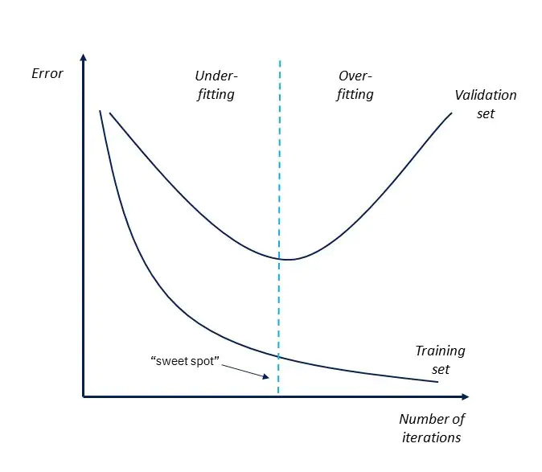

# DL computer vision III: Hyperparameter tuning

In this knowledge module, you will find a list of online resources to help you to tune your model's hyperparameters, such as momentum and learning rate. 

After this module, you will be able to:

- [ ] Explain the difference between model design elements, hyperparameters and model parameters of a deep learning algorithm
- [ ] Explain the concept of hyperparameter tuning 
- [ ] Compare and contrast two hyperparameter search methods; Grid vs. Random
- [ ] Explain how the following hyperparameters affect model performance: weight decay, learning rate, momentum, batch size, and image size 

***

## 1. What are hyperparameters?

It is very rare to have a model that works well out of the box. In fact, most models require some sort of optimization to get the best performance on a given dataset. Remember: Building, training and evaluating a machine learning model is an iterative process (CRISP-DM).

Hyperparameters are the parameters that are not directly learnt within the model. They are set before the training process starts. For example, the number of layers, the number of neurons in each layer, the activation function, the optimizer, the learning rate, the batch size, and momentum are all hyperparameters. Additionally, the first four listed are also part of the model design, - i.e., they are the building blocks of a deep learning algorithm. 

*Figure 1. Model design, hyperparameters and model parameters*

For more information, see the video below:

<iframe width="896" height="504" src="https://www.youtube-nocookie.com/embed/VTE2KlfoO3Q" title="YouTube video player" frameborder="0" allow="accelerometer; autoplay; clipboard-write; encrypted-media; gyroscope; picture-in-picture" allowfullscreen></iframe>

*Video 1. Parameters vs Hyperparameters (C1W4L07).*

Brainteaser 1: Can you list some of the hyperparameters of your chosen object detection model?

*** 

## 2. Search methods

Search methods are used to systematically find the best hyperparameters for a given model. In this section, we will discuss two commonly used methods: grid search and random search. 

__What is a hyperparameter space?__ 

A hyperparameter space is the set of all possible hyperparameter combinations. For example, if you have 3 hyperparameters, each with 3 possible values, then your search space is 3 x 3 x 3 = 27, resulting in 27 experiments or runs. Thus, for each experiment, you only change one hyperparameter; the others remain constant.

<iframe width="896" height="504" src="https://www.youtube-nocookie.com/embed/wKkcBPp3F1Y" title="YouTube video player" frameborder="0" allow="accelerometer; autoplay; clipboard-write; encrypted-media; gyroscope; picture-in-picture" allowfullscreen></iframe>

*Video 2. Hyperparameter Tuning in Practice (C2W3L03).*

### 2.1 Grid search

A grid search is a method of searching through a manually specified subset of the hyperparameter space of a machine learning algorithm:

> Grid search, true to its name, picks out a grid of hyperparameter values, evaluates every one of them, and returns the winner. For example, if the hyperparameter is the number of leaves in a decision tree, then the grid could be 10, 20, 30, …, 100. For regularization parameters, it's common to use exponential scale: 1e-5, 1e-4, 1e-3, … 1. Some guess work is necessary to specify the minimum and maximum values. So sometimes people run a small grid, see if the optimum lies at either end point, and then expand the grid in that direction. This is called manual grid search.     Grid search is dead simple to set up and trivial to parallelize. It is the most expensive method in terms of total computation time. However, if run in parallel, it is fast in terms of wall clock time ([Source](https://web.archive.org/web/20160701182750/http://blog.dato.com/how-to-evaluate-machine-learning-models-part-4-hyperparameter-tuning)).

__Advantages/Disadvantages of using grid search:__

(+) It eventually will find the best hyperparameter settings for a given model  
(-) It is computationally expensive, especially if the hyperparameter space is large, because it searches through all possible hyperparameter combinations 

### 2.2 Random search

In contrast to grid search, which exhaustively tests all the hyperparameter combinations, random search randomly selects a number of hyperparameter combinations from the hyperparameter space to test:

> I love movies where the underdog wins, and I love machine learning papers where simple solutions are shown to be surprisingly effective. This is the storyline of "Random search for hyperparameter optimization" by Bergstra and Bengio. Random search is a slight variation on grid search. Instead of searching over the entire grid, random search only evaluates a random sample of points on the grid. This makes random search a lot cheaper than grid search. Random search wasn't taken very seriously before. This is because it doesn't search over all the grid points, so it cannot possibly beat the optimum found by grid search. But then came along Bergstra and Bengio. They showed that, in surprisingly many instances, random search performs about as well as grid search. All in all, trying 60 random points sampled from the grid seems to be good enough.   In hindsight, there is a simple probabilistic explanation for the result: for any distribution over a sample space with a finite maximum, the maximum of 60 random observations lies within the top 5% of the true maximum, with 95% probability. That may sound complicated, but it's not. Imagine the 5% interval around the true maximum. Now imagine that we sample points from this space and see if any of it lands within that maximum. Each random draw has a 5% chance of landing in that interval, if we draw $n$ points independently, then the probability that all of them miss the desired interval is $(1 - 0.05)^n$. So the probability that at least one of them succeeds in hitting the interval is 1 minus that quantity. We want at least a .95 probability of success. To figure out the number of draws we need, just solve for $n$ in the equation:     $1 - (1-0.05)^n > 0.95$     We get $n >= 60$. Ta-da!     The moral of the story is: if the close-to-optimal region of hyperparameters occupies at least 5% of the grid surface, then random search with 60 trials will find that region with high probability.     With its utter simplicity and surprisingly reasonable performance, random search is my to-go method for hyperparameter tuning. It's trivially parallelizable, just like grid search, but it takes much fewer tries and performance almost as well most of the time ([Source](https://web.archive.org/web/20160701182750/http://blog.dato.com/how-to-evaluate-machine-learning-models-part-4-hyperparameter-tuning)).

__Advantages/Disadvantages of using grid search:__
    
(+) It is computationally efficient, because it searches through a random subset of the hyperparameter space  
(-) It does not guarantee to find the best hyperparameter settings for a given model if the number of runs is < 60

All in all, random search is a good starting point for hyperparameter tuning. It is computationally efficient and can be used to narrow down the hyperparameter space ('Course to fine', Andrew ng). 

For more information on the tuning process, see the video below:

<iframe width="896" height="504" src="https://www.youtube-nocookie.com/embed/AXDByU3D1hA" title="YouTube video player" frameborder="0" allow="accelerometer; autoplay; clipboard-write; encrypted-media; gyroscope; picture-in-picture" allowfullscreen></iframe>

*Video 3. Tuning Process (C2W3L01).*

***

## 3. Hyperparameters for computer vision

Let us take a closer look at some of the hyperparameters that are commonly optimized in computer vision.

### 3.1 Weight decay

Weight decay is a regularization technique that is used to prevent [overfitting](https://www.ibm.com/cloud/learn/overfitting). 

*Figure 2. Overfitting vs. Underfitting.*

It is also known as L2 regularization or Ridge regression. Weight decay adds a penalty term to the loss function, which is proportional to the square of the magnitude of the weights. By doing so, it penalizes larger weights more severely than smaller weights, reducing the variance. 

*Figure 3. Overview of bias and variance in machine learning.*

Brainteaser 2: Can explain why overfitting is linked to high variance and underfitting is linked to high bias?

For more information, see [Regularization for Simplicity: L₂ Regularization](https://developers.google.com/machine-learning/crash-course/regularization-for-simplicity/l2-regularization). 

### 3.2 Learning rate

The learning rate is a hyperparameter that controls how much the weights are updated during training. If the learning rate is too small, it will take a long time to train the model, and it might even get 'stuck' in a local minimum. If the learning rate is too large, you might end up with a suboptimal set of weights, and/or an unstable training process.

<iframe width="896" height="504" src="https://www.youtube-nocookie.com/embed/IHZwWFHWa-w" title="YouTube video player" frameborder="0" allow="accelerometer; autoplay; clipboard-write; encrypted-media; gyroscope; picture-in-picture" allowfullscreen></iframe>

*Video 4. Gradient descent, how neural networks learn | Chapter 2, Deep learning.*

### 3.3 Momentum

> Training a neural network can be made easier with the addition of history to the weight update. Specifically, an exponentially weighted average of the prior updates to the weight can be included when the weights are updated. This change to stochastic gradient descent is called 'momentum' and adds inertia to the update procedure, causing many past updates in one direction to continue in that direction in the future ([Source](https://machinelearningmastery.com/learning-rate-for-deep-learning-neural-networks/)).

__Okay, that sounds rather complex... Luckily, the intuition behind the hyperparameter momentum is quite straight forward:__

Imagine that you are trying to push a heavy box across the floor. If you push it with a constant force, it will take a long time to move it across the floor. However, if you push it with a constant force, but you also give it a little push in the direction that it is already moving, it will move much faster.

For a more in-depth explanation, watch the following video by the famous AI researcher [Geoffrey Hinton](https://research.google/people/GeoffreyHinton/):

<iframe width="896" height="504" src="https://www.youtube-nocookie.com/embed/LdkkZglLZ0Q" title="YouTube video player" frameborder="0" allow="accelerometer; autoplay; clipboard-write; encrypted-media; gyroscope; picture-in-picture" allowfullscreen></iframe>

*Video 5. Lecture 6.3 — The momentum method [Neural Networks for Machine Learning].*

For more information on learning rate, and momentum, see the article [How to Configure the Learning Rate When Training Deep Learning Neural Networks](https://machinelearningmastery.com/learning-rate-for-deep-learning-neural-networks/)

*Video 4. The Problem of Local Optima (C2W3L10).*

### 3.4 Batch size

The batch size (A.K.A. mini-batch) is the number of training examples that are used to compute the gradient during one iteration. in other words, batch size is the number of training images that will be forwarded through the network at the same time. 

__Also, batch size is not the same as the number of epochs!:__

*Figure 3. Batch size, iterations and epochs.*

A large batch size will result in a relatively stable training process, but it causes the model to not generalize well to new data, and it is memory expensive. As a result, it tends to get 'stuck' in a local minimum. Weak generalization, or overfitting, due to a large batch size might be due to the fact that the gradients are not updated as frequently as it would be with a smaller batch size:

> Following this hypothesis we conducted experiments to show empirically that the "generalization gap" stems from the relatively small number of updates rather than the batch size, and can be completely eliminated by adapting the training regime used ([Source](https://arxiv.org/pdf/1705.08741.pdf)).

One major advantage of a large batch size is that it allows you to train the model faster; it will take fewer iterations to train the model.

A small batch size will result in a more unstable training process, but it cause the model to generalize better to new data, and it less memory expensive. As a result, it has a higher chance of finding the global minimum (i,e., lowest loss value). One major disadvantage of a small batch size is that it will take more iterations to train the model. 

For more information on the effect of batch size on training neural networks, see the video below:

<iframe width="896" height="504" src="https://www.youtube-nocookie.com/embed/U4WB9p6ODjM" title="YouTube video player" frameborder="0" allow="accelerometer; autoplay; clipboard-write; encrypted-media; gyroscope; picture-in-picture" allowfullscreen></iframe>

Brainteaser 3: Which of the statements below is true, and which are false?    

When you increase the batch size:

1. The slower the training loss decreases  
2. The less time it takes to train per epoch  
3. The less epochs it takes to converge to the minimum validation loss

Answer

1. __True__  
2. __True__  
3. __False__  
([Source](https://medium.com/deep-learning-experiments/effect-of-batch-size-on-neural-net-training-c5ae8516e57))

### 3.5 Image size

In general, a larger input size will result in a more accurate model because it will be able to learn more complex patterns. However, there is a trade-off between between batch size and image size. If you increase the image size, you will need to decrease the batch size to compensate for the increased memory usage.

Lastly, some models are designed to work with a specific input size. For example, YOLOv3 is designed to work with images that can be divided by 32. Thus, if you want to use YOLOv3, you will need to resize your images to a size that can be divided by 32:

> The network downsamples the image by a factor called the stride of the network. For example, if the stride of the network is 32, then an input image of size 416 x 416 will yield an output of size 13 x 13. Generally, stride of any layer in the network is equal to the factor by which the output of the layer is smaller than the input image to the network ([Source](https://www.kdnuggets.com/2018/05/implement-yolo-v3-object-detector-pytorch-part-1.html)).

***

## 4. Additional resources

- [Practical Guide to Hyperparameters Optimization for Deep Learning Models](https://blog.floydhub.com/guide-to-hyperparameters-search-for-deep-learning-models/) (Alessio Gozzoli, blog post)
- [A Recipe for Training Neural Networks](http://karpathy.github.io/2019/04/25/recipe/) (Andrej Karpathy, blog post)
- [Lecture 10: Training Neural Networks I](https://www.youtube.com/watch?v=lGbQlr1Ts7w&list=PL5-TkQAfAZFbzxjBHtzdVCWE0Zbhomg7r&index=10) (Justin Johnson, Youtube video)
- [Lecture 11: Training Neural Networks II](https://www.youtube.com/watch?v=WUazOtlti0g&list=PL5-TkQAfAZFbzxjBHtzdVCWE0Zbhomg7r&index=11) (Justin Johnson, Youtube video)

***