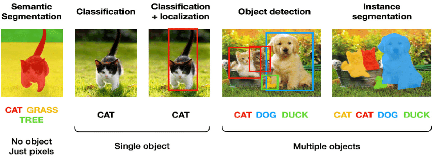
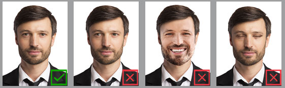
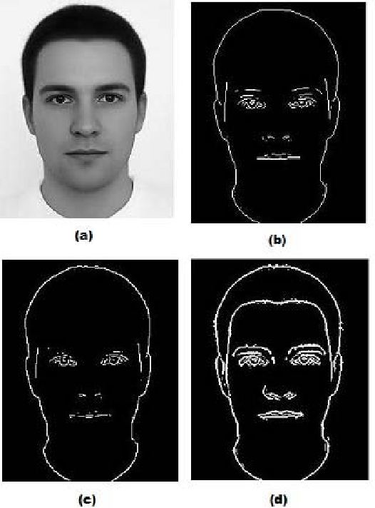

# Computer vision: Introduction

In this knowledge module, you will find a list of online resources to help you get familiar with some of the main concepts in the field of computer vision.

After this module, you will be able to:

- [ ] Define the term 'computer vision'
- [ ] List, and describe real-life applications of computer vision
- [ ] List, and describe the main computer vision tasks
- [ ] Provide benefits/drawbacks of using traditional computer vision/deep learning methods

## 1. What is computer vision?

Computer vision is a field of artificial intelligence that trains computers to interpret and understand the visual world. It enables computers to see, process, and understand images in the same way that humans do. To get an overview of the main concepts of computer vision, you can watch the following video:

<iframe width="896" height="504" src="https://www.youtube-nocookie.com/embed/-4E2-0sxVUM" title="YouTube video player" frameborder="0" allow="accelerometer; autoplay; clipboard-write; encrypted-media; gyroscope; picture-in-picture" allowfullscreen></iframe>

*Video 1. Computer Vision: Crash Course Computer Science #35.*

Interested in learning more research field of computer vision and its history? Check out pages 3-22 of the [Computer Vision: Algorithms and Applications, 2nd ed.](https://szeliski.org/Book/) book by Richard Szeliski or watch the following video lecture by Justin Johnson ([Fei-Fei Li](https://profiles.stanford.edu/fei-fei-li) was his PhD advisor :open_mouth:):

<iframe width="896" height="504" src="https://www.youtube-nocookie.com/embed/dJYGatp4SvA" title="YouTube video player" frameborder="0" allow="accelerometer; autoplay; clipboard-write; encrypted-media; gyroscope; picture-in-picture" allowfullscreen></iframe>

Now that we have seen what computer vision constitutes, let us look closely at the main tasks, and the different methodological approaches. 

***

## 2. Computer vision tasks

There are many different computer vision tasks, but the most common ones are: semantic segmentation, image classification, single/multiple object classification and localization (the latter often referred to as object detection), instance segmentation. In the following figure, you can see a summary of the main computer vision tasks:

*Figure 1. The main computer vision tasks.*

- __Semantic segmentation__ is the task of assigning a class label to every pixel in an image. For example, in the image above, the task is to assign a class label to every pixel in the image. In this case, the class labels are: background, cat, grass, and tree. 

*Annotation:* mask (pixel-wise class label), extremely labor-intensive. 

Tip: Do not even try to make a custom semantic segmentation dataset! It is extremely labor-intensive; you will have to draw polygons around all the different elements in the image. If you would like to perform semantic segmentation, use one of the existing datasets, such as <a href="https://www.cvlibs.net/datasets/kitti/eval_semseg.php?benchmark=semantics2015">KITTI semantic segmentation benchmark</a>.

- __Image classification__ is the task of assigning a class label to an image. For example, in the image above, the task is to assign a class label to the image. In this case, the class is: cat. 

*Annotation:* label (image-level class label), slightly labor-intensive. 

- __Object detection__ is the task of locating and classifying multiple objects in a single image. For example, in the image above, the task is to locate and classify the cat, the grass, and the tree. 

*Annotation:* bounding box (object-level class label), moderately labor-intensive. 

- __Instance segmentation__ is the task of locating and classifying multiple objects in a single image, and assigning a unique instance label to each object. For example, in the image above, the task is to locate and classify the cat, the grass, and the tree, and assign a unique instance label to each object. 

*Annotation:* bounding box + mask (object-level class label + pixel-wise instance label), very labor-intensive. 

***

## 3. Object detection: Traditional vs. Deep learning

This block, we will focusses on one specific task, namely object detection. To be more precise, you will learn to build, (train), and evaluate different types of models that can detect objects in images. As mentioned earlier, object detection's primary objective is to locate and classifying multiple objects in a single image. 

When we look at the history of object detection, we can distinguish two main methodological approaches: 

- Traditional, rule-based/symbolic AI
- Deep learning

> Traditionally, the object detection method relies on some hand-picked features of an object with very little scope of trainable architecture. To detect an object, scanning the entire image using a multi-scale sliding window seems to be a natural choice. However, this method was computationally expensive with too many redundant windows. Then some feature extraction techniques have been introduced where some visual features have been extracted. Some of the features extraction techniques are SIFT [3], Haar-like [4], HOG [5]. Also, due to different scenarios like different lighting condition, different backgrounds, diversity in appearances, the task of manually picking up features become difficult.   With recent improvements in the deep neural network and accessibility of large-scale datasets with a proper annotation such as ImageNet [6], this task has been shifted to trainable architecture. Here, two types of framework have been introduced. The first one follows the traditional object detection approach i.e. at first, a regional proposal has been generated and then each region is classified into a different category. However, in the second approach, object detection has been seen as a regression or classification problem. The work that has uses region proposal-based method are R-CNN [7], Fast R-CNN [8], Faster R-CNN [9], R-FCN [10], FPN [11] and Mask R-CNN [12]. The work that uses regression-based models are Multibox [13], G-CNN [14], AttentionNet [15], YOLO [16], YOLOv2 [17], SSD [18], DSSD [19], DSOD [20], YOLOv3 [21] ([Source](https://link.springer.com/chapter/10.1007/978-981-15-6315-7_13)). 

For more information regarding the differences between rule-based/symbolic AI and connectionist AI (A.K.A deep learning), check out [Taxonomy of AI (2)](https://adsai.buas.nl/Study%20Content/Artificial%20Intelligence/Week2Day4.html). 

Let us imagine, we are building a computer vision solution to automate a passport photo requirements check. In this case, we would like to detect the face of the person in the image, and make sure that the face is centered, the ears are visible, and that the person is not smiling and looking straight into the camera. 

*Figure 2. Passport photo check requirements.*

In the traditional approach, we would first have to hard-code these features, which is complex, and from a human perspective, not very intuitive (e.g., difficult to create a feature representing a pair of human ears in an image, especially when the viewpoint shifts, lighting conditions change, etc.). For instance, we could for apply a method called edge detection, which would return a set of edges in the image. For example: 

*Figure 3. Edge detection passport photo.*

Looks good, right? We can clearly see that the person has their eyes open, is not smiling, etc. Based on these edges/boundaries/etc or features, we can state that the image meets all of the passport photo requirement. However, there are some problems with this approach:

- It is not very robust. For example, suppose the person in the image has smaller eyes (e.g., people of Asian descent). In that case, the edges around the eyes might not be detected, eventually leading to a false negative (i.e., The algorithm incorrectly concludes that the image does not meet the passport photo requirements). For more information, see the newspaper article, [New Zealand passport robot tells applicant of Asian descent to open eyes](https://www.reuters.com/article/us-newzealand-passport-error-idUSKBN13W0RL?utm_campaign=trueAnthem:+Trending+Content&utm_content=5847faf004d30118f1aa99ed&utm_medium=trueAnthem&utm_source=facebook).  
- It is very rigid. For example, if we would like to detect a face in a different context, smiling people at a wedding party, we would have to re-code the entire algorithm. 

On the other hand, deep learning is more robust to these types of problems. For example, if we would like to detect bicycles instead of human faces, we would only have to add additional images, and re-train the model. In other words, deep learning is data-driven, meaning it does not require explicit knowledge by a (domain) expert; it instead learns from the data it is fed. However, deep learning algorithms are not immune to the problems mentioned above. For example, if we only include images of people with European roots, the algorithm might not be able to detect if the eyes of people with Asian roots are open or closed. Regarding the traditional approaches, bias is mainly introduced by the (domain) expert through the selection and development of hand-picked features. In the deep learning approaches, bias is primarily introduced by the person who collects and labels the data. 

For more information regarding the differences between traditional and deep learning approaches, see [Deep Learning vs. Traditional Computer Vision](https://link.springer.com/chapter/10.1007/978-3-030-17795-9_10). 

***

