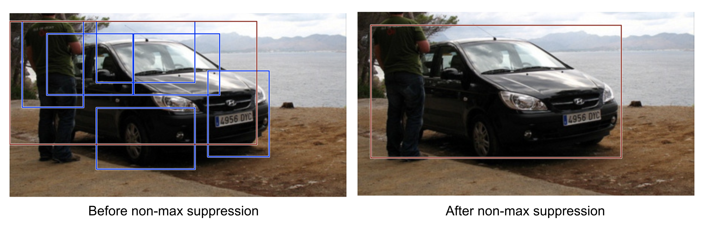
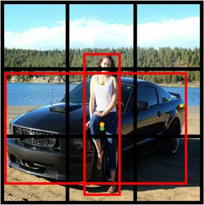

# DL computer vision I: Theory 

In this knowledge module, you will find a list of online resources to help you to get familiar with some of the foundational theories underlying deep learning-based object detection algorithms. 

After this module, you will be able to:

- [ ] Explain the differences between specific object detection and generic object detection
- [ ] Describe the general architecture of a CNN-based object detection model
- [ ] Explain the process of multitask learning, and describe its advantages/limitations, in the context of object detection
- [ ] Explain the concepts of sliding windows, Region Proposal (Network), Intersection over Union (IoU), Non-Maximum Suppression (NMS), and anchor boxes

## 1. Object detection: Specific vs. Generic

Object detection is a challenging task, as it requires the model to simultaneously perform object localization and classification. For input the model receives an image, and for output it returns a list of bounding boxes (i.e., x, y, width, height), each with a class label, from a fixed set of categories. There are two types of object detection; the detection of specific instances, and the detection of broad categories (A.K.A. generic object detection). The first type aims to detect a specific object instance, such as my cat Mr. Gijsbrecht, while the second type aims to detect a broad category, such as cats in general. 

*Figure 1. Classification and localization as multitask learning.*

Brainteaser 1a: Which type of object detection is more challenging?  
Brainteaser 1b: Considering our use-case, which type of object detection is more useful?

***

## 2. Architecture 

In general, an object detection model consists of two parts; a backbone and a head. The backbone is a pre-trained classification model, such as [VGG](https://paperswithcode.com/method/vgg) or [ResNet](https://paperswithcode.com/method/resnet), which extracts features from the input image. The head is a custom, multitask learning model, which predicts the bounding box coordinates and class labels. Recent architectures often include a neck, consisting of additional layers between the backbone and the head. These aim to improve the model's performance by concatenating features from the different layers. 

*Figure 2. Object detection architecture.*

Brainteaser 2: What could be a benefit of using a pre-trained model, such as VGG16, as a backbone for detection model?

For more information on the architectures of image classification models, - i.e., the backbone of object detection, see the blog post [An Introduction to Convolutional Neural Network Architecture](https://programmathically.com/deep-learning-architectures-for-image-classification-lenet-vs-alexnet-vs-vgg/) by Sebastian Kirsch. 

Need a recap on the architecture of CNNs? Check out the following blog posts by Sebastian Kirsch:

- [What is a Convolution: Introducing the Convolution Operation Step by Step](https://programmathically.com/what-is-a-convolution-introducing-the-convolution-operation-step-by-step/)
- [Understanding Convolutional Filters and Convolutional Kernels](https://programmathically.com/understanding-convolutional-filters-and-convolutional-kernels/)
- [Understanding Padding and Stride in Convolutional Neural Networks](https://programmathically.com/understanding-padding-and-stride-in-convolutional-neural-networks/)
- [What is Pooling in a Convolutional Neural Network (CNN): Pooling Layers Explained](https://programmathically.com/what-is-pooling-in-a-convolutional-neural-network-cnn-pooling-layers-explained/)

### 2.1 'Simplest' approach: 'Localization as regression'

The simplest way to perform object localization and classification are by using a CNN as a backbone (e.g., [AlexNet](https://paperswithcode.com/method/alexnet)) and using some fully connected layers as a head to predict the bounding box coordinates, and the class labels. 

*Figure 3. Classification and localization as multitask learning.*

The classification part of the head determines 'what' is in the image, while the localization/regression part of the head determines 'where' the object is in the picture. The corresponding loss functions, for example, [softmax](https://deepai.org/machine-learning-glossary-and-terms/softmax-layer) loss for classification and [L2](https://stephenallwright.com/l2-loss-function/) loss for localization/regression, are combined into a single loss function by calculating the weighted sum of the two loss functions. We want to have one single loss function or multitask loss because it enables us to train the model using gradient descent. 

Brainteaser 3a: Why would you want to use weighted sum instead of a regular sum for the multitask loss?  
Brainteaser 3b: What are other benefits of multitask learning? Hint: It is related time spend on training the model, and the concept of regularization. 

For a detailed explanation of multitask learning in the context of object detection, see the video below:

<iframe width="896" height="504" src="https://www.youtube-nocookie.com/embed/Tjtzml4PQWE" title="YouTube video player" frameborder="0" allow="accelerometer; autoplay; clipboard-write; encrypted-media; gyroscope; picture-in-picture" allowfullscreen></iframe>

*Video 1. CS 152 NN—16: Multi task Learning.*

#### 2.1.1 Intersection over Union (IoU)

Okay, but how do we know if our bounding box predictions are correct? To evaluate the accuracy of the bounding box predictions, we use the cost function MSE (commonly used for L2 loss), but we can also apply a technique called [Intersection over Union (IoU)](https://www.pyimagesearch.com/2016/11/07/intersection-over-union-iou-for-object-detection/). 

*Figure 4. Intersection over Union (IoU).*

The IoU is the ratio between the area of overlap between the predicted bounding box and the ground truth bounding box, and the area of union between the two bounding boxes. 

<iframe width="896" height="504" src="https://www.youtube-nocookie.com/embed/ANIzQ5G-XPE" title="YouTube video player" frameborder="0" allow="accelerometer; autoplay; clipboard-write; encrypted-media; gyroscope; picture-in-picture" allowfullscreen></iframe>

*Video 2. C4W3L06 Intersection Over Union.*

Different benchmark datasets use different thresholds for the IoU to determine whether a prediction is correct or not. For example, the [PASCAL VOC](http://host.robots.ox.ac.uk/pascal/VOC/) dataset uses a threshold of 0.5, while the [COCO](https://cocodataset.org/#home) dataset uses a threshold of 0.5:0.95. Important to remember is that the IoU is only used to evaluate the accuracy of the bounding box predictions, and not the accuracy of the class predictions. In addition, IoU is not a loss function, but a metric to evaluate the performance of the model!

Brainteaser 4: What is the effect of using a lower/higher IoU threshold on the performance metrics precision and recall? Hint: Think about the number of false positives (FPs) and false negatives (FNs).

### 2.2 Naive approach: Sliding windows

Unfortunately, in many cases, we do not precisely know how many objects an image or video frame will contain. For example, when we want to count the number of vehicles crossing a specific road section, we cannot accurately predict how many of them will be in a particular video frame. For example, the vehicle's speed (partially) determines the number of objects in one frame; a car moving at 80 km/h will be in more frames than a vehicle moving at 120 km/h. 

*Figure 5. Counting vehicles in on the road.*

Brainteaser 5a: Could you provide an example of a computer vision task where you know exactly how many objects the images or video frames will contain?  
Brainteaser 5b: What makes this approach 'naive'?

We do not know precisely how many consumer goods will be in our images. As a result, our model does not know when the task is complete and can stop generating predictions. By deploying a sliding window, a rectangular box with a fixed height and width, we can provide the model with a clear completion criterion. After the sliding window is moved across the image, a classifier is deployed for each region to determine if it contains an object belonging to one of the predefined classes.   

*Figure 6. Sliding windows.*

Brainteaser 6: What is the benefit/drawback of having a small stride (i.e., the size of the step between windows) value for your sliding window?

#### 2.2.1 Non-Maximum Suppression (NMS)

The sliding window approach is very computationally expensive, especially when your stride value is small and/or the size of the window is small, because the model will output a large number of bounding boxes. In addition, many of the bounding boxes will be overlapping, which makes it difficult to determine which bounding box is the correct one. To solve this problem, we use an algorithm called [Non-Maximum Suppression (NMS)](https://www.pyimagesearch.com/2014/11/17/non-maximum-suppression-object-detection-python/).

*Figure 7. Non-Maximum Suppression.*

To implement NMS you need to follow the following procedure:

> 1. Select the bounding box 'a' with the highest confidence score.   2. Compare the proposal 'a' with the highest confidence with every other proposal by calculating the intersection over union.   3. If the overlap between 'a' and the other proposal is higher than a chosen threshold, remove the other proposal.   4. Next, you choose the box with the highest confidence score out of the remaining boxes and repeat the process until no more boxes are left ([Source](https://programmathically.com/foundations-of-deep-learning-for-object-detection-from-sliding-windows-to-anchor-boxes/)).

Still unclear? Watch the video below:

<iframe width="896" height="504" src="https://www.youtube-nocookie.com/embed/VAo84c1hQX8" title="YouTube video player" frameborder="0" allow="accelerometer; autoplay; clipboard-write; encrypted-media; gyroscope; picture-in-picture" allowfullscreen></iframe>

*Video 3. C4W3L07 Nonmax Suppression.*

#### 2.2.2 Anchor boxes
 
What are anchor boxes?

*Figure 8. Two anchor boxes.*

> The term anchor boxes refers to a predefined collection of boxes with widths and heights chosen to match the widths and heights of objects in a dataset. The proposed anchor boxes encompass the possible combination of object sizes that could be found in a dataset. This should naturally include varying aspect ratios and scales present in the data. It is typical to select between 4-10 anchor boxes to use as proposals over various locations in the image ([Source](https://www.wovenware.com/blog/2020/06/anchor-boxes-in-object-detection-when-where-and-how-to-propose-them-for-deep-learning-apps/)).

... and why should we use them?

The sliding windows approach only allows for one object per window. However, in many cases, we want to detect multiple objects in a single window. For example, when we want to detect our consumer goods in an image, we want to detect all the objects present in a single window. To solve this problem, we can use anchor boxes:

<iframe width="896" height="504" src="https://www.youtube-nocookie.com/embed/RTlwl2bv0Tg" title="YouTube video player" frameborder="0" allow="accelerometer; autoplay; clipboard-write; encrypted-media; gyroscope; picture-in-picture" allowfullscreen></iframe>

*Video 4. C4W3L08 Anchor Boxes.*

For more information regarding anchor boxes, see the article [Anchor Boxes for Object Detection](https://www.mathworks.com/help/vision/ug/anchor-boxes-for-object-detection.html).

Brainteaser 7: To detect many small objects in an image, would it be better to use a small number of anchor boxes or a large number of anchor boxes?

### 2.3 Two-stage approach: R-CNN

A better way to perform object detection is to use a two-stage approach. In this approach, we first use a region proposal algorithm to generate a set of candidate bounding boxes (number of potential regions: 1-infinity, 'sparse' detector). Then, we extract features from each of the candidate bounding boxes. Lastly, we refine the bounding box coordinates, and use a classifier to determine if the candidate bounding box contains an object belonging to one of the predefined classes. 

Advantages/Disadvantages of the two-stage approach:

(+) High performance  
(+) Easily extendable to instance-based tasks (e.g., semantic segmentation; [Mask R-CNN](https://arxiv.org/abs/1703.06870))  
(-) Slow (particularly, the first two generations; R-CNN and Fast R-CNN)

#### 2.3.1 Region proposals

So how do we generate a set of candidate bounding boxes? We can use a region proposal algorithm, such as Selective Search or a Region Proposal Network (RPN). The RPN is a neural network that generates a set of candidate bounding boxes. It is trained to maximize the probability of generating a bounding box that contains an object belonging to one of the predefined classes.

<iframe width="896" height="504" src="https://www.youtube-nocookie.com/embed/6ykvU9WuIws" title="YouTube video player" frameborder="0" allow="accelerometer; autoplay; clipboard-write; encrypted-media; gyroscope; picture-in-picture" allowfullscreen></iframe>

*Video 5. C4W3L07 Region Proposals.*

#### 2.3.2 Family of R-CNN models

There are three main variants of Region-based Convolutional Neural Network (R-CNN), each attempting to improve (a part of) the processes described above:

- [R-CNN](https://arxiv.org/abs/1311.2524)

> The R-CNN detector first generates region proposals using an algorithm such as Edge Boxes. The proposal regions are cropped out of the image and resized. Then, the CNN classifies the cropped and resized regions. Finally, the region proposal bounding boxes are refined by a support vector machine (SVM) that is trained using CNN features ([Source](https://www.mathworks.com/help/vision/ug/getting-started-with-r-cnn-fast-r-cnn-and-faster-r-cnn.html)).

*Figure 9. The architecture of R-CNN.*

Model workflow:

> <ul> 1. Pre-train a CNN network on image classification tasks; for example, VGG or ResNet trained on ImageNet dataset. The classification task involves N classes.   2. Propose category-independent regions of interest by Selective Search (~2k candidates per image). Those regions may contain target objects and they are of different sizes.   3. Region candidates are warped to have a fixed size as required by CNN.   4. Continue fine-tuning the CNN on warped proposal regions for K + 1 classes; The additional one class refers to the background (no object of interest). In the fine-tuning stage, we should use a much smaller learning rate and the mini-batch oversamples the positive cases because most proposed regions are just background.   5. Given every image region, one forward propagation through the CNN generates a feature vector. This feature vector is then consumed by a binary SVM trained for each class independently. The positive samples are proposed regions with IoU (Intersection over Union) overlap threshold >= 0.3, and negative samples are irrelevant others.   6. To reduce the localization errors, a regression model is trained to correct the predicted detection window on bounding box correction offset using CNN features. </ul>  
([Source](https://lilianweng.github.io/posts/2017-12-31-object-recognition-part-3/))

You might have noticed from the above workflow that the R-CNN model is very computationally expensive. This is because the model needs to propose 2000 candidate regions for every image, and subsequently has to generate a CNN feature vector for each of these regions. In addition, the model is comprised by three separate models: a CNN for image classification and feature extraction, a Support Vector Machine (SVM) model for classifying the objects, and a bounding box regression model for localizing the objects. 

- [Fast R-CNN](https://arxiv.org/abs/1504.08083)

> <ul> As in the R-CNN detector, the Fast R-CNN detector also uses an algorithm like Edge Boxes to generate region proposals. Unlike the R-CNN detector, which crops and resizes region proposals, the Fast R-CNN detector processes the entire image. Whereas an R-CNN detector must classify each region, Fast R-CNN pools CNN features corresponding to each region proposal. Fast R-CNN is more efficient than R-CNN, because in the Fast R-CNN detector, the computations for overlapping regions are shared. </ul>  
([Source](https://www.mathworks.com/help/vision/ug/getting-started-with-r-cnn-fast-r-cnn-and-faster-r-cnn.html))

*Figure 10. The architecture of Fast R-CNN.*

Model workflow:

> <ul> 1. First, pre-train a convolutional neural network on image classification tasks.   2. Propose regions by selective search (~2k candidates per image).   3. Alter the pre-trained CNN: <li> Replace the last max pooling layer of the pre-trained CNN with a RoI pooling layer. The RoI pooling layer outputs fixed-length feature vectors of region proposals. Sharing the CNN computation makes a lot of sense, as many region proposals of the same images are highly overlapped. <li> Replace the last fully connected layer and the last softmax layer (K classes) with a fully connected layer and softmax over K + 1 classes.   4. Finally the model branches into two output layers: A softmax estimator of K + 1 classes (same as in R-CNN, +1 is the "background" class), outputting a discrete probability distribution per RoI. A bounding-box regression model which predicts offsets relative to the original RoI for each of K classes. </ul> 
([Source](https://lilianweng.github.io/posts/2017-12-31-object-recognition-part-3/))

This new implementation, Fast R-CNN, is definitely faster than the R-CNN model. However, the improvement is not as significant as we would have hoped. This is because the region proposals are still generated by a separate model, which increases the computational cost. 

- [Faster R-CNN](https://arxiv.org/abs/1506.01497)

> <ul> The Faster R-CNN detector adds a region proposal network (RPN) to generate region proposals directly in the network instead of using an external algorithm like Edge Boxes. The RPN uses Anchor Boxes for Object Detection. Generating region proposals in the network is faster and better tuned to your data. </ul> 
([Source](https://www.mathworks.com/help/vision/ug/getting-started-with-r-cnn-fast-r-cnn-and-faster-r-cnn.html))

*Figure 11. The architecture of Faster R-CNN.*

Model workflow:

> <ul> 1. Pre-train a CNN network on image classification tasks.   2. Fine-tune the RPN (Region Proposal Network) end-to-end for the region proposal task, which is initialized by the pre-train image classifier. Positive samples have IoU (Intersection over Union) > 0.7, while negative samples have IoU < 0.3. <li> Slide a small N x N spatial window over the conv feature map of the entire image. <li> At the center of each sliding window, we predict multiple regions of various scales and ratios simultaneously. An anchor is a combinatin of (sliding window center, scale, ratio). For example, 3 scales + 3 ratios => k=9 anchors at each sliding position.   3. Train a Fast R-CNN object detection model using the proposals generated by the current RPN   4. Then use the Fast R-CNN network to initialize RPN training. While keeping the shared convolutional layers, only fine-tune the RPN-specific layers. At this stage, RPN and the detection network have shared convolutional layers!    5. Finally fine-tune the unique layers of Fast R-CNN.   6. Step 4-5 can be repeated to train RPN and Fast R-CNN alternatively if needed. </ul>  
([Source](https://lilianweng.github.io/posts/2017-12-31-object-recognition-part-3/))

Faster R-CNN is significantly faster than the previous models because it generates the region proposals directly in the network.

For more information regarding the R-CNN family, check out the following resources:

- [Object Detection for Dummies Part 3: R-CNN Family](https://lilianweng.github.io/posts/2017-12-31-object-recognition-part-3/) 
- [Region-CNN (RCNN) Object Detection](https://pantelis.github.io/artificial-intelligence/aiml-common/lectures/scene-understanding/object-detection/rcnn-object-detection/index.html)
- [Fast and Faster RCNN Object Detection](https://pantelis.github.io/artificial-intelligence/aiml-common/lectures/scene-understanding/object-detection/faster-rcnn-object-detection/index.html)

### 2.4 One-stage approach: YOLO

But why use a two stage approach when we can use more an more efficient one stage approach? The You Only Look Once (YOLO) family of object detection models skips the second stage, and runs detection directly over a 'dense' sampling of possible locations.

*Figure 12. Overview of the YOLOv1 algorithm.*

Advantages/Disadvantages of the one-stage approach:

(+) Faster, especially regarding inference, compared to the two-stage approaches  
(-) Struggles to detect small objects, especially when they are spatially flocked together, due to the low resolution of feature maps, compared to the two-stage approaches  
(-) Less accurate compared to the two-stage approaches  

<iframe width="896" height="504" src="https://www.youtube-nocookie.com/embed/9s_FpMpdYW8" title="YouTube video player" frameborder="0" allow="accelerometer; autoplay; clipboard-write; encrypted-media; gyroscope; picture-in-picture" allowfullscreen></iframe>

*Video 6. C4W3L08 YOLO algorithm.*

Model workflow (i.e., YOLOv1):

> <ul> 1. Pre-train a CNN network on image classification task.   2. Split an image into S x S cells. If an object’s center falls into a cell, that cell is "responsible" for detecting the existence of that object. Each cell predicts (a) the location of B bounding boxes, (b) a confidence score, and (c) a probability of object class conditioned on the existence of an object in the bounding box. <li> The coordinates of bounding box are defined by a tuple of 4 values, (center x-coord, center y-coord, width, height) — (x, y, w, h), where x and y are set to be offset of a cell location. Moreover, x, y, w and h are normalized by the image width and height, and thus all between [0, 1]. <li> A confidence score indicates the likelihood that the cell contains an object: Pr(containing an object) x IoU(pred, truth); where Pr = probability and IoU = Intersection over Union. <li> If the cell contains an object, it predicts a probability of this object belonging to every class Ci,i = 1,...,K: Pr(The object belongs to the class C_i | containing an object). At this stage, the model only predicts one set of class probabilities per cell, regardless of the number of bounding boxes, B. <li>> In total, one image contains S x S x B bounding boxes, each box corresponding to 4 location predictions, 1 confidence score, and K conditional probabilities for object classification. The total prediction values for one image is S x S x (5B + K), which is the tensor shape of the final convolutional layer of the model.   3. The final layer of the pre-trained CNN is modified to output a prediction tensor of size. </ul>  
([Source](https://lilianweng.github.io/posts/2018-12-27-object-recognition-part-4/))

#### 2.4.1 Family of YOLO models

There are many variants of the YOLO algorithm. Each of them have a slightly different architecture. Some notable ones are:

- [YOLOv1](https://arxiv.org/abs/1506.02640)
- [YOLOv3](https://arxiv.org/abs/1804.02767)
- [YOLOv5](https://docs.ultralytics.com/)
- [PP-YOLO](https://arxiv.org/abs/2007.12099)

Brainteaser 8a: Does YOLO actually look only 'once'?  
Brainteaser 8b: Can you think of a computer vision task where YOLO would be a better fit than R-CNN?

For more information regarding the YOLO family, see [Object Detection Part 4: Fast Detection Models](https://lilianweng.github.io/posts/2018-12-27-object-recognition-part-4/), and [Your Comprehensive Guide to the YOLO Family of Models](https://blog.roboflow.com/guide-to-yolo-models/). 

Alert: In DataLab (Week 3), we will discuss some of the theory behind the deep learning based object detection algorithms.

***

## 3. Recommended resources

Do you want a more in-depth explanation of the topics discussed in this GitHub page? Check out the following resources:

- [Deep Learning Architectures for Object Detection: Yolo vs. SSD vs. RCNN](https://programmathically.com/deep-learning-architectures-for-object-detection-yolo-vs-ssd-vs-rcnn/)
- [Deep Learning for Generic Object Detection: A Survey](https://link.springer.com/content/pdf/10.1007/s11263-019-01247-4.pdf)

***