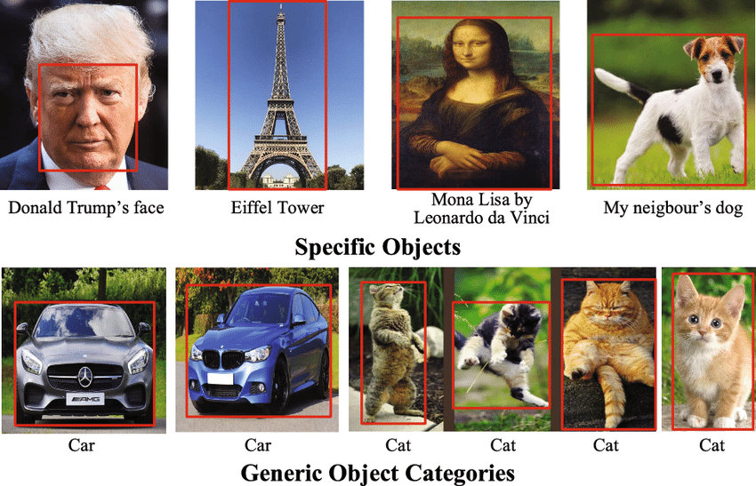
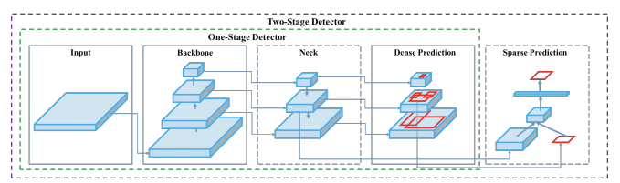
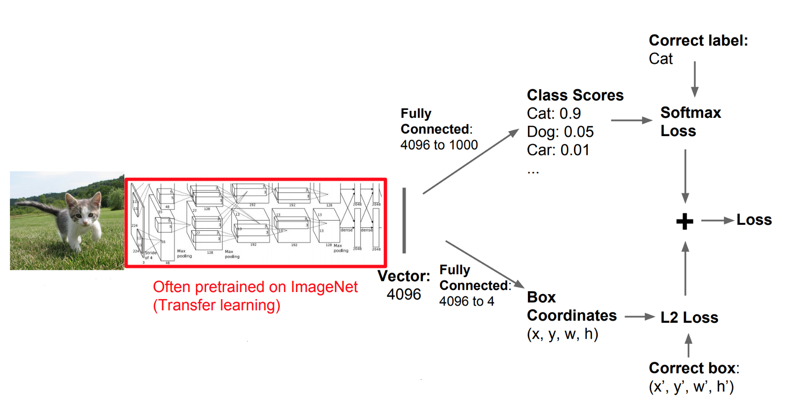
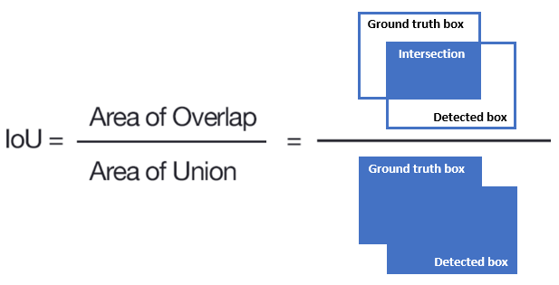
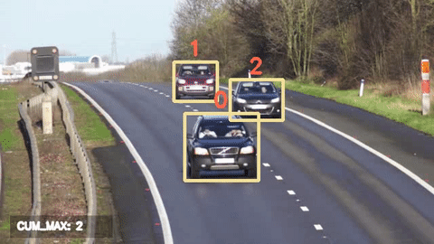
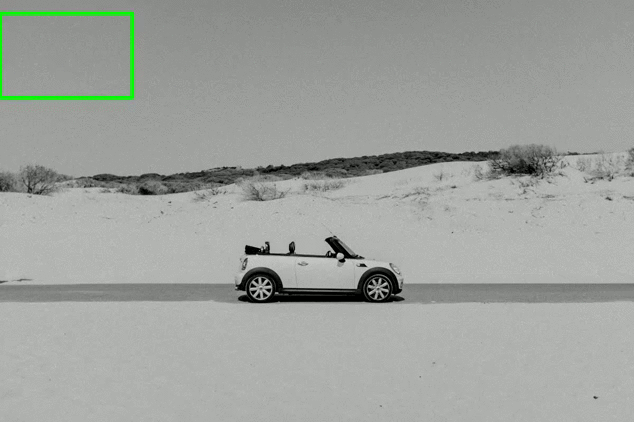
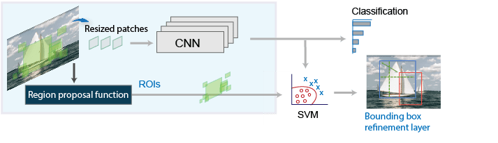
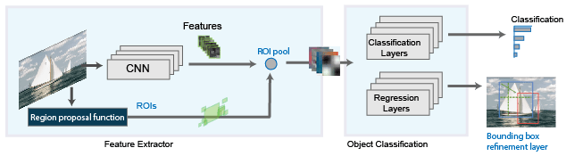
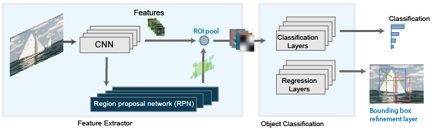
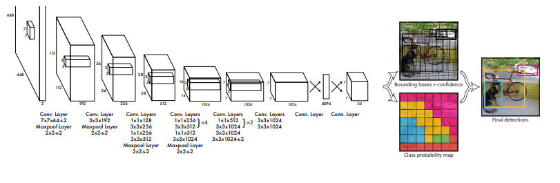

# DL computer vision I: Theory 

In this knowledge module, you will find a list of online resources to help you to get familiar with some of the foundational theories underlying deep learning-based object detection algorithms. 

After this module, you will be able to:

- [ ] Explain the differences between specific object detection and generic object detection
- [ ] Describe the general architecture of a CNN-based object detection model
- [ ] Explain the process of multitask learning, and describe its advantages/limitations, in the context of object detection
- [ ] Explain the concepts of sliding windows, Region Proposal (Network), Intersection over Union (IoU), Non-Maximum Suppression (NMS), and anchor boxes
- [ ] Define the performance metric Mean Absolute Precision (mAP) metric, and explain its use in object detection

## 1. Object detection: Specific vs. Generic

Object detection is a challenging task, as it requires the model to simultaneously perform object localization and classification. For input the model receives an image, and for output it returns a list of bounding boxes (i.e., x, y, width, height), each with a class label, from a fixed set of categories. There are two types of object detection; the detection of specific instances, and the detection of broad categories (A.K.A. generic object detection). The first type aims to detect a specific object instance, such as my cat Mr. Gijsbrecht, while the second type aims to detect a broad category, such as cats in general. 

*Figure 1. Classification and localization as multitask learning.*

Brainteaser 1a: Which type of object detection is more challenging?  
Brainteaser 1b: Considering our use-case, which type of object detection is more useful?

***

## 2. Architecture 

In general, an object detection model consists of two parts; a backbone and a head. The backbone is a pre-trained classification model, such as [VGG](https://paperswithcode.com/method/vgg) or [ResNet](https://paperswithcode.com/method/resnet), which extracts features from the input image. The head is a custom, multitask learning model, which predicts the bounding box coordinates and class labels. Recent architectures often include a neck, consisting of additional layers between the backbone and the head. These aim to improve the model's performance by concatenating features from the different layers. 

*Figure 2. Object detection architecture.*

Brainteaser 2: What could be a benefit of using a pre-trained model, such as VGG16, as a backbone for detection model?

For more information on the architecture of images classification model, - i.e., the backbone of object detection, see the blog post [An Introduction to Convolutional Neural Network Architecture](https://programmathically.com/deep-learning-architectures-for-image-classification-lenet-vs-alexnet-vs-vgg/) by Sebastian Kirsch. 

Need a recap on the architecture of CNNs? Check out the following blog posts by Sebastian Kirsch:

- [What is a Convolution: Introducing the Convolution Operation Step by Step](https://programmathically.com/what-is-a-convolution-introducing-the-convolution-operation-step-by-step/)
- [Understanding Convolutional Filters and Convolutional Kernels](https://programmathically.com/understanding-convolutional-filters-and-convolutional-kernels/)
- [Understanding Padding and Stride in Convolutional Neural Networks](https://programmathically.com/understanding-padding-and-stride-in-convolutional-neural-networks/)
- [What is Pooling in a Convolutional Neural Network (CNN): Pooling Layers Explained](https://programmathically.com/what-is-pooling-in-a-convolutional-neural-network-cnn-pooling-layers-explained/)

### 2.1 'Simplest' approach: 'Localization as regression'

The simplest way to perform object localization and classification are by using a CNN as a backbone (e.g., [AlexNet](https://paperswithcode.com/method/alexnet)) and using some fully connected layers as a head to predict the bounding box coordinates, and the class labels. 

*Figure 3. Classification and localization as multitask learning.*

The classification part of the head determines 'what' is in the image, while the localization/regression part of the head determines 'where' the object is in the picture. The corresponding loss functions, for example, [softmax](https://deepai.org/machine-learning-glossary-and-terms/softmax-layer) loss for classification and [L2](https://stephenallwright.com/l2-loss-function/) loss for localization/regression, are combined into a single loss function by calculating the weighted sum of the two loss functions. We want to have one single loss function or multitask loss because it enables us to train the model using gradient descent. 

Brainteaser 3a: Why would you want to use weighted sum instead of a regular sum for the multitask loss?  
Brainteaser 3b: What are other benefits of multitask learning? Hint: It is related time spend on training the model, and the concept of regularization. 

For a detailed explanation of multitask learning in the context of object detection, see the video below:

<iframe width="896" height="504" src="https://www.youtube-nocookie.com/embed/Tjtzml4PQWE" title="YouTube video player" frameborder="0" allow="accelerometer; autoplay; clipboard-write; encrypted-media; gyroscope; picture-in-picture" allowfullscreen></iframe>

*Video 1. CS 152 NN—16: Multi task Learning.*

#### 2.2.1 Intersection over Union (IoU)

Okay, but how do we know if our bounding box predictions are correct? To evaluate the accuracy of the bounding box predictions, we use the cost function MSE (commonly used for L2 loss), but we can also apply a technique called [Intersection over Union (IoU)](https://www.pyimagesearch.com/2016/11/07/intersection-over-union-iou-for-object-detection/). 

*Figure 4. Intersection over Union (IoU).*

The IoU is the ratio between the area of overlap between the predicted bounding box and the ground truth bounding box, and the area of union between the two bounding boxes. 

<iframe width="896" height="504" src="https://www.youtube-nocookie.com/embed/ANIzQ5G-XPE" title="YouTube video player" frameborder="0" allow="accelerometer; autoplay; clipboard-write; encrypted-media; gyroscope; picture-in-picture" allowfullscreen></iframe>

*Video 2. C4W3L06 Intersection Over Union.*

Different benchmark datasets use different thresholds for the IoU to determine whether a prediction is correct or not. For example, the [PASCAL VOC](http://host.robots.ox.ac.uk/pascal/VOC/) dataset uses a threshold of 0.5, while the [COCO](https://cocodataset.org/#home) dataset uses a threshold of 0.5:0.95. Important to remember is that the IoU is only used to evaluate the accuracy of the bounding box predictions, and not the accuracy of the class predictions. In addition, IoU is not a loss function, but a metric to evaluate the performance of the model!

Brainteaser 4: What is the effect of using a lower/higher IoU threshold on the performance metrics precision and recall? Hint: Think about the number of false positives (FPs) and false negatives (FNs).

### 2.2 Naive approach: Sliding windows

Unfortunately, in many cases, we do not precisely know how many objects an image or video frame will contain. For example, when we want to count the number of vehicles crossing a specific road section, we cannot accurately predict how many of them will be in a particular video frame. For example, the vehicle's speed (partially) determines the number of objects in one frame; a car moving at 80 km/h will be in fewer frames than a vehicle moving at 120 km/h. 

*Figure 5. Counting vehicles in on the road.*

Brainteaser 5a: Could you provide an example of a computer vision task where you know exactly how many objects the images or video frames will contain?  
Brainteaser 5b: What makes this approach 'naive'?

We do not know precisely how many consumer goods will be in our images. As a result, our model does not know when the task is complete and can stop generating predictions. By deploying a sliding window, a rectangular box with a fixed height and width, we can provide the model with a clear completion criterion. After the sliding window is moved across the image, a classifier is deployed for each region to determine if it contains an object belonging to one of the predefined classes.   

*Figure 6. Sliding windows.*

Brainteaser 6: What is the benefit/drawback of having a small stride (i.e., the size of the step between windows) value for your sliding window?

#### 2.2.1 Non-Maximum Suppression (NMS)

The sliding window approach is very computationally expensive, especially when your stride value is small and/or the size of the window is small, because the model will output a large number of bounding boxes. In addition, many of the bounding boxes will be overlapping, which makes it difficult to determine which bounding box is the correct one. To solve this problem, we use an algorithm called [Non-Maximum Suppression (NMS)](https://www.pyimagesearch.com/2014/11/17/non-maximum-suppression-object-detection-python/).

To implement NMS you need to follow the following procedure:

> Sort all the bounding boxes by confidence score. Discard boxes with low confidence scores. While there is any remaining bounding box, repeat the following: Greedily select the one with the highest score. Skip the remaining boxes with high IoU (i.e. > 0.5) with previously selected one ([Source](https://lilianweng.github.io/posts/2017-12-31-object-recognition-part-3/)).

Still unclear? Watch the video below:

<iframe width="896" height="504" src="https://www.youtube-nocookie.com/embed/VAo84c1hQX8" title="YouTube video player" frameborder="0" allow="accelerometer; autoplay; clipboard-write; encrypted-media; gyroscope; picture-in-picture" allowfullscreen></iframe>

*Video 3. C4W3L07 Nonmax Suppression.*

### 2.3 Two-stage approach: R-CNN

A better way to perform object detection is to use a two-stage approach. In this approach, we first use a region proposal algorithm to generate a set of candidate bounding boxes (number of potential regions: 1-infinity, 'sparse' detector). Then, we extract features from each of the candidate bounding boxes. Lastly, we refine the bounding box coordinates, and use a classifier to determine if the candidate bounding box contains an object belonging to one of the predefined classes. 

#### 2.3.1 Region proposals

So how do we generate a set of candidate bounding boxes? We can use a region proposal algorithm, such as [Selective Search](https://paperswithcode.com/method/selective-search) or a region proposal network (RPN). The RPN is a neural network that generates a set of candidate bounding boxes. The RPN is trained to maximize the probability of generating a bounding box that contains an object belonging to one of the predefined classes.

<iframe width="896" height="504" src="https://www.youtube-nocookie.com/embed/6ykvU9WuIws" title="YouTube video player" frameborder="0" allow="accelerometer; autoplay; clipboard-write; encrypted-media; gyroscope; picture-in-picture" allowfullscreen></iframe>

*Video 4. C4W3L07 Region Proposals.*

#### 2.3.2 Family of R-CNN models

There are three main variants of Region-based Convolutional Neural Network (R-CNN), each attempting to improve (a part of) the processes described above:

- R-CNN

*Figure 7. The architecture of R-CNN.*

> The R-CNN detector first generates region proposals using an algorithm such as Edge Boxes. The proposal regions are cropped out of the image and resized. Then, the CNN classifies the cropped and resized regions. Finally, the region proposal bounding boxes are refined by a support vector machine (SVM) that is trained using CNN features ([Source](https://www.mathworks.com/help/vision/ug/getting-started-with-r-cnn-fast-r-cnn-and-faster-r-cnn.html)).

- Fast R-CNN

*Figure 8. The architecture of Fast R-CNN.*

> As in the R-CNN detector, the Fast R-CNN detector also uses an algorithm like Edge Boxes to generate region proposals. Unlike the R-CNN detector, which crops and resizes region proposals, the Fast R-CNN detector processes the entire image. Whereas an R-CNN detector must classify each region, Fast R-CNN pools CNN features corresponding to each region proposal. Fast R-CNN is more efficient than R-CNN, because in the Fast R-CNN detector, the computations for overlapping regions are shared ([Source](https://www.mathworks.com/help/vision/ug/getting-started-with-r-cnn-fast-r-cnn-and-faster-r-cnn.html)).

- Faster R-CNN

*Figure 9. The architecture of Faster R-CNN.*

> The Faster R-CNN detector adds a region proposal network (RPN) to generate region proposals directly in the network instead of using an external algorithm like Edge Boxes. The RPN uses Anchor Boxes for Object Detection. Generating region proposals in the network is faster and better tuned to your data ([Source](https://www.mathworks.com/help/vision/ug/getting-started-with-r-cnn-fast-r-cnn-and-faster-r-cnn.html)).

For more information regarding the R-CNN family, check out the following resources:

- [Object Detection for Dummies Part 3: R-CNN Family](https://lilianweng.github.io/posts/2017-12-31-object-recognition-part-3/) 
- [Region-CNN (RCNN) Object Detection](https://pantelis.github.io/artificial-intelligence/aiml-common/lectures/scene-understanding/object-detection/rcnn-object-detection/index.html)
- [Fast and Faster RCNN Object Detection](https://pantelis.github.io/artificial-intelligence/aiml-common/lectures/scene-understanding/object-detection/faster-rcnn-object-detection/index.html)

### 2.4 One-stage approach: YOLO

But why use a two stage approach when we can use more an more efficient one stage approach? The You Only Look Once (YOLO) family of object detection models skips the second stage, and runs detection directly over a 'dense' sampling of possible locations.

*Figure 10. Overview of the YOLO algorithm.*

This approach is relatively simple and fast, but it is less accurate than the detectors of the R-CNN family. Currently, it is the most popular approach for object detection.

<iframe width="896" height="504" src="https://www.youtube-nocookie.com/embed/9s_FpMpdYW8" title="YouTube video player" frameborder="0" allow="accelerometer; autoplay; clipboard-write; encrypted-media; gyroscope; picture-in-picture" allowfullscreen></iframe>

*Video 5. C4W3L08 YOLO algorithm.*

#### 2.4.1 Anchor boxes

<iframe width="896" height="504" src="https://www.youtube-nocookie.com/embed/RTlwl2bv0Tg" title="YouTube video player" frameborder="0" allow="accelerometer; autoplay; clipboard-write; encrypted-media; gyroscope; picture-in-picture" allowfullscreen></iframe>

*Video 6. C4W3L08 Anchor Boxes.*

For more information regarding anchor boxes, see the article [Anchor Boxes for Object Detection](https://www.mathworks.com/help/vision/ug/anchor-boxes-for-object-detection.html).

#### 2.4.2 Family of YOLO models

There are many variants of the YOLO algorithm. Each of them have a slightly different architecture. Some popular ones are:

- YOLOv1
- YOLOv3
- YOLOv5
- PP-YOLO

Brainteaser 7a: Does YOLO actually look only 'once'?  
Brainteaser 7b: Can you think of a computer vision task where YOLO would be a better fit than R-CNN?

For more information regarding the YOLO family, see [Object Detection Part 4: Fast Detection Models](https://lilianweng.github.io/posts/2018-12-27-object-recognition-part-4/).

Alert: In week 3, we will discuss some of the theory behind the deep learning based object detection algorithms in DataLab.

***

## 3. Recommended resources

Do you want a more in-depth explanation of the topics discussed in this GitHub page? Check out the following resources:

- [Foundations of Deep Learning for Object Detection: From Sliding Windows to Anchor Boxes](https://programmathically.com/foundations-of-deep-learning-for-object-detection-from-sliding-windows-to-anchor-boxes/)
- [Deep Learning Architectures for Object Detection: Yolo vs. SSD vs. RCNN](https://programmathically.com/deep-learning-architectures-for-object-detection-yolo-vs-ssd-vs-rcnn/)
- [Deep Learning for Generic Object Detection: A Survey](https://link.springer.com/content/pdf/10.1007/s11263-019-01247-4.pdf)

***