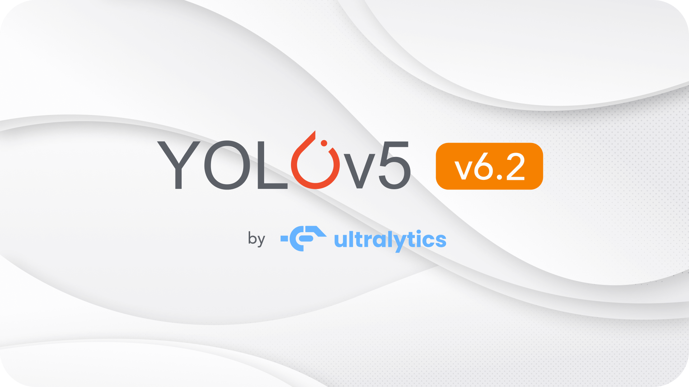
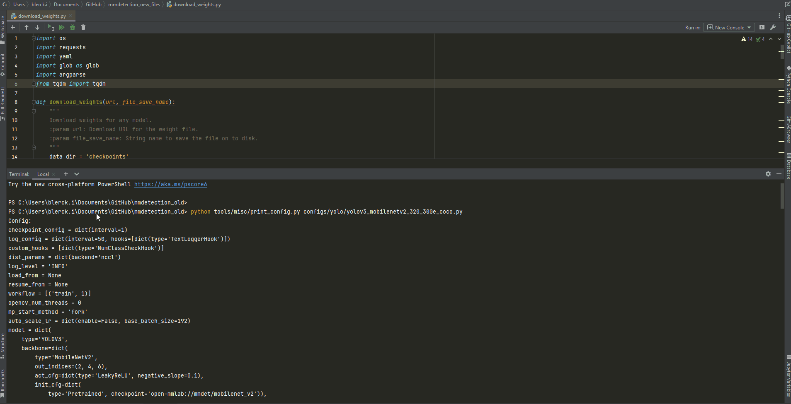
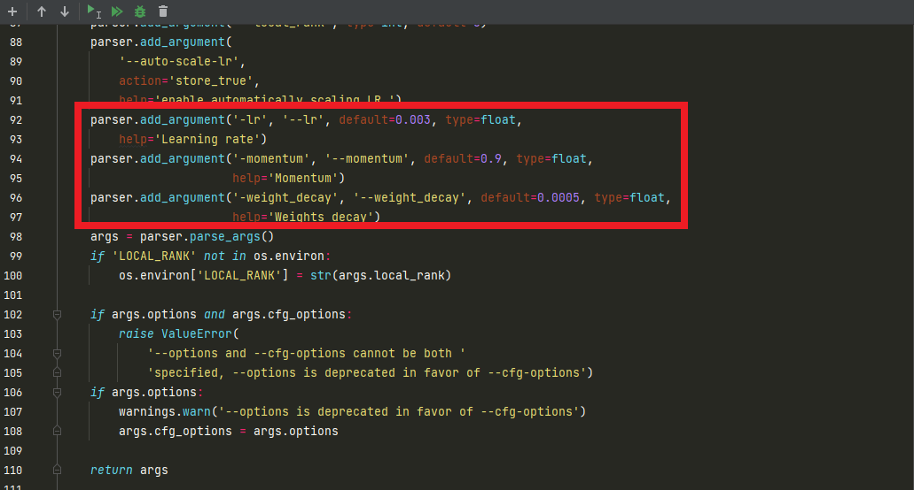
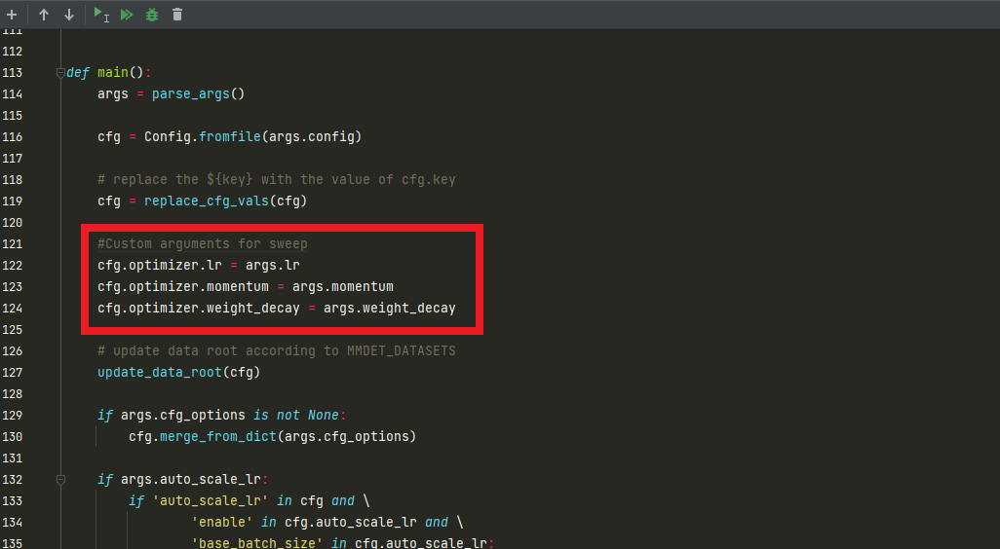
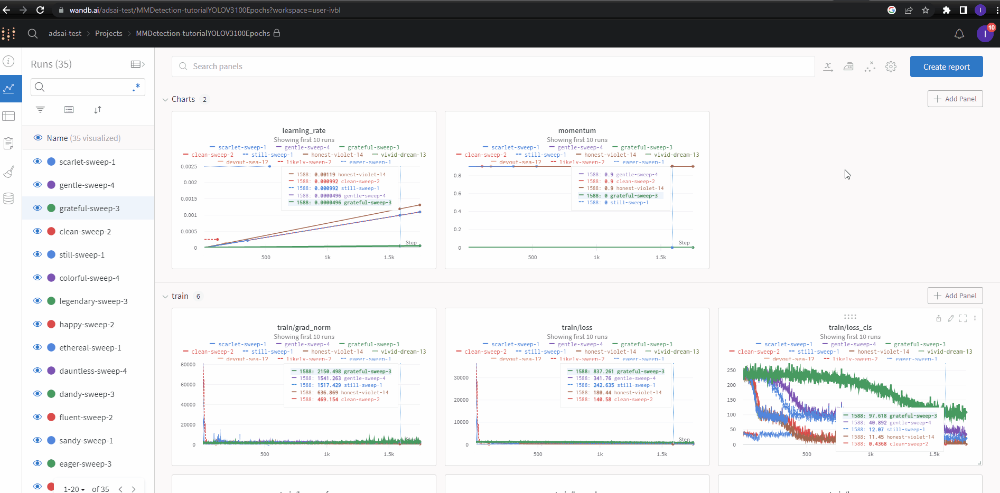

# DL computer vision II: Application

In this knowledge module, you will find a list of online resources to help you to build, (train), and evaluate a traditional and DL object detection model on the real-life image dataset ('difficult' object detection task).

After this module, you will be able to:

- [ ] Select the appropriate DL object detection algorithm/toolbox/etc. on GitHub to solve the computer vision task
- [ ] Successfully install and run the selected DL object detection algorithm/toolbox/etc. on your local device/Google Colab
- [ ] Use a MLOps tool to train and evaluate the DL object detection model (e.g., Weights and Biases)

***

## 1. Computer vision recognition projects on GitHub

Let us take a look at some popular computer vision projects on GitHub, which can be deployed to solve a object detection task:

- [MMDetection](https://github.com/open-mmlab/mmdetection)


> MMDetection is an open source object detection toolbox based on PyTorch. It is a part of the OpenMMLab project ([Source](https://github.com/open-mmlab/mmdetection)).

- [YOLOv5](https://github.com/ultralytics/yolov5)



> YOLOv5 🚀 is a family of object detection architectures and models pretrained on the COCO dataset, and represents Ultralytics open-source research into future vision AI methods, incorporating lessons learned and best practices evolved over thousands of hours of research and development ([Source](https://github.com/ultralytics/yolov5)).

- [Detectron2](https://github.com/facebookresearch/detectron2)


> Detectron2 is Facebook AI Research's next generation library that provides state-of-the-art detection and segmentation algorithms. It is the successor of Detectron and maskrcnn-benchmark. It supports a number of computer vision research projects and production applications in Facebook ([Source](https://github.com/facebookresearch/detectron2)).

... and there are many more interesting object detection projects on GitHub. 

First, we need to choose an open source GitHub project that can help us to locate and classify the objects in the bin. Good places to start are [Papers with Code](https://paperswithcode.com/methods/category/object-detection-models) and the blog [Open Source Computer Vision Object Detection Models](https://models.roboflow.com/) by Roboflow. After we have selected a project, we need to fork the GitHub repository. 

### 1.1 Fork a repository 

> Most commonly, forks are used to either propose changes to someone else's project to which you do not have write access, or to use someone else's project as a starting point for your own idea. You can fork a repository to create a copy of the repository and make changes without affecting the upstream repository ([Source](https://docs.github.com/en/get-started/quickstart/fork-a-repo)).

The blog [Fork a repo](https://docs.github.com/en/get-started/quickstart/fork-a-repo) by GitHub provides a nice tutorial in how to fork a repository. Rather watch a video, check out 
the YouTube video below:

<iframe width="896" height="504" src="https://www.youtube-nocookie.com/embed/XTolZqmZq6s" title="YouTube video player" frameborder="0" allow="accelerometer; autoplay; clipboard-write; encrypted-media; gyroscope; picture-in-picture" allowfullscreen></iframe>

*Video 1. How to Fork a GitHub Repository by Cameron McKenzie.*

Now we have forked our chosen repository, we can start with the installation procedure. 

***

### 1.2 Virtual environment

Each GitHub project has its own minimum hardware/software requirements, and installation process. So, before you create your virtual environment, carefully check the 'get started'/installation guide of the algorithm/toolkit you are interested in. For example: 

- [mmdetection](https://mmdetection.readthedocs.io/en/latest/get_started.html#installation)
- [detectron2](https://detectron2.readthedocs.io/en/latest/tutorials/install.html)
- [YOLOV5 by Ultralytics]()

For more information on how to create and virtual conda environment, see [Virtual environments & PyTorch](../../Study%20Content/MLOps/MLOpsVirtualEnvironments.html)

## 2. mmdetection

### 2.1 Installation

To start with the installation, we first need to clone their repository called [mmdetection](https://github.com/open-mmlab/mmdetection) on GitHub. Next, we need to find the toolbox's official documentation, which you can find, [here](https://mmdetection.readthedocs.io/en/latest/get_started.html). After we have opened the 'Get Started' guide, the prerequisites section tells us we need to create a virtual conda environment. For __Step 2__, please use this bash command to install PyTorch with cudatoolkit:

```
conda install pytorch torchvision torchaudio cudatoolkit=11.1 -c pytorch-lts -c conda-forge

```

<div style="padding: 15px; border: 1px solid transparent; border-color: transparent; margin-bottom: 20px; border-radius: 4px; color: #8a6d3b;; background-color: #fcf8e3; border-color: #faebcc;">
Note: You will need to install cudatoolkit with conda, otherwise you will be unable to use your GPU with PyTorch!
</div>

Then, install MMCV without MIM because otherwise, you might get an access error:

```
pip install mmcv-full=={mmcv_version} -f https://download.openmmlab.com/mmcv/dist/{cu_version}/{torch_version}/index.html
```

Lastly, install MMDetection from source: 

```
git clone https://github.com/open-mmlab/mmdetection.git

cd mmdetection

pip install -v -e .
```

Congratulations, you should have a working version of mmdetection installed on your local device :smile_cat:.

<div style="padding: 15px; border: 1px solid transparent; border-color: transparent; margin-bottom: 20px; border-radius: 4px; color: #8a6d3b;; background-color: #fcf8e3; border-color: #faebcc;">
Note: If you encounter this error: 'distutils.errors.DistutilsPlatformError: Microsoft Visual C++ 14.0 or greater is required. Get it with "Microsoft C++ Build Tools"', you can install <a href="https://visualstudio.microsoft.com/downloads/#build-tools-for-visual-studio-2019">Build Tools for Visual Studio 2022</a>, which will remove the error. 
</div>

### 2.2 Model selection 

First, we need to select a model that can be deployed to solve an object detection task. You can find all the different models in the 'configs' folder. mmdetection´s configuration files contain the parameters of the model (e.g., backbone, augmentation). More on this later.

__Directory tree mmdetection:__

``` 
mmdetection
├── checkpoints 
│   └──yolo
│       └── yolov3_d53_320_273e_coco
│          └── yolov3_d53_320_273e_coco-421362b6.pth
├── .circleci
├── .dev_scripts
├── .git
├── .github
├── .gitignore
├── .idea
├── .owners.yml
├── .pre-commit-config.yaml
├── .readthedocs.yml
├── CITATION.cff
├── configs
│   ├── albu_example
│   ├── atss
│   ├── autoassign
│   ├── carafe
│   ├── cascade_rcnn
│   ├── cascade_rpn
│   ├── centernet
│   ├── centripetalnet
│   ├── cityscapes
│   ├── common
│   ├── convnext
│   ├── cornernet
│   ├── dcn
│   ├── dcnv2
│   ├── ddod
│   ├── deepfashion
│   ├── deformable_detr
│   ├── detectors
│   ├── detr
│   ├── double_heads
│   ├── dyhead
│   ├── dynamic_rcnn
│   ├── efficientnet
│   ├── empirical_attention
│   ├── faster_rcnn
│   ├── fast_rcnn
│   ├── fcos
│   ├── foveabox
│   ├── fpg
│   ├── free_anchor
│   ├── fsaf
│   ├── gcnet
│   ├── gfl
│   ├── ghm
│   ├── gn
│   ├── gn+ws
│   ├── grid_rcnn
│   ├── groie
│   ├── guided_anchoring
│   ├── hrnet
│   ├── htc
│   ├── instaboost
│   ├── lad
│   ├── ld
│   ├── legacy_1.x
│   ├── libra_rcnn
│   ├── lvis
│   ├── mask2former
│   ├── maskformer
│   ├── mask_rcnn
│   ├── ms_rcnn
│   ├── nas_fcos
│   ├── nas_fpn
│   ├── openimages
│   ├── paa
│   ├── pafpn
│   ├── panoptic_fpn
│   ├── pascal_voc
│   ├── pisa
│   ├── point_rend
│   ├── pvt
│   ├── queryinst
│   ├── regnet
│   ├── reppoints
│   ├── res2net
│   ├── resnest
│   ├── resnet_strikes_back
│   ├── retinanet
│   ├── rpn
│   ├── sabl
│   ├── scnet
│   ├── scratch
│   ├── seesaw_loss
│   ├── selfsup_pretrain
│   ├── simple_copy_paste
│   ├── solo
│   ├── solov2
│   ├── sparse_rcnn
│   ├── ssd
│   ├── strong_baselines
│   ├── swin
│   ├── timm_example
│   ├── tood
│   ├── tridentnet
│   ├── vfnet
│   ├── wider_face
│   ├── yolact
│   ├── yolo
│   │	    └──yolov3_d53_320_273e_coco
│   │         └── yolov3_d53_320_273e_custom_config.py	
│   ├── yolof
│   ├── yolox
│   └── _base_
├── data
│   ├── annotations
│   │    ├── train_annotations.json
│   │    ├── valid_annotations.json
│   │    └── test_annotations.json  
│   └── images
│        ├── train
│        │    ├── image1.jpg
│        │    ├── image2.jpg
│        │    └── image3.jpg
|        ├── valid
|        └── test 
├── demo
├── docker
├── docs
├── LICENSE
├── MANIFEST.in
├── mmdet
├── model-index.yml
├── pytest.ini
├── README.md
├── README_zh-CN.md
├── requirements
├── requirements.txt
├── resources
├── setup.cfg
├── setup.py
├── tests
├── tools
|   ├── misc
|   |   └── print_config.py
|   └── test.py
├── custom_train.py
├── custom_test.py
├── download_weights.py
├── wandb
│   ├── run-20221003_161330-2apa7ggi
│   ├── run-20221003_161442-1b0xpmqc
│   └── sweep-0u5mpg0v
├── work_dirs
│   └── yolo
│   	└── yolov3_d53_320_273e_coco
│           ├── epoch_1.pth
│           ├── epoch_2.pth
│           ├── latest.pth
│           ├── 20221011_125253.log
│           ├── 20221011_125253.log.json
│           ├── best_bbox_mAP_epoch_2.pth
│           └── yolov3_d53_320_273e_custom_config.py
└── weights.txt
```

To get a better understanding of the configuration files, see [Tutorial 1: Learn about configs](https://mmdetection.readthedocs.io/en/latest/tutorials/config.html). 

You can inspect a particular config by running this command in your terminal:

```
python tools/misc/print_config.py configs/yolo/yolov3_mobilenetv2_320_300e_coco.py
```



*Figure 1. Output print_config.py.*

### 2.3 Pre-trained model & argsparse

Next step is to download the pre-trained model weights. You can also start with a model that has not been trained on a benchmark dataset, such as MS COCO. However, the pre-trained models perform already fairly well by itself, thus reducing the training time required to get a satisfactory performance on your custom image dataset. To download the weights, add the file called 'download_weights.py' to the directory (See directory tree of mmdetection), and run the file in your terminal. For example:

```
python download_weights.py --weights yolov3_d53_320_273e_coco
```

You can download the corresponding Pyhton file, [here](./code/mmdetection_weightsandbiases/download_weights.py). 

The downloaded weights have a '.pth' file extension (e.g., 'yolov3_d53_320_273e_coco-421362b6.pth'), and will be stored in in the 'checkpoint' folder (See directory tree of mmdetection). 

__Okay, how do I know which argument (e.g., '--weights') I should use?__ 

Instead of manually setting variables inside the code, the Python library argparse is used to parse the command line arguments and pass them to the script. In this case, the argument is the name of the model weights you want to download. When you add the '--help' argument to your command line statement, you will see a list of all the arguments available, and a short description of what they do. If you do not explicitly add an argument, the default value will be used. 

For more information on argparse, see [Python argparse](https://docs.python.org/3/library/argparse.html), and the two videos below:

<iframe width="896" height="504" src="https://www.youtube-nocookie.com/embed/FbEJN8FsJ9U" title="YouTube video player" frameborder="0" allow="accelerometer; autoplay; clipboard-write; encrypted-media; gyroscope; picture-in-picture" allowfullscreen></iframe>

*Video 1. Argparse Basics - How I run my scripts via the Command Line.*

<iframe width="896" height="504" src="https://www.youtube-nocookie.com/embed/0twL6MXCLdQ" title="YouTube video player" frameborder="0" allow="accelerometer; autoplay; clipboard-write; encrypted-media; gyroscope; picture-in-picture" allowfullscreen></iframe>

*Video 2. Argparse for CLI - Intermediate Python Programming p.3.*

It is time to check if we installed mmdetection correctly. To do this, we will run a demo script that will show us the results of the pre-trained model on a sample image. Please, following the instructions provided in the 'Demos' section of [1: Inference and train with existing models and standard datasets](https://mmdetection.readthedocs.io/en/latest/1_exist_data_model.html). Important note, use the pre-trained model weights that you downloaded in the previous step otherwise it will throw an error!

### 2.4 Configuration file

Before we start training, we need to create a custom configuration file. In this tutorial we will use the Weights & Biases, which is a great MLOps tool to track your experiments. However, you are free to use any other tool you like. Let us take a closer look at the configuration file. 

The configuration file is a Python file that contains all the parameters that are used to train the model. The configuration file can be roughly divided into four parts: the model, data pipeline, dataset, and logger. The model part contains all the parameters that are used to build the model, such as the backbone, the neck, the head, and the loss function. The data pipeline contains all the parameters that are used to train the model, such as the optimizer, the learning rate, the number of epochs. The dataset part contains all the parameters that are used to load the dataset, such as the path to the images, the path to the annotations, and the number of classes. The logger can be used to log the training process, such as the learning rate, the loss, and the accuracy in a MLOps tool. 

When you create a new configuration file, you can either start from scratch, or you can use an existing configuration file as a template. In this tutorial, we will use the '{model name}.py' configuration file as a template for our custom configuration file '{model name}_custom_config.py':
```
checkpoint_config = dict(interval=1)
log_config = dict(interval=1, hooks=[
    dict(type='TextLoggerHook'),
    dict(type='MMDetWandbHook',
         init_kwargs={'project': 'MMDetection-tutorialYOLOV3100Epochs'},
         interval=10,
         log_checkpoint=True,
         log_checkpoint_metadata=True,
         num_eval_images=40)]) # Weights & Biases logger (Custom)
dist_params = dict(backend='nccl')
log_level = 'INFO'
load_from = './checkpoints/yolov3_d53_320_273e_coco-421362b6.pth' # Default: None (Custom)
resume_from = None
workflow = [('train', 1)]
opencv_num_threads = 0
mp_start_method = 'fork'
auto_scale_lr = dict(enable=False, base_batch_size=192)
model = dict(
    type='YOLOV3',
    backbone=dict(
        type='MobileNetV2',
        out_indices=(2, 4, 6),
        act_cfg=dict(type='LeakyReLU', negative_slope=0.1),
        init_cfg=dict(
            type='Pretrained', checkpoint='open-mmlab://mmdet/mobilenet_v2')),
    neck=dict(
        type='YOLOV3Neck',
        num_scales=3,
        in_channels=[320, 96, 32],
        out_channels=[96, 96, 96]),
    bbox_head=dict(
        type='YOLOV3Head',
        num_classes=2, # Adjusted for 2 classes (Custom)
        in_channels=[96, 96, 96],
        out_channels=[96, 96, 96],
        anchor_generator=dict(
            type='YOLOAnchorGenerator',
            base_sizes=[[(220, 125), (128, 222), (264, 266)],
                        [(35, 87), (102, 96), (60, 170)],
                        [(10, 15), (24, 36), (72, 42)]],
            strides=[32, 16, 8]),
        bbox_coder=dict(type='YOLOBBoxCoder'),
        featmap_strides=[32, 16, 8],
        loss_cls=dict(
            type='CrossEntropyLoss',
            use_sigmoid=True,
            loss_weight=1.0,
            reduction='sum'),
        loss_conf=dict(
            type='CrossEntropyLoss',
            use_sigmoid=True,
            loss_weight=1.0,
            reduction='sum'),
        loss_xy=dict(
            type='CrossEntropyLoss',
            use_sigmoid=True,
            loss_weight=2.0,
            reduction='sum'),
        loss_wh=dict(type='MSELoss', loss_weight=2.0, reduction='sum')),
    train_cfg=dict(
        assigner=dict(
            type='GridAssigner',
            pos_iou_thr=0.5,
            neg_iou_thr=0.5,
            min_pos_iou=0)),
    test_cfg=dict(
        nms_pre=1000,
        min_bbox_size=0,
        score_thr=0.05,
        conf_thr=0.005,
        nms=dict(type='nms', iou_threshold=0.45),
        max_per_img=100))
dataset_type = 'CocoDataset'
data_root = './cubes/' # Adjusted for custom dataset (Custom)
img_norm_cfg = dict(
    mean=[123.675, 116.28, 103.53], std=[58.395, 57.12, 57.375], to_rgb=True)
train_pipeline = [
    dict(type='LoadImageFromFile'),
    dict(type='LoadAnnotations', with_bbox=True, with_mask=False), # Add with_mask=False
    dict(
        type='Expand',
        mean=[123.675, 116.28, 103.53],
        to_rgb=True,
        ratio_range=(1, 2)),
    dict(
        type='MinIoURandomCrop',
        min_ious=(0.4, 0.5, 0.6, 0.7, 0.8, 0.9),
        min_crop_size=0.3),
    dict(type='Resize', img_scale=(320, 320), keep_ratio=True),
    dict(type='RandomFlip', flip_ratio=0.5),
    dict(type='PhotoMetricDistortion'),
    dict(
        type='Normalize',
        mean=[123.675, 116.28, 103.53],
        std=[58.395, 57.12, 57.375],
        to_rgb=True),
    dict(type='Pad', size_divisor=32),
    dict(type='DefaultFormatBundle'),
    dict(type='Collect', keys=['img', 'gt_bboxes', 'gt_labels'])
]
test_pipeline = [
    dict(type='LoadImageFromFile'),
    dict(
        type='MultiScaleFlipAug',
        img_scale=(320, 320),
        flip=False,
        transforms=[
            dict(type='Resize', keep_ratio=True),
            dict(type='RandomFlip'),
            dict(
                type='Normalize',
                mean=[123.675, 116.28, 103.53],
                std=[58.395, 57.12, 57.375],
                to_rgb=True),
            dict(type='Pad', size_divisor=32),
            dict(type='DefaultFormatBundle'),
            dict(type='Collect', keys=['img'])
        ])
]
data = dict(
    samples_per_gpu=24,
    workers_per_gpu=4,
    train=dict(
        type='RepeatDataset',
        times=10,
        dataset=dict(
            type='CocoDataset',
            ann_file='./cubes/annotations/train_annotations.json', 
            img_prefix='./cubes/images/train/',
            classes= ('GreenCube', 'RedCube'), # Adjusted for custom dataset (Custom)
            pipeline=[
                dict(type='LoadImageFromFile'),
                dict(type='LoadAnnotations', with_bbox=True),
                dict(
                    type='Expand',
                    mean=[123.675, 116.28, 103.53],
                    to_rgb=True,
                    ratio_range=(1, 2)),
                dict(
                    type='MinIoURandomCrop',
                    min_ious=(0.4, 0.5, 0.6, 0.7, 0.8, 0.9),
                    min_crop_size=0.3),
                dict(type='Resize', img_scale=(320, 320), keep_ratio=True),
                dict(type='RandomFlip', flip_ratio=0.5),
                dict(type='PhotoMetricDistortion'),
                dict(
                    type='Normalize',
                    mean=[123.675, 116.28, 103.53],
                    std=[58.395, 57.12, 57.375],
                    to_rgb=True),
                dict(type='Pad', size_divisor=32),
                dict(type='DefaultFormatBundle'),
                dict(type='Collect', keys=['img', 'gt_bboxes', 'gt_labels'])
            ])),
    val=dict(
        type='CocoDataset',
        ann_file= './cubes/annotations/valid_annotations.json',
        img_prefix='./cubes/images/valid/',
        classes= ('GreenCube', 'RedCube'), # Adjusted for custom dataset (Custom)
        pipeline=[
            dict(type='LoadImageFromFile'),
            dict(
                type='MultiScaleFlipAug',
                img_scale=(320, 320),
                flip=False,
                transforms=[
                    dict(type='Resize', keep_ratio=True),
                    dict(type='RandomFlip'),
                    dict(
                        type='Normalize',
                        mean=[123.675, 116.28, 103.53],
                        std=[58.395, 57.12, 57.375],
                        to_rgb=True),
                    dict(type='Pad', size_divisor=32),
                    dict(type='DefaultFormatBundle'),
                    dict(type='Collect', keys=['img'])
                ])
        ]),
    test=dict(
        type='CocoDataset',
        ann_file='./cubes/annotations/test_annotations.json',
        img_prefix='./cubes/images/test/',
        classes= ('GreenCube', 'RedCube'), # Adjusted for custom dataset (Custom)
        pipeline=[
            dict(type='LoadImageFromFile'),
            dict(
                type='MultiScaleFlipAug',
                img_scale=(320, 320),
                flip=False,
                transforms=[
                    dict(type='Resize', keep_ratio=True),
                    dict(type='RandomFlip'),
                    dict(
                        type='Normalize',
                        mean=[123.675, 116.28, 103.53],
                        std=[58.395, 57.12, 57.375],
                        to_rgb=True),
                    dict(type='Pad', size_divisor=32),
                    dict(type='DefaultFormatBundle'),
                    dict(type='Collect', keys=['img'])
                ])
        ]))

optimizer = dict(type='SGD', lr=0.003, momentum=0.9, weight_decay=0.0005)
optimizer_config = dict(grad_clip=dict(max_norm=35, norm_type=2))
lr_config = dict(
    policy='step',
    warmup='linear',
    warmup_iters=4000,
    warmup_ratio=0.0001,
    step=[24, 28])
runner = dict(type='EpochBasedRunner', max_epochs=2)
evaluation = dict(interval=1, metric=['bbox'], save_best='auto') # Add save_best='auto' (Custom)
find_unused_parameters = True

```
This particular file needs to be placed in the 'configs/yolo/yolov3_d53_320_273e_coco' folder (See directory tree of mmdetection). Adjustments to the file are marked with '(Custom)' in the comments. 

:warning:__Important notes:__:warning:

- You need to install Weights & Biases for this to work. You can do this by running the following command in your terminal: `pip install wandb`. In addition, you need to create an account on the [Weights & Biases website](https://wandb.ai/site). For 'project' you can use the name of your project.
- You need to create a dataset folder (e.g., 'cubes') in the root directory of the project. This folder should contain the 'images' and 'annotations' folders. The 'images' folder should contain the 'train', 'valid' and 'test' folders. The 'annotations' folder should contain the train, valid and test json files.
- You need to specify the annotations and image paths in the 'data' section of the config file
- You need to specify the annotation format in the 'data' section of the config file. In this case, the format is 'CocoDataset' 
- You need to 'load_from' to 'checkpoints/{pre-trained model weights}.pth', which is the path to the pre-trained model
- The 'classes' parameter in the data section needs to be adjusted to the number of classes in your dataset
- The 'save_best' parameter in the evaluation section needs to be set to 'auto' to save the best model

You can download the custom config file, [here](./code/mmdetection_weightsandbiases/yolov3_d53_320_273e_coco_custom_config.py). 

To test your final model, use the 'test.py' file. This file is located in the 'tools' folder (See directory tree of mmdetection).

### 2.5 Hyperparameter tuning with Weight & Biases 

To enable hyperparameter tuning in Weights and Biases, we need add some additional arguments to the training script. For example, 'momentum', and 'learning rate' are two hyperparameters that we can tune. We can add these arguments to the training script by adding the following lines to the training script: 



*Figure 2. Custom train arguments (1).*



*Figure 3. Custom train arguments (2).*

You can download the training script [here](./code/mmdetection_weightsandbiases/custom_train.py). Lastly, please add the custom_train.py script to the root directory of the project (See Directory tree mmdetection).

Let us head over to Weigths & Biases to train our model, and log our experiments. Sweep is a feature in Weights & Biases that allows us to run multiple experiments with different hyperparameters. To start a [sweep](https://wandb.ai/site/articles/run-your-first-sweep), we need to create a sweep configuration file:

```
method: grid
metric:
  goal: minimize
  name: train/loss
parameters:
  config:
    values:
      - configs/yolo/yolov3_d53_320_273e_coco/yolov3_d53_320_273e_coco_custom_config.py
  lr:
    values:
      - 0.0025
      - 0.000125
  momentum:
    values:
      - 0
      - 0.9
  weight_decay:
    values:
      - 0.0005
program: custom_train.py

```

Notice that we are using the '{model name}_custom_config.py' file that we created in the previous step. We are also specifying the hyperparameters that we want to tune. In this case, we are tuning the learning rate, momentum and weight decay. 

At last, we are able to run our custom training script with hyperparameter tuning. To do this, we need to run the following command in our terminal: 

```
python custom_train.py configs/yolo/yolov3_d53_320_273e_coco/yolov3_d53_320_273e_coco_custom_config.py 
```

You should now see results from your experiments in Weights & Biases. For instance: 



*Figure 4. Weights & Biases hyperparameter output.*

For more information regarding the use of mmdetection (and Weights & Biases) please refer to the following links:

- [MMDetection and Weights & Biases](https://docs.wandb.ai/guides/integrations/mmdetection) 
- [Tune Hyperparameters with Weights & Biases](https://docs.wandb.ai/guides/sweeps)
- [How to Use Weights & Biases with MMDetection](https://wandb.ai/ayush-thakur/mmdetection/reports/How-to-Use-Weights-Biases-with-MMDetection--VmlldzoyMTM0MDE2)
- [Image and Video Inference using MMDetection](https://debuggercafe.com/image-and-video-inference-using-mmdetection/)
- [Getting Started with MMDetection Training for Object Detection](https://debuggercafe.com/getting-started-with-mmdetection-training-for-object-detection/)
- [Training YOLOv3 Model with MMDetection using Custom Dataset](https://debuggercafe.com/training-yolov3-model-with-mmdetection-using-custom-dataset/)

<div style="padding: 15px; border: 1px solid transparent; border-color: transparent; margin-bottom: 20px; border-radius: 4px; color: #8a6d3b;; background-color: #fcf8e3; border-color: #faebcc;">
Note: When you are unable to run mmdetection in your IDE, which occasionally happens, you can always resort to the Jupyter Notebook tutorials. You can find these tutorials in the 'tutorials' folder of the mmdetection repository.
</div>

***

## 3. YOLOV5

YOLOV5 is a PyTorch implementation of YOLOv5, which is a family of object detection models. In contrast to mmdetection, which is a toolbox for object detection, YOLOV5 is a single model. In addition, implementing Weights & Biases with YOLOV5 is a lot easier than with mmdetection. This is because YOLOV5 already has a built-in Weights & Biases integration. If you use one of the following online resources, you will be able to deploy YOLOV5 (with Weights & Biases) in no time. 

- [YOLOv5 Documentation](https://docs.ultralytics.com/)
- [Weights & Biases YOLOv5 integration](https://docs.wandb.ai/guides/integrations/yolov5)
- [Hyperparameter Evolution YOLOv5](https://github.com/ultralytics/yolov5/issues/607)
- [Weights & Biases with YOLOv5](https://github.com/ultralytics/yolov5/issues/1289)
- [YOLOv5 series](https://www.youtube.com/playlist?list=PLD80i8An1OEHEpJVjtujEb0lQWc0GhX_4)

<div style="padding: 15px; border: 1px solid transparent; border-color: transparent; margin-bottom: 20px; border-radius: 4px; color: #8a6d3b;; background-color: #fcf8e3; border-color: #faebcc;">
Note: When you are unable to run YOLOv5 in your IDE, which occasionally happens, you can always resort to the Jupyter Notebook tutorials. These are located under the heading 'Tutorials' in the GitHub repository.
</div>

***

## 4. detectron2 

Unfortunately detectron2 does not have a built-in Weights & Biases integration. However, it is a very popular framework for object detection. Therefore, I decided to include it in this tutorial. 

<iframe width="896" height="504" src="https://www.youtube-nocookie.com/embed/egs0XN-xjA0" title="YouTube video player" frameborder="0" allow="accelerometer; autoplay; clipboard-write; encrypted-media; gyroscope; picture-in-picture" allowfullscreen></iframe>

*Video 3. Detectron2 - Next Gen Object Detection Library - Yuxin Wu.*

It does have a built-in Tensorboard integration, which is similar to Weights & Biases. If you use one of the following online resources, you will be able to deploy detectron2 (with Tensorboard) in no time.

- [Detectron2 Documentation](https://detectron2.readthedocs.io/en/latest/)
- [How to Train a Custom Faster R-CNN Model with Facebook AI's Detectron2 | Use Your Own Dataset](https://www.youtube.com/watch?v=4OXntFVfFio)
- [Object Detection with PyTorch and Detectron2](https://blog.paperspace.com/object-detection-segmentation-with-detectron2-on-paperspace-gradient/)

<div style="padding: 15px; border: 1px solid transparent; border-color: transparent; margin-bottom: 20px; border-radius: 4px; color: #8a6d3b;; background-color: #fcf8e3; border-color: #faebcc;">
Note: When you are unable to run detectron2 in your IDE, which occasionally happens, you can always resort to the Jupyter Notebook tutorials. These are located under the heading 'Getting Started' in the GitHub repository.
</div>

***


