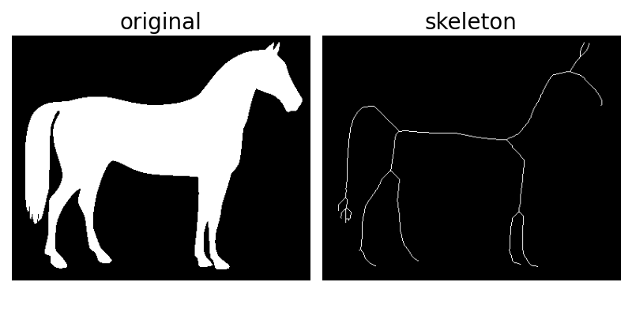
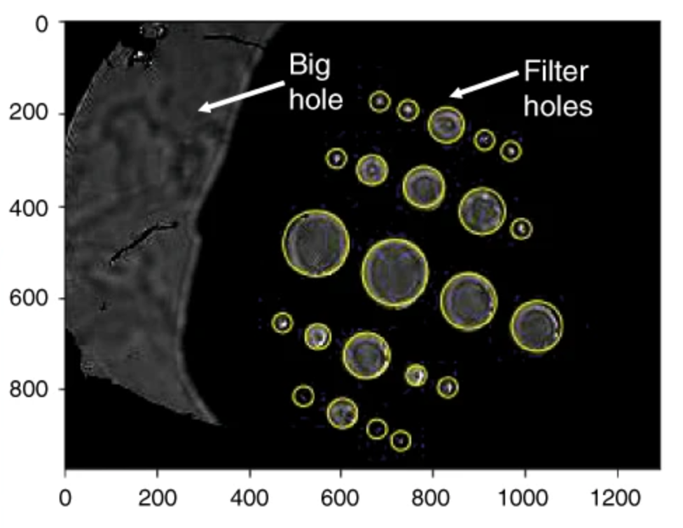

# Traditional Computer Vision

## Introduction

Nowadays, it seems like computer vision (CV) is all about deep learning (DL). While it is true that DL models dominate CV applications, it does not mean that traditional CV techniques are no longer in use. Real CV projects typically require multiple steps, from raw data to the required output, forming image processing pipelines. These pipelines rarely rely on pure DL. Instead, it is more common to see a pipeline with DL as its backbone supported by traditional CV. Traditional CV methods can be used for pre-/post-processing of images as well as tasks such as feature extraction, object measurements.

Let’s look at an example project on plant biology[1]. The dataset consisted of plant images planted such that their roots were visible. The task was to measure the length of these roots from the images. The first 100 hours of plant development was monitored by photographing the seed at t = 0 h and repeating it every hour until t = 100 h. Roots appear after germination around t = 20 h.

<iframe width="896" height="504" src="https://www.youtube-nocookie.com/embed/U_BoKRrSzqA" title="YouTube video player" frameborder="0" allow="accelerometer; autoplay; clipboard-write; encrypted-media; gyroscope; picture-in-picture" allowfullscreen></iframe>
Video 1: Video summary of the plant biology project[1].

Finding the plants and roots can be done effectively using DL. Researchers used U-Net to find the plant root pixels. But measuring root length is not feasible with DL. Instead, a traditional CV technique called [skeletonization](https://scikit-image.org/docs/stable/auto_examples/edges/plot_skeleton.html) was selected for this problem.

\
Figure 1: An example topological skeleton.

## Where to start?

The best way to start learning traditional CV using Python is to learn OpenCV. It is one of the most popular CV libraries out there. It is used for both traditional CV and DL tasks. In the DataLab dedicated to traditional CV, you will write code using OpenCV and Python and detect objects.

Before attempting the DataLab tasks, you will complete the following OpenCV course:

<iframe width="896" height="504" src="https://www.youtube-nocookie.com/embed/oXlwWbU8l2o" title="YouTube video player" frameborder="0" allow="accelerometer; autoplay; clipboard-write; encrypted-media; gyroscope; picture-in-picture" allowfullscreen></iframe>
Video 2: OpenCV Course – Full Tutorial with Python

The course is divided into ~10 minutes long modules. Complete the modules under Section 1 and 2 detailed below. After each module practice what you have learned in your preferred IDE. Instead of working on the images shown in the video, choose an RGB image you like and work on that.

## Course contents

Here is a detailed explanation of each module and how it could be relevant for CV projects.

### Getting started
⌨️ [0:00:00](https://www.youtube.com/watch?v=oXlwWbU8l2o&t=0s) Introduction\
⌨️ [0:01:07](https://www.youtube.com/watch?v=oXlwWbU8l2o&t=67s) Installing OpenCV and Caer
### Section 1 - Basics
⌨️ [0:04:12](https://www.youtube.com/watch?v=oXlwWbU8l2o&t=252s) Reading Images & Video\
To process images, you need to learn how to read them. This module teaches you how to use cv2.imread(). It also shows how to show images using OpenCV but you can use matplotlib for that as well.\
\
⌨️ [0:12:57](https://www.youtube.com/watch?v=oXlwWbU8l2o&t=777s) Resizing and Rescaling Frames \
Regardless of working on DL or traditional CV, you need to be comfortable with resizing and rescaling images. For example, neural networks accept square images but real image datasets consist of rectangular images most of the time. Therefore you need to be able to resize\rescale your images before training NNs.
\
⌨️ [0:20:21](https://www.youtube.com/watch?v=oXlwWbU8l2o&t=1221s) Drawing Shapes & Putting Text\
If you would like to drawing bounding boxes on images, you need to learn annotating images with OpenCV. This is possible with matplotlib as well.\
\
⌨️ [0:31:55](https://www.youtube.com/watch?v=oXlwWbU8l2o&t=1915s) 5 Essential Functions in OpenCV \
OpenCV is a vast library where you can find almost any CV operation you can think of. But some are more common than the others. In this module you will learn about turning an image to grayscale, blurring it, detecting its edges and dilation/erosion.\
\
⌨️ [0:44:13](https://www.youtube.com/watch?v=oXlwWbU8l2o&t=2653s) Image Transformations\
Image transformations such as rotation is commonly used for increasing training dataset size without actually collecting new images. This is called image augmentation. DL libraries already have image augmentation capabilities, therefore you won't be using OpenCV for that. Nevertheless this is still important to know.\
\
⌨️ [0:57:06](https://www.youtube.com/watch?v=oXlwWbU8l2o&t=3426s) Contour Detection\
Object boundaries can be represented as contours and contours are combination of edges. For simple images and shapes, it is possible to detect objects without DL. Knowing contour detection will help you do that.

### Section 2 – Advanced
⌨️ [1:12:53](https://www.youtube.com/watch?v=oXlwWbU8l2o&t=4373s) Color Spaces \
⌨️ [1:23:10](https://www.youtube.com/watch?v=oXlwWbU8l2o&t=4990s) Color Channels \
Color is a fundamental property of images. You should be proficient with RGB and HSV representation of images. This is useful for DL as well as traditional CV.\
\
⌨️ [1:31:03](https://www.youtube.com/watch?v=oXlwWbU8l2o&t=5463s) Blurring \
Real images can be contaminated by [salt-and-pepper noise](https://en.wikipedia.org/wiki/Salt-and-pepper_noise). These pixels could mess up training and testing of DL models. Using blurring, you can reduce this type of noise.\
\
⌨️ [1:44:27](https://www.youtube.com/watch?v=oXlwWbU8l2o&t=6267s) BITWISE operations\
In the plant biology project mentioned previously[1], root labels were provided according to their type (primary, lateral etc.). However the model was developed to detect root pixels, regardless of its type. This required root labels to be combined with the AND operator to obtain a single label for all root pixels.\
\
⌨️ [1:53:06](https://www.youtube.com/watch?v=oXlwWbU8l2o&t=6786s) Masking\
In another example project combining photonics and machine learning[2], masking was used to extract light intensity values from images. The project required calculating the light intensities inside the filter holes depicted in Figure 2. The dataset contained hundreds of such images. The filter position was fixed with respect to the camera. Therefore filter holes were detected once using circle detection and intensity values inside the circles were calculated. Then, these circles were used as a mask for all of the remaining images to calculate the light intensities.

\
Figure 2: Masking example from an real machine learning project[2].

⌨️ [2:01:43](https://www.youtube.com/watch?v=oXlwWbU8l2o&t=7303s) Histogram Computation \
⌨️ [2:15:22](https://www.youtube.com/watch?v=oXlwWbU8l2o&t=8122s) Thresholding/Binarizing Images \
Semantic segmentation labels need to be binary for training networks (e.g. root or not). But in the plant biology project[1], roots were labeled such that the labels were not binary. Root pixels had values between 150-180 and the background was 255. Using histograms, thresholding and inversion labels were transformed into the suitable format.\
\
⌨️ [2:26:27](https://www.youtube.com/watch?v=oXlwWbU8l2o&t=8787s) Edge Detection\
Similar to contour detection, edge detection forms the basis of object detection using traditional CV.

## References

[1] Lube, V., Noyan, M.A., Przybysz, A. et al. [MultipleXLab: A high-throughput portable live-imaging root phenotyping platform using deep learning and computer vision.](https://doi.org/10.1186/s13007-022-00864-4) Plant Methods 18, 38 (2022).

[2] Hussain, R., Noyan, M.A., Woyessa, G. et al. [An ultra-compact particle size analyser using a CMOS image sensor and machine learning.]( https://doi.org/10.1038/s41377-020-0255-6) Light Sci Appl 9, 21 (2020).
