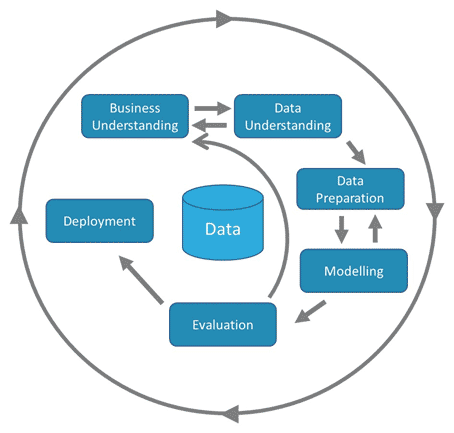

# Datalab 04: Conclusion and Referencing

We've now learned everything we needed to know in order to finish our first data science project. All that's left is writing the conclusion and referencing any sources you may have used, like the webpage of the SDG indicators where you got your data. Once you're finished, you can use the remainder of your time to brush up on your conference poster or revisit part of the analysis like data visualisation or interpretation.

## Learning Objectives
1. write a conclusion;
2. reference your sources;
3. understand the CRISP-DM.

Please follow the links below to continue the class:
1. Mock Assessment Recap: 0.5 hours
2. Conclusion: 2 hours
3. Referencing: 1 hour
4. CRISP-DM: 1 hour; potentially more depending on your project

Feel free to ask for personal feedback during Datalab: from 9:00 to 16:00, in person or online.

Good luck!

## 0) Mock Assessment Recap
Now, let's all find a partner and open your pre-mock assessment poster and our post-mock asessement poster respectively. Show them to your partner and explain the improvements you made, why you made them and how you made them. You analyse and evaluate one another's work: specifically the choices, the execution and the story they tell with their data visualisations.

## 1) Write the Conclusion
Now, let's write the conclusion of your poster. You have gone through all the steps. You know what to do next and why that's what you need to do. That essentially involves communicating:
- A summary of the problem and research question: the problem makes a case for the research question;
- What the data implies based on your Exploratory Data Analysis;
- How to proceed or what to consider.

## 2) Referencing
You already learned how to refer to sources using APA citation in Digital Transformation. If you need a refresher, look at [Scientific Writing 2](https://adsai.buas.nl/Study%20Content/Digital%20Transformation/Scientific%20writing%202.html). They're some good APA referencing tools available. [Google Scholar]() is a good one. The [Scribbr Citation Tool](https://www.scribbr.com/apa-citation-generator/) also seems to be good. There are other tools available as well. We're going to cite any sources used for our data science project in the conference poster.

## 3) Iterating using the CRISP-DM

The CRoss Industry Standard Process for Data Mining (CRISP-DM) is a process model with six phases that naturally describes the data science life cycle. It’s like a set of guardrails to help you plan, organize, and implement your data science (or machine learning) project.

1. Business understanding – What does the business need?
2. Data understanding – What data do we have/need? Is it clean?
3. Data preparation – How do we organise the data for modelling?
4. Modeling – What modelling techniques should we apply?
5. Evaluation – Which model best meets the business objectives?
6. Deployment – How do stakeholders access the results?

\

In our project, we only go to step 4, asking ourselves: What modelling technique should we apply? We don't actually model our data, evaluate our model or deploy our data science solution. We'll do these steps in the different projects throughout the year.

Watch the following video:

<iframe width="640" height="360" src="https://www.linkedin.com/learning/embed/data-science-for-java-developers/crisp-dm-the-data-science-cycle?autoplay=false&claim=AQE7aNB0gsHrKgAAAXuehqfAMTIXw27ZETDk3v0n1ILbxgFR2EOcIxEpRz03FiIL4XLyHalA4ZJ36lGceHRjW7TPal_znC2dUvH76UCG363f60c2K1FwsVYdBHs4rUkiErgU-pMlHhQ0L56Z9ENgLmirSzdAQyPY2ATPF_aay-IyNh8KN5t_3Au1y7_O6oTQxehIxhQ6-4yLlqq78IOXzWSSLlcTPd8vkAqcnNI8X3hsu70GTIdR-m-mna9WUgzv0nmDdFbh7rBBB3hUTBflJpMrN5PhUR1W4uc6MlCcBXSzobvxegnf8YRGg_KK-Vv4K9hi-YF0AfzxFcjRk1NsvXRFxS0rksHa02VLxvI-lWPE7rs7xPua3Wz63qjj1NlTFhQ8M87N2DY3OajUN0AEbbk6R2Hn1iVg1R7spxMNiOcwWm5g0hH7LtYvM_rIoZmsxoUlYRSKyJGd4HktJXvjPx0Cyp0jJWv-VafYsLDpvHQ37ZhRVR0sN4A44XWQMRcZ84Y3Ub8vXv-v0zz7lgsf-Y2-yGPETdfEusC7lzCoxMcToFqvenZX7asL8D6CS4lxDPxcHzbMZZ5wuqXIDT5MK7hKAY5IuK9HCgf02YMKXDRkzc_5Ru5xDuX8OXliQXxhTi8q01T8NfuVC_QMluI2EnA2nuNYU0MT5qxPIo8HrWf1QtGcHucLJoJRlGN5RCMUUFpCue-7qNZcOs5YXqoTlhDL3nk2Db1EUb-fW153sudFh_ZKnoQ&lipi=urn%3Ali%3Apage%3Ad_learning_content%3BtSYxLf9mSWO8dG4Yt8KSVQ%3D%3D&licu" mozallowfullscreen="true" webkitallowfullscreen="true" allowfullscreen="true" frameborder="0" style="position:absolute;width:100%;height:100%;left:0"></iframe>

<strong><a href="https://www.linkedin.com/learning/data-science-for-java-developers/crisp-dm-the-data-science-cycle?trk=embed_lil">CRISP-DM: The data science cycle</a></strong> from <strong><a href="https://www.linkedin.com/learning/data-science-for-java-developers?trk=embed_lil">Data Science for Java Developers</a></strong> by <strong><a href="https://www.linkedin.com/learning/instructors/shaun-wassell?trk=embed_lil">Shaun Wassell</a></strong>

Run through your analysis script, run it and re-evaluate it. Look at your conference poster and visualisations to see if there's anything that needs to be updated.

Done? Maybe you can help your peers by proofreading their work? They may return the favour, and you both get a better learning experience!

## 4) In-Class discussion
At 16:00, there's an online meeting you're encouraged to take part in to ask questions and to discuss our progress and reflect on today activities.

Tomorrow, we will introduce you to the differences between explanatory and predictive modelling!

## Questions or issues?
If you have any questions, please first ask your peers or send us a message on teams instead!

## Resources
- [https://swirlstats.com/students.html](https://swirlstats.com/students.html)
- [Swirl](https://swirlstats.com/help.html)
- [Learning Statistics with R, by D. Navarro (2018)](https://learningstatisticswithr.com/)
- [Discovering Statistics using R, A. Fields et al. (2012)](https://eds.b.ebscohost.com/eds/detail/detail?vid=2&sid=785a4ba4-77c1-4205-be1c-f6cd920efb78%40pdc-v-sessmgr02&bdata=JnNpdGU9ZWRzLWxpdmU%3d#AN=bus.KOHA.OAI.BUAS.28091&db=cat08862a)
