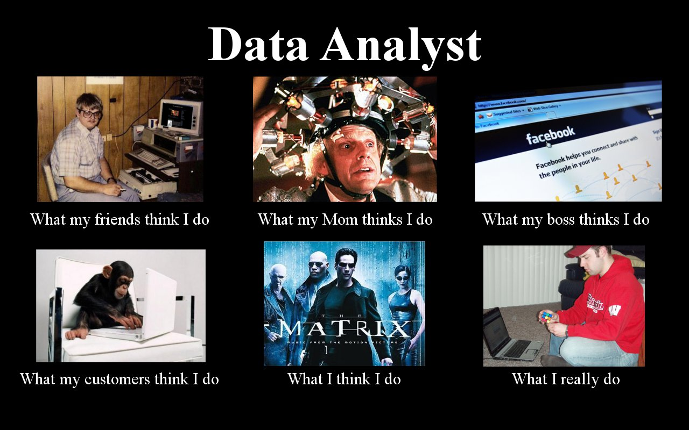

# Quantifying our World into Data
We start off with a comfortable introduction to some basic concepts and tools. Today, we will focus on how we can see and quantify our world into data. We are going to cover some basic concepts and apply those concepts to a mock assessment called Datalab Preparation. In the workshop you are introduced to Power BI: an industry-standard tool for describing and visualizing data.

Make sure to hand in your Preparation for DataLab 5, Week 3 exercises by the end of the day (Mandatory!). Upload your work on github and insert the github link in your learning log for this week with a brief description. If your files are too large for Github; upload them to Sharepoint via teams or using: www.edubuas.sharepoint.com. Only files on github and sharepoint (team, outlook also upload to sharepoint) are considered for grading. For details on staff availability, see the [Project Brief](https://adsai.buas.nl/Year1/BlockA/).

## Learning Objectives
1. Enable you to quantify real-world phenomena and objects into data.
2. Enable you to use Power-BI

### Table of contents:
1. Introduction to DS Science Kick-Off: 1 hour
2. Preparation for DataLab: 1 hour
3. What will we do for data science?
4. Workshop: 4 hours

#### Don't know a specific word?
Don't worry about it and just google it! You're here to learn and expand your the vocabulary as part of your knowledge and skills! And, using search engines like google is actually a vital skill for any data scientist or any other individual for that matter who does programming!

## Questions or issues?

If you have questions or issues regarding the course material you can't solve by asking your peers or using google, please fill out the 'How Can We Help?' form under the section ['Ask me anything'](https://adsai.buas.nl/Contact%20Us/). A member of our teaching staff will respond as soon as possible.

***

## More info?
Look at the [creative brief](https://adsai.buas.nl/Year1/BlockA/) for more info about the content or ask us during the Q&A in datalab tomorrow!

## 1) Data Science Introduction Lecture
**It is available [here](https://github.com/BredaUniversityADSAI/ADS-AI/blob/326523f60f5ef35e603eab424e35cd18b985562d/docs/Study%20Content/DataScience/assets/DS1%20-%20Lecture%201;%20The%20world%20in%20data.ppsx) now!** And, [Here is the link to the slides in case you want those too.](https://edubuas.sharepoint.com/sites/2021-22AFGA1.P1ADSAI/Shared%20Documents/General/Recordings/DS1%20-%20Lecture%201;%20The%20world%20in%20data.ppsx)

## 2) Preparation for DataLab 5, Week 3: 
**Mock-Assessments** like this test your knowledge and skills but **are not graded in any way.** Instead, they are small exercises which; similar to real assessments, test your capacity to use your knowledge:
- Apply: use your knowledge in new situations
- Analyze: draw connections among ideas
- Evaluate: Justify a stand or decision
- Create: Produce new or original work (although this is primarily done in projects though; because of workload considerations)
These excercise often also function as building blocks for your final project! This time this isn't the case but usually it is which is helpful to build your final project in bite-sized pieces whereon you can get feedback and iterate; or improve, upon!

<figure>
    
    <figcaption>It's based on Bloom's Taxonomy, so be aware that these are usefull steps to solidify your learning and we'll integrate it whenever it fits: time and effort wise.</figcaption>
</figure>
 

Anyway, now we got that clear:

Every workshop includes a small datalab preparation section in the form of a mock-assessment to prepare you for the actual assessment deliverable you'll create in Datalab. In Datalab, you and your peers will look at and assess one another's mock assessments to check if you have understood or mastered the learning objectives. So don't get frustrated if you cannot satisfyingly answer some questions or are struggling: we're just practising, reinforcing our knowledge retention and using community learning to reinforce the learning experience during Data Lab. The role of a univerisity is to provide a safe space to learn and fail after all :)!

A) Create a text (e.g. microsoft word) file named 'MockAssessment_QuantifyingTheWorldInData',  where you answer the following questions:

B) Questions: Defining objects as data

0. Choose an object to define: e.g. near you or something you like or want to understand better.
1. Describe the object in at least 100 words.
2. Quantify the object into (at least 10) variables.
3. Form a data-driven research question based on your variables and the description of the object.

C) Questions: Defining phenomena as data

0. Choose a phenomenon to define: e.g. near you or something you like or want to understand better.
1. Describe the phenomenon in at least 100 words.
2. Quantify the phenomenon into (at least 10) variables.
3. Form a data-driven research question based on your variables and the description of the phenomena.

Save the file as .txt or .pdf file to GitHub; we'll discuss it during Datalab tomorrow.

## 3) What will you be doing for Data Science?

You will start on your path to becoming a data proffesional by **learning how to describe, visualise and understand data**. The data proffesionals serve the gatekeepers of the organization’s data collection, ensuring that the stakeholders can make informed decisions based on accurate, correct, and complete data.

*Figure 1. What does a data proffesional do?*

The responsibilities and roles of a data proffesionals are generally varied, challenging, and fun. One day you might be pre-processing (e.g. transforming, cleaning etc.) data with SQL, another day you might participate in a stakeholder alignment session (e.g. establishing key performance indicators), another day you might be visualising that key performance indicator in Power BI or apply a simple ML model in Python or R to a dataset.

To successfully perform these tasks, a data proffesional must have a broad foundation, which includes but is not limited to:

- Critical thinking
- Presentation skills
- Structured Query Language (SQL)
- Python or R statistical programming
- Data pipeline design
- Data understanding and visualization (e.g. Power BI, tableau)
- Machine & Deep learning
- Data & AI in the Ethics and Legal context

For the remainder of block A we will focus on data understanding and visualization (e.g. Power BI), critical thinking and presentation skills and adress the rest of these topics over the next two years...

Now I can imagine there's some confusion regarding the difference between a data scientist and artificial intelligence. How are they actually distinct, or are they even? In truth there's a lot of overlap and the terms are changing as the industry changes. However, the main distinction in the field lies in that a data proffesional just works with data to solves problems and can use virtually any (valid) tool to solve the problem whereas a more advance data proffesional who does more advanced analysis is usually called a data scientist. He's actively doing research and modelling the data in order to get to some understanding or insight about the data. A data scientist can also apply machine and deep learning to solve different problems whereas a regular data proffesional; like a data analyst, cannot. 
But then what is the difference between a data scientist and an AI specialist like an AI scientist or engineer? Well, in truth it depends a lot on the context; the company and problem. But usually a an AI specialist is solely concerned with applying an AI algorith; applying machine or deep learning, in order to solve some problem and is usually concerned with a lot of active tuning and maintainace of the algorithm!

Tip: If you want to get a better understanding of the daily tasks and responsibilities of a data analyst, look up videos and articles with titles such as 'Day in a life of ...' In addition, the article <a href="https://careerfoundry.com/en/blog/data-analytics/whats-it-like-to-actually-be-a-data-analyst/">'What's it like to actually be a data analyst'</a> consists of an interview with a data analyst.

### Deliverable?
Look at the [creative brief](https://adsai.buas.nl/Year1/BlockA/) at point 2 for more info about the Power BI deliverable. Also check out the self-assessment slide to see how we're going to grade your deliverable! Any questions left? Ask us during the Q&A in datalab tomorrow!

## 4) Workshop: Introduction to PowerBI
Businesses need data analysis more than ever. In this learning path, you will learn about the life and journey of a data analyst, the skills, tasks, and processes they go through in order to tell a story with data so trusted business decisions can be made. You will learn how the suite of Power BI tools and services are used by a data analyst to tell a compelling story through reports and dashboards, and the need for true BI in the enterprise.

### Installing
Let's start by installing the latest version of Power BI! [Click here!](https://powerbi.microsoft.com/en-gb/desktop/) Here's an [example of a dashboard](https://community.powerbi.com/t5/Data-Stories-Gallery/Analyzing-the-UN-s-Sustainable-Development-Goals-at-Gartner-Data/m-p/2527235) made by a pro within our topic!

### Logging in
To log into [datacamp](www.datacamp.com), use your BUas credentials (e.g. 123456@buas.nl, PasswordExample_007).

### The doing part
Now it's time for the [the workshop part](https://www.datacamp.com/courses/introduction-to-power-bi) of this class to get acquainted with PowerBI. Click the link in the previous sentence to start with the online workshop. Complete the entire course and upload the certificate to github, reference the certificate in your learning log for this week.

## Questions or issues?

If you have questions or issues regarding the course material, please fill out the 'How Can We Help?' form under the section ['Ask me anything'](https://adsai.buas.nl/Contact%20Us/). A member of our teaching staff will respond as soon as possible.

***

## References:
- [Descriptive Statistics, by Statistics LibreTexts)](https://statics.teams.cdn.office.net/evergreen-assets/safelinks/1/atp-safelinks.html?url=https%3A%2F%2Fstats.libretexts.org%2FBookshelves%2FIntroductory_Statistics%2FBook%253A_Introductory_Statistics_(OpenStax)%2F02%253A_Descriptive_Statistics)
- [Graphing Distributions, by Statistics LibreTexts.)](https://statics.teams.cdn.office.net/evergreen-assets/safelinks/1/atp-safelinks.html?url=https%3A%2F%2Fstats.libretexts.org%2FBookshelves%2FIntroductory_Statistics%2FBook%253A_Introductory_Statistics_(Lane)%2F02%253A_Graphing_Distributions)
-  [Descriptive Statistics, by Statistics LibreTexts)](https://statics.teams.cdn.office.net/evergreen-assets/safelinks/1/atp-safelinks.html?url=https%3A%2F%2Fstats.libretexts.org%2FBookshelves%2FIntroductory_Statistics%2FBook%253A_Introductory_Statistics_(Shafer_and_Zhang)%2F02%253A_Descriptive_Statistics)
 - [Displaying and ANalysing Data with Graphs, by Statistics LibreTexts)](https://statics.teams.cdn.office.net/evergreen-assets/safelinks/1/atp-safelinks.html?url=https%3A%2F%2Fstats.libretexts.org%2FBookshelves%2FIntroductory_Statistics%2FBook%253A_Inferential_Statistics_and_Probability_-_A_Holistic_Approach_(Geraghty)%2F02%253A_Displaying_and_Analyzing_Data_with_Graphs)
