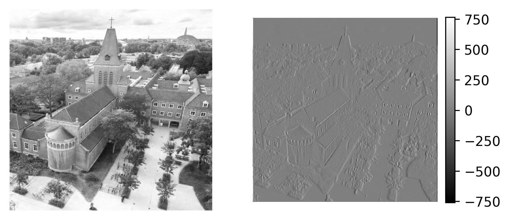
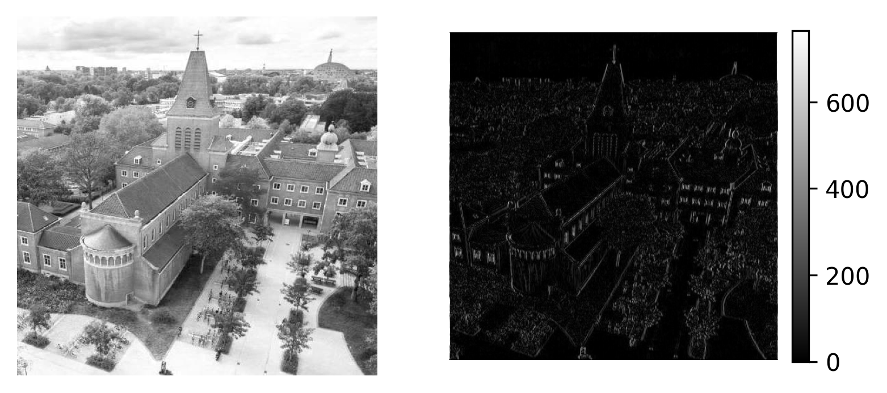

# Week 4, Day 1: Introduction to Convolutional Neural Networks 1

AI as a field of study is as old as computer science. But Convolutional Neural Networks put AI into the spotlight. By now, you know what a neural network is. But what is a convolution?

First, we will see a convolution in action. Then we will see how it works.

Let's take the 3x3 array below,

```
array_1 = np.array([[1, 0, -1],
                    [1, 0, -1],
                    [1, 0, -1]])
```
and convolve it over an image of BUas campus.

```
from scipy.signal import convolve2d
output = convolve2d(image, array_1)
```

Here is the image and the output side by side.



**Figure 1:** Image of BUas and the output of the convolution with array_1.


As you can see, the output of the convolution operation emphasizes the edges. Notice that the edges are either white or black (windows), and smooth surfaces are gray (sky). We can take the absolute value of the output to set all edges to white and the rest to black.



**Figure 2:** Image of BUas and the absolute value of the output of the convolution with array_1.


`array_1` is called a kernel (or a filter). The numbers are not random. They are selected for edge detection. And if you look at the output carefully, not all the edges, the kernel is designed for vertical edges. We can design another kernel for horizontal edges.

```
array_2 = np.array([[1, 1, 1],
                    [0, 0, 0],
                    [-1, -1, -1]])

output_2 = convolve2d(image, array_2)
```


**Figure 3:** Image of BUas and the absolute value of the output of the convolution with array_2.


Notice how the horizon is much more visible in Figure 3, compared to Figure 2. Also, compare the cross at the top of the tower in both outputs.

**In summary, convolution is an operation of a kernel on an image in order to extract useful features.**

In this example, we manually designed the kernels for detecting edges. In fact, kernels are named sometimes named by their inventors (e.g. Sobel filter). But it is not easy to design kernels manually, especially for complex problems. Can you design a kernel for detecting a dalmatian pattern? It would be nice if we can learn kernels from data.

This is the idea behind convolutional neural networks: learn kernels from the data. The values inside the kernels will be the weights of the CNNs.

But one question still remains unanswered. How does the convolution operation work? In other words, what does `convolve2d()` do to calculate the output? Watch the videos below to answer these questions:

<iframe width="896" height="504" src="https://www.youtube-nocookie.com/embed/C_zFhWdM4ic" title="YouTube video player" frameborder="0" allow="accelerometer; autoplay; clipboard-write; encrypted-media; gyroscope; picture-in-picture" allowfullscreen></iframe>

Video 1: How Blurs & Filters Work - Computerphile

<iframe width="896" height="504" src="https://www.youtube-nocookie.com/embed/uihBwtPIBxM" title="YouTube video player" frameborder="0" allow="accelerometer; autoplay; clipboard-write; encrypted-media; gyroscope; picture-in-picture" allowfullscreen></iframe>

Video 2: Finding the Edges (Sobel Operator) - Computerphile

# 1) Review meeting at 10:00

Today we will have an online meeting to review last weeks materials and this week's material.

# 2) Assignment

Please complete the DataCamp course [Image Processing with Keras in Python](https://app.datacamp.com/learn/courses/image-processing-with-keras-in-python)


