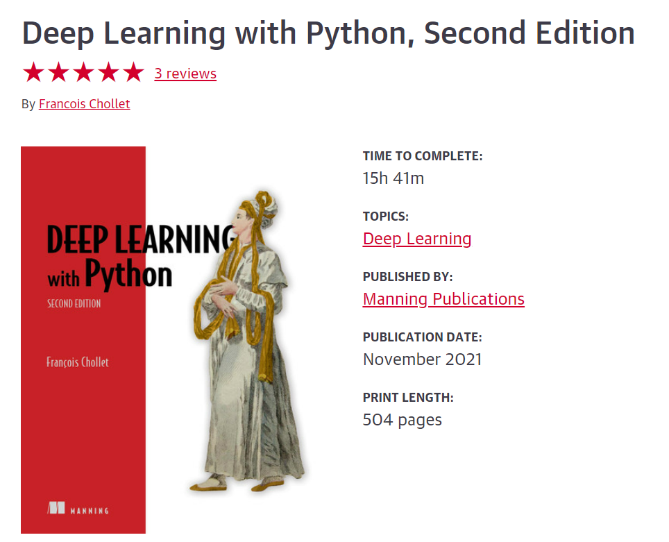

# Practical Issues & BestPractices

Before starting today's material, make sure you are up to date on building a base CNN-model for image classification. In case you need to catch up , please do so before starting today's material.
Refer to [this python notebook](https://www.kaggle.com/code/victorhz/cnn-with-20-classes-trained-validation-set/notebook) in case you are looking for a classifier example with Open image data set.

## Building a better model
Read **Chapter 13** from Book - Deep Learning with Python, Second Edition

From chapter 13, your primary objective is to get better understanding of Hyperparameter tuning. Model ensembling, Mixed-precision training
and Training Keras models on multiple GPUs or on a TPU are optional but very good to know. 

Make sure to apply the Hyperparameter tuning process in any/all of your CNNs projects. As usual take notes in the **_DL-notes.docx_** file in your **_Block C Microsoft Teams assignment_**. Clearly capture (screenshot) the various experiments you are implementing and their corresponding results with different hyperparameter settings.

The process of optimizing hyperparameters typically looks like this:

1. Choose a set of hyperparameters (automatically).

2. Build the corresponding model.

3. Fit it to your training data, and measure performance on the validation data.

4. Choose the next set of hyperparameters to try (automatically).

5. Repeat.

6. Eventually, measure performance on your test data.

The key to this process is the algorithm that analyzes the relationship between validation performance and various hyperparameter values to choose the next set of hyperparameters to evaluate. 

In addition to reading the book, refer to the code snippets from the book : [fchollet : chapter13_best-practices-for-the-real-world.ipynb](https://github.com/fchollet/deep-learning-with-python-notebooks/blob/master/chapter13_best-practices-for-the-real-world.ipynb)

## Automatic hyperparameter tuner - KerasTuner 
KerasTUner is a general-purpose hyperparameter tuning library. It has strong integration with Keras workflows. [Follow this tutorial](https://keras.io/guides/keras_tuner/getting_started/) - In this tutorial, you will see how to tune model architecture, training process, and data preprocessing steps with KerasTuner.

[Another example of using KerasTuner used in multi class classification -  Fashion MNIST dataset](https://www.tensorflow.org/tutorials/keras/keras_tuner) - follow this tutorial and try the various configuration for your Fashion MINST image classification project OR apply the concepts in your creative brief use case.

_Optional_ : view the different hyperparameter combination and their corresponding performance matrices using tensorboard - [clicky](https://www.tensorflow.org/tensorboard/hyperparameter_tuning_with_hparams)

_Optional_ : Another couple of interesting [article1](https://pyimagesearch.com/2021/06/07/easy-hyperparameter-tuning-with-keras-tuner-and-tensorflow/) on using KerasTuner for a CNN model hyperparameters. (**Note** - only focus on the CNN hyperparameter configurations, and ignore the complex setup configuration, saving model, etc.. ) [article2](https://towardsdatascience.com/hyperparameter-tuning-with-kerastuner-and-tensorflow-c4a4d690b31a)

For the rest of the day, feel free to catchup on your pending tasks from other days, or apply the keras-tuner to your creative brief use case, or dive into other self-guided topics of your interest.

## Literature

[Deep Learning with Python, Second Edition](https://learning.oreilly.com/library/view/deep-learning-with/9781617296864/)